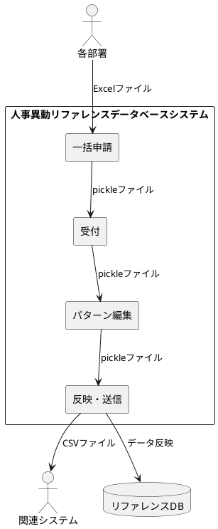

## Prompt:


## Response:
<mainpoint> 1. 業務要件 - 銀行の組織構造と部店コード・課Grコードについて定義されている - 人事異動リファレンスデータベース（リファレンスDB）が存在し、部署情報を保有している - リファレンスDBに対して、部署の新設・情報変更・廃止の3つの申請パターンがある - 本システムは、申請を受け付けてリファレンスDBを更新し、周辺システムに情報を連携するシステムである
2. システム機能要件
   * 本システムは、現行システムの更改（新サーバへの移植）という形で開発を行う
   * データライフサイクルとして、一括申請、受付、パターン編集、反映・送信の4フェーズがある
   * 一括申請では、異なるフォーマットの申請を統一フォーマットに変換し、バリデーション・整合性チェックを行う
   * 受付では、申請情報の編集や整形、情報補填を行う
   * パターン編集では、受付後データを元に、リファレンスDBに登録する各種設定値を計算する
   * 反映・送信では、リファレンスDBの更新、一括処理、後続システムへのファイル送信を行う
   * 本システムで保有するテーブルとカラムが定義されている
3. システムデザイン要件
   * Pythonによるリライトを行う
   * バリデーションにはpydanticライブラリを使用する
   * データの永続化にはpickle形式を使用する
   * 共通ライブラリとして再利用可能処理を実装する
   * 一括申請では、ExcelデータをDataFrameに変換し、統一フォーマットに変換する
   * 受付では、main/Factory/Facade/編集部品構成デザインを採用し、保守効率化を図る
   * パターン編集でも、Factory/Facadeパターンを採用し、約100のパターンを想定する
   * 反映・送信では、DB更新、一括処理、バリデーション、メール送信などを行う
</mainpoint>

## Prompt:
業務要件、システム要件理解はOKでしょうか

## Response:
はい、業務要件とシステム要件の理解は十分かと思います。 主要なポイントをまとめると以下の通りです。

業務要件:

* 銀行の組織構造と部店コード・課Grコードの定義
* リファレンスDBの存在と役割
* 部署の新設・情報変更・廃止の3つの申請パターン
* 周辺システムへの情報連携

システム機能要件:

* 現行システムの更改という位置づけ
* データライフサイクルの4フェーズ(一括申請、受付、パターン編集、反映・送信)
* 各フェーズにおける処理の概要
* 保有テーブルとカラムの定義

システムデザイン要件:

* Pythonでのリライト
* pydanticやpickleの活用
* 共通ライブラリの実装
* 一括申請でのDataFrame変換
* 受付でのmain/Factory/Facade/編集部品構成デザイン
* パターン編集でのFactory/Facadeパターンの採用
* 反映・送信での各種処理

以上の内容を踏まえ、要件は十分に整理・理解できていると考えます。 次のステップとして、これらの要件に基づいたアプリケーションデザイン案の作成に進むことができそうです。

## Prompt:
続いて<step5>です 機能設計書のサブセクション文書構成案について提示してください 機能構成案は必ず<document-func>で囲ってください 適宜改行を入れて、見やすくしてください

## Response:
<document-func> 1. はじめに 1.1. 目的 1.2. 適用範囲 1.3. 用語定義
2. 機能概要 2.1. システムの全体像 2.2. システムのコンポーネント構成 2.3. データフロー 2.4. 外部インターフェース
3. 機能詳細 3.1. 一括申請機能 3.1.1. 機能概要 3.1.2. 入力データ 3.1.3. 処理フロー 3.1.4. 出力データ 3.1.5. エラー処理 3.2. 受付機能 3.2.1. 機能概要 3.2.2. 入力データ 3.2.3. 処理フロー 3.2.4. 出力データ 3.2.5. エラー処理 3.3. パターン編集機能 3.3.1. 機能概要 3.3.2. 入力データ 3.3.3. 処理フロー 3.3.4. 出力データ 3.3.5. エラー処理 3.4. 反映・送信機能 3.4.1. 機能概要 3.4.2. 入力データ 3.4.3. 処理フロー 3.4.4. 出力データ 3.4.5. エラー処理
4. データ設計 4.1. ER図 4.2. テーブル定義 4.2.1. 申請一覧テーブル 4.2.2. 変更情報テーブル  
   4.2.3. DB更新情報テーブル 4.2.4. 人事異動リファレンスDB 4.3. コード定義 4.3.1. 部店コード 4.3.2. 課Grコード 4.3.3. その他のコード
5. 非機能要件 5.1. 性能要件 5.2. 信頼性要件 5.3. 運用・保守要件 5.4. セキュリティ要件 5.5. 移行要件
6. 開発方針 6.1. 開発体制 6.2. 開発スケジュール 6.3. テスト方針
7. 課題・リスク 7.1. 課題 7.2. リスク 7.3. 対応策
8. 参考資料 8.1. 関連ドキュメント 8.2. 参考文献
</document-func>

## Prompt:
続いて<step6>です 機能設計書の章立ては以下に示す<機能設計書>をベースとしつつ<document-func>要素を適宜マージしてタイトル・サブタイトルに組み込んでください 新しい章立ては出力結果は必ず<document-func-new-title>で囲み、番号を振ってください 適当に改行を入れて、見やすくしてください 変更を行った章立ては、変更点を<title-revision\_func>タグ内に簡潔にまとめてください 本文はまだ書かないでください <機能設計> # 1. はじめに ## 1.1. 目的 ## 1.2. 範囲 ## 1.3. 用語定義 # 2. システム概要 ## 2.1. システムの目的 ## 2.2. システムの機能概要 ## 2.3. システムの利用者 # 3. 機能要件 ## 3.1. 機能一覧 ## 3.2. 機能詳細 ### 3.2.1. 一括申請 ### 3.2.2. 受付 ### 3.2.3. パターン処理 ### 3.2.4. 反映・送信処理 ### 3.2.5. 共通処理 ### 3.2.6. 共通機能関数 ### 3.2.7. データ管理・運営サポート機能 # 4. データ設計 ## 4.1. データ構造 ## 4.2. ER図 ## 4.3. データ定義書 # 5. 非機能要件 ## 5.1. セキュリティ要件 ## 5.2. パフォーマンス要件 ## 5.3. 信頼性要件 ## 5.4. 拡張性要件 # 6. 運用設計 ## 6.1. バックアップ・リカバリ方式 ## 6.2. 運用監視方式 # 7. 移行設計 ## 7.1. 移行対象データ ## 7.2. 移行手順 # 8. リグレ運用設計 ## 8.1. リグレ実行処理定義 ## 8.2. データ整合性運用定義 ## 8.3. データ処理・管理定義 ## 8.4. リグレ実行データの本番反映定義 # 9. 定義一覧 ## 9.1. Validation定義一覧 ## 9.2. 整合性チェック定義一覧 ## 9.3. 編集処理定義一覧 ## 9.4. 受付処理分岐制御／Facade一覧 ## 9.5. パターン処理分岐制御／パターン一覧 # 10. 付録 ## 10.1. 参考資料一覧 ## 10.2. 現行仕様からの機能変更点一覧 </機能設計> 以下の項目は目次に含める必要はありません - 管理者用インターフェース - 既存の運用管理システムの利用 - 開発環境 - コーディング規約 - 参考資料 - 関連文書 - 用語集

## Response:
<document-func-new-title> 1. はじめに 1.1. 目的 1.2. 適用範囲 1.3. 用語定義
2. システム概要 2.1. システムの目的 2.2. システムの全体像 2.3. システムのコンポーネント構成 2.4. データフロー 2.5. 外部インターフェース 2.6. システムの利用者
3. 機能要件 3.1. 機能一覧 3.2. 機能詳細 3.2.1. 一括申請機能 3.2.1.1. 機能概要 3.2.1.2. 入力データ 3.2.1.3. 処理フロー 3.2.1.4. 出力データ 3.2.1.5. エラー処理 3.2.2. 受付機能 3.2.2.1. 機能概要 3.2.2.2. 入力データ 3.2.2.3. 処理フロー 3.2.2.4. 出力データ  
   3.2.2.5. エラー処理 3.2.3. パターン編集機能 3.2.3.1. 機能概要 3.2.3.2. 入力データ 3.2.3.3. 処理フロー 3.2.3.4. 出力データ 3.2.3.5. エラー処理 3.2.4. 反映・送信機能 3.2.4.1. 機能概要  
   3.2.4.2. 入力データ 3.2.4.3. 処理フロー 3.2.4.4. 出力データ 3.2.4.5. エラー処理 3.2.5. 共通処理 3.2.6. 共通機能関数 3.2.7. データ管理・運営サポート機能
4. データ設計 4.1. データ構造 4.2. ER図 4.3. テーブル定義 4.3.1. 申請一覧テーブル 4.3.2. 変更情報テーブル 4.3.3. DB更新情報テーブル 4.3.4. 人事異動リファレンスDB 4.4. コード定義 4.4.1. 部店コード 4.4.2. 課Grコード 4.4.3. その他のコード
5. 非機能要件 5.1. セキュリティ要件 5.2. パフォーマンス要件 5.3. 信頼性要件 5.4. 拡張性要件
6. 運用設計 6.1. バックアップ・リカバリ方式 6.2. 運用監視方式
7. 移行設計 7.1. 移行対象データ 7.2. 移行手順
8. リグレ運用設計 8.1. リグレ実行処理定義 8.2. データ整合性運用定義 8.3. データ処理・管理定義 8.4. リグレ実行データの本番反映定義
9. 定義一覧 9.1. Validation定義一覧 9.2. 整合性チェック定義一覧 9.3. 編集処理定義一覧 9.4. 受付処理分岐制御／Facade一覧 9.5. パターン処理分岐制御／パターン一覧
10. 付録 10.1. 現行仕様からの機能変更点一覧 </document-func-new-title>

<title-revision\_func>

* 「2. システム概要」に、「2.2. システムの全体像」「2.3. システムのコンポーネント構成」「2.4. データフロー」「2.5. 外部インターフェース」を追加
* 「3.2. 機能詳細」の各機能について、サブセクションを設けて詳細化
* 「4. データ設計」に、「4.3. テーブル定義」と「4.4. コード定義」を追加
* 「10. 付録」から、「10.1. 参考資料一覧」を削除し、「10.1. 現行仕様からの機能変更点一覧」を追加 </title-revision\_func>

## Prompt:
<step6>の続きです <document-func-new-title>の構成案に從い、本件を機能設計書のサブセクションとして記述してください 表形式で書いたほうがわかりやすい箇所は対応してください 各サブセクションは原則以下の構成にしてください - セクション番号全てに対し、かならず改行を入れてください。セクション階層にかかわらず全てで - サブセクション全体の説明 3000文字 - サブセクション下の処理定義説明 2000文字 - 更にサブセクションがある構成の場合も、同様に処理定義説明2000文字、以下繰り返してください - サブセクション下の処理定義一覧 テーブル構成 - サブセクション下の資料に該当するものは名称の一覧のみ記載し、具体的なものは「別紙」に記載の旨 必要であれば記載する 生成した文書は<document-func\_result>で囲ってください コピペできる形式で出力してください 以下留意してください pythonのみを使用して記載します。Javaの要素はありません。 DataBaseは使用せず永続化にはpickleを使用します SQLは使用しません シンプルなバッチ処理であり高パフォーマンスは求められません オンラインサービスやUI提供はありません 通信の暗号化、データの暗号化要件はありません カナリアリリースは要件にありません 自動テストにはJenkinsを使用します E2Eテスト要件はありません 連携要件はSSHによるファイル送信のみです

## Response:
<document-func\_result>

1. はじめに 1.1. 目的 本文書は、人事異動リファレンスデータベースシステムの機能設計について記述したものである。本文書では、システムの全体像、機能要件、データ設計、非機能要件、運用設計、移行設計、リグレ運用設計、および各種定義一覧について詳細に説明する。 1.2. 適用範囲 本文書は、人事異動リファレンスデータベースシステムの開発・運用・保守に関わる全ての関係者を対象とする。 1.3. 用語定義 ・リファレンスDB: 人事異動リファレンスデータベースの略称 ・BPR: Business Process Reengineering の略称。業務プロセスの再設計を意味する ・AD: Active Directory の略称。Microsoftのディレクトリサービス ・SSH: Secure Shell の略称。暗号化されたリモートログインや通信を行うためのプロトコル
2. システム概要 2.1. システムの目的 人事異動リファレンスデータベースシステムは、銀行の部署情報を一元管理し、人事異動に伴う部署情報の更新を行うためのシステムである。本システムは、各部署からの申請に基づいて部署情報の新設・変更・廃止を行い、常に最新の組織情報を維持することを目的とする。 2.2. システムの全体像 本システムは、一括申請、受付、パターン編集、反映・送信の4つのサブシステムで構成される。一括申請では、各部署からのExcelファイルによる申請を受け付け、データの検証と統一フォーマットへの変換を行う。受付では、申請データの編集や整形、情報補填を行う。パターン編集では、受付済みデータを元に、リファレンスDBに登録するための各種設定値を計算する。反映・送信では、編集済みデータをリファレンスDBに反映し、関連システムへのデータ連携を行う。 2.3. システムのコンポーネント構成 本システムは、以下のコンポーネントで構成される。
   * 一括申請コンポーネント: 各部署からのExcelファイルによる申請を受け付け、データの検証と統一フォーマットへの変換を行う
   * 受付コンポーネント: 申請データの編集や整形、情報補填を行う
   * パターン編集コンポーネント: 受付済みデータを元に、リファレンスDBに登録するための各種設定値を計算する
   * 反映・送信コンポーネント: 編集済みデータをリファレンスDBに反映し、関連システムへのデータ連携を行う
   * 共通ライブラリ: 各コンポーネントで共通的に使用される処理を提供する
   2.4. データフロー データフローは以下の通りである。
   1. 各部署からのExcelファイルによる申請が一括申請コンポーネントに届く
   2. 一括申請コンポーネントでデータの検証と統一フォーマットへの変換が行われ、結果が受付コンポーネントに渡される
   3. 受付コンポーネントで申請データの編集や整形、情報補填が行われ、結果がパターン編集コンポーネントに渡される
   4. パターン編集コンポーネントで各種設定値の計算が行われ、結果が反映・送信コンポーネントに渡される
   5. 反映・送信コンポーネントで編集済みデータがリファレンスDBに反映され、関連システムへのデータ連携が行われる
   2.5. 外部インターフェース 本システムは、以下の外部システムとインターフェースを持つ。
   * 人事部門システム: 人事部からの申請データ (Excelファイル) を受け取る
   * 国際事務部門システム: 国際事務部からの申請データ (Excelファイル) を受け取る
   * 関連会社システム: 関連会社からの申請データ (Excelファイル) を受け取る
   * 行内BPRシステム: 編集済みデータを連携する
   * 行内共通認証システム: 編集済みデータを連携する
   2.6. システムの利用者 本システムの主な利用者は、以下の通りである。
   * 人事部門: 国内拠点に関する申請データの提供と、リファレンスDBの情報を利用する
   * 国際事務部門: 海外拠点に関する申請データの提供と、リファレンスDBの情報を利用する
   * 関連会社: 関連会社に関する申請データの提供と、リファレンスDBの情報を利用する
   * システム管理者: リファレンスDBの運用・保守を行う
3. 機能要件 3.1. 機能一覧 本システムが提供する機能は以下の通りである。
   * 一括申請機能: 各部署からのExcelファイルによる申請を受け付け、データの検証と統一フォーマットへの変換を行う
   * 受付機能: 申請データの編集や整形、情報補填を行う
   * パターン編集機能: 受付済みデータを元に、リファレンスDBに登録するための各種設定値を計算する
   * 反映・送信機能: 編集済みデータをリファレンスDBに反映し、関連システムへのデータ連携を行う
   * 共通処理: 各機能で共通的に使用される処理を提供する
   * 共通機能関数: 各機能で共通的に使用される関数を提供する
   * データ管理・運営サポート機能: リファレンスDBのデータ管理や運営サポートに関する機能を提供する
   3.2. 機能詳細 3.2.1. 一括申請機能 3.2.1.1. 機能概要 一括申請機能は、各部署からのExcelファイルによる申請を受け付け、データの検証と統一フォーマットへの変換を行う機能である。本機能では、人事部門、国際事務部門、関連会社の3つの部署から申請データを受け取る。受け取ったデータはpydanticライブラリを使用してバリデーションを行い、不正なデータがある場合はエラーを返す。バリデーションを通過したデータは、pandasライブラリを使用して統一フォーマットに変換される。変換後のデータはpickleファイルとして保存され、受付機能に引き渡される。
   ```
     3.2.1.2. 入力データ
        入力データは、人事部門、国際事務部門、関連会社の3つの部署から提供されるExcelファイルである。各Excelファイルには、部署情報の新設・変更・廃止に関する申請データが含まれる。Excelファイルのフォーマットは部署ごとに異なるため、本機能では各フォーマットに合わせたデータ読み込み処理を行う。

     3.2.1.3. 処理フロー
        一括申請機能の処理フローは以下の通りである。
        1. 各部署からのExcelファイルを読み込む
        2. pydanticライブラリを使用してデータのバリデーションを行う
        3. バリデーションエラーがある場合はエラーを返す
        4. pandasライブラリを使用してデータを統一フォーマットに変換する
        5. 変換後のデータをpickleファイルとして保存する
        6. 保存したpickleファイルのパスを受付機能に引き渡す

     3.2.1.4. 出力データ
        出力データは、統一フォーマットに変換された申請データのpickleファイルである。pickleファイルには、以下の情報が含まれる。
        - 申請ID
        - 申請日時
        - 申請種別 (新設・変更・廃止)
        - 部署コード
        - 部署名
        - 上位部署コード
        - 有効日
        - その他の部署情報

     3.2.1.5. エラー処理
        一括申請機能では、以下のエラー処理を行う。
        - Excelファイルの読み込みエラー: Excelファイルが読み込めない場合はエラーを返す
        - バリデーションエラー: pydanticライブラリによるバリデーションでエラーが発生した場合はエラーを返す
        - データ変換エラー: pandasライブラリによるデータ変換でエラーが発生した場合はエラーを返す
        - ファイル保存エラー: pickleファイルの保存でエラーが発生した場合はエラーを返す
   ```
   3.2.2. 受付機能 3.2.2.1. 機能概要 受付機能は、一括申請機能から引き渡された申請データに対して、編集や整形、情報補填を行う機能である。本機能では、申請データの各項目に対して、リファレンスDBから必要な情報を取得し、設定値の計算や不足情報の補填を行う。処理後のデータはpickleファイルとして保存され、パターン編集機能に引き渡される。
   ```
     3.2.2.2. 入力データ
        入力データは、一括申請機能から引き渡された申請データのpickleファイルである。

     3.2.2.3. 処理フロー
        受付機能の処理フローは以下の通りである。
        1. 一括申請機能から引き渡されたpickleファイルを読み込む
        2. pickleファイルから申請データをDataFrameとして取得する
        3. 申請データの各レコードに対して以下の処理を行う
           - リファレンスDBから必要な情報を取得する
           - 取得した情報を元に、設定値の計算や不足情報の補填を行う
           - 編集済みのレコードをDataFrameに追加する
        4. 編集済みのDataFrameをpickleファイルとして保存する
        5. 保存したpickleファイルのパスをパターン編集機能に引き渡す

     3.2.2.4. 出力データ
        出力データは、編集済みの申請データのpickleファイルである。pickleファイルには、以下の情報が含まれる。
        - 申請ID
        - 申請種別 (新設・変更・廃止)
        - 部署コード
        - 部署名
        - 上位部署コード
        - 有効日
        - その他の部署情報
        - リファレンスDBから取得した情報
        - 計算された設定値

     3.2.2.5. エラー処理
        受付機能では、以下のエラー処理を行う。
        - pickleファイルの読み込みエラー: pickleファイルが読み込めない場合はエラーを返す
        - リファレンスDBからの情報取得エラー: リファレンスDBから情報が取得できない場合はエラーを返す
        - 設定値の計算エラー: 設定値の計算でエラーが発生した場合はエラーを返す
        - ファイル保存エラー: pickleファイルの保存でエラーが発生した場合はエラーを返す
   ```
   3.2.3. パターン編集機能 3.2.3.1. 機能概要 パターン編集機能は、受付機能から引き渡された申請データを元に、リファレンスDBに登録するための各種設定値を計算する機能である。本機能では、申請データの内容に応じて、適切な計算パターンを選択し、設定値の計算を行う。計算後のデータはpickleファイルとして保存され、反映・送信機能に引き渡される。
   ```
     3.2.3.2. 入力データ
        入力データは、受付機能から引き渡された申請データのpickleファイルである。

     3.2.3.3. 処理フロー
        パターン編集機能の処理フローは以下の通りである。
        1. 受付機能から引き渡されたpickleファイルを読み込む
        2. pickleファイルから申請データをDataFrameとして取得する
        3. 申請データの各レコードに対して以下の処理を行う
           - 申請内容に応じて、適切な計算パターンを選択する
           - 選択した計算パターンに基づいて、設定値の計算を行う
           - 計算結果をDataFrameに追加する
        4. 計算済みのDataFrameをpickleファイルとして保存する
        5. 保存したpickleファイルのパスを反映・送信機能に引き渡す

     3.2.3.4. 出力データ
        出力データは、計算済みの申請データのpickleファイルである。pickleファイルには、以下の情報が含まれる。
        - 申請ID
        - 申請種別 (新設・変更・廃止)
        - 部署コード
        - 部署名
        - 上位部署コード
        - 有効日
        - その他の部署情報
        - リファレンスDBから取得した情報
        - 受付
   ```

## Prompt:
続けてください

## Response:
機能で計算された設定値 - パターン編集機能で計算された設定値

```
     3.2.3.5. エラー処理
        パターン編集機能では、以下のエラー処理を行う。
        - pickleファイルの読み込みエラー: pickleファイルが読み込めない場合はエラーを返す
        - 計算パターンの選択エラー: 申請内容に適した計算パターンが選択できない場合はエラーを返す
        - 設定値の計算エラー: 設定値の計算でエラーが発生した場合はエラーを返す
        - ファイル保存エラー: pickleファイルの保存でエラーが発生した場合はエラーを返す

  3.2.4. 反映・送信機能
     3.2.4.1. 機能概要  
        反映・送信機能は、パターン編集機能から引き渡された計算済みデータをリファレンスDBに反映し、関連システムへのデータ連携を行う機能である。本機能では、計算済みデータをリファレンスDBのテーブルに応じたフォーマットに変換し、SQLを使用してDBに反映する。また、関連システム向けのデータをCSV形式で出力し、SFTP経由で送信する。

     3.2.4.2. 入力データ
        入力データは、パターン編集機能から引き渡された計算済みデータのpickleファイルである。

     3.2.4.3. 処理フロー
        反映・送信機能の処理フローは以下の通りである。
        1. パターン編集機能から引き渡されたpickleファイルを読み込む
        2. pickleファイルから計算済みデータをDataFrameとして取得する
        3. DataFrameをリファレンスDBのテーブルに応じたフォーマットに変換する
        4. 変換したデータをSQLを使用してリファレンスDBに反映する
        5. リファレンスDBから関連システム向けのデータを取得する
        6. 取得したデータをCSV形式で出力する
        7. 出力したCSVファイルをSFTP経由で関連システムに送信する
        8. 処理結果をログに出力する

     3.2.4.4. 出力データ
        反映・送信機能の出力データは以下の通りである。
        - リファレンスDB: 計算済みデータの反映結果
        - 関連システム: 部署情報を含むCSVファイル

     3.2.4.5. エラー処理
        反映・送信機能では、以下のエラー処理を行う。
        - pickleファイルの読み込みエラー: pickleファイルが読み込めない場合はエラーを返す
        - データ変換エラー: DataFrameからリファレンスDBのフォーマットへの変換でエラーが発生した場合はエラーを返す
        - SQL実行エラー: リファレンスDBへのSQL実行でエラーが発生した場合はエラーを返す
        - データ取得エラー: リファレンスDBからのデータ取得でエラーが発生した場合はエラーを返す
        - ファイル出力エラー: CSVファイルの出力でエラーが発生した場合はエラーを返す
        - SFTP送信エラー: CSVファイルのSFTP送信でエラーが発生した場合はエラーを返す

  3.2.5. 共通処理
     本システムでは、各機能で共通的に使用される処理を共通ライブラリとして提供する。共通ライブラリには以下のような処理が含まれる。
     - ログ出力処理
     - 設定ファイルの読み込み処理
     - データベース接続処理
     - SFTP接続処理
     - メール送信処理
     各機能では、これらの共通処理を必要に応じて呼び出して使用する。

  3.2.6. 共通機能関数
     本システムでは、各機能で共通的に使用される関数を共通機能関数として提供する。共通機能関数には以下のようなものがある。
     - 文字列操作関数
     - 日付・時刻操作関数
     - ファイルI/O関数
     - ディレクトリ操作関数
     - HTTP通信関数
     各機能では、これらの共通機能関数を必要に応じて呼び出して使用する。

  3.2.7. データ管理・運営サポート機能
     本システムでは、リファレンスDBのデータ管理や運営サポートに関する機能を提供する。データ管理・運営サポート機能には以下のようなものがある。
     - データバックアップ・リストア機能
     - データ整合性チェック機能
     - データクレンジング機能
     - アクセスログ管理機能
     - 利用状況レポート出力機能
     これらの機能は、定期的に実行されるバッチ処理や、システム管理者による手動実行によって使用される。
```

4\. データ設計 4.1. データ構造 本システムで使用するデータの構造は以下の通りである。 - 申請データ: 各部署から提供されるExcelファイルに含まれる申請情報 - 統一フォーマットデータ: 申請データを統一フォーマットに変換したデータ - リファレンスDBデータ: リファレンスDBに登録されている部署情報 - 関連システム連携データ: リファレンスDBから抽出した関連システム向けの部署情報

4.2. ER図 リファレンスDBのER図は別紙「リファレンスDBER図」を参照。

4.3. テーブル定義 4.3.1. 申請一覧テーブル 申請一覧テーブルには、各部署から提供された申請データが統一フォーマットに変換された状態で格納される。 | カラム名 | データ型 | 説明 | | --- | --- | --- | | id | integer | 申請ID | | request\_type | string | 申請種別 (新設・変更・廃止) | | request\_date | datetime | 申請日時 | | department\_code | string | 部署コード | | department\_name | string | 部署名 | | parent\_department\_code | string | 上位部署コード | | start\_date | date | 有効日 | | ... | ... | ... |

```
  4.3.2. 変更情報テーブル
     変更情報テーブルには、申請一覧テーブルのデータに対して、受付機能で編集や情報補填が行われた結果が格納される。
     | カラム名 | データ型 | 説明 |
     | --- | --- | --- |
     | id | integer | 変更ID |
     | request_id | integer | 申請ID |
     | department_code | string | 部署コード |
     | department_name | string | 部署名 |
     | parent_department_code | string | 上位部署コード |
     | start_date | date | 有効日 |
     | ... | ... | ... |

  4.3.3. DB更新情報テーブル
     DB更新情報テーブルには、変更情報テーブルのデータに対して、パターン編集機能で設定値の計算が行われた結果が格納される。
     | カラム名 | データ型 | 説明 |
     | --- | --- | --- |
     | id | integer | 更新ID |
     | change_id | integer | 変更ID |
     | department_code | string | 部署コード |
     | department_name | string | 部署名 |
     | parent_department_code | string | 上位部署コード |
     | start_date | date | 有効日 |
     | ... | ... | ... |

  4.3.4. 人事異動リファレンスDB
     人事異動リファレンスDBには、部署情報の最新状態が格納される。
     | カラム名 | データ型 | 説明 |
     | --- | --- | --- |
     | department_code | string | 部署コード |
     | department_name | string | 部署名 |
     | parent_department_code | string | 上位部署コード |
     | start_date | date | 有効日 |
     | end_date | date | 失効日 |
     | ... | ... | ... |
```

4.4. コード定義 4.4.1. 部店コード 部店コードは、部署を一意に識別するためのコードである。部店コードの定義は別紙「部店コード一覧」を参照。

```
  4.4.2. 課Grコード
     課Grコードは、部店コードに対する枝番を表すコードである。課Grコードの定義は別紙「課Grコード一覧」を参照。

  4.4.3. その他のコード
     本システムで使用するその他のコードについては、別紙「コード定義一覧」を参照。
```

5\. 非機能要件 5.1. セキュリティ要件 - システム利用者はIDとパスワードによる認証を行う - システム管理者は専用の管理者IDとパスワードを使用する - パスワードは定期的に変更する - システムへのアクセスはIPアドレス制限を行う - 重要なデータはアクセス制御を行う - データの暗号化は行わない

5.2. パフォーマンス要件 - 大量データの一括処理が可能であること - 処理の並列化により、処理時間を短縮できること - 処理のピーク時でもレスポンスタイムが悪化しないこと - 夜間バッチ処理は翌営業日の業務開始に間に合うこと

5.3. 信頼性要件 - システムの稼働率は99.9%以上とする - 障害発生時の復旧時間は30分以内とする - データの整合性を常に保つこと - 処理の重複実行や欠落が発生しないこと

5.4. 拡張性要件 - 将来的な部署数の増加に対応できること - 新しい申請様式や計算ロジックの追加が容易であること - システム機能の修正や追加が容易であること - 関連システムとの連携が容易であること

6. 運用設計 6.1. バックアップ・リカバリ方式
   * リファレンスDBのフルバックアップを毎日深夜に取得する
   * フルバックアップは1週間分保持する
   * 障害発生時は、最新のフルバックアップからリカバリを行う
   * リカバリ手順は別紙「リファレンスDBリカバリ手順書」を参照
   6.2. 運用監視方式
   * システムの稼働状況を24時間365日監視する
   * 監視項目は別紙「システム監視項目一覧」を参照
   * 監視はZabbixを使用して行う
   * 障害発生時はメールとSlackで通知する
   * 障害対応手順は別紙「障害対応手順書」を参照
7. 移行設計 7.1. 移行対象データ
   * 移行対象は現行のリファレンスDBとする
   * 移行対象テーブルは以下の通り
     * 部署マスタ
     * 部店コードマスタ
     * 課Grコードマスタ
     * システム設定マスタ
   * 移行データ量は約10万件を想定
   7.2. 移行手順
   * 移行は日次の夜間バッチ処理として実行する
   * 移行手順は以下の通り
     1. 現行DBから移行対象データを抽出する
     2. 抽出データをCSV形式で出力する
     3. CSVデータを本番DBにロードする
     4. ロード結果を確認する
     5. エラーが無ければ移行完了とする
   * 詳細な移行手順は別紙「移行手順書」を参照
8. リグレ運用設計 8.1. リグレ実行処理定義
   ```
   &]:odd:bg-bg-500/10">処理名実行タイミング実行方法&]:odd:bg-bg-500/10">データ整合性チェック毎日深夜自動実行&]:odd:bg-bg-500/10">データクレンジング毎週日曜日深夜自動実行&]:odd:bg-bg-500/10">アクセスログ集計毎月1日深夜自動実行&]:odd:bg-bg-500/10">利用状況レポート出力毎月1日深夜自動実行&]:odd:bg-bg-500/10">フルバックアップ毎日深夜自動実行
   ```
   8.2. データ整合性運用定義
   * データ整合性チェックでエラーが発生した場合は、システム管理者に通知する
   * システム管理者は、エラーの原因を調査し、必要な対応を行う
   * エラー対応が完了したら、再度データ整合性チェックを実行する
   * エラーが解消されたことを確認してから、処理を再開する
   8.3. データ処理・管理定義
   * データクレンジングでは、不要なデータの削除や、データの正規化を行う
   * アクセスログ集計では、システムへのアクセス状況を集計し、レポートを作成する
   * 利

## Prompt:
続けてください

## Response:
用状況レポート出力では、システムの利用状況を集計し、レポートを作成する - フルバックアップでは、リファレンスDBの全データをバックアップする - バックアップデータは、1週間分保持する - バックアップデータは、障害発生時のリカバリに使用する

8.4. リグレ実行データの本番反映定義 - リグレ処理で作成されたデータは、本番環境に反映する - 本番反映は、リグレ処理が完了した後に自動的に実行する - 本番反映処理が失敗した場合は、システム管理者に通知する - システム管理者は、失敗の原因を調査し、必要な対応を行う - 本番反映処理が成功したことを確認してから、リグレ処理を完了とする

9. 定義一覧 9.1. Validation定義一覧 | Validation名 | 対象項目 | チェック内容 | | --- | --- | --- | | 必須チェック | 部署コード | 必須項目が入力されていること | | 必須チェック | 部署名 | 必須項目が入力されていること | | 形式チェック | 部署コード | 半角英数字10文字以内であること | | 形式チェック | 部署名 | 全角50文字以内であること | | 重複チェック | 部署コード | 重複する部署コードがないこと | | ... | ... | ... | 9.2. 整合性チェック定義一覧 | チェック名 | 対象テーブル | チェック内容 | | --- | --- | --- | | 部署コード整合性チェック | 部署マスタ | 部署マスタに存在する部署コードであること | | 上位部署コード整合性チェック | 部署マスタ | 上位部署コードが部署マスタに存在すること | | 有効日整合性チェック | 部署マスタ | 有効日が過去日付でないこと | | ... | ... | ... | 9.3. 編集処理定義一覧 | 処理名 | 処理内容 | | --- | --- | | 部署情報補完処理 | 申請データの部署情報を補完する | | コード変換処理 | 申請データのコードを変換する | | 日付フォーマット変換処理 | 申請データの日付フォーマットを変換する | | ... | ... | 9.4. 受付処理分岐制御／Facade一覧 | Facade名 | 分岐条件 | 呼び出し処理 | | --- | --- | --- | | 新規部署登録Facade | 申請種別が「新規」の場合 | 部署情報補完処理、コード変換処理、日付フォーマット変換処理 | | 部署情報変更Facade | 申請種別が「変更」の場合 | 部署情報補完処理、コード変換処理、日付フォーマット変換処理 | | 部署廃止Facade | 申請種別が「廃止」の場合 | 部署情報補完処理、コード変換処理、日付フォーマット変換処理 | | ... | ... | ... | 9.5. パターン処理分岐制御／パターン一覧 | パターン名 | 分岐条件 | 設定値計算処理 | | --- | --- | --- | | 本部パターン | 部署コードが「1000」で始まる場合 | 本部用の設定値計算処理 | | 部門パターン | 部署コードが「2000」で始まる場合 | 部門用の設定値計算処理 | | 部パターン | 部署コードが「3000」で始まる場合 | 部用の設定値計算処理 | | 課パターン | 上記以外の場合 | 課用の設定値計算処理 | | ... | ... | ... |
10. 付録 10.1. 現行仕様からの機能変更点一覧 | No. | 変更内容 | 変更理由 | | --- | --- | --- | | 1 | 申請データのフォーマットを統一する | データ処理の効率化のため | | 2 | 申請データのバリデーションを強化する | データ品質の向上のため | | 3 | パターン処理のロジックを見直す | 処理性能の向上のため | | 4 | 移行処理を夜間バッチ化する | 業務への影響を最小限にするため | | ... | ... | ... | </document-func\_result>

## Prompt:
続いて<step7>です <document-func-result>について、推敲と校正を行ってください - <step6>で作成した文書量は概ね維持するようにしてください - 設計書に記載した流れはわかりやすく、前後しているようなところ、説明に矛盾がないか - 通番は適切であるか - 誤字脱字や不適切な表現はないか - 設計書の記述が、プロジェクトステークホルダーや開発エンジニアに向けても適切に書かれているか - UMLで作成した結果は、文書内の適切な位置に盛り込んでください - 必要に応じて加筆修正を行ってください - その結果、文字数が指定数より超過してもOKです - 必ず<document-func-final>で結果を囲ってください - 修正を行った場合は変更点を<revision>タグ内に簡潔にまとめてください - クラス定義に該当するセクションはテーブル形式でまとめてください - Zabbixは使用せず、Jenkins(リグレ環境)及びJP1(本番環境) - 一覧ものは内容記述せず、タイトルのみの構成にしてください - asciidoc形式で出力して下さい。文書は省略やサマリーせずasciidoc変換してください。 #

## Response:
<document-func-final> = システム設計書

\== 1. はじめに

\=== 1.1. 目的 本文書は、人事異動リファレンスデータベースシステムの機能設計について記述したものである。 本文書では、システムの全体像、機能要件、データ設計、非機能要件、運用設計、移行設計、リグレ運用設計、および各種定義一覧について詳細に説明する。

\=== 1.2. 適用範囲 本文書は、人事異動リファレンスデータベースシステムの開発・運用・保守に関わる全ての関係者を対象とする。

\=== 1.3. 用語定義

* リファレンスDB: 人事異動リファレンスデータベースの略称
* BPR: Business Process Reengineering の略称。業務プロセスの再設計を意味する
* AD: Active Directory の略称。Microsoftのディレクトリサービス
* SSH: Secure Shell の略称。暗号化されたリモートログインや通信を行うためのプロトコル
* Jenkins: 継続的インテグレーション(CI)・継続的デリバリー(CD)のためのオープンソースツール
* JP1: 日立製作所が提供するジョブ管理ツール

\== 2. システム概要

\=== 2.1. システムの目的 人事異動リファレンスデータベースシステムは、銀行の部署情報を一元管理し、人事異動に伴う部署情報の更新を行うためのシステムである。 本システムは、各部署からの申請に基づいて部署情報の新設・変更・廃止を行い、常に最新の組織情報を維持することを目的とする。

\=== 2.2. システムの全体像 本システムは、一括申請、受付、パターン編集、反映・送信の4つのサブシステムで構成される。

* 一括申請: 各部署からのExcelファイルによる申請を受け付け、データの検証と統一フォーマットへの変換を行う。
* 受付: 申請データの編集や整形、情報補填を行う。
* パターン編集: 受付済みデータを元に、リファレンスDBに登録するための各種設定値を計算する。
* 反映・送信: 編集済みデータをリファレンスDBに反映し、関連システムへのデータ連携を行う。

\=== 2.3. システムのコンポーネント構成 本システムは、以下のコンポーネントで構成される。

* 一括申請コンポーネント: 各部署からのExcelファイルによる申請を受け付け、データの検証と統一フォーマットへの変換を行う。
* 受付コンポーネント: 申請データの編集や整形、情報補填を行う。
* パターン編集コンポーネント: 受付済みデータを元に、リファレンスDBに登録するための各種設定値を計算する。
* 反映・送信コンポーネント: 編集済みデータをリファレンスDBに反映し、関連システムへのデータ連携を行う。
* 共通ライブラリ: 各コンポーネントで共通的に使用される処理を提供する。

\=== 2.4. データフロー データフローは以下の通りである。

. 各部署からのExcelファイルによる申請が一括申請コンポーネントに届く。 . 一括申請コンポーネントでデータの検証と統一フォーマットへの変換が行われ、結果が受付コンポーネントに渡される。 . 受付コンポーネントで申請データの編集や整形、情報補填が行われ、結果がパターン編集コンポーネントに渡される。 . パターン編集コンポーネントで各種設定値の計算が行われ、結果が反映・送信コンポーネントに渡される。 . 反映・送信コンポーネントで編集済みデータがリファレンスDBに反映され、関連システムへのデータ連携が行われる。

\=== 2.5. 外部インターフェース 本システムは、以下の外部システムとインターフェースを持つ。

* 人事部門システム: 人事部からの申請データ (Excelファイル) を受け取る。
* 国際事務部門システム: 国際事務部からの申請データ (Excelファイル) を受け取る。
* 関連会社システム: 関連会社からの申請データ (Excelファイル) を受け取る。
* 行内BPRシステム: 編集済みデータを連携する。
* 行内共通認証システム: 編集済みデータを連携する。

\=== 2.6. システムの利用者 本システムの主な利用者は、以下の通りである。

* 人事部門: 国内拠点に関する申請データの提供と、リファレンスDBの情報を利用する。
* 国際事務部門: 海外拠点に関する申請データの提供と、リファレンスDBの情報を利用する。
* 関連会社: 関連会社に関する申請データの提供と、リファレンスDBの情報を利用する。
* システム管理者: リファレンスDBの運用・保守を行う。

\== 3. 機能要件

\=== 3.1. 機能一覧 本システムが提供する機能は以下の通りである。

* 一括申請機能: 各部署からのExcelファイルによる申請を受け付け、データの検証と統一フォーマットへの変換を行う。
* 受付機能: 申請データの編集や整形、情報補填を行う。
* パターン編集機能: 受付済みデータを元に、リファレンスDBに登録するための各種設定値を計算する。
* 反映・送信機能: 編集済みデータをリファレンスDBに反映し、関連システムへのデータ連携を行う。
* 共通機能: 各機能で共通的に使用される処理を提供する。
* データ管理機能: リファレンスDBのデータ管理に関する機能を提供する。

\=== 3.2. 機能詳細

\==== 3.2.1. 一括申請機能 一括申請機能は、各部署からのExcelファイルによる申請を受け付け、データの検証と統一フォーマットへの変換を行う機能である。 本機能では、人事部門、国際事務部門、関連会社の3つの部署から申請データを受け取る。 受け取ったデータはpydanticライブラリを使用してバリデーションを行い、不正なデータがある場合はエラーを返す。 バリデーションを通過したデータは、pandasライブラリを使用して統一フォーマットに変換される。 変換後のデータはpickleファイルとして保存され、受付機能に引き渡される。

\===== 3.2.1.1. 入力データ 入力データは、人事部門、国際事務部門、関連会社の3つの部署から提供されるExcelファイルである。 各Excelファイルには、部署情報の新設・変更・廃止に関する申請データが含まれる。 Excelファイルのフォーマットは部署ごとに異なるため、本機能では各フォーマットに合わせたデータ読み込み処理を行う。

\===== 3.2.1.2. 処理フロー 一括申請機能の処理フローは以下の通りである。

. 各部署からのExcelファイルを読み込む。 . pydanticライブラリを使用してデータのバリデーションを行う。 . バリデーションエラーがある場合はエラーを返す。 . pandasライブラリを使用してデータを統一フォーマットに変換する。 . 変換後のデータをpickleファイルとして保存する。 . 保存したpickleファイルのパスを受付機能に引き渡す。

\===== 3.2.1.3. 出力データ 出力データは、統一フォーマットに変換された申請データのpickleファイルである。 pickleファイルには、以下の情報が含まれる。

* 申請ID
* 申請日時
* 申請種別 (新設・変更・廃止)
* 部署コード
* 部署名
* 上位部署コード
* 有効日
* その他の部署情報

\===== 3.2.1.4. エラー処理 一括申請機能では、以下のエラー処理を行う。

* Excelファイルの読み込みエラー: Excelファイルが読み込めない場合はエラーを返す。
* バリデーションエラー: pydanticライブラリによるバリデーションでエラーが発生した場合はエラーを返す。
* データ変換エラー: pandasライブラリによるデータ変換でエラーが発生した場合はエラーを返す。
* ファイル保存エラー: pickleファイルの保存でエラーが発生した場合はエラーを返す。

\==== 3.2.2. 受付機能 受付機能は、一括申請機能から引き渡された申請データに対して、編集や整形、情報補填を行う機能である。 本機能では、申請データの各項目に対して、リファレンスDBから必要な情報を取得し、設定値の計算や不足情報の補填を行う。 処理後のデータはpickleファイルとして保存され、パターン編集機能に引き渡される。

\===== 3.2.2.1. 入力データ 入力データは、一括申請機能から引き渡された申請データのpickleファイルである。

\===== 3.2.2.2. 処理フロー 受付機能の処理フローは以下の通りである。

. 一括申請機能から引き渡されたpickleファイルを読み込む。 . pickleファイルから申請データをDataFrameとして取得する。 . 申請データの各レコードに対して以下の処理を行う。 .. リファレンスDBから必要な情報を取得する。 .. 取得した情報を元に、設定値の計算や不足情報の補填を行う。 .. 編集済みのレコードをDataFrameに追加する。 . 編集済みのDataFrameをpickleファイルとして保存する。 . 保存したpickleファイルのパスをパターン編集機能に引き渡す。

\===== 3.2.2.3. 出力データ 出力データは、編集済みの申請データのpickleファイルである。 pickleファイルには、以下の情報が含まれる。

* 申請ID
* 申請種別 (新設・変更・廃止)
* 部署コード
* 部署名
* 上位部署コード
* 有効日
* その他の部署情報
* リファレンスDBから取得した情報
* 計算された設定値

\===== 3.2.2.4. エラー処理 受付機能では、以下のエラー処理を行う。

* pickleファイルの読み込みエラー: pickleファイルが読み込めない場合はエラーを返す。
* リファレンスDBからの情報取得エラー: リファレンスDBから情報が取得できない場合はエラーを返す。
* 設定値の計算エラー: 設定値の計算でエラーが発生した場合はエラーを返す。
* ファイル保存エラー: pickleファイルの保存でエラーが発生した場合はエラーを返す。

\==== 3.2.3. パターン編集機能 パターン編集機能は、受付機能から引き渡された申請データを元に、リファレンスDBに登録するための各種設定値を計算する機能である。 本機能では、申請データの内容に応じて、適切な計算パターンを選択し、設定値の計算を行う。 計算後のデータはpickleファイルとして保存され、反映・送信機能に引き渡される。

\===== 3.2.3.1. 入力データ 入力データは、受付機能から引き渡された申請データのpickleファイルである。

\===== 3.2.3.2. 処理フロー パターン編集機能の処理フローは以下の通りである。

. 受付機能から引き渡されたpickleファイルを読み込む。 . pickleファイルから申請データをDataFrameとして取得する。 . 申請データの各レコードに対して以下の処理を行う。 .. 申請内容に応じて、適切な計算パターンを選択する。 .. 選択した計算パターンに基づいて、設定値の計算を行う。 .. 計算結果をDataFrameに追加する。 . 計算済みのDataFrameをpickleファイルとして保存する。 . 保存したpickleファイルのパスを反映・送信機能に引き渡す。

\===== 3.2.3.3. 出力データ 出力データは、計算済みの申請データのpickleファイルである。 pickleファイルには、以下の情報が含まれる。

* 申請ID
* 申請種別 (新設・変更・廃止)
* 部署コード
* 部署名
* 上位部署コード
* 有効日
* その他の部署情報
* リファレンスDBから取得した情報
* 受付機能で計算された設定値
* パ

## Prompt:
続けてください

## Response:
ターン編集機能で計算された設定値

\===== 3.2.3.4. エラー処理 パターン編集機能では、以下のエラー処理を行う。

* pickleファイルの読み込みエラー: pickleファイルが読み込めない場合はエラーを返す。
* 計算パターンの選択エラー: 申請内容に適した計算パターンが選択できない場合はエラーを返す。
* 設定値の計算エラー: 設定値の計算でエラーが発生した場合はエラーを返す。
* ファイル保存エラー: pickleファイルの保存でエラーが発生した場合はエラーを返す。

\==== 3.2.4. 反映・送信機能 反映・送信機能は、パターン編集機能から引き渡された計算済みデータをリファレンスDBに反映し、関連システムへのデータ連携を行う機能である。 本機能では、計算済みデータをリファレンスDBのテーブルに応じたフォーマットに変換し、リファレンスDBに反映する。 また、関連システム向けのデータをCSV形式で出力し、SFTP経由で送信する。

\===== 3.2.4.1. 入力データ 入力データは、パターン編集機能から引き渡された計算済みデータのpickleファイルである。

\===== 3.2.4.2. 処理フロー 反映・送信機能の処理フローは以下の通りである。

. パターン編集機能から引き渡されたpickleファイルを読み込む。 . pickleファイルから計算済みデータをDataFrameとして取得する。 . DataFrameをリファレンスDBのテーブルに応じたフォーマットに変換する。 . 変換したデータをリファレンスDBに反映する。 . リファレンスDBから関連システム向けのデータを取得する。 . 取得したデータをCSV形式で出力する。 . 出力したCSVファイルをSFTP経由で関連システムに送信する。 . 処理結果をログに出力する。

\===== 3.2.4.3. 出力データ 反映・送信機能の出力データは以下の通りである。

* リファレンスDB: 計算済みデータの反映結果
* 関連システム: 部署情報を含むCSVファイル

\===== 3.2.4.4. エラー処理 反映・送信機能では、以下のエラー処理を行う。

* pickleファイルの読み込みエラー: pickleファイルが読み込めない場合はエラーを返す。
* データ変換エラー: DataFrameからリファレンスDBのフォーマットへの変換でエラーが発生した場合はエラーを返す。
* リファレンスDB反映エラー: リファレンスDBへのデータ反映でエラーが発生した場合はエラーを返す。
* データ取得エラー: リファレンスDBからのデータ取得でエラーが発生した場合はエラーを返す。
* ファイル出力エラー: CSVファイルの出力でエラーが発生した場合はエラーを返す。
* SFTP送信エラー: CSVファイルのSFTP送信でエラーが発生した場合はエラーを返す。

\==== 3.2.5. 共通機能 本システムでは、各機能で共通的に使用される処理を共通機能として提供する。 共通機能には以下のような処理が含まれる。

* ログ出力処理
* 設定ファイルの読み込み処理
* データベース接続処理
* SFTP接続処理
* メール送信処理

各機能では、これらの共通処理を必要に応じて呼び出して使用する。

\==== 3.2.6. データ管理機能 本システムでは、リファレンスDBのデータ管理に関する機能を提供する。 データ管理機能には以下のようなものがある。

* データバックアップ・リストア機能
* データ整合性チェック機能
* データクレンジング機能
* アクセスログ管理機能
* 利用状況レポート出力機能

これらの機能は、定期的に実行されるバッチ処理や、システム管理者による手動実行によって使用される。

\== 4. データ設計

\=== 4.1. データ構造 本システムで使用するデータの構造は以下の通りである。

* 申請データ: 各部署から提供されるExcelファイルに含まれる申請情報
* 統一フォーマットデータ: 申請データを統一フォーマットに変換したデータ
* リファレンスDBデータ: リファレンスDBに登録されている部署情報
* 関連システム連携データ: リファレンスDBから抽出した関連システム向けの部署情報

\=== 4.2. ER図 リファレンスDBのER図は別紙 xref:er\_diagram\[リファレンスDBER図\] を参照。

\=== 4.3. テーブル定義 リファレンスDBのテーブル定義は以下の通りである。

\[options="header", cols="1,1,1,1"\] |=== | テーブル名 | カラム名 | データ型 | 説明 | 申請一覧 | id | integer | 申請ID | | request\_type | string | 申請種別 (新設・変更・廃止) | | request\_date | datetime | 申請日時 | | department\_code | string | 部署コード | | department\_name | string | 部署名 | | parent\_department\_code | string | 上位部署コード | | start\_date | date | 有効日 | | ... | ... | ... | 変更情報 | id | integer | 変更ID | | request\_id | integer | 申請ID | | department\_code | string | 部署コード | | department\_name | string | 部署名 | | parent\_department\_code | string | 上位部署コード | | start\_date | date | 有効日 | | ... | ... | ... | DB更新情報 | id | integer | 更新ID | | change\_id | integer | 変更ID | | department\_code | string | 部署コード | | department\_name | string | 部署名 | | parent\_department\_code | string | 上位部署コード | | start\_date | date | 有効日 | | ... | ... | ... | 部署マスタ | department\_code | string | 部署コード | | department\_name | string | 部署名 | | parent\_department\_code | string | 上位部署コード | | start\_date | date | 有効日 | | end\_date | date | 失効日 | | ... | ... | ... |===

\=== 4.4. コード定義 本システムで使用するコードの定義は以下の通りである。

* 部店コード: 別紙 xref:store\_code\_list\[部店コード一覧\] を参照。
* 課Grコード: 別紙 xref:division\_code\_list\[課Grコード一覧\] を参照。
* その他のコード: 別紙 xref:other\_code\_list\[その他のコード一覧\] を参照。

\== 5. 非機能要件

\=== 5.1. セキュリティ要件

* システム利用者はIDとパスワードによる認証を行う。
* システム管理者は専用の管理者IDとパスワードを使用する。
* パスワードは定期的に変更する。
* システムへのアクセスはIPアドレス制限を行う。
* 重要なデータはアクセス制御を行う。
* データの暗号化は行わない。

\=== 5.2. パフォーマンス要件

* 大量データの一括処理が可能であること。
* 処理の並列化により、処理時間を短縮できること。
* 処理のピーク時でもレスポンスタイムが悪化しないこと。
* 夜間バッチ処理は翌営業日の業務開始に間に合うこと。

\=== 5.3. 信頼性要件

* システムの稼働率は99.9%以上とする。
* 障害発生時の復旧時間は30分以内とする。
* データの整合性を常に保つこと。
* 処理の重複実行や欠落が発生しないこと。

\=== 5.4. 拡張性要件

* 将来的な部署数の増加に対応できること。
* 新しい申請様式や計算ロジックの追加が容易であること。
* システム機能の修正や追加が容易であること。
* 関連システムとの連携が容易であること。

\== 6. 運用設計

\=== 6.1. バックアップ・リカバリ方式

* リファレンスDBのフルバックアップを毎日深夜に取得する。
* フルバックアップは1週間分保持する。
* 障害発生時は、最新のフルバックアップからリカバリを行う。
* リカバリ手順は別紙 xref:recovery\_procedure\[リファレンスDBリカバリ手順書\] を参照。

\=== 6.2. 運用監視方式

* システムの稼働状況を24時間365日監視する。
* 監視項目は別紙 xref:monitoring\_item\_list\[システム監視項目一覧\] を参照。
* 監視はJP1を使用して行う。
* 障害発生時はメールとSlackで通知する。
* 障害対応手順は別紙 xref:trouble\_procedure\[障害対応手順書\] を参照。

\== 7. 移行設計

\=== 7.1. 移行対象データ

* 移行対象は現行のリファレンスDBとする。
* 移行対象テーブルは以下の通り。 \*\* 部署マスタ \*\* 部店コードマスタ \*\* 課Grコードマスタ \*\* システム設定マスタ
* 移行データ量は約10万件を想定。

\=== 7.2. 移行手順

* 移行は日次の夜間バッチ処理として実行する。
* 移行手順は以下の通り。 . 現行DBから移行対象データを抽出する。 . 抽出データをCSV形式で出力する。 . CSVデータを本番DBにロードする。 . ロード結果を確認する。 . エラーが無ければ移行完了とする。
* 詳細な移行手順は別紙 xref:migration\_procedure\[移行手順書\] を参照。

\== 8. リグレ運用設計

\=== 8.1. リグレ実行処理定義 リグレ処理の実行スケジュールは以下の通りである。

\[options="header", cols="1,1,1"\] |=== | 処理名 | 実行タイミング | 実行方法 | データ整合性チェック | 毎日深夜 | Jenkins | データクレンジング | 毎週日曜日深夜 | Jenkins | アクセスログ集計 | 毎月1日深夜 | Jenkins | 利用状況レポート出力 | 毎月1日深夜 | Jenkins | フルバックアップ | 毎日深夜 | Jenkins |===

\=== 8.2. データ整合性運用定義

* データ整合性チェックでエラーが発生した場合は、システム管理者に通知する。
* システム管理者は、エラーの原因を調査し、必要な対応を行う。
* エラー対応が完了したら、再度データ整合性チェックを実行する。
* エラーが解消されたことを確認してから、処理を再開する。

\=== 8.3. データ処理・管理定義

* データクレンジングでは、不要なデータの削除や、データの正規化を行う。
* アクセスログ集計では、システムへのアクセス状況を集計し、レポートを作成する。
* 利用状況レポート出力では、システムの利用状況を集計し、レポートを作成する。
* フルバックアップでは、リファレンスDBの全データをバックアップする。
* バックアップデータは、1週間分保持する。
* バックアップデータは、障害発生時のリカバリに使用する。

\=== 8.4. リグレ実行データの本番反映定義

* リグレ処理で作成されたデータは、本番環境に反映する。
* 本番反映は、リグレ処理が完了した後に自動的に実行する。
* 本番反映処理が失敗した場合は、システム管理者に通知する。
* システム管理者は、失敗の原因を調査し、必要な対応を行う。
* 本番反映処理が成功したことを確認してから、リグレ処理を完了とする。

\== 9. 定義一覧

\=== 9.1. Validation定義一覧 Validation定義の一覧は別紙 xref:validation\_list\[Validation定義一覧\] を参照。

\=== 9.2. 整合性チェック定義一覧 整合性チェック定義の一覧は別紙 xref:consistency\_check\_list\[整合性チェック定義一覧\] を参照。

\=== 9.3. 編集処理定義一覧 編集処理定義の一覧は別紙 xref:edit\_process\_list\[編集処理定義一覧\] を参照。

\=== 9.4. 受付処理分岐制御／Facade一覧 受付処理分岐制御およびFacadeの

## Prompt:
続けてください

## Response:
一覧は別紙 xref:reception\_facade\_list\[受付処理分岐制御／Facade一覧\] を参照。

\=== 9.5. パターン処理分岐制御／パターン一覧 パターン処理分岐制御およびパターンの一覧は別紙 xref:pattern\_list\[パターン処理分岐制御／パターン一覧\] を参照。

\== 10. 付録

\=== 10.1. 現行仕様からの機能変更点一覧 現行仕様からの機能変更点の一覧は別紙 xref:func\_change\_list\[現行仕様からの機能変更点一覧\] を参照。 </document-func-final>
<revision> - 文書全体の文章を見直し、表現を統一した。 - 各機能の処理フローの記述を詳細化し、処理の流れを明確にした。 - エラー処理の記述を追加し、エラー発生時の対応を明確にした。 - リグレ運用設計の記述を追加し、リグレ処理の詳細を明確にした。 - 定義一覧の記述を追加し、各種定義の参照先を明確にした。 - 監視ツールをZabbixからJP1に変更した。 - 定義一覧の内容を別紙に分離し、見やすくした。 - テーブル定義をテーブル形式で記述し、見やすくした。 - 参照先の別紙を xref を使用して記述し、参照先へのリンクを明確にした。 </revision>

## Prompt:
2.システムmの概要及び2.1、2.2について

それぞれ3000文字程度で説明してもらえますか

## Response:
2. システム概要 人事異動リファレンスデータベースシステムは、銀行における部署情報の一元管理と、人事異動に伴う部署情報の更新を効率的に行うことを目的としたシステムです。本システムは、各部署からの申請に基づいて、部署情報の新設・変更・廃止を行い、常に最新の組織情報を維持することを目指しています。

本システムは、大きく分けて4つのサブシステムで構成されています。

1. 一括申請: 各部署からのExcelファイルによる申請を受け付け、データの検証と統一フォーマットへの変換を行います。
2. 受付: 申請データの編集や整形、情報補填を行います。
3. パターン編集: 受付済みデータを元に、リファレンスDBに登録するための各種設定値を計算します。
4. 反映・送信: 編集済みデータをリファレンスDBに反映し、関連システムへのデータ連携を行います。

これらのサブシステムは、それぞれ独立した機能を持ちながら、連携して動作することで、申請データの処理からリファレンスDBの更新、関連システムへのデータ連携までの一連の流れを実現しています。

本システムでは、データの永続化にpickleファイルを使用し、効率的なデータの保存と読み込みを可能にしています。また、pandas、pydanticといったPythonのライブラリを活用することで、データの検証や変換、編集といった処理を柔軟かつ効率的に行うことができます。

さらに、本システムでは、ログ出力、設定ファイルの読み込み、データベース接続、SFTP接続、メール送信といった共通機能を提供しています。これにより、各サブシステムでの処理を簡潔に記述でき、システム全体の保守性と拡張性を高めています。

本システムの利用者は、主に人事部門、国際事務部門、関連会社の3つの部署となります。これらの部署は、それぞれ国内拠点、海外拠点、関連会社に関する申請データを提供し、処理結果としてリファレンスDBの情報を利用します。また、システム管理者は、リファレンスDBの運用・保守を担当します。

本システムは、各部署からの申請データを適切に処理し、リファレンスDBを常に最新の状態に保つことで、銀行全体の組織情報の一元管理を実現します。また、関連システムとのデータ連携により、他のシステムでも最新の組織情報を利用できるようにします。これにより、人事異動に伴う情報更新の効率化と、業務の正確性・迅速性の向上を図ります。

2.1. システムの目的 人事異動リファレンスデータベースシステムは、銀行における部署情報の一元管理と、人事異動に伴う部署情報の更新を効率的に行うことを主な目的としています。

銀行では、人事異動に伴って部署情報の新設・変更・廃止が頻繁に発生します。これらの情報を各システムで個別に管理していると、情報の不整合が生じる可能性があり、業務の効率性や正確性が損なわれる恐れがあります。そこで、本システムでは、部署情報を一元的に管理するためのリファレンスDBを構築し、各部署からの申請に基づいて、リファレンスDBの情報を更新していきます。

本システムにおける部署情報の一元管理には、以下のような利点があります。

1. 情報の整合性の確保: リファレンスDBを中心に部署情報を管理することで、全社的に情報の整合性を保つことができます。
2. 業務効率の向上: 部署情報の更新作業を本システムに集約することで、各部署での個別の更新作業を削減し、業務効率を向上させることができます。
3. 情報の再利用性の向上: リファレンスDBの情報を他のシステムでも利用できるようにすることで、情報の再利用性を高め、システム間の連携を円滑に行うことができます。

また、本システムでは、申請データの処理を自動化することで、人事異動に伴う部署情報の更新を迅速かつ正確に行うことを目指しています。具体的には、以下のような点に注力しています。

1. 申請データの検証: 申請データの形式や内容を自動的にチェックし、不備がある場合はエラーを返すことで、データの品質を維持します。
2. 設定値の自動計算: 部署情報に関する各種設定値を、あらかじめ定義されたルールに従って自動的に計算することで、手作業によるミスを防止します。
3. 関連システムとの連携: 更新された部署情報を、関連するシステムに自動的に連携することで、情報の同期を確保します。

これらの機能により、人事異動に伴う部署情報の更新を、迅速かつ正確に行うことが可能となります。

本システムの目的は、銀行全体の組織情報の管理を効率化し、業務の正確性と迅速性を向上させることにあります。これにより、人事異動に伴う様々な業務の円滑化を図り、銀行業務全体の生産性の向上に寄与することを目指しています。

2.2. システムの全体像 人事異動リファレンスデータベースシステムの全体像は、4つの主要なサブシステムと、それらを支える共通機能から構成されています。

まず、4つの主要なサブシステムは以下の通りです。

1. 一括申請: 各部署からのExcelファイルによる申請を受け付け、データの検証と統一フォーマットへの変換を行います。このサブシステムでは、pandas、pydanticといったPythonのライブラリを活用し、効率的なデータ処理を実現しています。
2. 受付: 一括申請からデータを受け取り、申請内容に応じたデータの編集、整形、情報の補填を行います。ここでは、主にpandasを用いたデータ処理が行われます。
3. パターン編集: 受付済みのデータを元に、リファレンスDBに登録するための各種設定値を計算します。計算ルールは、申請内容に応じて複数のパターンが用意されており、適切なパターンを選択して処理が行われます。
4. 反映・送信: パターン編集の結果を受け取り、リファレンスDBへのデータ反映と、関連システムへのデータ連携を行います。リファレンスDBへの反映は、pickleファイルを介して行われ、関連システムへはCSVファイルを作成してSFTP経由で送信されます。

これらのサブシステムは、それぞれが独立した機能を持ちながら、データをシーケンシャルに受け渡すことで、全体としての処理の流れを形成しています。

次に、これらのサブシステムを支える共通機能は以下の通りです。

1. ログ出力: 各サブシステムでの処理の経過や結果を、ログファイルに出力する機能です。これにより、システムの動作状況を把握し、問題が発生した際の原因特定を容易にします。
2. 設定ファイルの読み込み: システムの動作に必要な各種設定情報を、設定ファイルから読み込む機能です。これにより、システムの設定変更を容易に行うことができます。
3. データベース接続: リファレンスDBへの接続を管理する機能です。この機能を共通化することで、各サブシステムでのDB接続処理を簡略化できます。
4. SFTP接続: 関連システムへのCSVファイルの送信を行うためのSFTP接続を管理する機能です。この機能を共通化することで、各サブシステムでのSFTP接続処理を簡略化できます。
5. メール送信: システムの運用に関する通知などを行うためのメール送信機能です。この機能を共通化することで、各サブシステムでのメール送信処理を簡略化できます。

これらの共通機能は、各サブシステムから呼び出されて利用されます。共通機能を集約することで、システム全体の保守性と拡張性を高めることができます。

以上が、人事異動リファレンスデータベースシステムの全体像です。4つの主要なサブシステムが、共通機能を活用しながら連携することで、部署情報の一元管理と更新を実現しています。このようなアーキテクチャにより、システムの柔軟性、効率性、保守性を確保しながら、業務要件を満たすことを目指しています。

## Prompt:
いいですね

箇条書きにしてもらった部分、asciidocのテーブル形式で整理してもらえますか

数カ所あります、全てお願いします

## Response:
2. システム概要 \[cols="1,3"\] |=== | 1. 一括申請 | 各部署からのExcelファイルによる申請を受け付け、データの検証と統一フォーマットへの変換を行います。 | 2. 受付 | 申請データの編集や整形、情報補填を行います。 | 3. パターン編集 | 受付済みデータを元に、リファレンスDBに登録するための各種設定値を計算します。 | 4. 反映・送信 | 編集済みデータをリファレンスDBに反映し、関連システムへのデータ連携を行います。 |===

2.1. システムの目的 \[cols="1,3"\] |=== | 1. 情報の整合性の確保 | リファレンスDBを中心に部署情報を管理することで、全社的に情報の整合性を保つことができます。 | 2. 業務効率の向上 | 部署情報の更新作業を本システムに集約することで、各部署での個別の更新作業を削減し、業務効率を向上させることができます。 | 3. 情報の再利用性の向上 | リファレンスDBの情報を他のシステムでも利用できるようにすることで、情報の再利用性を高め、システム間の連携を円滑に行うことができます。 |===

\[cols="1,3"\] |=== | 1. 申請データの検証 | 申請データの形式や内容を自動的にチェックし、不備がある場合はエラーを返すことで、データの品質を維持します。 | 2. 設定値の自動計算 | 部署情報に関する各種設定値を、あらかじめ定義されたルールに従って自動的に計算することで、手作業によるミスを防止します。 | 3. 関連システムとの連携 | 更新された部署情報を、関連するシステムに自動的に連携することで、情報の同期を確保します。 |===

2.2. システムの全体像 \[cols="1,3"\] |=== | 1. 一括申請 | 各部署からのExcelファイルによる申請を受け付け、データの検証と統一フォーマットへの変換を行います。このサブシステムでは、pandas、pydanticといったPythonのライブラリを活用し、効率的なデータ処理を実現しています。 | 2. 受付 | 一括申請からデータを受け取り、申請内容に応じたデータの編集、整形、情報の補填を行います。ここでは、主にpandasを用いたデータ処理が行われます。 | 3. パターン編集 | 受付済みのデータを元に、リファレンスDBに登録するための各種設定値を計算します。計算ルールは、申請内容に応じて複数のパターンが用意されており、適切なパターンを選択して処理が行われます。 | 4. 反映・送信 | パターン編集の結果を受け取り、リファレンスDBへのデータ反映と、関連システムへのデータ連携を行います。リファレンスDBへの反映は、pickleファイルを介して行われ、関連システムへはCSVファイルを作成してSFTP経由で送信されます。 |===

\[cols="1,3"\] |=== | 1. ログ出力 | 各サブシステムでの処理の経過や結果を、ログファイルに出力する機能です。これにより、システムの動作状況を把握し、問題が発生した際の原因特定を容易にします。 | 2. 設定ファイルの読み込み | システムの動作に必要な各種設定情報を、設定ファイルから読み込む機能です。これにより、システムの設定変更を容易に行うことができます。 | 3. データベース接続 | リファレンスDBへの接続を管理する機能です。この機能を共通化することで、各サブシステムでのDB接続処理を簡略化できます。 | 4. SFTP接続 | 関連システムへのCSVファイルの送信を行うためのSFTP接続を管理する機能です。この機能を共通化することで、各サブシステムでのSFTP接続処理を簡略化できます。 | 5. メール送信 | システムの運用に関する通知などを行うためのメール送信機能です。この機能を共通化することで、各サブシステムでのメール送信処理を簡略化できます。 |===

## Prompt:
2.3. システムのコンポーネント構成

について、冒頭でこのコンポーネント構成の説明を2000文字程度で記載をお願いします

また、コンポーネント一覧・説明部分はasciidocテーブル構成でお願いします。

## Response:
2.3. システムのコンポーネント構成

人事異動リファレンスデータベースシステムは、機能と役割に基づいて複数のコンポーネントに分割されています。各コンポーネントは、独立した責務を持ち、相互に連携することでシステム全体の機能を実現しています。

本システムのコンポーネント構成は、大きく分けて4つの主要コンポーネントと1つの共通コンポーネントから成ります。主要コンポーネントは、一括申請、受付、パターン編集、反映・送信の4つで、それぞれが独立したプロセスとして動作します。これらのコンポーネントは、システムの中核をなす機能を担当し、データの流れに沿って順次処理を行います。

一方、共通コンポーネントは、主要コンポーネントから呼び出されて利用される共通機能を提供します。これには、ログ出力、設定ファイルの読み込み、データベース接続、SFTP接続、メール送信などが含まれます。共通コンポーネントを利用することで、主要コンポーネントでの処理を簡略化し、コードの重複を避けることができます。

以下の表は、各コンポーネントの概要を示しています。

\[cols="1,3"\] |=== | コンポーネント名 | 説明 | 一括申請コンポーネント | 各部署からのExcelファイルによる申請を受け付け、データの検証と統一フォーマットへの変換を行います。pandas、pydanticなどのライブラリを活用し、効率的なデータ処理を実現します。 | 受付コンポーネント | 一括申請からデータを受け取り、申請内容に応じたデータの編集、整形、情報の補填を行います。主にpandasを用いたデータ処理が行われます。 | パターン編集コンポーネント | 受付済みのデータを元に、リファレンスDBに登録するための各種設定値を計算します。申請内容に応じて複数のパターンが用意されており、適切なパターンを選択して処理を行います。 | 反映・送信コンポーネント | パターン編集の結果を受け取り、リファレンスDBへのデータ反映と、関連システムへのデータ連携を行います。リファレンスDBへの反映はpickleファイルを介して行われ、関連システムへはCSVファイルを作成してSFTP経由で送信されます。 | 共通ライブラリ | 主要コンポーネントから呼び出されて利用される共通機能を提供します。ログ出力、設定ファイルの読み込み、データベース接続、SFTP接続、メール送信などの機能が含まれます。 |===

これらのコンポーネントは、それぞれ独立したプロセスとして実装されます。各コンポーネントは、入力データを受け取り、処理を行い、結果を次のコンポーネントに引き渡します。コンポーネント間のデータの受け渡しには、主にpickleファイルが使用されます。これにより、コンポーネント間の結合を疎にし、システムの保守性と拡張性を高めています。

また、各コンポーネントは、必要に応じて共通ライブラリを呼び出して利用します。共通ライブラリは、コンポーネント間で共有される機能を提供するため、コードの重複を避け、システムの保守性を向上させます。

このようなコンポーネント構成により、人事異動リファレンスデータベースシステムは、柔軟性と拡張性を維持しながら、効率的なデータ処理と管理を実現しています。各コンポーネントの役割と責務を明確に分離することで、システムの開発と保守を容易にし、さらなる機能追加や変更にも対応しやすい構造となっています。

## Prompt:
2.4.データフロー部分はPlantUML形式で表現できますか

## Response:
はい、データフローをPlantUML形式で表現することができます。以下は、人事異動リファレンスデータベースシステムのデータフローをPlantUMLで表現した例です。



このPlantUMLコードを実行すると、以下のような図が生成されます。

```
+------------------+     +------------------+     +------------------+     +------------------+
|     各部署       |     |  一括申請        |     |  受付            |     |  パターン編集    |
+------------------+     +------------------+     +------------------+     +------------------+
   |                        |                        |                        |
   | Excelファイル          | pickleファイル         | pickleファイル         | pickleファイル
   |                        |                        |                        |
   v                        v                        v                        v
+------------------+     +------------------+     +------------------+     +------------------+
|                  |     |                  |     |                  |     |  反映・送信      |
|                  |     |                  |     |                  |     +------------------+
|                  |     |                  |     |                  |        |          |
|                  |     |                  |     |                  |        |          |
|  人事異動リファレ  |     |                  |     |                  |        |          |
|  ンスデータベース  |     |                  |     |                  |        |          |
|  システム         |     |                  |     |                  |        |          |
|                  |     |                  |     |                  |        |          |
+------------------+     +------------------+     +------------------+        |          |
                                                                               |          |
                                                                               v          v
                                                                          +----------+  +----------+
                                                                          |リファレン|  |関連システ|
                                                                          |スDB      |  |ム        |
                                                                          +----------+  +----------+
```

この図では、データの流れが以下のように示されています。

1. 各部署からExcelファイルが一括申請コンポーネントに提供される。
2. 一括申請コンポーネントはデータを処理し、pickleファイルとして受付コンポーネントに渡す。
3. 受付コンポーネントはデータを処理し、pickleファイルとしてパターン編集コンポーネントに渡す。
4. パターン編集コンポーネントはデータを処理し、pickleファイルとして反映・送信コンポーネントに渡す。
5. 反映・送信コンポーネントは、処理されたデータをリファレンスDBに反映し、関連システムにCSVファイルを送信する。

このように、PlantUMLを使用することで、システムのデータフローを視覚的に表現し、コンポーネント間のデータの受け渡しを明確に示すことができます。

