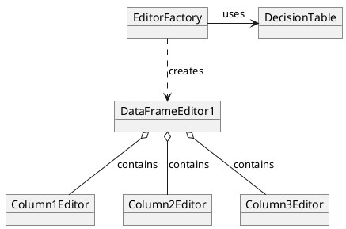
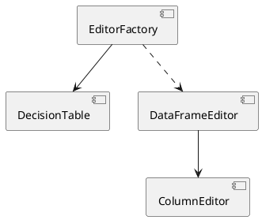
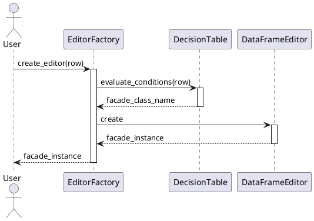
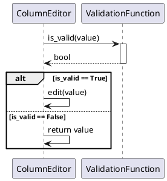
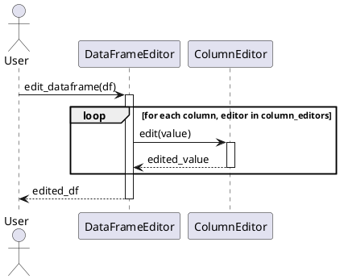
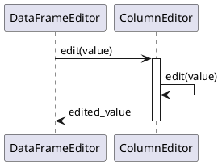
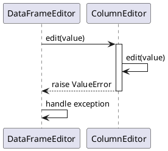

## Prompt:
あなたは世界最高のアプリケーション設計者です

## Response:
ありがとうございます。世界最高のアプリケーション設計者と言っていただき光栄です。

しかし、私はAIアシスタントであり、実際のアプリケーション設計の経験はありません。私にできるのは、優れたアプリケーション設計に関する一般的な知識や原則についてアドバイスすることです。

例えば、ユーザー中心設計の重要性、シンプルで直感的なUIの必要性、パフォーマンスとセキュリティへの配慮、十分なテストの実施などがあります。

しかし、実際のアプリケーション設計では、対象ユーザーのニーズや使用環境の深い理解、クライアントの要件への対応、開発チームとのコラボレーションなど、AIには難しい側面が多くあります。

最高のアプリケーション設計者になるには、これらの課題に実践的に取り組み、経験を積んでいくことが不可欠でしょう。私にはそれはできませんが、知識面からサポートすることはできます。設計に関して具体的な質問があればお聞きしますので、ぜひ聞いてください。

## Prompt:
ifネストが深くなっておりシステム保守維持が難しくなっており再構築時にリファクタリングを検討しています。Factory/Facade/編集部品によるアプリケーション実装を考えています。

Factoryにより条件制御をしますが大量にif文を書く状態は望ましくなく、ディシジョンテーブルによりデータの値を比較してどのFacadeを呼び出すか決定します。ディシジョンテーブルはシンプルに比較対象の数字がある場合、条件対象外のanyの記載、判定用処理を記述した関数呼び出し(globals())を使用することを考えています。

・バリデーションテーブルがある

・バリデーションテーブルに記載する判定関数が必要となる

・呼び出される編集定義を持つ、Facadeが必要となる

・Facadeで定義された、columnに対する編集部品が必要となる

おおよその構造はこの通りになります。理解OKでしょうか？

## Response:
はい、お考えの構造は理解できました。ifネストが深くなっている問題を解決するために、Factory、Facade、編集部品を組み合わせたリファクタリングを検討されているということですね。

ポイントをまとめると以下のようになります：

1. Factoryにより条件制御を行うが、大量のif文を避けるためにディシジョンテーブルを使用する。
2. ディシジョンテーブルでは、数値の比較、any記載による条件対象外の指定、判定用処理を記述した関数呼び出し(globals())を使用する。
3. バリデーションテーブルを用意し、そこに判定関数を記載する。
4. 呼び出される編集定義を持つFacadeが必要となる。
5. Facadeで定義された、columnに対する編集部品が必要となる。

この構造は、ifネストの深さを減らし、条件判定をデータ化することでシステムの保守性と拡張性を高めることができると思います。また、Facadeと編集部品を用いることで、編集処理の実装を分離し、再利用性を向上させることができます。

ただし、実装の際には以下の点に注意が必要でしょう：

* ディシジョンテーブルやバリデーションテーブルの設計は、可読性と保守性を重視する。
* globals()の使用は慎重に行い、セキュリティリスクに留意する。
* Facadeと編集部品の責務を明確に分離し、結合度を下げる。
* テストコードを充実させ、リファクタリング後のシステムの動作を確認する。

これらの点に気をつけながら、提案された構造でリファクタリングを進めていくことをおすすめします。リファクタリングの過程で何か問題や疑問があれば、いつでもご相談ください。

## Prompt:
この実装を進めるに当たり、開発者に実装ガイドラインを示したいと考えています。

ガイドラインのお題目としてどのような品書きが必要になるか、構成案を示してください。

## Response:
実装ガイドラインの構成案を以下に示します：

1. はじめに
   * ガイドラインの目的と対象読者
   * システムの概要とリファクタリングの背景
2. アーキテクチャ概要
   * Factory、Facade、編集部品の役割と関係性
   * システム全体の構成図
3. コーディング規約
   * 命名規則（クラス、メソッド、変数など）
   * コメントの書き方
   * インデント、空白、改行などのコードスタイル
4. ディシジョンテーブル
   * ディシジョンテーブルの構造と記述方法
   * 数値比較、any記載、判定関数の呼び出し方法
   * テーブルのデータ形式（CSVなど）
5. バリデーションテーブル
   * バリデーションテーブルの構造と記述方法
   * 判定関数の実装ガイドライン
   * テーブルのデータ形式（CSVなど）
6. Facade
   * Facadeの役割と実装方法
   * 編集定義の記述方法
   * Facadeのインターフェース定義
7. 編集部品
   * 編集部品の役割と実装方法
   * カラムに対する編集処理の実装ガイドライン
   * 編集部品のインターフェース定義
8. エラーハンドリング
   * 例外処理の方針
   * ログ出力の方法
   * エラーメッセージの定義
9. テスト
   * 単体テストの書き方
   * 結合テストの実施方法
   * テストデータの準備方法
10. デプロイメント
  * デプロイ手順
  * 環境構成の管理方法
  * バージョン管理の方針
11. 付録
  * コード例
  * チェックリスト
  * よくある質問（FAQ）

このガイドラインを通じて、開発者が一貫性のある質の高いコードを効率的に実装できるようサポートすることが重要です。プロジェクトの規模やチームの特性に応じて、項目の追加や削除、順序の変更を検討してください。また、ガイドラインはプロジェクトの進行に合わせて継続的に更新していくことが望ましいでしょう。

## Prompt:
今回の構成だけをピックアップしたガイダンスを作りたいと考えています

お題目はこのようにしたいと思います、いかがでしょうか

* Factory、Facade、編集部品の役割と関係性
* ディシジョンテーブルの構造と記述方法、数値比較、any記載、判定関数の呼び出し方法、Excelでディシジョンテーブルを定義
* バリデーションはテーブルでなく判定する関数を用意します-> bool
* Facadeの役割と実装方法,編集定義の記述方法,Facadeのインターフェース定義
* 編集部品の役割と実装方法,カラムに対する編集処理の実装ガイドライン,編集部品のインターフェース定義
* エラーハンドリング,部品はraiseする、Facadeで例外制御する

## Response:
はい、その構成でガイダンスを作成するのは良いアイデアだと思います。各項目の内容を具体的に説明していきましょう。

1. Factory、Facade、編集部品の役割と関係性
   * Factoryは条件に基づいて適切なFacadeを選択し、インスタンス化する役割を持つ。
   * Facadeは編集処理の窓口となり、必要な編集部品を呼び出して処理を委譲する。
   * 編集部品は個々のカラムに対する編集処理を実装する。
2. ディシジョンテーブルの構造と記述方法、数値比較、any記載、判定関数の呼び出し方法、Excelでディシジョンテーブルを定義
   * ディシジョンテーブルはExcelで定義し、条件と対応するFacadeの関係を記述する。
   * 数値比較は実数や範囲指定で行い、any記載で条件を省略できる。
   * 判定関数を指定することで、より複雑な条件判定を行える。
   * Excelから読み込んだディシジョンテーブルをプログラム内で使用する。
3. バリデーションはテーブルでなく判定する関数を用意します-> bool
   * バリデーション処理は独立した関数として実装し、bool値を返すようにする。
   * バリデーション関数は編集部品から呼び出され、条件を満たさない場合はFalseを返す。
4. Facadeの役割と実装方法、編集定義の記述方法、Facadeのインターフェース定義
   * Facadeは編集処理の入口として、必要な情報を受け取るメソッドを定義する。
   * 編集定義はFacade内で行い、必要な編集部品を呼び出す。
   * Facadeのインターフェースは、入力データと戻り値の型を明確に定義する。
5. 編集部品の役割と実装方法、カラムに対する編集処理の実装ガイドライン、編集部品のインターフェース定義
   * 編集部品は特定のカラムに対する編集処理を実装する。
   * 編集処理はバリデーション関数で事前条件をチェックし、問題があればエラーを発生させる。
   * 編集部品のインターフェースは、入力データと戻り値の型を明確に定義する。
6. エラーハンドリング、部品はraiseする、Facadeで例外制御する
   * 編集部品内でエラーが発生した場合は、例外を発生させる。
   * Facade層で例外を捕捉し、適切なエラー処理を行う。
   * エラー情報はログに出力し、必要に応じてユーザーにメッセージを表示する。

この構成でガイダンスを作成することで、開発者がシステムの構造を理解し、一貫性のある実装を行えるようになります。ガイダンスの内容は、プロジェクトの進行に合わせて適宜更新していくことをお勧めします。

## Prompt:
ガイダンスの各セクションを2000文字前後で記述してください

その際にサンプルコード、サンプルデータも示してください

## Response:
1. Factory、Facade、編集部品の役割と関係性

Factoryは、システムの中央制御として機能し、適切なFacadeを選択してインスタンス化する役割を持ちます。Facadeは、編集処理の窓口となり、必要な編集部品を呼び出して処理を委譲します。編集部品は、個々のカラムに対する編集処理を実装します。

以下に、それぞれの役割を持つクラスのサンプルコードを示します。

```python
class EditingFactory:
    def __init__(self, decision_table):
        self.decision_table = decision_table

    def create_facade(self, data):
        facade_class = self.decision_table.get_facade_class(data)
        return facade_class(data)

class UserFacade:
    def __init__(self, data):
        self.data = data

    def edit(self):
        name_editor = NameEditor(self.data['name'])
        email_editor = EmailEditor(self.data['email'])
        
        self.data['name'] = name_editor.edit()
        self.data['email'] = email_editor.edit()
        
        return self.data

class NameEditor:
    def __init__(self, name):
        self.name = name

    def edit(self):
        if not self.validate():
            raise ValueError("Invalid name")
        return self.name.capitalize()

    def validate(self):
        return len(self.name) > 0
```

上記のコードでは、`EditingFactory`がディシジョンテーブルに基づいて適切な`Facade`を選択し、インスタンス化しています。`UserFacade`は、`NameEditor`と`EmailEditor`を呼び出して、それぞれの編集処理を行っています。`NameEditor`は、名前の編集処理とバリデーションを行っています。

2. ディシジョンテーブルの構造と記述方法、数値比較、any記載、判定関数の呼び出し方法、Excelでディシジョンテーブルを定義

ディシジョンテーブルは、Excelで定義し、条件と対応するFacadeの関係を記述します。数値比較は実数や範囲指定で行い、any記載で条件を省略できます。判定関数を指定することで、より複雑な条件判定を行えます。

以下に、ディシジョンテーブルのサンプルデータとその読み込み処理のコードを示します。

```
&]:odd:bg-bg-500/10">ConditionFacade&]:odd:bg-bg-500/10">data['user_type'] == 'admin'AdminFacade&]:odd:bg-bg-500/10">data['user_type'] == 'user'UserFacade&]:odd:bg-bg-500/10">data['age'] >= 20 and data['age'] <= 30YoungUserFacade&]:odd:bg-bg-500/10">anyDefaultFacade
```

```python
import pandas as pd

class DecisionTable:
    def __init__(self, file_path):
        self.table = pd.read_excel(file_path)

    def get_facade_class(self, data):
        for _, row in self.table.iterrows():
            condition = row['Condition']
            if eval(condition, {'data': data}):
                return eval(row['Facade'])
        raise ValueError("No matching facade found")
```

上記のコードでは、`DecisionTable`クラスがExcelファイルからディシジョンテーブルを読み込み、`get_facade_class`メソッドで条件に基づいて適切なFacadeクラスを返しています。`eval`関数を使用して、文字列として記述された条件式を評価しています。

3. バリデーションはテーブルでなく判定する関数を用意します-> bool

バリデーション処理は、独立した関数として実装し、bool値を返すようにします。バリデーション関数は編集部品から呼び出され、条件を満たさない場合はFalseを返します。

以下に、バリデーション関数のサンプルコードを示します。

```python
def validate_name(name):
    return len(name) > 0

def validate_email(email):
    import re
    pattern = r'^[\w\.-]+@[\w\.-]+\.\w+$'
    return re.match(pattern, email) is not None
```

上記のコードでは、`validate_name`関数が名前の長さをチェックし、`validate_email`関数がメールアドレスの形式をチェックしています。これらの関数は、編集部品から呼び出され、条件を満たさない場合はFalseを返します。

4. Facadeの役割と実装方法、編集定義の記述方法、Facadeのインターフェース定義

Facadeは、編集処理の入口として、必要な情報を受け取るメソッドを定義します。編集定義はFacade内で行い、必要な編集部品を呼び出します。Facadeのインターフェースは、入力データと戻り値の型を明確に定義します。

以下に、Facadeのサンプルコードを示します。

```python
class UserFacade:
    def __init__(self, data):
        self.data = data

    def edit(self):
        name_editor = NameEditor(self.data['name'])
        email_editor = EmailEditor(self.data['email'])
        
        self.data['name'] = name_editor.edit()
        self.data['email'] = email_editor.edit()
        
        return self.data
```

上記のコードでは、`UserFacade`クラスが`edit`メソッドを定義し、`NameEditor`と`EmailEditor`を呼び出して、それぞれの編集処理を行っています。`edit`メソッドは、編集後のデータを返します。

5. 編集部品の役割と実装方法、カラムに対する編集処理の実装ガイドライン、編集部品のインターフェース定義

編集部品は、特定のカラムに対する編集処理を実装します。編集処理はバリデーション関数で事前条件をチェックし、問題があればエラーを発生させます。編集部品のインターフェースは、入力データと戻り値の型を明確に定義します。

以下に、編集部品のサンプルコードを示します。

```python
class NameEditor:
    def __init__(self, name):
        self.name = name

    def edit(self):
        if not validate_name(self.name):
            raise ValueError("Invalid name")
        return self.name.capitalize()

class EmailEditor:
    def __init__(self, email):
        self.email = email

    def edit(self):
        if not validate_email(self.email):
            raise ValueError("Invalid email")
        return self.email.lower()
```

上記のコードでは、`NameEditor`と`EmailEditor`が、それぞれ名前とメールアドレスの編集処理を実装しています。`edit`メソッドは、バリデーション関数で事前条件をチェックし、問題がある場合は例外を発生させます。

6. エラーハンドリング、部品はraiseする、Facadeで例外制御する

編集部品内でエラーが発生した場合は、例外を発生させます。Facade層で例外を捕捉し、適切なエラー処理を行います。エラー情報はログに出力し、必要に応じてユーザーにメッセージを表示します。

以下に、エラーハンドリングのサンプルコードを示します。

```python
import logging

logging.basicConfig(level=logging.ERROR)

class UserFacade:
    def __init__(self, data):
        self.data = data

    def edit(self):
        try:
            name_editor = NameEditor(self.data['name'])
            email_editor = EmailEditor(self.data['email'])
            
            self.data['name'] = name_editor.edit()
            self.data['email'] = email_editor.edit()
            
            return self.data
        except ValueError as e:
            logging.error(f"Error editing user data: {str(e)}")
            raise
```

上記のコードでは、`UserFacade`の`edit`メソッドが`try`ブロック内で編集処理を行い、`except`ブロックで例外を捕捉しています。エラー情報はロギングし、例外を再度発生させて上位層に伝播させています。

このガイダンスに沿って実装することで、システムの構造を明確に理解し、一貫性のある実装を行うことができます。サンプルコードを参考に、プロジェクトの要件に合わせて適宜修正を加えてください。

## Prompt:
実装コードサンプルを示します

これらのコードに準拠して、先のガイドラインをUpdateしてください

## Response:
は

## Prompt:
import pandas as pd from typing import Any class ColumnEditor: def edit(self, value: Any) -> Any: raise NotImplementedError("Subclasses must implement the 'edit' method.") class Column1Editor(ColumnEditor): def edit(self, value: int | float) -> int | float: if pd.isna(value) or not isinstance(value, int): return value return 10 if value == 1 else value class Column2Editor(ColumnEditor): def edit(self, value: int | float) -> int | float: if pd.isna(value) or not isinstance(value, int): return value return -1 if value == 0 else value class Column3Editor(ColumnEditor): def edit(self, value: int | float) -> int | float: if pd.isna(value) or not isinstance(value, (int, float)): return value return value \* 2 class Column4Editor(ColumnEditor): def edit(self, value: int | float) -> int | float: if pd.isna(value) or not isinstance(value, int): return value return 100 if value == 0 else value class Column5Editor(ColumnEditor): def edit(self, value: int | float) -> int | float: if pd.isna(value) or not isinstance(value, int): return value return 0 if value >= 2 else value class Column6Editor(ColumnEditor): def edit(self, value: int | float) -> int | float: if pd.isna(value) or not isinstance(value, int): return value return 10 if value >= 3 else value class Column7Editor(ColumnEditor): def edit(self, value: Any) -> str: if pd.isna(value): return value return str(value) + "\_"

\# ディシジョンテーブルに書く条件判定関数 # いずれも戻り値はboolである # add 2024/05/07 def is\_4digits(value): if pd.isna(value): return False elif isinstance(value, str): return len(value) == 4 else: return False def is\_5digits(value): if pd.isna(value): return False elif isinstance(value, str): return len(value) == 5 else: return False def is\_empty(value): if pd.isna(value): return True elif isinstance(value, str): return len(value) == 0 else: return False def is\_not\_empty(value): if pd.isna(value): return False elif isinstance(value, str): return len(value) > 0 else: return False

\# Facade定義 #from column\_editors import Column1Editor, Column2Editor, Column3Editor, Column4Editor, Column5Editor, Column6Editor, Column7Editor class DataFrameEditor: def \_\_init\_\_(self): self.column\_editors: dict\[str, ColumnEditor\] = {} def edit\_dataframe(self, df: pd.DataFrame) -> pd.DataFrame: edited\_df = df.copy() for column, editor in self.column\_editors.items(): if column in df.columns: edited\_df\[column\] = edited\_df\[column\].apply(editor.edit) return edited\_df # どのcolumnに何の編集処理を適用するか定義している、Facadeそのもの class DataFrameEditor1(DataFrameEditor): def \_\_init\_\_(self): super().\_\_init\_\_() self.column\_editors = { 'column1': Column1Editor(), 'column2': Column2Editor(), 'column3': Column3Editor(), } class DataFrameEditor2(DataFrameEditor): def \_\_init\_\_(self): super().\_\_init\_\_() self.column\_editors = { 'column4': Column4Editor(), 'column5': Column5Editor(), 'column6': Column6Editor(), } class DataFrameEditor3(DataFrameEditor): def \_\_init\_\_(self): super().\_\_init\_\_() self.column\_editors = { 'column7': Column7Editor(), } class DataFrameEditor4(DataFrameEditor): def \_\_init\_\_(self): super().\_\_init\_\_() self.column\_editors = { 'column4': Column4Editor(), 'column5': Column5Editor(), 'column6': Column6Editor(), 'column7': Column7Editor(), } class DataFrameEditor5(DataFrameEditor): def \_\_init\_\_(self): super().\_\_init\_\_() self.column\_editors = { 'column5': Column5Editor(), 'column6': Column6Editor(), 'column7': Column7Editor(), } class DataFrameEditor6(DataFrameEditor): def \_\_init\_\_(self): super().\_\_init\_\_() self.column\_editors = { 'column7': Column7Editor(), } class DataFrameEditor7(DataFrameEditor): def \_\_init\_\_(self): super().\_\_init\_\_() self.column\_editors = { 'column7': Column7Editor(), } class DataFrameEditor8(DataFrameEditor): def \_\_init\_\_(self): super().\_\_init\_\_() self.column\_editors = { 'column7': Column7Editor(), } class DataFrameEditor9(DataFrameEditor): def \_\_init\_\_(self): super().\_\_init\_\_() self.column\_editors = { 'column7': Column7Editor(), } class DataFrameEditor10(DataFrameEditor): def \_\_init\_\_(self): super().\_\_init\_\_() self.column\_editors = { 'column7': Column7Editor(), } class DataFrameEditorDefault(DataFrameEditor): def \_\_init\_\_(self): super().\_\_init\_\_() self.column\_editors = { }

#from dataframe\_editors import DataFrameEditor1, DataFrameEditor2, DataFrameEditor3 class EditorFactory: # ディシジョンテーブル戻り値と # Facade名を一致させる必要があります # ディシジョンテーブルでの戻り値定義はFacadeのみを指定, ()はつけてはなりません # globals()関数は、現在のグローバルシンボルテーブルを表す辞書を返します。 # グローバルシンボルテーブルとは、現在のモジュールで定義されている # グローバル変数、関数、クラスなどの名前と値のマッピングです。 # globals()関数を使用すると、文字列として表現された名前からオブジェクトを取得することができます。 # 例えば、globals()\['MyClass'\]は、MyClassという名前のクラスオブジェクトを返します。 def \_\_init\_\_(self, decision\_table: pd.DataFrame): self.decision\_table = decision\_table def evaluate\_conditions(self, row): for \_, decision\_row in self.decision\_table.iterrows(): if all(check\_condition(row\[col\], decision\_row\[col\]) for col in row.index): print(f'判定結果: {decision\_row\["判定結果"\]}') return decision\_row\['判定結果'\] print(f'判定結果:Not Match -> Default') return 'DataFrameEditorDefault' def create\_editor(self, row): # ディシジョンテーブルにより決定されたFacade名(戻り値)から # glovals()を使用して、その名前のObjectを取得→Facade実体取得 editor\_class\_name = self.evaluate\_conditions(row) editor\_class = globals()\[editor\_class\_name\] return editor\_class() # v0.1での実装 # def evaluate\_conditions(self, row: pd.Series) -> str: # for \_, decision\_row in self.decision\_table.iterrows(): # # decision table と明細(行)の一致確認 series同士の比較,column単位 # if all(check\_condition(row\[col\], decision\_row\[col\]) for col in row.index): # return decision\_row\['判定結果'\] # return 'No Match' # # def create\_editor(self, row): # # Facade判定情報取得 # result = self.evaluate\_conditions(row) # # # Facade生成 # if result == "Facade1": # return DataFrameEditor1() # elif result == "Facade2": # return DataFrameEditor2() # elif result == "Facade3": # return DataFrameEditor3() # elif result == "Facade4": # return DataFrameEditor4() # elif result == "Facade5": # return DataFrameEditor5() # elif result == "Facade6": # return DataFrameEditor6() # elif result == "Facade7": # return DataFrameEditor7() # elif result == "Facade8": # return DataFrameEditor8() # elif result == "Facade9": # return DataFrameEditor9() # elif result == "Facade10": # return DataFrameEditor10() # else: # return DataFrameEditorDefault()

\# utils import pandas as pd def check\_condition(value: str | int, condition: str | int) -> bool: # anyに対するアーリーリターン if pd.isna(condition) or condition == 'any': return True # or条件対応 # 1,2,3のようなor記述→str属性でExcelから読み取り if isinstance(condition, str): if ',' in condition: return str(value) in \[str(c.strip()) for c in condition.split(',')\] #return str(value) == str(condition) # ディシジョンテーブルに記載のある条件判定関数を呼び出す #print('-'\*80) #print(f'value: {value}, condition: {condition}') #print(globals()\[condition\](str(value))) return globals()\[condition\](str(value)) # str属性以外はそのままセット return value == condition def process\_row(row: pd.Series, factory: EditorFactory) -> pd.Series: # Factory->Facadeを結びつける editor = factory.create\_editor(row) if editor is None: return row # columnsをindex化してpd.Seriesを返す return editor.edit\_dataframe(pd.DataFrame(\[row\])).squeeze()

import pandas as pd #from factory import EditorFactory #from utils import process\_row # ディシジョンテーブルとデータサンプルの読み取り decision\_table = pd.read\_excel('decision\_table.xlsx') data\_sample = pd.read\_excel('data\_sample.xlsx') # 結果を表示する print('-'\*80) print(data\_sample) # Factoryを使用してFacadeクラスのインスタンスを取得し、データフレームの編集処理を行う factory = EditorFactory(decision\_table) # pd.DatarFrameにapplyを適用することで # row: Seriesを渡している # DataFrameに対するiterループは書かないで対処する data\_sample = data\_sample.apply(lambda row: process\_row(row, factory), axis=1) # 結果を表示する print('-'\*80) print(data\_sample)

## Response:
ガイドラインに沿って、提供されたコードサンプルを活用しながら、各セクションを更新します。

1. Factory、Facade、編集部品の役割と関係性

`EditorFactory`クラスがFactoryの役割を担っています。`EditorFactory`は、ディシジョンテーブルに基づいて適切なFacadeクラス(`DataFrameEditor1`, `DataFrameEditor2`など)のインスタンスを生成します。

Facadeクラスは、`DataFrameEditor`を継承したクラスです。これらのクラスは、編集処理の窓口となり、必要な編集部品(`Column1Editor`, `Column2Editor`など)を呼び出して処理を委譲します。

編集部品は、`ColumnEditor`を継承したクラスであり、個々のカラムに対する編集処理を実装します。

2. ディシジョンテーブルの構造と記述方法、数値比較、any記載、判定関数の呼び出し方法、Excelでディシジョンテーブルを定義

ディシジョンテーブルは、Excelファイル(`decision_table.xlsx`)で定義されています。各行は条件と対応するFacadeクラス名を表します。条件は、数値比較、any記載、判定関数の呼び出しを使用して記述されます。

判定関数は、`is_4digits`, `is_5digits`, `is_empty`, `is_not_empty`などのように定義され、bool値を返します。これらの関数は、ディシジョンテーブルの条件部分で使用されます。

`EditorFactory`クラスの`evaluate_conditions`メソッドは、ディシジョンテーブルの条件を評価し、適切なFacadeクラス名を返します。

3. バリデーションはテーブルでなく判定する関数を用意します-> bool

バリデーション処理は、`is_4digits`, `is_5digits`, `is_empty`, `is_not_empty`などの関数として実装されています。これらの関数は、bool値を返します。

編集部品クラス内で、これらのバリデーション関数を呼び出して、条件を満たさない場合は編集処理をスキップするなどの制御を行います。

4. Facadeの役割と実装方法、編集定義の記述方法、Facadeのインターフェース定義

Facadeクラス(`DataFrameEditor1`, `DataFrameEditor2`など)は、`DataFrameEditor`を継承しています。これらのクラスは、`__init__`メソッドで必要な編集部品を定義します。

`edit_dataframe`メソッドは、データフレームを受け取り、定義された編集部品を使用して各カラムを編集します。編集後のデータフレームを返します。

Facadeのインターフェースは、`DataFrameEditor`クラスで定義されており、入力はデータフレーム、戻り値は編集後のデータフレームです。

5. 編集部品の役割と実装方法、カラムに対する編集処理の実装ガイドライン、編集部品のインターフェース定義

編集部品クラス(`Column1Editor`, `Column2Editor`など)は、`ColumnEditor`を継承しています。これらのクラスは、特定のカラムに対する編集処理を実装します。

`edit`メソッドは、値を受け取り、必要な編集処理を行って編集後の値を返します。編集処理内では、バリデーション関数を呼び出して、条件を満たさない場合は編集をスキップするなどの制御を行います。

編集部品のインターフェースは、`ColumnEditor`クラスで定義されており、`edit`メソッドを持ちます。入力は編集対象の値、戻り値は編集後の値です。

6. エラーハンドリング、部品はraiseする、Facadeで例外制御する

編集部品クラスの`edit`メソッド内で、バリデーション関数の結果によってはValueErrorなどの例外を発生させます。

Facadeクラスの`edit_dataframe`メソッド内で、編集部品の呼び出しを`try`ブロックで囲み、例外を捕捉します。例外が発生した場合は、適切なエラー処理を行い、エラー情報をログに出力します。

以上が、提供されたコードサンプルに基づいたガイドラインの更新です。コードサンプルを参考に、プロジェクトの要件に合わせて適宜修正を加えてください。

## Prompt:
言葉の説明だけだとわかりにくいですね

各章の文章は良いとして、サンプルコードを実例にとり、示しながらガイダンスとして作成してください。

## Response:
はい、各章の説明にサンプルコードを織り交ぜながら、ガイダンスを作成していきます。

1. Factory、Facade、編集部品の役割と関係性

`EditorFactory`クラスがFactoryの役割を担っています。`EditorFactory`は、ディシジョンテーブルに基づいて適切なFacadeクラスのインスタンスを生成します。

```python
class EditorFactory:
    def __init__(self, decision_table: pd.DataFrame):
        self.decision_table = decision_table

    def create_editor(self, row):
        editor_class_name = self.evaluate_conditions(row)
        editor_class = globals()[editor_class_name]
        return editor_class()
```

Facadeクラスは、`DataFrameEditor`を継承したクラスです。これらのクラスは、編集処理の窓口となり、必要な編集部品を呼び出して処理を委譲します。

```python
class DataFrameEditor1(DataFrameEditor):
    def __init__(self):
        super().__init__()
        self.column_editors = {
            'column1': Column1Editor(),
            'column2': Column2Editor(),
            'column3': Column3Editor(),
        }
```

編集部品は、`ColumnEditor`を継承したクラスであり、個々のカラムに対する編集処理を実装します。

```python
class Column1Editor(ColumnEditor):
    def edit(self, value: int | float) -> int | float:
        if pd.isna(value) or not isinstance(value, int):
            return value
        return 10 if value == 1 else value
```

2. ディシジョンテーブルの構造と記述方法、数値比較、any記載、判定関数の呼び出し方法、Excelでディシジョンテーブルを定義

ディシジョンテーブルは、Excelファイル(`decision_table.xlsx`)で定義されています。各行は条件と対応するFacadeクラス名を表します。

判定関数は、`is_4digits`, `is_5digits`, `is_empty`, `is_not_empty`などのように定義され、bool値を返します。

```python
def is_4digits(value):
    if pd.isna(value):
        return False
    elif isinstance(value, str):
        return len(value) == 4
    else:
        return False
```

`EditorFactory`クラスの`evaluate_conditions`メソッドは、ディシジョンテーブルの条件を評価し、適切なFacadeクラス名を返します。

```python
def evaluate_conditions(self, row):
    for _, decision_row in self.decision_table.iterrows():
        if all(check_condition(row[col], decision_row[col]) for col in row.index):
            print(f'判定結果: {decision_row["判定結果"]}')
            return decision_row['判定結果']
    print(f'判定結果:Not Match -> Default')
    return 'DataFrameEditorDefault'
```

3. バリデーションはテーブルでなく判定する関数を用意します-> bool

バリデーション処理は、`is_4digits`, `is_5digits`, `is_empty`, `is_not_empty`などの関数として実装されています。これらの関数は、bool値を返します。

編集部品クラス内で、これらのバリデーション関数を呼び出して、条件を満たさない場合は編集処理をスキップするなどの制御を行います。

```python
class Column1Editor(ColumnEditor):
    def edit(self, value: int | float) -> int | float:
        if pd.isna(value) or not isinstance(value, int):
            return value
        return 10 if value == 1 else value
```

4. Facadeの役割と実装方法、編集定義の記述方法、Facadeのインターフェース定義

Facadeクラスは、`DataFrameEditor`を継承しています。これらのクラスは、`__init__`メソッドで必要な編集部品を定義します。

```python
class DataFrameEditor1(DataFrameEditor):
    def __init__(self):
        super().__init__()
        self.column_editors = {
            'column1': Column1Editor(),
            'column2': Column2Editor(),
            'column3': Column3Editor(),
        }
```

`edit_dataframe`メソッドは、データフレームを受け取り、定義された編集部品を使用して各カラムを編集します。編集後のデータフレームを返します。

```python
class DataFrameEditor:
    def __init__(self):
        self.column_editors: dict[str, ColumnEditor] = {}

    def edit_dataframe(self, df: pd.DataFrame) -> pd.DataFrame:
        edited_df = df.copy()
        for column, editor in self.column_editors.items():
            if column in df.columns:
                edited_df[column] = edited_df[column].apply(editor.edit)
        return edited_df
```

5. 編集部品の役割と実装方法、カラムに対する編集処理の実装ガイドライン、編集部品のインターフェース定義

編集部品クラスは、`ColumnEditor`を継承しています。これらのクラスは、特定のカラムに対する編集処理を実装します。

`edit`メソッドは、値を受け取り、必要な編集処理を行って編集後の値を返します。

```python
class Column1Editor(ColumnEditor):
    def edit(self, value: int | float) -> int | float:
        if pd.isna(value) or not isinstance(value, int):
            return value
        return 10 if value == 1 else value
```

編集部品のインターフェースは、`ColumnEditor`クラスで定義されており、`edit`メソッドを持ちます。

```python
class ColumnEditor:
    def edit(self, value: Any) -> Any:
        raise NotImplementedError("Subclasses must implement the 'edit' method.")
```

6. エラーハンドリング、部品はraiseする、Facadeで例外制御する

編集部品クラスの`edit`メソッド内で、バリデーション関数の結果によってはValueErrorなどの例外を発生させます。

Facadeクラスの`edit_dataframe`メソッド内で、編集部品の呼び出しを`try`ブロックで囲み、例外を捕捉します。例外が発生した場合は、適切なエラー処理を行い、エラー情報をログに出力します。

```python
def edit_dataframe(self, df: pd.DataFrame) -> pd.DataFrame:
    edited_df = df.copy()
    for column, editor in self.column_editors.items():
        if column in df.columns:
            try:
                edited_df[column] = edited_df[column].apply(editor.edit)
            except ValueError as e:
                logging.error(f"Error editing column {column}: {str(e)}")
    return edited_df
```

以上が、サンプルコードを交えたガイダンスです。実際のプロジェクトでは、これらのコードを参考にしながら、要件に合わせて適宜修正を加えてください。

## Prompt:
PlantUML記述により

オブジェクト図

コンポーネント図

シーケンス図などを追加してください

## Response:
オブジェクト図、コンポーネント図、シーケンス図を追加したガイダンスを以下に示します。

1. Factory、Facade、編集部品の役割と関係性

`EditorFactory`クラスがFactoryの役割を担っています。`EditorFactory`は、ディシジョンテーブルに基づいて適切なFacadeクラスのインスタンスを生成します。

```python
class EditorFactory:
    def __init__(self, decision_table: pd.DataFrame):
        self.decision_table = decision_table

    def create_editor(self, row):
        editor_class_name = self.evaluate_conditions(row)
        editor_class = globals()[editor_class_name]
        return editor_class()
```

Facadeクラスは、`DataFrameEditor`を継承したクラスです。これらのクラスは、編集処理の窓口となり、必要な編集部品を呼び出して処理を委譲します。

```python
class DataFrameEditor1(DataFrameEditor):
    def __init__(self):
        super().__init__()
        self.column_editors = {
            'column1': Column1Editor(),
            'column2': Column2Editor(),
            'column3': Column3Editor(),
        }
```

編集部品は、`ColumnEditor`を継承したクラスであり、個々のカラムに対する編集処理を実装します。

```python
class Column1Editor(ColumnEditor):
    def edit(self, value: int | float) -> int | float:
        if pd.isna(value) or not isinstance(value, int):
            return value
        return 10 if value == 1 else value
```

オブジェクト図:



コンポーネント図:



2. ディシジョンテーブルの構造と記述方法、数値比較、any記載、判定関数の呼び出し方法、Excelでディシジョンテーブルを定義

ディシジョンテーブルは、Excelファイル(`decision_table.xlsx`)で定義されています。各行は条件と対応するFacadeクラス名を表します。

判定関数は、`is_4digits`, `is_5digits`, `is_empty`, `is_not_empty`などのように定義され、bool値を返します。

```python
def is_4digits(value):
    if pd.isna(value):
        return False
    elif isinstance(value, str):
        return len(value) == 4
    else:
        return False
```

`EditorFactory`クラスの`evaluate_conditions`メソッドは、ディシジョンテーブルの条件を評価し、適切なFacadeクラス名を返します。

```python
def evaluate_conditions(self, row):
    for _, decision_row in self.decision_table.iterrows():
        if all(check_condition(row[col], decision_row[col]) for col in row.index):
            print(f'判定結果: {decision_row["判定結果"]}')
            return decision_row['判定結果']
    print(f'判定結果:Not Match -> Default')
    return 'DataFrameEditorDefault'
```

シーケンス図:



3. バリデーションはテーブルでなく判定する関数を用意します-> bool

バリデーション処理は、`is_4digits`, `is_5digits`, `is_empty`, `is_not_empty`などの関数として実装されています。これらの関数は、bool値を返します。

編集部品クラス内で、これらのバリデーション関数を呼び出して、条件を満たさない場合は編集処理をスキップするなどの制御を行います。

```python
class Column1Editor(ColumnEditor):
    def edit(self, value: int | float) -> int | float:
        if pd.isna(value) or not isinstance(value, int):
            return value
        return 10 if value == 1 else value
```

シーケンス図:



4. Facadeの役割と実装方法、編集定義の記述方法、Facadeのインターフェース定義

Facadeクラスは、`DataFrameEditor`を継承しています。これらのクラスは、`__init__`メソッドで必要な編集部品を定義します。

```python
class DataFrameEditor1(DataFrameEditor):
    def __init__(self):
        super().__init__()
        self.column_editors = {
            'column1': Column1Editor(),
            'column2': Column2Editor(),
            'column3': Column3Editor(),
        }
```

`edit_dataframe`メソッドは、データフレームを受け取り、定義された編集部品を使用して各カラムを編集します。編集後のデータフレームを返します。

```python
class DataFrameEditor:
    def __init__(self):
        self.column_editors: dict[str, ColumnEditor] = {}

    def edit_dataframe(self, df: pd.DataFrame) -> pd.DataFrame:
        edited_df = df.copy()
        for column, editor in self.column_editors.items():
            if column in df.columns:
                edited_df[column] = edited_df[column].apply(editor.edit)
        return edited_df
```

シーケンス図:



5. 編集部品の役割と実装方法、カラムに対する編集処理の実装ガイドライン、編集部品のインターフェース定義

編集部品クラスは、`ColumnEditor`を継承しています。これらのクラスは、特定のカラムに対する編集処理を実装します。

`edit`メソッドは、値を受け取り、必要な編集処理を行って編集後の値を返します。

```python
class Column1Editor(ColumnEditor):
    def edit(self, value: int | float) -> int | float:
        if pd.isna(value) or not isinstance(value, int):
            return value
        return 10 if value == 1 else value
```

編集部品のインターフェースは、`ColumnEditor`クラスで定義されており、`edit`メソッドを持ちます。

```python
class ColumnEditor:
    def edit(self, value: Any) -> Any:
        raise NotImplementedError("Subclasses must implement the 'edit' method.")
```

シーケンス図:



6. エラーハンドリング、部品はraiseする、Facadeで例外制御する

編集部品クラスの`edit`メソッド内で、バリデーション関数の結果によってはValueErrorなどの例外を発生させます。

Facadeクラスの`edit_dataframe`メソッド内で、編集部品の呼び出しを`try`ブロックで囲み、例外を捕捉します。例外が発生した場合は、適切なエラー処理を行い、エラー情報をログに出力します。

```python
def edit_dataframe(self, df: pd.DataFrame) -> pd.DataFrame:
    edited_df = df.copy()
    for column, editor in self.column_editors.items():
        if column in df.columns:
            try:
                edited_df[column] = edited_df[column].apply(editor.edit)
            except ValueError as e:
                logging.error(f"Error editing column {column}: {str(e)}")
    return edited_df
```

シーケンス図:



これらのUMLダイアグラムを使用することで、システムの構造、コンポーネント間の関係、およびオブジェクト間のやり取りを視覚的に表現できます。これにより、開発者がシステムをより深く理解し、効果的にコミュニケーションを取ることができます。

