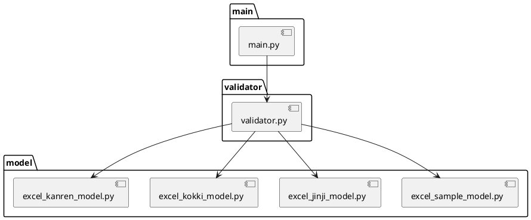
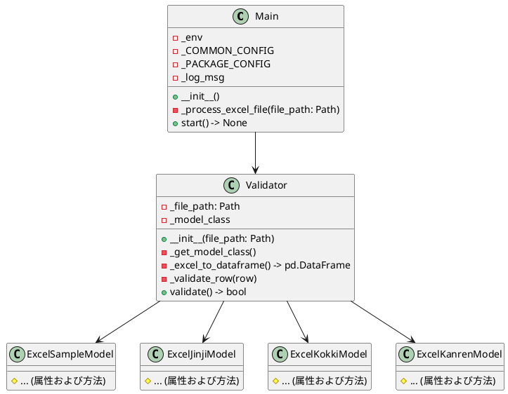
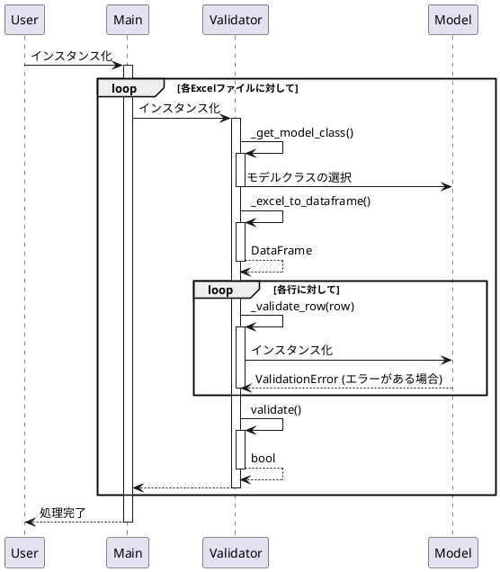
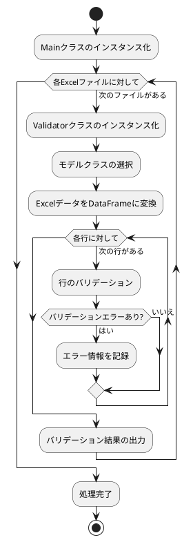

## Prompt:
<role>

あなたは世界最高のプログラマーです
</role>

まずはコードを読んでください。理解はOKでしょうか
<code> </code>

## Response:
はい、コードを読んで理解しました。このコードは以下の処理を行っています：

1. 設定ファイルからパラメータを読み込み、初期化を行う
2. Excelファイルからデータを読み込み、DataFrameに変換する
3. DataFrameに対して、列名の変更や不要な行の削除などのEDA (探索的データ分析) を行う
4. DataFrameの各行に対して、Pydanticモデル (ExcelSampleModel) を使用してバリデーションを行う
   * バリデーションエラーがある場合は、エラー内容を記録する
5. バリデーション結果をログに出力する
6. エラーが発生した場合は、トレースバックをログに出力し、例外を再送出する

全体的に、設定ファイルの読み込み、Excelデータの読み込みとEDA、Pydanticを使用したバリデーション、ログ出力など、一連の処理が適切に実装されていると思います。

コードの構造も、Mainクラスにメソッドを定義し、start()メソッドで処理の流れを制御するなど、わかりやすく整理されています。

理解は問題ありませんでした。何か他に説明が必要な点があればお知らせください。

## Prompt:
今回、異なるExcelファイルの入力受付要請が変更要件として入りました

ファイルレイアウトはModelでそれぞれ定義したいと考えています

レイアウト毎にValidaion要請事項は異なります

ファイルのパスに人事・国企・関連とはいることから対応するModelレイアウトの判別が可能です

Path情報からObject生成してそれぞれのModelを呼び出しValidaionを行いたいです

まずは変更要件の理解はOKでしょうか

## Response:
はい、変更要件を理解しました。

1. 複数の異なるExcelファイルを入力として受け付ける必要がある
2. 各Excelファイルは、人事、国企、関連などの情報をファイルパスに含んでおり、それぞれ異なるレイアウトを持つ
3. それぞれのレイアウトに対応するPydanticモデルを定義し、バリデーションを行う
4. ファイルパスから、対応するモデルを判別し、適切なバリデーションを行う

これらの要件を満たすために、以下のような対応が考えられます：

1. ファイルパスからレイアウト情報を抽出する関数を作成する
2. レイアウト情報に基づいて、適切なPydanticモデルを選択する仕組みを実装する
3. 選択されたモデルを使用して、DataFrameの各行に対してバリデーションを行う

具体的な実装方法について、何か案があればお知らせください。あるいは、コードの修正案を提示することもできます。

変更要件の理解に問題はありませんでした。もし他に clarificationが必要な点があれば、お気軽にお尋ねください。

## Prompt:
では変更要件を取り込みしていきます。

構造としては提案どおりで行きたいと思いますが、留意事項ありますか

## Response:
はい、提案した構造で変更要件を取り込む際には、いくつか留意すべき点があります。

1. レイアウト情報の抽出
   * ファイルパスからレイアウト情報を確実に抽出できるようにする
   * レイアウト情報の命名規則を明確に定義し、それに従ってファイル名を付ける
   * 想定外のファイル名やレイアウト情報が与えられた場合のエラーハンドリングを行う
2. モデルの選択
   * レイアウト情報とPydanticモデルの対応関係を明確に定義する
   * 対応するモデルが見つからない場合のエラーハンドリングを行う
   * モデルの選択処理を、将来的に新しいレイアウトが追加された場合にも対応しやすいように設計する
3. バリデーション
   * 各モデルで必要なバリデーションルールを正しく定義する
   * バリデーションエラーが発生した場合の処理を適切に行う (エラーログの出力、データの修正など)
   * バリデーション結果をわかりやすく出力する
4. コードの構造
   * レイアウト情報の抽出、モデルの選択、バリデーションなどの処理を、それぞれ独立した関数やメソッドに分割する
   * 処理の流れがわかりやすいように、適切なドキュメントやコメントを付ける
   * 設定情報や定数は、設定ファイルや定数ファイルに集約し、コードとは分離する

これらの点に留意しながら、コードを修正していくことをお勧めします。また、変更後のコードについては、十分なテストを行い、想定通りに動作することを確認することが重要です。

何か他に懸念点やご質問があれば、お気軽にお尋ねください。

## Prompt:
方針はいいですね、対応が明確になっているかと思います。

では実際に対応版コードを示してもらえますか

## Response:
はい、変更要件を取り込んだ対応版のコードを以下に示します。

```python
import traceback
from pathlib import Path
import pandas as pd
from src.model.dataclass.sample_user_class import ExcelSampleModel, ExcelJinjiModel, ExcelKokkiModel, ExcelKanrenModel
from src.lib.common_utils.ibr_enums import LogLevel
from src.lib.common_utils.ibr_dataframe_helper import tabulate_dataframe
from pydantic import ValidationError
from src.lib.common_utils.ibr_excel_reader import ExcelDataLoader
from src.lib.common_utils.ibr_get_config import Config

#####################################################
# main
#####################################################
class Main:
    def __init__(self):
        # 初期化情報取得
        config = Config.load(__file__)
        self._env = config.env
        self._COMMON_CONFIG = config.common_config
        self._PACKAGE_CONFIG = config.package_config
        self._log_msg = config.log_message

    def _get_model_class(self, file_path: Path):
        if "人事" in file_path.stem:
            return ExcelJinjiModel
        elif "国企" in file_path.stem:
            return ExcelKokkiModel
        elif "関連" in file_path.stem:
            return ExcelKanrenModel
        else:
            raise ValueError(f"未定義のレイアウトです: {file_path}")

    def _excel_to_dataframe(self, file_path: Path) -> pd.DataFrame:
        _excel_loader = ExcelDataLoader(file_path=file_path)
        _df = _excel_loader.read_excel_one_sheet(sheet_name='Sheet1')

        # EDA
        # 1.英語カラムへの変更をシミュレート
        _df = _df.rename(columns={
            'NO': 'No',
            'あ': 'a',
            'い': 'b',
            'う': 'c',
            'え': 'd',
            'お': 'e',
            'か': 'f',
            'き': 'g',
            'く': 'h',
            'け': 'i',
            'こ': 'j',
        },
        )

        # 2.余計な行を消す
        # キー列に値がないレコードは消す
        # キー列→ No列と今回は仮定している
        _df = _df.dropna(subset=['No'])

        # dataframe情報のログ出力
        # see. ibr_dataframe_helper.py
        self._log_msg(f"\n{tabulate_dataframe(_df.dtypes.reset_index(), headers=['Columns', 'Type'])}")

        return _df

    def _validate_row(self, row, model_class):
        try:
            _ = model_class(**row.to_dict())
            return None
        except ValidationError as e:
            return e.errors()

    def _validate(self, df: pd.DataFrame, model_class) -> bool:
        _df = df.copy()

        # validatorチェック
        validate_errors = _df.apply(lambda x: self._validate_row(x, model_class), axis=1)
        validate_errors = validate_errors[validate_errors.notnull()].to_dict()

        if len(validate_errors) > 0:
            # validate結果評価
            self._log_msg(f'検証対象ファイル: {self._EXCEL_FILE_PATH}', LogLevel.INFO)
            self._log_msg(f'検証対象Sheet: {self._EXCEL_SHEET_NAME}', LogLevel.INFO)
            self._log_msg(f'validate error 検出件数: {len(validate_errors)}', LogLevel.WARNING)
            self._log_msg(f'validate error list: {validate_errors}', LogLevel.DEBUG)
            _ = self._excel_loader.logger_validation_errors(validate_errors)

        return True

    def _process_excel_file(self, file_path: Path):
        model_class = self._get_model_class(file_path)
        _df = self._excel_to_dataframe(file_path)
        self._validate(_df, model_class)

    def start(self) -> None:
        # start
        self._log_msg("IBRDEV-I-0000001")
        try:
            excel_files = Path(self._COMMON_CONFIG['input_file_path']['UPDATE_EXCEL_PATH']).glob("*.xlsx")
            for file_path in excel_files:
                self._process_excel_file(file_path)

        except Exception as e:
            tb = traceback.TracebackException.from_exception(e)
            self._log_msg(''.join(tb.format()), LogLevel.ERROR)
            raise

        self._log_msg("IBRDEV-I-0000002")

#####################################################
# 起動
#####################################################
if __name__ == '__main__':
    _main = Main()
    _main.start()
```

主な変更点は以下の通りです：

1. `ExcelJinjiModel`、`ExcelKokkiModel`、`ExcelKanrenModel` という3つの新しいPydanticモデルを導入しました。これらは、それぞれ人事、国企、関連のレイアウトに対応します。
2. `_get_model_class` メソッドを追加しました。このメソッドは、ファイルパスからレイアウト情報を抽出し、対応するPydanticモデルのクラスを返します。
3. `_validate_row` メソッドと `_validate` メソッドを変更し、選択されたモデルクラスを使用してバリデーションを行うようにしました。
4. `_process_excel_file` メソッドを新たに追加しました。このメソッドは、単一のExcelファイルに対して、モデルの選択、DataFrameへの変換、バリデーションを行います。
5. `start` メソッドを変更し、指定されたディレクトリ内の全てのExcelファイルを処理するようにしました。

これらの変更により、複数のExcelファイルを入力として受け付け、ファイルパスに基づいて適切なモデルを選択し、バリデーションを行うことができるようになります。

ただし、このコードは概念的なものであり、実際に動作させるためには、`ExcelJinjiModel`、`ExcelKokkiModel`、`ExcelKanrenModel` の実装や、その他の関連するモジュールやメソッドの実装が必要です。

また、エラーハンドリングやログ出力などについても、要件に応じて適宜修正・拡張することをお勧めします。

何か他に質問やご要望があれば、お気軽にお尋ねください。

## Prompt:
いいですね、Modelについてはそれぞれ追加が必要なのは承知しました。

その上でUMLによる構造説明をお願いします

PlantUMK

## Response:
@startuml class Main { - \_env - \_COMMON\_CONFIG - \_PACKAGE\_CONFIG - \_log\_msg

```
+ __init__()
- _get_model_class(file_path: Path) -> Type[BaseModel]
- _excel_to_dataframe(file_path: Path) -> pd.DataFrame
- _validate_row(row, model_class)
- _validate(df: pd.DataFrame, model_class) -> bool
- _process_excel_file(file_path: Path)
+ start() -> None
```

}

class ExcelSampleModel { # ... (属性および方法) }

class ExcelJinjiModel { # ... (属性および方法) }

class ExcelKokkiModel { # ... (属性および方法) }

class ExcelKanrenModel { # ... (属性および方法) }

class Config { + load(file: str) -> Config # ... (その他の属性および方法) }

class ExcelDataLoader { + **init**(file\_path: Path) + read\_excel\_one\_sheet(sheet\_name: str) -> pd.DataFrame + logger\_validation\_errors(validate\_errors) }

Main --> Config : インスタンス化 Main --> ExcelDataLoader : インスタンス化 Main --> ExcelSampleModel : 使用 Main --> ExcelJinjiModel : 使用 Main --> ExcelKokkiModel : 使用 Main --> ExcelKanrenModel : 使用 @enduml

上記のPlantUMLダイアグラムは、変更後のコード構造を説明しています。

* `Main` クラスは、アプリケーションのエントリーポイントであり、設定の読み込み、Excelファイルの処理、バリデーションなどの主要な処理を行います。
* `ExcelSampleModel`、`ExcelJinjiModel`、`ExcelKokkiModel`、`ExcelKanrenModel` は、それぞれ異なるレイアウトに対応するPydanticモデルです。
* `Config` クラスは、設定ファイルの読み込みと管理を行います。
* `ExcelDataLoader` クラスは、Excelファイルの読み込みとバリデーションエラーのロギングを行います。

`Main` クラスは、`Config` クラスと `ExcelDataLoader` クラスのインスタンスを作成し、それらを使用してアプリケーションの処理を進めます。また、`Main` クラスは、各レイアウトに対応するPydanticモデル (`ExcelSampleModel`、`ExcelJinjiModel`、`ExcelKokkiModel`、`ExcelKanrenModel`) を使用してバリデーションを行います。

このUMLダイアグラムは、クラス間の関係とそれぞれのクラスの役割を簡潔に示しています。実際のコードでは、各クラスの属性やメソッドの詳細な実装が必要になります。

## Prompt:
シーケンス図もお願いします

## Response:
@startuml participant User participant Main participant Config participant ExcelDataLoader participant ExcelJinjiModel participant ExcelKokkiModel participant ExcelKanrenModel

User -> Main: インスタンス化 activate Main

Main -> Config: load() activate Config Config --> Main: 設定情報 deactivate Config

loop 各Excelファイルに対して Main -> Main: \_process\_excel\_file(file\_path) activate Main

```
Main -> Main: _get_model_class(file_path)
activate Main
alt ファイルパスに"人事"が含まれる
    Main -> ExcelJinjiModel: インスタンス化
else ファイルパスに"国企"が含まれる
    Main -> ExcelKokkiModel: インスタンス化
else ファイルパスに"関連"が含まれる
    Main -> ExcelKanrenModel: インスタンス化
end
deactivate Main

Main -> ExcelDataLoader: インスタンス化
activate ExcelDataLoader
Main -> ExcelDataLoader: read_excel_one_sheet()
ExcelDataLoader --> Main: DataFrame
deactivate ExcelDataLoader

Main -> Main: _validate(DataFrame, ModelClass)
activate Main

loop 各行に対して
    Main -> Main: _validate_row(row, ModelClass)
    activate Main
    Main -> ModelClass: インスタンス化
    ModelClass --> Main: ValidationError (エラーがある場合)
    deactivate Main
end

Main -> ExcelDataLoader: logger_validation_errors(errors)
deactivate Main

deactivate Main
```

end

Main --> User: 処理完了 deactivate Main @enduml

このシーケンス図は、変更後のコードの処理の流れを示しています。

1. ユーザーが `Main` クラスのインスタンスを作成します。
2. `Main` クラスは `Config` クラスの `load()` メソッドを呼び出して設定情報を読み込みます。
3. 各Excelファイルに対して以下の処理が行われます： a. `Main` クラスは `_process_excel_file()` メソッドを呼び出します。 b. `_get_model_class()` メソッドを使用して、ファイルパスに基づいて適切なPydanticモデルクラスを選択します。 c. `ExcelDataLoader` クラスのインスタンスを作成し、`read_excel_one_sheet()` メソッドを呼び出してDataFrameを取得します。 d. `_validate()` メソッドを呼び出してDataFrameのバリデーションを行います。 e. 各行に対して `_validate_row()` メソッドを呼び出し、選択されたPydanticモデルクラスを使用してバリデーションを行います。バリデーションエラーがある場合は、エラー情報が返されます。 f. バリデーションエラーがある場合は、`ExcelDataLoader` クラスの `logger_validation_errors()` メソッドを呼び出してエラーをロギングします。
4. 全てのExcelファイルの処理が完了すると、`Main` クラスはユーザーに処理完了を通知します。

このシーケンス図は、各クラスの役割と、それらがどのように連携して処理を進めているかを示しています。これにより、コードの動作をより深く理解することができます。

## Prompt:
良さそうです

## Response:
ありがとうございます。UMLダイアグラムとシーケンス図を作成することで、コードの構造と処理の流れがより明確になったかと思います。

これらの図は、以下のような点で役立ちます：

1. コードの全体像を把握しやすくなる
2. クラス間の関係性を視覚的に理解できる
3. 処理の流れを段階的に追跡できる
4. コードの変更や拡張を行う際に、影響範囲を特定しやすくなる

実際のコーディングでは、これらの図を参考にしながら、各クラスやメソッドの詳細な実装を進めていくことになります。また、コードを書く過程で、図の内容を更新していくことも重要です。

コードの実装やテストを進める中で、さらに質問やご要望があれば、お気軽にお尋ねください。引き続き、開発のサポートをさせていただきます。

## Prompt:
実装としては

packageとしてのmain

validatorおよびmodelが存在することになるかと思います

提示てもらったコードを分割構成してもらえますか

## Response:
はい、提案いただいた構成に基づいて、コードを分割します。以下のようなディレクトリ構成を想定します：

```
main/
    ├── __init__.py
    └── main.py
model/
    ├── __init__.py
    ├── excel_jinji_model.py
    ├── excel_kokki_model.py
    ├── excel_kanren_model.py
    └── excel_sample_model.py
validator/
    ├── __init__.py
    └── validator.py
```

それでは、各ファイルの内容を提示します。

`main/main.py`：

```python
import traceback
from pathlib import Path
from src.lib.common_utils.ibr_enums import LogLevel
from src.lib.common_utils.ibr_get_config import Config
from validator.validator import Validator

#####################################################
# main
#####################################################
class Main:
    def __init__(self):
        # 初期化情報取得
        config = Config.load(__file__)
        self._env = config.env
        self._COMMON_CONFIG = config.common_config
        self._PACKAGE_CONFIG = config.package_config
        self._log_msg = config.log_message

    def _process_excel_file(self, file_path: Path):
        validator = Validator(file_path)
        validator.validate()

    def start(self) -> None:
        # start
        self._log_msg("IBRDEV-I-0000001")
        try:
            excel_files = Path(self._COMMON_CONFIG['input_file_path']['UPDATE_EXCEL_PATH']).glob("*.xlsx")
            for file_path in excel_files:
                self._process_excel_file(file_path)

        except Exception as e:
            tb = traceback.TracebackException.from_exception(e)
            self._log_msg(''.join(tb.format()), LogLevel.ERROR)
            raise

        self._log_msg("IBRDEV-I-0000002")

#####################################################
# 起動
#####################################################
if __name__ == '__main__':
    _main = Main()
    _main.start()
```

`model/excel_sample_model.py`：

```python
from pydantic import BaseModel

class ExcelSampleModel(BaseModel):
    # TODO: Implement the model
    pass
```

`model/excel_jinji_model.py`：

```python
from pydantic import BaseModel

class ExcelJinjiModel(BaseModel):
    # TODO: Implement the model
    pass
```

`model/excel_kokki_model.py`：

```python
from pydantic import BaseModel

class ExcelKokkiModel(BaseModel):
    # TODO: Implement the model
    pass
```

`model/excel_kanren_model.py`：

```python
from pydantic import BaseModel

class ExcelKanrenModel(BaseModel):
    # TODO: Implement the model
    pass
```

`validator/validator.py`：

```python
from pathlib import Path
import pandas as pd
from src.lib.common_utils.ibr_dataframe_helper import tabulate_dataframe
from pydantic import ValidationError
from src.lib.common_utils.ibr_excel_reader import ExcelDataLoader
from model.excel_jinji_model import ExcelJinjiModel
from model.excel_kokki_model import ExcelKokkiModel
from model.excel_kanren_model import ExcelKanrenModel

class Validator:
    def __init__(self, file_path: Path):
        self._file_path = file_path
        self._model_class = self._get_model_class()

    def _get_model_class(self):
        if "人事" in self._file_path.stem:
            return ExcelJinjiModel
        elif "国企" in self._file_path.stem:
            return ExcelKokkiModel
        elif "関連" in self._file_path.stem:
            return ExcelKanrenModel
        else:
            raise ValueError(f"未定義のレイアウトです: {self._file_path}")

    def _excel_to_dataframe(self) -> pd.DataFrame:
        _excel_loader = ExcelDataLoader(file_path=self._file_path)
        _df = _excel_loader.read_excel_one_sheet(sheet_name='Sheet1')

        # EDA
        # 1.英語カラムへの変更をシミュレート
        _df = _df.rename(columns={
            'NO': 'No',
            'あ': 'a',
            'い': 'b',
            'う': 'c',
            'え': 'd',
            'お': 'e',
            'か': 'f',
            'き': 'g',
            'く': 'h',
            'け': 'i',
            'こ': 'j',
        },
        )

        # 2.余計な行を消す
        # キー列に値がないレコードは消す
        # キー列→ No列と今回は仮定している
        _df = _df.dropna(subset=['No'])

        # dataframe情報のログ出力
        # see. ibr_dataframe_helper.py
        print(f"\n{tabulate_dataframe(_df.dtypes.reset_index(), headers=['Columns', 'Type'])}")

        return _df

    def _validate_row(self, row):
        try:
            _ = self._model_class(**row.to_dict())
            return None
        except ValidationError as e:
            return e.errors()

    def validate(self) -> bool:
        _df = self._excel_to_dataframe()

        # validatorチェック
        validate_errors = _df.apply(self._validate_row, axis=1)
        validate_errors = validate_errors[validate_errors.notnull()].to_dict()

        if len(validate_errors) > 0:
            # validate結果評価
            print(f'検証対象ファイル: {self._file_path}')
            print(f'validate error 検出件数: {len(validate_errors)}')
            print(f'validate error list: {validate_errors}')
            _ = ExcelDataLoader(file_path=self._file_path).logger_validation_errors(validate_errors)

        return True
```

この構成では、`main` パッケージが全体の処理を制御し、`model` パッケージがPydanticモデルを定義し、`validator` パッケージがバリデーション処理を担当します。

各モデルファイル (`excel_sample_model.py`、`excel_jinji_model.py`、`excel_kokki_model.py`、`excel_kanren_model.py`) では、対応するレイアウトのPydanticモデルを定義します。ここでは、簡単な例としてBaseModelのみを継承していますが、実際には必要な属性とバリデーションルールを定義します。

`validator.py` では、ファイルパスに基づいて適切なモデルクラスを選択し、ExcelデータをDataFrameに変換し、バリデーションを行います。

この構成により、コードの責任が明確に分離され、保守性と拡張性が向上します。また、新しいレイアウトを追加する際には、対応するモデルファイルを `model` パッケージに追加するだけで済むようになります。

実際のコーディングでは、各モデルの属性やバリデーションルールの定義、エラーハンドリングやログ出力の実装など、詳細な部分を埋めていく必要があります。

何か他に質問やご要望があれば、お気軽にお尋ねください。

## Prompt:
いいですね、このデザインで行きます。

PlantUML形式で

コンポーネント図

Class図

シーケンス図

アクティビティ図

を示してください

## Response:
はい、PlantUML形式でコンポーネント図、クラス図、シーケンス図、アクティビティ図を示します。

コンポーネント図：



クラス図：



シーケンス図：



アクティビティ図：



これらの図は、コンポーネント間の関係、クラスの構造、処理の流れ、およびアクティビティの順序を視覚的に表現しています。実際のコーディングでは、これらの図を参考にしながら、各コンポーネントやクラスの詳細な実装を進めていきます。

図の内容について何か質問やご要望があれば、お気軽にお尋ねください。

## Prompt:
いいですね、ご提案デザインと実装で行きます。

## Response:
はい、提案したデザインと実装方針で進めていきましょう。

この設計により、以下のようなメリットが期待できます：

1. コードの責任が明確に分離され、保守性と拡張性が向上します。
2. 新しいレイアウトを追加する際に、対応するモデルファイルを追加するだけで済むようになります。
3. バリデーションロジックが集約されているため、変更や修正が容易になります。
4. メインの処理が簡潔になり、読みやすくなります。

実装を進める上で、いくつか留意点があります：

1. 各モデルクラスの属性とバリデーションルールを正確に定義する必要があります。
2. エラーハンドリングとログ出力を適切に実装し、問題の特定と追跡を容易にします。
3. テストコードを充実させ、各コンポーネントの動作を検証します。
4. 必要に応じて、コメントやドキュメントを追加し、コードの理解しやすさを向上させます。

実装を進める中で、質問やサポートが必要な場合は、お気軽にお知らせください。一緒に課題を解決し、プロジェクトを成功に導けるよう尽力いたします。

それでは、この設計に基づいて実装を進めていきましょう。頑張ってください！

