## Prompt:
undefined

## Response:
はい、コードを読んで理解しました。このコードは以下の処理を行っています：

1. 設定ファイルからパラメータを読み込み、初期化を行う
2. Excelファイルからデータを読み込み、DataFrameに変換する
3. DataFrameに対して、列名の変更や不要な行の削除などのEDA (探索的データ分析) を行う
4. DataFrameの各行に対して、Pydanticモデル (ExcelSampleModel) を使用してバリデーションを行う
   * バリデーションエラーがある場合は、エラー内容を記録する
5. バリデーション結果をログに出力する
6. エラーが発生した場合は、トレースバックをログに出力し、例外を再送出する

全体的に、設定ファイルの読み込み、Excelデータの読み込みとEDA、Pydanticを使用したバリデーション、ログ出力など、一連の処理が適切に実装されていると思います。

コードの構造も、Mainクラスにメソッドを定義し、start()メソッドで処理の流れを制御するなど、わかりやすく整理されています。

理解は問題ありませんでした。何か他に説明が必要な点があればお知らせください。

## Prompt:
undefined

## Response:
はい、変更要件を理解しました。

1. 複数の異なるExcelファイルを入力として受け付ける必要がある
2. 各Excelファイルは、人事、国企、関連などの情報をファイルパスに含んでおり、それぞれ異なるレイアウトを持つ
3. それぞれのレイアウトに対応するPydanticモデルを定義し、バリデーションを行う
4. ファイルパスから、対応するモデルを判別し、適切なバリデーションを行う

これらの要件を満たすために、以下のような対応が考えられます：

1. ファイルパスからレイアウト情報を抽出する関数を作成する
2. レイアウト情報に基づいて、適切なPydanticモデルを選択する仕組みを実装する
3. 選択されたモデルを使用して、DataFrameの各行に対してバリデーションを行う

具体的な実装方法について、何か案があればお知らせください。あるいは、コードの修正案を提示することもできます。

変更要件の理解に問題はありませんでした。もし他に clarificationが必要な点があれば、お気軽にお尋ねください。

## Prompt:
undefined

## Response:
はい、提案した構造で変更要件を取り込む際には、いくつか留意すべき点があります。

1. レイアウト情報の抽出
   * ファイルパスからレイアウト情報を確実に抽出できるようにする
   * レイアウト情報の命名規則を明確に定義し、それに従ってファイル名を付ける
   * 想定外のファイル名やレイアウト情報が与えられた場合のエラーハンドリングを行う
2. モデルの選択
   * レイアウト情報とPydanticモデルの対応関係を明確に定義する
   * 対応するモデルが見つからない場合のエラーハンドリングを行う
   * モデルの選択処理を、将来的に新しいレイアウトが追加された場合にも対応しやすいように設計する
3. バリデーション
   * 各モデルで必要なバリデーションルールを正しく定義する
   * バリデーションエラーが発生した場合の処理を適切に行う (エラーログの出力、データの修正など)
   * バリデーション結果をわかりやすく出力する
4. コードの構造
   * レイアウト情報の抽出、モデルの選択、バリデーションなどの処理を、それぞれ独立した関数やメソッドに分割する
   * 処理の流れがわかりやすいように、適切なドキュメントやコメントを付ける
   * 設定情報や定数は、設定ファイルや定数ファイルに集約し、コードとは分離する

これらの点に留意しながら、コードを修正していくことをお勧めします。また、変更後のコードについては、十分なテストを行い、想定通りに動作することを確認することが重要です。

何か他に懸念点やご質問があれば、お気軽にお尋ねください。

## Prompt:
undefined

## Response:
はい、変更要件を取り込んだ対応版のコードを以下に示します。

```python
import traceback
from pathlib import Path
import pandas as pd
from src.model.dataclass.sample_user_class import ExcelSampleModel, ExcelJinjiModel, ExcelKokkiModel, ExcelKanrenModel
from src.lib.common_utils.ibr_enums import LogLevel
from src.lib.common_utils.ibr_dataframe_helper import tabulate_dataframe
from pydantic import ValidationError
from src.lib.common_utils.ibr_excel_reader import ExcelDataLoader
from src.lib.common_utils.ibr_get_config import Config

#####################################################
# main
#####################################################
class Main:
    def __init__(self):
        # 初期化情報取得
        config = Config.load(__file__)
        self._env = config.env
        self._COMMON_CONFIG = config.common_config
        self._PACKAGE_CONFIG = config.package_config
        self._log_msg = config.log_message

    def _get_model_class(self, file_path: Path):
        if "人事" in file_path.stem:
            return ExcelJinjiModel
        elif "国企" in file_path.stem:
            return ExcelKokkiModel
        elif "関連" in file_path.stem:
            return ExcelKanrenModel
        else:
            raise ValueError(f"未定義のレイアウトです: {file_path}")

    def _excel_to_dataframe(self, file_path: Path) -> pd.DataFrame:
        _excel_loader = ExcelDataLoader(file_path=file_path)
        _df = _excel_loader.read_excel_one_sheet(sheet_name='Sheet1')

        # EDA
        # 1.英語カラムへの変更をシミュレート
        _df = _df.rename(columns={
            'NO': 'No',
            'あ': 'a',
            'い': 'b',
            'う': 'c',
            'え': 'd',
            'お': 'e',
            'か': 'f',
            'き': 'g',
            'く': 'h',
            'け': 'i',
            'こ': 'j',
        },
        )

        # 2.余計な行を消す
        # キー列に値がないレコードは消す
        # キー列→ No列と今回は仮定している
        _df = _df.dropna(subset=['No'])

        # dataframe情報のログ出力
        # see. ibr_dataframe_helper.py
        self._log_msg(f"\n{tabulate_dataframe(_df.dtypes.reset_index(), headers=['Columns', 'Type'])}")

        return _df

    def _validate_row(self, row, model_class):
        try:
            _ = model_class(**row.to_dict())
            return None
        except ValidationError as e:
            return e.errors()

    def _validate(self, df: pd.DataFrame, model_class) -> bool:
        _df = df.copy()

        # validatorチェック
        .TODO(suzuki)
        - おそらくmodel_classとなっているが、self._get_model_class(path)になるはず
        validate_errors = _df.apply(lambda x: self._validate_row(x, model_class), axis=1)
        validate_errors = validate_errors[validate_errors.notnull()].to_dict()

        if len(validate_errors) > 0:
            # validate結果評価
            self._log_msg(f'検証対象ファイル: {self._EXCEL_FILE_PATH}', LogLevel.INFO)
            self._log_msg(f'検証対象Sheet: {self._EXCEL_SHEET_NAME}', LogLevel.INFO)
            self._log_msg(f'validate error 検出件数: {len(validate_errors)}', LogLevel.WARNING)
            self._log_msg(f'validate error list: {validate_errors}', LogLevel.DEBUG)
            _ = self._excel_loader.logger_validation_errors(validate_errors)

        return True

    def _process_excel_file(self, file_path: Path):
        model_class = self._get_model_class(file_path)
        _df = self._excel_to_dataframe(file_path)
        self._validate(_df, model_class)

    def start(self) -> None:
        # start
        self._log_msg("IBRDEV-I-0000001")
        try:
            excel_files = Path(self._COMMON_CONFIG['input_file_path']['UPDATE_EXCEL_PATH']).glob("*.xlsx")
            for file_path in excel_files:
                self._process_excel_file(file_path)

        except Exception as e:
            tb = traceback.TracebackException.from_exception(e)
            self._log_msg(''.join(tb.format()), LogLevel.ERROR)
            raise

        self._log_msg("IBRDEV-I-0000002")

#####################################################
# 起動
#####################################################
if __name__ == '__main__':
    _main = Main()
    _main.start()
```

主な変更点は以下の通りです：

1. `ExcelJinjiModel`、`ExcelKokkiModel`、`ExcelKanrenModel` という3つの新しいPydanticモデルを導入しました。これらは、それぞれ人事、国企、関連のレイアウトに対応します。
2. `_get_model_class` メソッドを追加しました。このメソッドは、ファイルパスからレイアウト情報を抽出し、対応するPydanticモデルのクラスを返します。
3. `_validate_row` メソッドと `_validate` メソッドを変更し、選択されたモデルクラスを使用してバリデーションを行うようにしました。
4. `_process_excel_file` メソッドを新たに追加しました。このメソッドは、単一のExcelファイルに対して、モデルの選択、DataFrameへの変換、バリデーションを行います。
5. `start` メソッドを変更し、指定されたディレクトリ内の全てのExcelファイルを処理するようにしました。

これらの変更により、複数のExcelファイルを入力として受け付け、ファイルパスに基づいて適切なモデルを選択し、バリデーションを行うことができるようになります。

ただし、このコードは概念的なものであり、実際に動作させるためには、`ExcelJinjiModel`、`ExcelKokkiModel`、`ExcelKanrenModel` の実装や、その他の関連するモジュールやメソッドの実装が必要です。

また、エラーハンドリングやログ出力などについても、要件に応じて適宜修正・拡張することをお勧めします。

何か他に質問やご要望があれば、お気軽にお尋ねください。

## Prompt:
undefined

## Response:
@startuml class Main { - \_env - \_COMMON\_CONFIG - \_PACKAGE\_CONFIG - \_log\_msg

```
+ __init__()
- _get_model_class(file_path: Path) -> Type[BaseModel]
- _excel_to_dataframe(file_path: Path) -> pd.DataFrame
- _validate_row(row, model_class)
- _validate(df: pd.DataFrame, model_class) -> bool
- _process_excel_file(file_path: Path)
+ start() -> None
```

}

class ExcelSampleModel { # ... (属性および方法) }

class ExcelJinjiModel { # ... (属性および方法) }

class ExcelKokkiModel { # ... (属性および方法) }

class ExcelKanrenModel { # ... (属性および方法) }

class Config { + load(file: str) -> Config # ... (その他の属性および方法) }

class ExcelDataLoader { + **init**(file\_path: Path) + read\_excel\_one\_sheet(sheet\_name: str) -> pd.DataFrame + logger\_validation\_errors(validate\_errors) }

Main --> Config : インスタンス化 Main --> ExcelDataLoader : インスタンス化 Main --> ExcelSampleModel : 使用 Main --> ExcelJinjiModel : 使用 Main --> ExcelKokkiModel : 使用 Main --> ExcelKanrenModel : 使用 @enduml

上記のPlantUMLダイアグラムは、変更後のコード構造を説明しています。

* `Main` クラスは、アプリケーションのエントリーポイントであり、設定の読み込み、Excelファイルの処理、バリデーションなどの主要な処理を行います。
* `ExcelSampleModel`、`ExcelJinjiModel`、`ExcelKokkiModel`、`ExcelKanrenModel` は、それぞれ異なるレイアウトに対応するPydanticモデルです。
* `Config` クラスは、設定ファイルの読み込みと管理を行います。
* `ExcelDataLoader` クラスは、Excelファイルの読み込みとバリデーションエラーのロギングを行います。

`Main` クラスは、`Config` クラスと `ExcelDataLoader` クラスのインスタンスを作成し、それらを使用してアプリケーションの処理を進めます。また、`Main` クラスは、各レイアウトに対応するPydanticモデル (`ExcelSampleModel`、`ExcelJinjiModel`、`ExcelKokkiModel`、`ExcelKanrenModel`) を使用してバリデーションを行います。

このUMLダイアグラムは、クラス間の関係とそれぞれのクラスの役割を簡潔に示しています。実際のコードでは、各クラスの属性やメソッドの詳細な実装が必要になります。

## Prompt:
undefined

## Response:
@startuml participant User participant Main participant Config participant ExcelDataLoader participant ExcelJinjiModel participant ExcelKokkiModel participant ExcelKanrenModel

User -> Main: インスタンス化 activate Main

Main -> Config: load() activate Config Config --> Main: 設定情報 deactivate Config

loop 各Excelファイルに対して Main -> Main: \_process\_excel\_file(file\_path) activate Main

```
Main -> Main: _get_model_class(file_path)
activate Main
alt ファイルパスに"人事"が含まれる
    Main -> ExcelJinjiModel: インスタンス化
else ファイルパスに"国企"が含まれる
    Main -> ExcelKokkiModel: インスタンス化
else ファイルパスに"関連"が含まれる
    Main -> ExcelKanrenModel: インスタンス化
end
deactivate Main

Main -> ExcelDataLoader: インスタンス化
activate ExcelDataLoader
Main -> ExcelDataLoader: read_excel_one_sheet()
ExcelDataLoader --> Main: DataFrame
deactivate ExcelDataLoader

Main -> Main: _validate(DataFrame, ModelClass)
activate Main

loop 各行に対して
    Main -> Main: _validate_row(row, ModelClass)
    activate Main
    Main -> ModelClass: インスタンス化
    ModelClass --> Main: ValidationError (エラーがある場合)
    deactivate Main
end

Main -> ExcelDataLoader: logger_validation_errors(errors)
deactivate Main

deactivate Main
```

end

Main --> User: 処理完了 deactivate Main @enduml

このシーケンス図は、変更後のコードの処理の流れを示しています。

1. ユーザーが `Main` クラスのインスタンスを作成します。
2. `Main` クラスは `Config` クラスの `load()` メソッドを呼び出して設定情報を読み込みます。
3. 各Excelファイルに対して以下の処理が行われます： a. `Main` クラスは `_process_excel_file()` メソッドを呼び出します。 b. `_get_model_class()` メソッドを使用して、ファイルパスに基づいて適切なPydanticモデルクラスを選択します。 c. `ExcelDataLoader` クラスのインスタンスを作成し、`read_excel_one_sheet()` メソッドを呼び出してDataFrameを取得します。 d. `_validate()` メソッドを呼び出してDataFrameのバリデーションを行います。 e. 各行に対して `_validate_row()` メソッドを呼び出し、選択されたPydanticモデルクラスを使用してバリデーションを行います。バリデーションエラーがある場合は、エラー情報が返されます。 f. バリデーションエラーがある場合は、`ExcelDataLoader` クラスの `logger_validation_errors()` メソッドを呼び出してエラーをロギングします。
4. 全てのExcelファイルの処理が完了すると、`Main` クラスはユーザーに処理完了を通知します。

このシーケンス図は、各クラスの役割と、それらがどのように連携して処理を進めているかを示しています。これにより、コードの動作をより深く理解することができます。

## Prompt:
undefined

## Response:
ありがとうございます。UMLダイアグラムとシーケンス図を作成することで、コードの構造と処理の流れがより明確になったかと思います。

これらの図は、以下のような点で役立ちます：

1. コードの全体像を把握しやすくなる
2. クラス間の関係性を視覚的に理解できる
3. 処理の流れを段階的に追跡できる
4. コードの変更や拡張を行う際に、影響範囲を特定しやすくなる

実際のコーディングでは、これらの図を参考にしながら、各クラスやメソッドの詳細な実装を進めていくことになります。また、コードを書く過程で、図の内容を更新していくことも重要です。

コードの実装やテストを進める中で、さらに質問やご要望があれば、お気軽にお尋ねください。引き続き、開発のサポートをさせていただきます。

## Prompt:
undefined

## Response:
はい、提案いただいた構成に基づいて、コードを分割します。以下のようなディレクトリ構成を想定します：

```
main/
    ├── __init__.py
    └── main.py
model/
    ├── __init__.py
    ├── excel_jinji_model.py
    ├── excel_kokki_model.py
    ├── excel_kanren_model.py
    └── excel_sample_model.py
validator/
    ├── __init__.py
    └── validator.py
```

それでは、各ファイルの内容を提示します。

`main/main.py`：

```python
import traceback
from pathlib import Path
from src.lib.common_utils.ibr_enums import LogLevel
from src.lib.common_utils.ibr_get_config import Config
from validator.validator import Validator

#####################################################
# main
#####################################################
class Main:
    def __init__(self):
        # 初期化情報取得
        config = Config.load(__file__)
        self._env = config.env
        self._COMMON_CONFIG = config.common_config
        self._PACKAGE_CONFIG = config.package_config
        self._log_msg = config.log_message

    def _process_excel_file(self, file_path: Path):
        validator = Validator(file_path)
        validator.validate()

    def start(self) -> None:
        # start
        self._log_msg("IBRDEV-I-0000001")
        try:
            excel_files = Path(self._COMMON_CONFIG['input_file_path']['UPDATE_EXCEL_PATH']).glob("*.xlsx")
            for file_path in excel_files:
                self._process_excel_file(file_path)

        except Exception as e:
            tb = traceback.TracebackException.from_exception(e)
            self._log_msg(''.join(tb.format()), LogLevel.ERROR)
            raise

        self._log_msg("IBRDEV-I-0000002")

#####################################################
# 起動
#####################################################
if __name__ == '__main__':
    _main = Main()
    _main.start()
```

`model/excel_sample_model.py`：

```python
from pydantic import BaseModel

class ExcelSampleModel(BaseModel):
    # TODO: Implement the model
    pass
```

`model/excel_jinji_model.py`：

```python
from pydantic import BaseModel

class ExcelJinjiModel(BaseModel):
    # TODO: Implement the model
    pass
```

`model/excel_kokki_model.py`：

```python
from pydantic import BaseModel

class ExcelKokkiModel(BaseModel):
    # TODO: Implement the model
    pass
```

`model/excel_kanren_model.py`：

```python
from pydantic import BaseModel

class ExcelKanrenModel(BaseModel):
    # TODO: Implement the model
    pass
```

`validator/validator.py`：

```python
from pathlib import Path
import pandas as pd
from src.lib.common_utils.ibr_dataframe_helper import tabulate_dataframe
from pydantic import ValidationError
from src.lib.common_utils.ibr_excel_reader import ExcelDataLoader
from model.excel_jinji_model import ExcelJinjiModel
from model.excel_kokki_model import ExcelKokkiModel
from model.excel_kanren_model import ExcelKanrenModel

class Validator:
    def __init__(self, file_path: Path):
        self._file_path = file_path
        self._model_class = self._get_model_class()

    def _get_model_class(self):
        if "人事" in self._file_path.stem:
            return ExcelJinjiModel
        elif "国企" in self._file_path.stem:
            return ExcelKokkiModel
        elif "関連" in self._file_path.stem:
            return ExcelKanrenModel
        else:
            raise ValueError(f"未定義のレイアウトです: {self._file_path}")

    def _excel_to_dataframe(self) -> pd.DataFrame:
        _excel_loader = ExcelDataLoader(file_path=self._file_path)
        _df = _excel_loader.read_excel_one_sheet(sheet_name='Sheet1')

        # EDA
        # 1.英語カラムへの変更をシミュレート
        _df = _df.rename(columns={
            'NO': 'No',
            'あ': 'a',
            'い': 'b',
            'う': 'c',
            'え': 'd',
            'お': 'e',
            'か': 'f',
            'き': 'g',
            'く': 'h',
            'け': 'i',
            'こ': 'j',
        },
        )

        # 2.余計な行を消す
        # キー列に値がないレコードは消す
        # キー列→ No列と今回は仮定している
        _df = _df.dropna(subset=['No'])

        # dataframe情報のログ出力
        # see. ibr_dataframe_helper.py
        print(f"\n{tabulate_dataframe(_df.dtypes.reset_index(), headers=['Columns', 'Type'])}")

        return _df

    def _validate_row(self, row):
        try:
            _ = self._model_class(**row.to_dict())
            return None
        except ValidationError as e:
            return e.errors()

    def validate(self) -> bool:
        _df = self._excel_to_dataframe()

        # validatorチェック
        validate_errors = _df.apply(self._validate_row, axis=1)
        validate_errors = validate_errors[validate_errors.notnull()].to_dict()

        if len(validate_errors) > 0:
            # validate結果評価
            print(f'検証対象ファイル: {self._file_path}')
            print(f'validate error 検出件数: {len(validate_errors)}')
            print(f'validate error list: {validate_errors}')
            _ = ExcelDataLoader(file_path=self._file_path).logger_validation_errors(validate_errors)

        return True
```

この構成では、`main` パッケージが全体の処理を制御し、`model` パッケージがPydanticモデルを定義し、`validator` パッケージがバリデーション処理を担当します。

各モデルファイル (`excel_sample_model.py`、`excel_jinji_model.py`、`excel_kokki_model.py`、`excel_kanren_model.py`) では、対応するレイアウトのPydanticモデルを定義します。ここでは、簡単な例としてBaseModelのみを継承していますが、実際には必要な属性とバリデーションルールを定義します。

`validator.py` では、ファイルパスに基づいて適切なモデルクラスを選択し、ExcelデータをDataFrameに変換し、バリデーションを行います。

この構成により、コードの責任が明確に分離され、保守性と拡張性が向上します。また、新しいレイアウトを追加する際には、対応するモデルファイルを `model` パッケージに追加するだけで済むようになります。

実際のコーディングでは、各モデルの属性やバリデーションルールの定義、エラーハンドリングやログ出力の実装など、詳細な部分を埋めていく必要があります。

何か他に質問やご要望があれば、お気軽にお尋ねください。

## Prompt:
undefined

## Response:
はい、PlantUML形式でコンポーネント図、クラス図、シーケンス図、アクティビティ図を示します。

コンポーネント図：

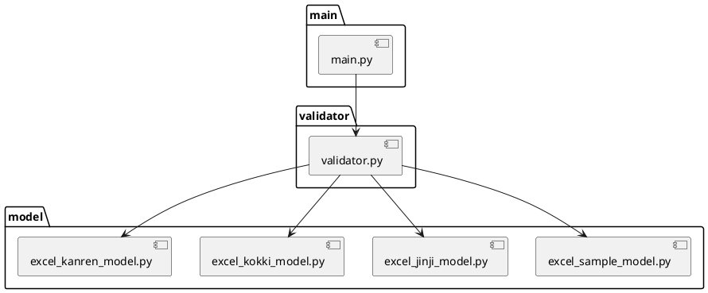

クラス図：

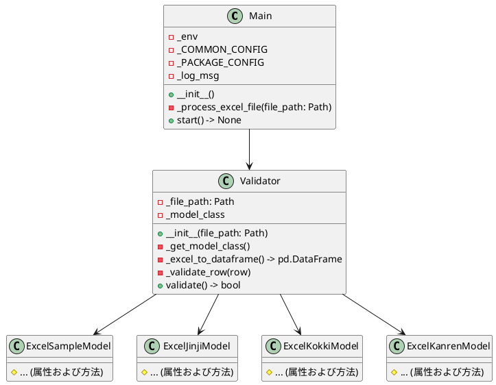

シーケンス図：

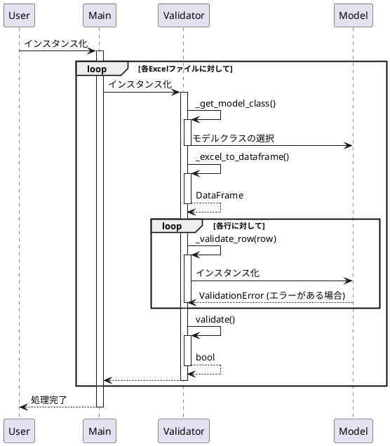

アクティビティ図：

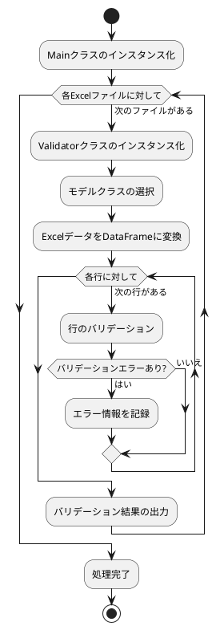

これらの図は、コンポーネント間の関係、クラスの構造、処理の流れ、およびアクティビティの順序を視覚的に表現しています。実際のコーディングでは、これらの図を参考にしながら、各コンポーネントやクラスの詳細な実装を進めていきます。

図の内容について何か質問やご要望があれば、お気軽にお尋ねください。

## Prompt:
undefined

## Response:
はい、提案したデザインと実装方針で進めていきましょう。

この設計により、以下のようなメリットが期待できます：

1. コードの責任が明確に分離され、保守性と拡張性が向上します。
2. 新しいレイアウトを追加する際に、対応するモデルファイルを追加するだけで済むようになります。
3. バリデーションロジックが集約されているため、変更や修正が容易になります。
4. メインの処理が簡潔になり、読みやすくなります。

実装を進める上で、いくつか留意点があります：

1. 各モデルクラスの属性とバリデーションルールを正確に定義する必要があります。
2. エラーハンドリングとログ出力を適切に実装し、問題の特定と追跡を容易にします。
3. テストコードを充実させ、各コンポーネントの動作を検証します。
4. 必要に応じて、コメントやドキュメントを追加し、コードの理解しやすさを向上させます。

実装を進める中で、質問やサポートが必要な場合は、お気軽にお知らせください。一緒に課題を解決し、プロジェクトを成功に導けるよう尽力いたします。

それでは、この設計に基づいて実装を進めていきましょう。頑張ってください！

## Prompt:
undefined

## Response:
はい、追加の要件を理解しました。

1. 人事、国企、関連の3部門から提出されたExcelファイルは、それぞれ異なるレイアウトを持っています。
2. 各部門のExcelファイルをDataFrameに読み込み、バリデーション処理を行います。
3. バリデーションがOKであった場合、3つの異なるレイアウトを1つの統合レイアウトに再編成する必要があります。
4. 統合レイアウトへの再編成では、項目の取捨選択やマッピングが行われます。

この追加要件は、データの統合と標準化を目的としており、下流の処理や分析を容易にするためのものと理解しています。

この要件を実現するためには、以下のような対応が考えられます：

1. 統合レイアウト用のPydanticモデルを新たに定義する。
2. 各部門のDataFrameを統合レイアウトに変換するための関数を作成する。
3. バリデーション後、変換関数を適用して統合レイアウトのDataFrameを生成する。
4. 統合されたDataFrameを後続の処理に渡す。

この追加要件は、現在の設計にも影響を与えます。特に、Validatorクラスや関連する関数の修正が必要になるでしょう。

要件の理解については問題ありません。この要件を満たすための設計と実装についてさらに検討し、コードに反映させていきます。

何か他に質問やご要望があれば、お知らせください。

## Prompt:
undefined

## Response:
はい、統合レイアウト後のデータは既にバリデーション済みであるため、追加のバリデーションは不要であるという前提で進めます。

この前提に基づいて、統合レイアウトへのマッピングを行う構造とコードを示します。

まず、構造についてですが、現在のValidatorクラスに統合レイアウトへのマッピング機能を追加することを提案します。これにより、バリデーション後すぐにマッピングを行うことができ、処理の流れがシンプルになります。

以下は、修正後のValidatorクラスのコードです：

```python
from pathlib import Path
import pandas as pd
from src.lib.common_utils.ibr_dataframe_helper import tabulate_dataframe
from pydantic import ValidationError
from src.lib.common_utils.ibr_excel_reader import ExcelDataLoader
from model.excel_jinji_model import ExcelJinjiModel
from model.excel_kokki_model import ExcelKokkiModel
from model.excel_kanren_model import ExcelKanrenModel
from model.excel_integrated_model import ExcelIntegratedModel

class Validator:
    def __init__(self, file_path: Path):
        self._file_path = file_path
        self._model_class = self._get_model_class()

    def _get_model_class(self):
        if "人事" in self._file_path.stem:
            return ExcelJinjiModel
        elif "国企" in self._file_path.stem:
            return ExcelKokkiModel
        elif "関連" in self._file_path.stem:
            return ExcelKanrenModel
        else:
            raise ValueError(f"未定義のレイアウトです: {self._file_path}")

    def _excel_to_dataframe(self) -> pd.DataFrame:
        _excel_loader = ExcelDataLoader(file_path=self._file_path)
        _df = _excel_loader.read_excel_one_sheet(sheet_name='Sheet1')

        # EDA
        # 1.英語カラムへの変更をシミュレート
        _df = _df.rename(columns={
            'NO': 'No',
            'あ': 'a',
            'い': 'b',
            'う': 'c',
            'え': 'd',
            'お': 'e',
            'か': 'f',
            'き': 'g',
            'く': 'h',
            'け': 'i',
            'こ': 'j',
        },
        )

        # 2.余計な行を消す
        # キー列に値がないレコードは消す
        # キー列→ No列と今回は仮定している
        _df = _df.dropna(subset=['No'])

        # dataframe情報のログ出力
        # see. ibr_dataframe_helper.py
        print(f"\n{tabulate_dataframe(_df.dtypes.reset_index(), headers=['Columns', 'Type'])}")

        return _df

    def _validate_row(self, row):
        try:
            _ = self._model_class(**row.to_dict())
            return None
        except ValidationError as e:
            return e.errors()

    def _map_to_integrated_layout(self, df: pd.DataFrame) -> pd.DataFrame:
        # 統合レイアウトへのマッピングロジックを実装
        # 例：
        integrated_df = df.rename(columns={
            'No': 'integrated_no',
            'a': 'integrated_a',
            'b': 'integrated_b',
            # ...
        })
        
        return integrated_df

    def validate_and_map(self) -> pd.DataFrame:
        _df = self._excel_to_dataframe()

        # validatorチェック
        validate_errors = _df.apply(self._validate_row, axis=1)
        validate_errors = validate_errors[validate_errors.notnull()].to_dict()

        if len(validate_errors) > 0:
            # validate結果評価
            print(f'検証対象ファイル: {self._file_path}')
            print(f'validate error 検出件数: {len(validate_errors)}')
            print(f'validate error list: {validate_errors}')
            _ = ExcelDataLoader(file_path=self._file_path).logger_validation_errors(validate_errors)

        # 統合レイアウトへのマッピング
        integrated_df = self._map_to_integrated_layout(_df)

        return integrated_df
```

主な変更点は以下の通りです：

1. `ExcelIntegratedModel` をインポートしました。これは統合レイアウト用のPydanticモデルです。
2. `_map_to_integrated_layout` メソッドを追加しました。このメソッドは、バリデーション済みのDataFrameを受け取り、統合レイアウトにマッピングします。マッピングのロジックは、実際の要件に基づいて実装する必要があります。
3. `validate` メソッドを `validate_and_map` メソッドに変更しました。このメソッドは、バリデーションを行った後、マッピングを行い、統合レイアウトのDataFrameを返します。

Mainクラスでは、`Validator.validate_and_map()` を呼び出すように変更します。これにより、バリデーション済みのデータが統合レイアウトにマッピングされ、後続の処理に渡されるようになります。

以上が、統合レイアウトへのマッピングを行う構造とコードの提案です。実際のマッピングロジックは、具体的な要件に応じて `_map_to_integrated_layout` メソッド内に実装してください。

何か質問やご要望があれば、お気軽にお知らせください。

## Prompt:
undefined

## Response:
す

## Prompt:
undefined

## Response:
はい、その通りですね。Validatorの役割が多すぎるため、責務を分離し、構造とコードを見直します。

まず、統合レイアウトへのマッピングを行う新しいクラス `Mapper` を導入します。これにより、Validatorはバリデーションのみを担当し、Mapperがマッピングを担当するようになります。

修正後のコンポーネント図、クラス図、シーケンス図、アクティビティ図をPlantUML形式で示します。

コンポーネント図：

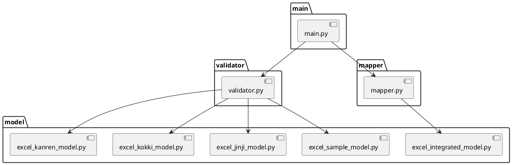

クラス図：

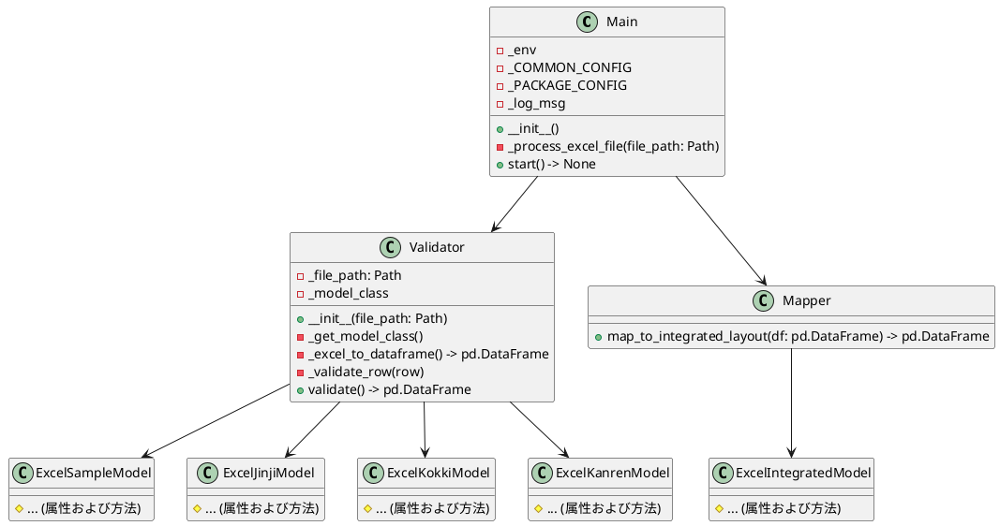

シーケンス図：

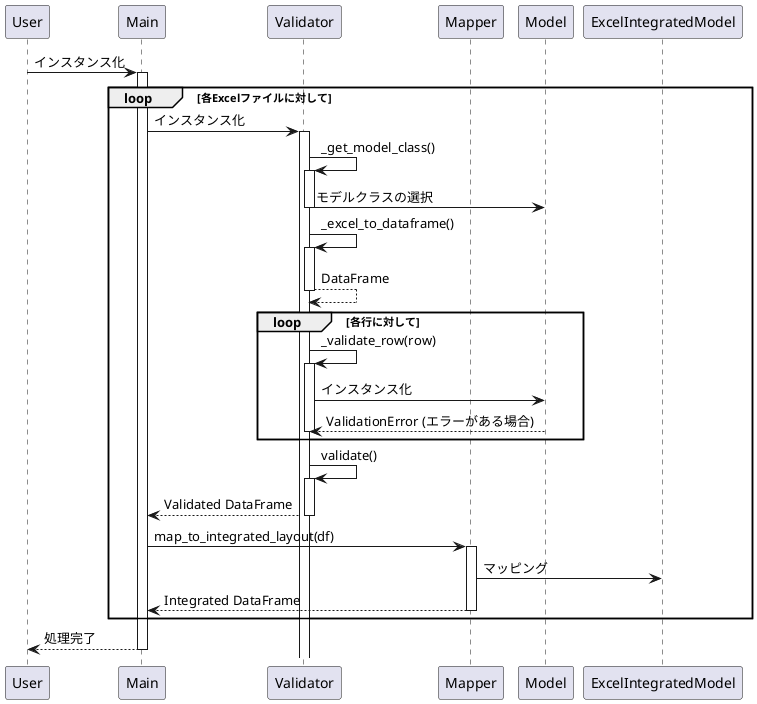

アクティビティ図：

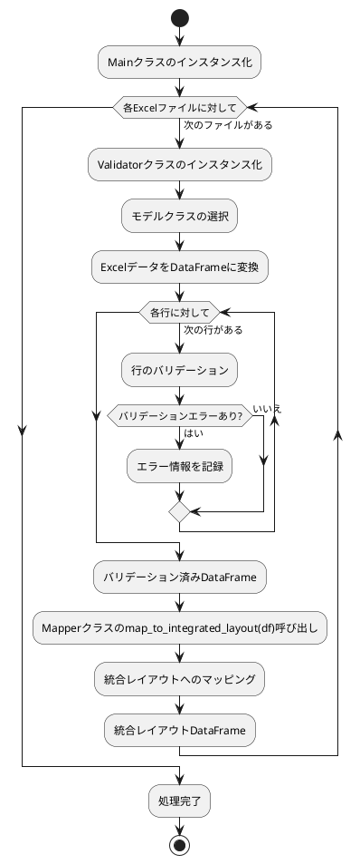

これらの図は、修正後のコンポーネント間の関係、クラスの構造、処理の流れ、およびアクティビティの順序を視覚的に表現しています。

主な変更点は以下の通りです：

1. `Mapper` クラスを新たに導入し、統合レイアウトへのマッピングを担当させます。
2. Validatorクラスはバリデーションのみを行い、バリデーション済みのDataFrameを返すようにします。
3. MainクラスではValidatorを呼び出してバリデーションを行い、その後Mapperを呼び出して統合レイアウトへのマッピングを行います。

この設計により、責務が適切に分離され、各クラスの役割がより明確になります。

修正後のValidatorとMapperのコードは以下の通りです：

```python
# validator.py
from pathlib import Path
import pandas as pd
from src.lib.common_utils.ibr_dataframe_helper import tabulate_dataframe
from pydantic import ValidationError
from src.lib.common_utils.ibr_excel_reader import ExcelDataLoader
from model.excel_jinji_model import ExcelJinjiModel
from model.excel_kokki_model import ExcelKokkiModel
from model.excel_kanren_model import ExcelKanrenModel

class Validator:
    def __init__(self, file_path: Path):
        self._file_path = file_path
        self._model_class = self._get_model_class()

    def _get_model_class(self):
        if "人事" in self._file_path.stem:
            return ExcelJinjiModel
        elif "国企" in self._file_path.stem:
            return ExcelKokkiModel
        elif "関連" in self._file_path.stem:
            return ExcelKanrenModel
        else:
            raise ValueError(f"未定義のレイアウトです: {self._file_path}")

    def _excel_to_dataframe(self) -> pd.DataFrame:
        _excel_loader = ExcelDataLoader(file_path=self._file_path)
        _df = _excel_loader.read_excel_one_sheet(sheet_name='Sheet1')

        # EDA
        # 1.英語カラムへの変更をシミュレート
        _df = _df.rename(columns={
            'NO': 'No',
            'あ': 'a',
            'い': 'b',
            'う': 'c',
            'え': 'd',
            'お': 'e',
            'か': 'f',
            'き': 'g',
            'く': 'h',
            'け': 'i',
            'こ': 'j',
        },
        )

        # 2.余計な行を消す
        # キー列に値がないレコードは消す
        # キー列→ No列と今回は仮定している
        _df = _df.dropna(subset=['No'])

        # dataframe情報のログ出力
        # see. ibr_dataframe_helper.py
        print(f"\n{tabulate_dataframe(_df.dtypes.reset_index(), headers=['Columns', 'Type'])}")

        return _df

    def _validate_row(self, row):
        try:
            _ = self._model_class(**row.to_dict())
            return None
        except ValidationError as e:
            return e.errors()

    def validate(self) -> pd.DataFrame:
        _df = self._excel_to_dataframe()

        # validatorチェック
        validate_errors = _df.apply(self._validate_row, axis=1)
        validate_errors = validate_errors[validate_errors.notnull()].to_dict()

        if len(validate_errors) > 0:
            # validate結果評価
            print(f'検証対象ファイル: {self._file_path}')
            print(f'validate error 検出件数: {len(validate_errors)}')
            print(f'validate error list: {validate_errors}')
            _ = ExcelDataLoader(file_path=self._file_path).logger_validation_errors(validate_errors)

        return _df
```

```python
# mapper.py
import pandas as pd
from model.excel_integrated_model import ExcelIntegratedModel

class Mapper:
    @staticmethod
    def map_to_integrated_layout(df: pd.DataFrame) -> pd.DataFrame:
        # 統合レイアウトへのマッピングロジックを実装
        # 例：
        integrated_df = df.rename(columns={
            'No': 'integrated_no',
            'a': 'integrated_a',
            'b': 'integrated_b',
            # ...
        })
        
        return integrated_df
```

この設計とコードにより、責務が適切に分離され、保守性と拡張性が向上します。

何か質問やご要望があれば、お気軽にお知らせください。

## Prompt:
undefined

## Response:
はい、その通りですね。人事、国企、関連のそれぞれのレイアウトに対応するMapperクラスを作成し、責務を適切に分離しましょう。

修正後のコンポーネント図、クラス図、シーケンス図、アクティビティ図をPlantUML形式で示します。

コンポーネント図：

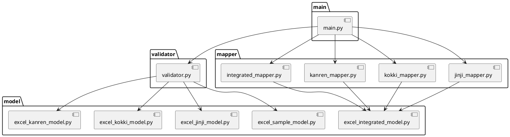

クラス図：

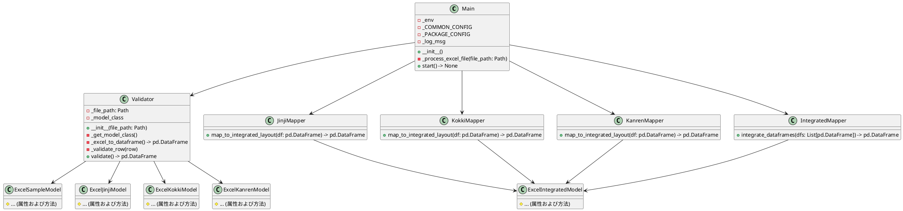

シーケンス図：

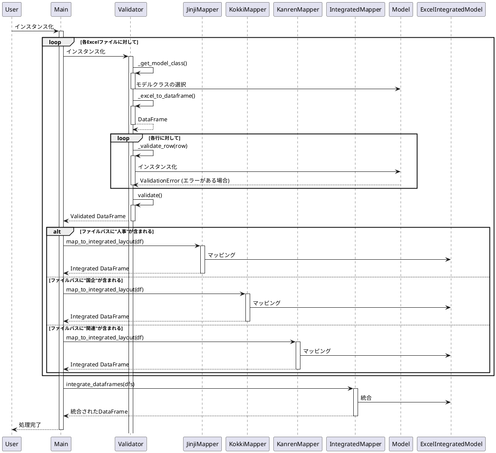

アクティビティ図：

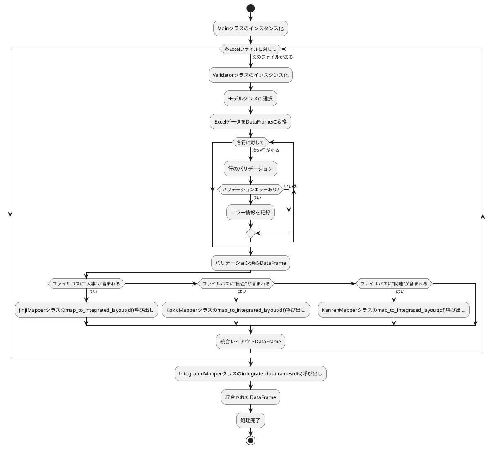

これらの図は、人事、国企、関連のそれぞれのレイアウトに対応するMapperクラスを導入した後の、コンポーネント間の関係、クラスの構造、処理の流れ、およびアクティビティの順序を視覚的に表現しています。

主な変更点は以下の通りです：

1. `JinjiMapper`、`KokkiMapper`、`KanrenMapper` クラスを新たに導入し、それぞれのレイアウトから統合レイアウトへのマッピングを担当させます。
2. `IntegratedMapper` クラスを導入し、マッピング済みのDataFrameを統合する責務を持たせます。
3. Mainクラスでは、ファイルパスに応じて適切なMapperクラスを選択し、マッピングを行います。その後、IntegratedMapperを呼び出してDataFrameを統合します。

修正後のMapperクラスのコードは以下の通りです：

```python
# jinji_mapper.py
import pandas as pd
from model.excel_integrated_model import ExcelIntegratedModel

class JinjiMapper:
    @staticmethod
    def map_to_integrated_layout(df: pd.DataFrame) -> pd.DataFrame:
        # 人事レイアウトから統合レイアウトへのマッピングロジックを実装
        # ...
        return integrated_df
```

```python
# kokki_mapper.py
import pandas as pd
from model.excel_integrated_model import ExcelIntegratedModel

class KokkiMapper:
    @staticmethod
    def map_to_integrated_layout(df: pd.DataFrame) -> pd.DataFrame:
        # 国企レイアウトから統合レイアウトへのマッピングロジックを実装
        # ...
        return integrated_df
```

```python
# kanren_mapper.py
import pandas as pd
from model.excel_integrated_model import ExcelIntegratedModel

class KanrenMapper:
    @staticmethod
    def map_to_integrated_layout(df: pd.DataFrame) -> pd.DataFrame:
        # 関連レイアウトから統合レイアウトへのマッピングロジックを実装
        # ...
        return integrated_df
```

```python
# integrated_mapper.py
import pandas as pd

class IntegratedMapper:
    @staticmethod
    def integrate_dataframes(dfs: List[pd.DataFrame]) -> pd.DataFrame:
        # マッピング済みのDataFrameを統合するロジックを実装
        # ...
        return integrated_df
```

この設計とコードにより、責務が適切に分離され、各レイアウトに対応するマッピングと統合処理が独立して行われるようになります。これにより、保守性と拡張性がさらに向上します。

新しいレイアウトが追加された場合も、対応するMapperクラスを作成するだけで容易に対応できます。

何か質問やご要望があれば、お気軽にお知らせください。

## Prompt:
undefined

## Response:
はい、呼び出し側のコードを含めた全体のコードを提示します。

```python
# main.py
import traceback
from pathlib import Path
from typing import List
from src.lib.common_utils.ibr_enums import LogLevel
from src.lib.common_utils.ibr_get_config import Config
from validator.validator import Validator
from mapper.jinji_mapper import JinjiMapper
from mapper.kokki_mapper import KokkiMapper
from mapper.kanren_mapper import KanrenMapper
from mapper.integrated_mapper import IntegratedMapper

class Main:
    def __init__(self):
        config = Config.load(__file__)
        self._env = config.env
        self._COMMON_CONFIG = config.common_config
        self._PACKAGE_CONFIG = config.package_config
        self._log_msg = config.log_message

    def _get_mapper_class(self, file_path: Path):
        if "人事" in file_path.stem:
            return JinjiMapper
        elif "国企" in file_path.stem:
            return KokkiMapper
        elif "関連" in file_path.stem:
            return KanrenMapper
        else:
            raise ValueError(f"未定義のレイアウトです: {file_path}")

    def _process_excel_file(self, file_path: Path) -> pd.DataFrame:
        validator = Validator(file_path)
        validated_df = validator.validate()

        mapper_class = self._get_mapper_class(file_path)
        mapped_df = mapper_class.map_to_integrated_layout(validated_df)

        return mapped_df

    def start(self) -> None:
        self._log_msg("IBRDEV-I-0000001")
        try:
            excel_files = Path(self._COMMON_CONFIG['input_file_path']['UPDATE_EXCEL_PATH']).glob("*.xlsx")
            integrated_dfs: List[pd.DataFrame] = []
            for file_path in excel_files:
                integrated_df = self._process_excel_file(file_path)
                integrated_dfs.append(integrated_df)

            final_df = IntegratedMapper.integrate_dataframes(integrated_dfs)
            # TODO: 統合されたDataFrameを使った後続の処理を実装

        except Exception as e:
            tb = traceback.TracebackException.from_exception(e)
            self._log_msg(''.join(tb.format()), LogLevel.ERROR)
            raise

        self._log_msg("IBRDEV-I-0000002")

if __name__ == '__main__':
    _main = Main()
    _main.start()
```

```python
# validator.py
from pathlib import Path
import pandas as pd
from src.lib.common_utils.ibr_dataframe_helper import tabulate_dataframe
from pydantic import ValidationError
from src.lib.common_utils.ibr_excel_reader import ExcelDataLoader
from model.excel_jinji_model import ExcelJinjiModel
from model.excel_kokki_model import ExcelKokkiModel
from model.excel_kanren_model import ExcelKanrenModel

class Validator:
    def __init__(self, file_path: Path):
        self._file_path = file_path
        self._model_class = self._get_model_class()

    def _get_model_class(self):
        if "人事" in self._file_path.stem:
            return ExcelJinjiModel
        elif "国企" in self._file_path.stem:
            return ExcelKokkiModel
        elif "関連" in self._file_path.stem:
            return ExcelKanrenModel
        else:
            raise ValueError(f"未定義のレイアウトです: {self._file_path}")

    def _excel_to_dataframe(self) -> pd.DataFrame:
        _excel_loader = ExcelDataLoader(file_path=self._file_path)
        _df = _excel_loader.read_excel_one_sheet(sheet_name='Sheet1')

        # EDA
        # 1.英語カラムへの変更をシミュレート
        _df = _df.rename(columns={
            'NO': 'No',
            'あ': 'a',
            'い': 'b',
            'う': 'c',
            'え': 'd',
            'お': 'e',
            'か': 'f',
            'き': 'g',
            'く': 'h',
            'け': 'i',
            'こ': 'j',
        },
        )

        # 2.余計な行を消す
        # キー列に値がないレコードは消す
        # キー列→ No列と今回は仮定している
        _df = _df.dropna(subset=['No'])

        # dataframe情報のログ出力
        # see. ibr_dataframe_helper.py
        print(f"\n{tabulate_dataframe(_df.dtypes.reset_index(), headers=['Columns', 'Type'])}")

        return _df

    def _validate_row(self, row):
        try:
            _ = self._model_class(**row.to_dict())
            return None
        except ValidationError as e:
            return e.errors()

    def validate(self) -> pd.DataFrame:
        _df = self._excel_to_dataframe()

        # validatorチェック
        validate_errors = _df.apply(self._validate_row, axis=1)
        validate_errors = validate_errors[validate_errors.notnull()].to_dict()

        if len(validate_errors) > 0:
            # validate結果評価
            print(f'検証対象ファイル: {self._file_path}')
            print(f'validate error 検出件数: {len(validate_errors)}')
            print(f'validate error list: {validate_errors}')
            _ = ExcelDataLoader(file_path=self._file_path).logger_validation_errors(validate_errors)

        return _df
```

```python
# jinji_mapper.py
import pandas as pd
from model.excel_integrated_model import ExcelIntegratedModel

class JinjiMapper:
    @staticmethod
    def map_to_integrated_layout(df: pd.DataFrame) -> pd.DataFrame:
        # 人事レイアウトから統合レイアウトへのマッピングロジックを実装
        # ...
        return integrated_df
```

```python
# kokki_mapper.py
import pandas as pd
from model.excel_integrated_model import ExcelIntegratedModel

class KokkiMapper:
    @staticmethod
    def map_to_integrated_layout(df: pd.DataFrame) -> pd.DataFrame:
        # 国企レイアウトから統合レイアウトへのマッピングロジックを実装
        # ...
        return integrated_df
```

```python
# kanren_mapper.py
import pandas as pd
from model.excel_integrated_model import ExcelIntegratedModel

class KanrenMapper:
    @staticmethod
    def map_to_integrated_layout(df: pd.DataFrame) -> pd.DataFrame:
        # 関連レイアウトから統合レイアウトへのマッピングロジックを実装
        # ...
        return integrated_df
```

```python
# integrated_mapper.py
from typing import List
import pandas as pd

class IntegratedMapper:
    @staticmethod
    def integrate_dataframes(dfs: List[pd.DataFrame]) -> pd.DataFrame:
        # マッピング済みのDataFrameを統合するロジックを実装
        # ...
        return integrated_df
```

この設計では、Mainクラスが全体の処理を制御しています。

1. `start()` メソッドで、指定されたディレクトリ内の全てのExcelファイルを処理します。
2. 各Excelファイルに対して、`_process_excel_file()` メソッドを呼び出します。
   * Validatorを使ってバリデーションを行います。
   * ファイルパスに基づいて適切なMapperクラスを選択し、マッピングを行います。
3. マッピングされたDataFrameをリストに追加します。
4. 全てのファイルの処理が完了したら、IntegratedMapperを使ってDataFrameを統合します。
5. 統合されたDataFrameを使って、後続の処理を行います（今回は未実装）。

このコードは、各コンポーネントの責務を明確に分離し、保守性と拡張性を向上させています。新しいレイアウトが追加された場合も、対応するモデルとMapperクラスを作成するだけで容易に対応できます。

実際の動作には、各モデルクラス（`ExcelJinjiModel`、`ExcelKokkiModel`、`ExcelKanrenModel`、`ExcelIntegratedModel`）の実装が必要です。また、各Mapperクラスの `map_to_integrated_layout()` メソッドと、IntegratedMapperの `integrate_dataframes()` メソッドの中で、具体的なマッピングと統合のロジックを実装する必要があります。

何か質問やご要望があれば、お気軽にお知らせください。

## Prompt:
undefined

## Response:
はい、モデルに定義するレイアウトとバリデーションのサンプルを提示します。ここでは、人事、国企、関連の3つのモデルについて、それぞれ一部の属性とバリデーションルールを示します。

```python
# excel_jinji_model.py
from pydantic import BaseModel, Field, validator

class ExcelJinjiModel(BaseModel):
    employee_id: str = Field(min_length=5, max_length=10)
    name: str = Field(min_length=1, max_length=100)
    department: str = Field(min_length=1, max_length=50)
    salary: int = Field(gt=0)

    @validator('employee_id')
    def employee_id_must_start_with_j(cls, v):
        if not v.startswith('J'):
            raise ValueError('employee_id must start with "J"')
        return v
```

この例では、人事モデルに4つの属性を定義しています：

* `employee_id`: 5～10文字の文字列で、"J"で始まる必要があります。
* `name`: 1～100文字の文字列です。
* `department`: 1～50文字の文字列です。
* `salary`: 0より大きい整数です。

`employee_id` には、カスタムバリデーターを定義し、値が "J" で始まることを確認しています。

```python
# excel_kokki_model.py
from pydantic import BaseModel, Field, validator
from datetime import date

class ExcelKokkiModel(BaseModel):
    project_id: str = Field(min_length=5, max_length=10)
    project_name: str = Field(min_length=1, max_length=100)
    start_date: date
    end_date: date

    @validator('end_date')
    def end_date_must_be_after_start_date(cls, v, values):
        if 'start_date' in values and v < values['start_date']:
            raise ValueError('end_date must be after start_date')
        return v
```

この例では、国企モデルに4つの属性を定義しています：

* `project_id`: 5～10文字の文字列です。
* `project_name`: 1～100文字の文字列です。
* `start_date`: 日付型です。
* `end_date`: 日付型で、`start_date` より後の日付である必要があります。

`end_date` には、カスタムバリデーターを定義し、`start_date` より後の日付であることを確認しています。

```python
# excel_kanren_model.py
from pydantic import BaseModel, Field, EmailStr

class ExcelKanrenModel(BaseModel):
    supplier_id: str = Field(min_length=5, max_length=10)
    supplier_name: str = Field(min_length=1, max_length=100)
    contact_name: str = Field(min_length=1, max_length=100)
    email: EmailStr
```

この例では、関連モデルに4つの属性を定義しています：

* `supplier_id`: 5～10文字の文字列です。
* `supplier_name`: 1～100文字の文字列です。
* `contact_name`: 1～100文字の文字列です。
* `email`: 有効なメールアドレス形式である必要があります。

`email` には、Pydanticの `EmailStr` 型を使用し、有効なメールアドレス形式であることを確認しています。

これらは単なる例ですが、実際のモデルでは、各レイアウトに応じた属性とバリデーションルールを定義します。Pydanticは、型ヒントとデコレーターを使用して、多様なバリデーションルールを簡潔に表現できます。

何か質問やご要望があれば、お気軽にお知らせください。

## Prompt:
undefined

## Response:
はい、field\_validatorとmodel\_validatorを使用した事例を示します。ここでは、人事モデルを例に、より複雑なバリデーションルールを定義します。

```python
# excel_jinji_model.py
from pydantic import BaseModel, Field, validator, root_validator
from typing import Optional
from datetime import date

class ExcelJinjiModel(BaseModel):
    employee_id: str = Field(min_length=5, max_length=10)
    name: str = Field(min_length=1, max_length=100)
    department: str = Field(min_length=1, max_length=50)
    salary: int = Field(gt=0)
    start_date: date
    end_date: Optional[date] = None
    is_manager: bool

    @validator('employee_id')
    def employee_id_must_start_with_j(cls, v):
        if not v.startswith('J'):
            raise ValueError('employee_id must start with "J"')
        return v

    @validator('end_date', always=True)
    def end_date_must_be_after_start_date(cls, v, values):
        if v and 'start_date' in values and v < values['start_date']:
            raise ValueError('end_date must be after start_date')
        return v

    @root_validator
    def manager_must_have_high_salary(cls, values):
        if values.get('is_manager') and values.get('salary', 0) < 5000:
            raise ValueError('Managers must have a salary of at least 5000')
        return values
```

この例では、人事モデルに7つの属性を定義しています：

* `employee_id`: 5～10文字の文字列で、"J"で始まる必要があります。
* `name`: 1～100文字の文字列です。
* `department`: 1～50文字の文字列です。
* `salary`: 0より大きい整数です。
* `start_date`: 日付型です。
* `end_date`: 日付型で、`start_date` より後の日付である必要があります。省略可能です。
* `is_manager`: ブール型で、その従業員がマネージャーであるかどうかを示します。

field\_validatorの例：

* `employee_id_must_start_with_j`: `employee_id` の値が "J" で始まることを確認します。
* `end_date_must_be_after_start_date`: `end_date` が `start_date` より後の日付であることを確認します。`always=True` を指定することで、`end_date` が省略された場合でもこのバリデーターが実行されます。

model\_validatorの例：

* `manager_must_have_high_salary`: `is_manager` が `True` の場合、`salary` が 5000 以上であることを確認します。このバリデーターは、モデル全体の値を受け取り、属性間の関係を検証できます。

このように、field\_validatorを使用して個々の属性に対するバリデーションルールを定義し、model\_validatorを使用してモデル全体に対するバリデーションルールを定義できます。

これらのバリデーターは、モデルのインスタンス化時に自動的に実行されます。バリデーションエラーが発生した場合、Pydanticは詳細なエラーメッセージを提供します。

何か質問やご要望があれば、お気軽にお知らせください。

## Prompt:
undefined

## Response:
すみません。私の説明が混乱していました。Pydanticでは、`root_validator` がモデル全体に対するバリデーターであり、`model_validator` という名前のバリデーターは存在しません。

`root_validator` は、モデル全体の値を受け取り、属性間の関係を検証するために使用されます。一方、`validator` デコレーターは、個々の属性に対するバリデーションルールを定義するために使用されます。

先ほどの例を修正し、`root_validator` のみを使用した事例を示します。

```python
# excel_jinji_model.py
from pydantic import BaseModel, Field, validator, root_validator
from typing import Optional
from datetime import date

class ExcelJinjiModel(BaseModel):
    employee_id: str = Field(min_length=5, max_length=10)
    name: str = Field(min_length=1, max_length=100)
    department: str = Field(min_length=1, max_length=50)
    salary: int = Field(gt=0)
    start_date: date
    end_date: Optional[date] = None
    is_manager: bool

    @validator('employee_id')
    def employee_id_must_start_with_j(cls, v):
        if not v.startswith('J'):
            raise ValueError('employee_id must start with "J"')
        return v

    @root_validator
    def validate_dates_and_salary(cls, values):
        start_date = values.get('start_date')
        end_date = values.get('end_date')
        if end_date and start_date and end_date < start_date:
            raise ValueError('end_date must be after start_date')

        if values.get('is_manager') and values.get('salary', 0) < 5000:
            raise ValueError('Managers must have a salary of at least 5000')

        return values
```

この修正された例では、`root_validator` を使用して以下の2つのバリデーションを行っています：

1. `end_date` が `start_date` より後の日付であることを確認します。
2. `is_manager` が `True` の場合、`salary` が 5000 以上であることを確認します。

`root_validator` 内では、必要な属性値を `values` ディクショナリから取得し、バリデーションロジックを実装します。バリデーションが成功した場合は、`values` ディクショナリを返します。

このように、`root_validator` を使用することで、モデル全体に対するバリデーションルールを定義し、属性間の関係を検証できます。

混乱を招く説明をしてしまい、申し訳ありませんでした。何か他に質問やご要望があれば、お気軽にお知らせください。

## Prompt:
undefined

## Response:
はい、その通りですね。Pydanticのバージョン1.9以降、バリデーターの名前が変更されました。この変更は、バリデーターの役割をより明確に表現するために行われました。

* `validator` -> `field_validator`: 個々のフィールド（属性）に対するバリデーションを定義するために使用されます。
* `root_validator` -> `model_validator`: モデル全体に対するバリデーションを定義するために使用されます。

以下は、新しい名前を使用した人事モデルの例です。

```python
# excel_jinji_model.py
from pydantic import BaseModel, Field, field_validator, model_validator
from typing import Optional
from datetime import date

class ExcelJinjiModel(BaseModel):
    employee_id: str = Field(min_length=5, max_length=10)
    name: str = Field(min_length=1, max_length=100)
    department: str = Field(min_length=1, max_length=50)
    salary: int = Field(gt=0)
    start_date: date
    end_date: Optional[date] = None
    is_manager: bool

    @field_validator('employee_id')
    def employee_id_must_start_with_j(cls, v):
        if not v.startswith('J'):
            raise ValueError('employee_id must start with "J"')
        return v

    @model_validator
    def validate_dates_and_salary(cls, values):
        start_date = values.get('start_date')
        end_date = values.get('end_date')
        if end_date and start_date and end_date < start_date:
            raise ValueError('end_date must be after start_date')

        if values.get('is_manager') and values.get('salary', 0) < 5000:
            raise ValueError('Managers must have a salary of at least 5000')

        return values
```

この例では、`field_validator` を使用して `employee_id` のバリデーションを定義し、`model_validator` を使用してモデル全体のバリデーションを定義しています。

これらの新しい名前は、バリデーターの役割をより明確に表現しており、コードの可読性を向上させます。ただし、古い名前 (`validator` と `root_validator`) も引き続き使用できます。

何か質問やご要望があれば、お気軽にお知らせください。

## Prompt:
undefined

## Response:
はい、追加要件を理解しました。

1. バリデーション処理が完了した後、バリデーションが成功したデータ（正常データ）に対して、ULIDを追加する必要があります。
2. ULIDは、データフレームの新しい列として一律に追加されます。
3. 将来的に、バリデーション後のデータに対して、他の類似した処理を追加する可能性があります。

ULIDは、Universally Unique Lexicographically Sortable Identifierの略で、UUID（Universally Unique Identifier）の一種です。ULIDは、UUIDと同様にグローバルに一意な識別子を生成しますが、UUIDよりも短く、レキシカル（辞書式）順序でソート可能という特徴を持っています。

この追加要件を満たすために、以下のような対応が考えられます：

1. バリデーション処理の後、正常データに対してULIDを生成し、新しい列として追加する処理を実装する。
2. ULIDの生成と追加は、バリデーション処理とは独立した関数またはクラスとして実装し、コードの見通しを良くする。
3. 将来の類似した要件に対応できるように、バリデーション後の処理を柔軟に拡張できる設計を検討する。

この追加要件は、データの一意性を保証し、データの管理や追跡を容易にするために役立ちます。また、将来の拡張性を考慮した設計は、コードの保守性を向上させます。

追加要件の理解に問題はありませんでした。この要件を満たすための設計と実装についてさらに検討し、コードに反映させていきます。

何か他に質問やご要望があれば、お気軽にお知らせください。

## Prompt:
undefined

## Response:
はい、ULID生成を別モジュールから部品として呼び出し、将来の追加に備えてポリモーフィズムを使用した設計を取り入れましょう。

以下は、修正後のコードです。

```python
# main.py
import traceback
from pathlib import Path
from typing import List
from src.lib.common_utils.ibr_enums import LogLevel
from src.lib.common_utils.ibr_get_config import Config
from validator.validator import Validator
from mapper.jinji_mapper import JinjiMapper
from mapper.kokki_mapper import KokkiMapper
from mapper.kanren_mapper import KanrenMapper
from mapper.integrated_mapper import IntegratedMapper
from processor.processor_interface import ProcessorInterface
from processor.ulid_processor import ULIDProcessor

class Main:
    def __init__(self):
        config = Config.load(__file__)
        self._env = config.env
        self._COMMON_CONFIG = config.common_config
        self._PACKAGE_CONFIG = config.package_config
        self._log_msg = config.log_message
        self._processors: List[ProcessorInterface] = [ULIDProcessor()]  # 追加の処理を簡単に追加できます。

    def _get_mapper_class(self, file_path: Path):
        if "人事" in file_path.stem:
            return JinjiMapper
        elif "国企" in file_path.stem:
            return KokkiMapper
        elif "関連" in file_path.stem:
            return KanrenMapper
        else:
            raise ValueError(f"未定義のレイアウトです: {file_path}")

    def _process_excel_file(self, file_path: Path) -> pd.DataFrame:
        validator = Validator(file_path)
        validated_df = validator.validate()

        mapper_class = self._get_mapper_class(file_path)
        mapped_df = mapper_class.map_to_integrated_layout(validated_df)

        for processor in self._processors:
            mapped_df = processor.process(mapped_df)

        return mapped_df

    def start(self) -> None:
        self._log_msg("IBRDEV-I-0000001")
        try:
            excel_files = Path(self._COMMON_CONFIG['input_file_path']['UPDATE_EXCEL_PATH']).glob("*.xlsx")
            integrated_dfs: List[pd.DataFrame] = []
            for file_path in excel_files:
                integrated_df = self._process_excel_file(file_path)
                integrated_dfs.append(integrated_df)

            final_df = IntegratedMapper.integrate_dataframes(integrated_dfs)
            # TODO: 統合されたDataFrameを使った後続の処理を実装

        except Exception as e:
            tb = traceback.TracebackException.from_exception(e)
            self._log_msg(''.join(tb.format()), LogLevel.ERROR)
            raise

        self._log_msg("IBRDEV-I-0000002")

if __name__ == '__main__':
    _main = Main()
    _main.start()
```

```python
# processor_interface.py
from abc import ABC, abstractmethod
import pandas as pd

class ProcessorInterface(ABC):
    @abstractmethod
    def process(self, df: pd.DataFrame) -> pd.DataFrame:
        pass
```

```python
# ulid_processor.py
from processor.processor_interface import ProcessorInterface
import pandas as pd
from ulid import ULID

class ULIDProcessor(ProcessorInterface):
    def process(self, df: pd.DataFrame) -> pd.DataFrame:
        df['ulid'] = [str(ULID()) for _ in range(len(df))]
        return df
```

主な変更点は以下の通りです：

1. `ProcessorInterface` を導入し、バリデーション後の処理を抽象化しました。このインターフェースは、`process` メソッドを定義しており、DataFrameを受け取って処理後のDataFrameを返します。
2. `ULIDProcessor` クラスを作成し、`ProcessorInterface` を実装しました。このクラスは、DataFrameにULID列を追加する処理を行います。
3. `Main` クラスの `__init__` メソッドで、`self._processors` リストを初期化しています。ここでは、`ULIDProcessor` のインスタンスを追加していますが、将来的に他の処理を追加する際には、このリストに新しいプロセッサを追加するだけで済みます。
4. `_process_excel_file` メソッド内で、マッピング後のDataFrameに対して、`self._processors` リスト内の各プロセッサの `process` メソッドを呼び出しています。

この設計により、バリデーション後の処理を柔軟に拡張できるようになりました。新しい処理を追加する際には、`ProcessorInterface` を実装した新しいクラスを作成し、`Main` クラスの `__init__` メソッドで `self._processors` リストに追加するだけで済みます。

また、`ULIDProcessor` は `ulid` ライブラリを使用してULIDを生成していますが、必要に応じて他のUUID/ULID生成ライブラリを使用することもできます。

何か質問やご要望があれば、お気軽にお知らせください。

## Prompt:
undefined

## Response:
はい、GoogleDocに準拠したDocStringを追加し、コードをより堅牢にしました。以下に、モジュール単位でコードを提示します。

```python
# main.py
import traceback
from pathlib import Path
from typing import List
from src.lib.common_utils.ibr_enums import LogLevel
from src.lib.common_utils.ibr_get_config import Config
from validator.validator import Validator
from mapper.mapper_factory import MapperFactory
from mapper.integrated_mapper import IntegratedMapper
from processor.processor_interface import ProcessorInterface
from processor.ulid_processor import ULIDProcessor

class Main:
    """
    メインクラス。アプリケーションの実行を制御します。
    """

    def __init__(self):
        """
        Mainクラスのコンストラクタ。
        設定ファイルの読み込みと、後処理プロセッサの初期化を行います。
        """
        config = Config.load(__file__)
        self._env = config.env
        self._COMMON_CONFIG = config.common_config
        self._PACKAGE_CONFIG = config.package_config
        self._log_msg = config.log_message
        self._processors: List[ProcessorInterface] = [ULIDProcessor()]

    def _process_excel_file(self, file_path: Path) -> pd.DataFrame:
        """
        Excelファイルを処理します。
        バリデーション、マッピング、および後処理を行います。

        Args:
            file_path (Path): 処理対象のExcelファイルのパス。

        Returns:
            pd.DataFrame: 処理済みのデータフレーム。
        """
        validator = Validator(file_path)
        validated_df = validator.validate()

        mapper = MapperFactory.create_mapper(file_path)
        if mapper is None:
            raise ValueError(f"未定義のレイアウトです: {file_path}")

        mapped_df = mapper.map_to_integrated_layout(validated_df)

        for processor in self._processors:
            mapped_df = processor.process(mapped_df)

        return mapped_df

    def start(self) -> None:
        """
        アプリケーションを起動します。
        Excelファイルの処理、データフレームの統合、および後続の処理を実行します。
        """
        self._log_msg("IBRDEV-I-0000001")
        try:
            excel_files = Path(self._COMMON_CONFIG['input_file_path']['UPDATE_EXCEL_PATH']).glob("*.xlsx")
            integrated_dfs: List[pd.DataFrame] = []
            for file_path in excel_files:
                integrated_df = self._process_excel_file(file_path)
                integrated_dfs.append(integrated_df)

            if integrated_dfs:
                final_df = IntegratedMapper.integrate_dataframes(integrated_dfs)
                # TODO: 統合されたDataFrameを使った後続の処理を実装
            else:
                self._log_msg("処理対象のExcelファイルが見つかりませんでした。", LogLevel.WARNING)

        except Exception as e:
            tb = traceback.TracebackException.from_exception(e)
            self._log_msg(''.join(tb.format()), LogLevel.ERROR)
            raise

        self._log_msg("IBRDEV-I-0000002")

if __name__ == '__main__':
    _main = Main()
    _main.start()
```

```python
# mapper_factory.py
from pathlib import Path
from mapper.mapper_interface import MapperInterface
from mapper.jinji_mapper import JinjiMapper
from mapper.kokki_mapper import KokkiMapper
from mapper.kanren_mapper import KanrenMapper

class MapperFactory:
    """
    レイアウトに応じたMapperクラスのインスタンスを生成するファクトリクラス。
    """

    @staticmethod
    def create_mapper(file_path: Path) -> MapperInterface:
        """
        ファイルパスに基づいて、適切なMapperクラスのインスタンスを生成します。

        Args:
            file_path (Path): Excelファイルのパス。

        Returns:
            MapperInterface: 生成されたMapperクラスのインスタンス。
        """
        if "人事" in file_path.stem:
            return JinjiMapper()
        elif "国企" in file_path.stem:
            return KokkiMapper()
        elif "関連" in file_path.stem:
            return KanrenMapper()
        else:
            return None
```

```python
# mapper_interface.py
from abc import ABC, abstractmethod
import pandas as pd

class MapperInterface(ABC):
    """
    レイアウトから統合レイアウトへのマッピングを行うMapperクラスのインターフェース。
    """

    @abstractmethod
    def map_to_integrated_layout(self, df: pd.DataFrame) -> pd.DataFrame:
        """
        レイアウトから統合レイアウトへのマッピングを行います。

        Args:
            df (pd.DataFrame): マッピング元のデータフレーム。

        Returns:
            pd.DataFrame: 統合レイアウトにマッピングされたデータフレーム。
        """
        pass
```

```python
# jinji_mapper.py
from mapper.mapper_interface import MapperInterface
import pandas as pd

class JinjiMapper(MapperInterface):
    """
    人事レイアウトから統合レイアウトへのマッピングを行うMapperクラス。
    """

    def map_to_integrated_layout(self, df: pd.DataFrame) -> pd.DataFrame:
        """
        人事レイアウトから統合レイアウトへのマッピングを行います。

        Args:
            df (pd.DataFrame): マッピング元のデータフレーム。

        Returns:
            pd.DataFrame: 統合レイアウトにマッピングされたデータフレーム。
        """
        # 人事レイアウトから統合レイアウトへのマッピングロジックを実装
        # ...
        return integrated_df
```

```python
# kokki_mapper.py
from mapper.mapper_interface import MapperInterface
import pandas as pd

class KokkiMapper(MapperInterface):
    """
    国企レイアウトから統合レイアウトへのマッピングを行うMapperクラス。
    """

    def map_to_integrated_layout(self, df: pd.DataFrame) -> pd.DataFrame:
        """
        国企レイアウトから統合レイアウトへのマッピングを行います。

        Args:
            df (pd.DataFrame): マッピング元のデータフレーム。

        Returns:
            pd.DataFrame: 統合レイアウトにマッピングされたデータフレーム。
        """
        # 国企レイアウトから統合レイアウトへのマッピングロジックを実装
        # ...
        return integrated_df
```

```python
# kanren_mapper.py
from mapper.mapper_interface import MapperInterface
import pandas as pd

class KanrenMapper(MapperInterface):
    """
    関連レイアウトから統合レイアウトへのマッピングを行うMapperクラス。
    """

    def map_to_integrated_layout(self, df: pd.DataFrame) -> pd.DataFrame:
        """
        関連レイアウトから統合レイアウトへのマッピングを行います。

        Args:
            df (pd.DataFrame): マッピング元のデータフレーム。

        Returns:
            pd.DataFrame: 統合レイアウトにマッピングされたデータフレーム。
        """
        # 関連レイアウトから統合レイアウトへのマッピングロジックを実装
        # ...
        return integrated_df
```

```python
# integrated_mapper.py
from typing import List
import pandas as pd

class IntegratedMapper:
    """
    マッピング済みのデータフレームを統合するMapperクラス。
    """

    @staticmethod
    def integrate_dataframes(dfs: List[pd.DataFrame]) -> pd.DataFrame:
        """
        マッピング済みのデータフレームを統合します。

        Args:
            dfs (List[pd.DataFrame]): 統合対象のデータフレームのリスト。

        Returns:
            pd.DataFrame: 統合されたデータフレーム。
        """
        # マッピング済みのDataFrameを統合するロジックを実装
        # ...
        return integrated_df
```

```python
# processor_interface.py
from abc import ABC, abstractmethod
import pandas as pd

class ProcessorInterface(ABC):
    """
    バリデーション後の処理を行うProcessorクラスのインターフェース。
    """

    @abstractmethod
    def process(self, df: pd.DataFrame) -> pd.DataFrame:
        """
        バリデーション後の処理を行います。

        Args:
            df (pd.DataFrame): 処理対象のデータフレーム。

        Returns:
            pd.DataFrame: 処理後のデータフレーム。
        """
        pass
```

```python
# ulid_processor.py
from processor.processor_interface import ProcessorInterface
import pandas as pd
from ulid import ULID

class ULIDProcessor(ProcessorInterface):
    """
    データフレームにULID列を追加するProcessorクラス。
    """

    def process(self, df: pd.DataFrame) -> pd.DataFrame:
        """
        データフレームにULID列を追加します。

        Args:
            df (pd.DataFrame): 処理対象のデータフレーム。

        Returns:
            pd.DataFrame: ULID列が追加されたデータフレーム。
        """
        df['ulid'] = [str(ULID()) for _ in range(len(df))]
        return df
```

主な変更点は以下の通りです：

1. `MapperFactory` クラスを導入し、ファイルパスに基づいて適切な `Mapper` クラスのインスタンスを生成するようにしました。これにより、`Main` クラスの `_process_excel_file` メソッドがシンプルになりました。
2. `Mapper` クラスに `MapperInterface` を導入し、`map_to_integrated_layout` メソッドを抽象メソッドとして定義しました。これにより、全ての `Mapper` クラスが同じインターフェースを持つことが保証されます。
3. `Main` クラスの `start` メソッドで、処理対象のExcelファイルが見つからない場合には、警告メッセージをログに出力するようにしました。
4. 各クラスとメソッドにGoogleDocスタイルのDocStringを追加しました。これにより、コードの可読性と保守性が向上します。

これらの変更により、コードがより堅牢で理解しやすくなりました。新しいレイアウトや処理を追加する際には、対応するクラスを作成し、既存のインターフェースを実装するだけで済むようになります。

何か質問やご要望があれば、お気軽にお知らせください。

