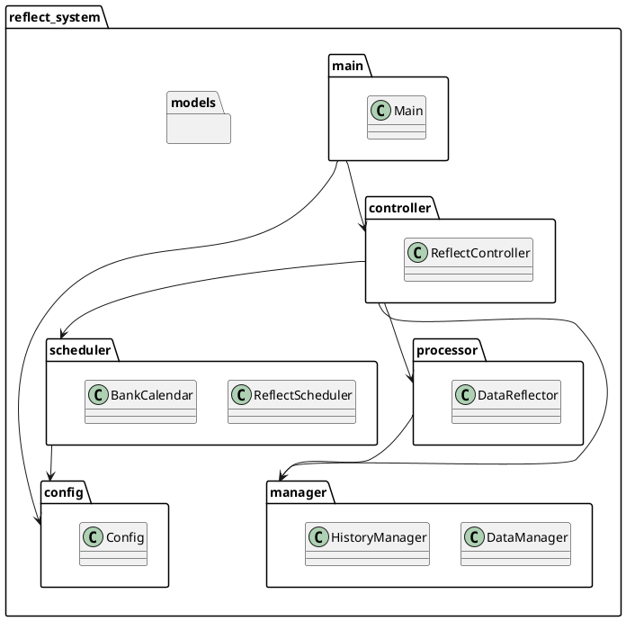
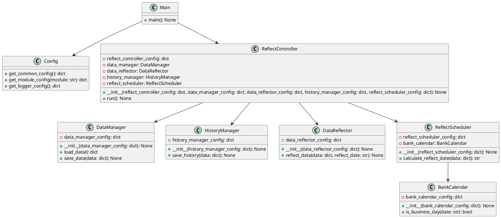
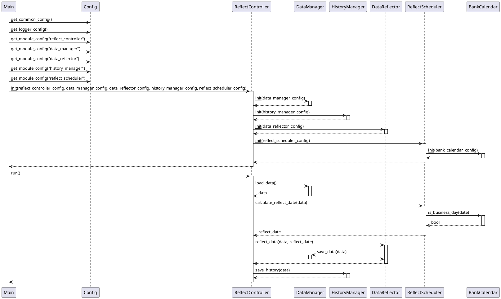
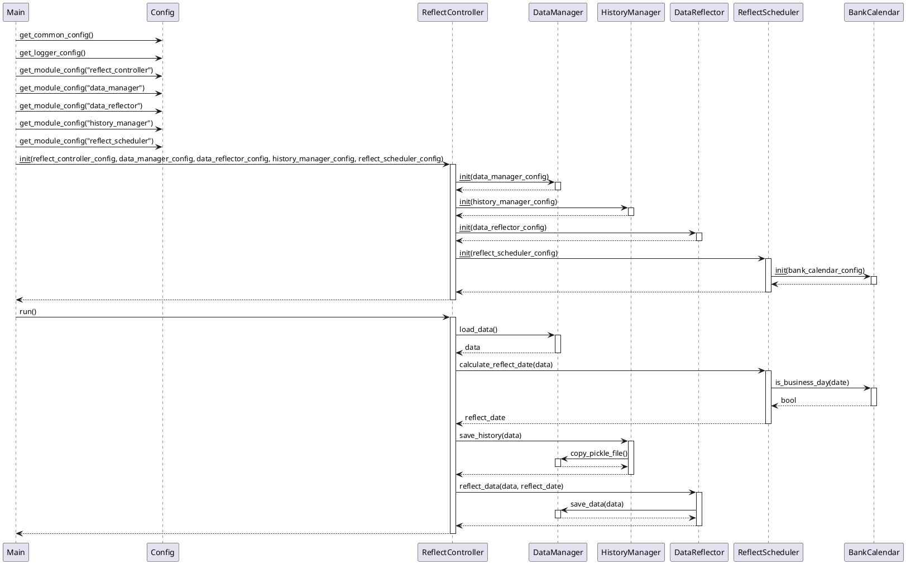

## Prompt:
undefined

## Response:
業務要件とシステム機能要件を理解しました。主な内容は以下の通りです。

業務要件:

* 会社概要、組織構造、部店コード・課Grコードの説明
* 本システムの概要として人事異動リファレンスデータベース(リファレンスDB)の説明
* リファレンスDBに対する各種申請(部署の新設・変更・廃止)の説明
* システム構成要素として一括申請、受付、パターン編集、反映・送信の説明
* 周辺システムとの連携として上流の申請元部署と下流の行内BPRシステム・行内共通認証システムとの説明

システム機能要件:

* システムの呼称や概要の説明
* データライフサイクルとして一括申請、受付、パターン編集、反映・送信の4フェーズの説明
* 申請フォームの種類と項目の説明
* 保有テーブルとカラムの説明(申請一覧テーブル、変更情報テーブル、DB更新情報テーブル、人事異動リファレンスDB)
* 申請の種類(新設・変更・廃止)と申請明細の展開の説明

システムデザイン要件についてもご提示いただいておりますので、業務要件・システム機能要件と併せて理解し、最適なシステム設計を行っていきたいと思います。ご質問やご要望などありましたらお聞かせください。

## Prompt:
undefined

## Response:
承知しました。反映・一括処理・送信処理について、業務要件とシステム機能要件に基づいて深掘りしていきましょう。

まず、反映処理では、パターン編集処理後のDB更新情報明細を元にリファレンスDBへの反映が行われます。明細が持つ反映日をキーとし、運用パラメータ制御により、反映指定日前にデータ仮反映も可能です。その際、銀行カレンダーを取得し、営業日での制御が行われます。

次に、一括処理では、データが保有する値に依存しない共通の処理が行われます。具体的には、リファレンスDBに対し、休職・本部詰の部署情報の作成・削除が行われます。「休職・本部詰の親部店」に該当する部署の配下に休職・本部詰部署がなければ作成し、該当しない部署の配下にあれば削除します。

最後に、送信処理では、後続システムに連携するためのCSVファイルと制御ファイルが作成されます。更新日にこれらのファイルを関連システムへSFTP送信し、仮反映データ及び本反映データが送信されます。

システムデザイン要件としては、反映・送信処理で以下の点が挙げられています。

* パターン編集で生成した永続化データ(DB更新情報明細)を使用
* DB更新情報明細によりリファレンステーブルを更新
* DB更新情報明細の反映日付に則りテーブル更新
* ダミー課Gr情報を取得しダミー課テーブルを作成
* 関連システムに渡すデータはリファレンステーブル及びダミー課テーブルレコードが対象
* 定義した事前提供日には受渡し側の要件に従いデータ加工しCSV化して送付(反映日5営業日前ケース、反映日前日ケース)
* 送信するCSVファイルはバリデーションチェック
* 部店新規・廃止の場合はリファレンステーブル更新連絡とともに、部店情報.txtを作成しメール添付
* テーブル更新前にテーブルファイルの物理コピーを行い履歴保有

以上が、反映・一括処理・送信処理の業務要件とシステム機能要件、およびシステムデザイン要件のポイントになります。これらを踏まえて、具体的な設計や実装を進めていく必要があります。何か他に確認したい点などありますでしょうか。

## Prompt:
undefined

## Response:
<step1>反映処理のモジュール構成案を以下に提案します。

提案1:

* reflect\_main.py: 反映処理のメインモジュール。処理の全体制御を行う。
* reflect\_data\_loader.py: DB更新情報明細データをロードするモジュール。
* reflect\_scheduler.py: 反映日付に基づいて反映処理をスケジューリングするモジュール。
* reflect\_executor.py: 実際のリファレンスDBの更新処理を実行するモジュール。
* bank\_calendar.py: 銀行営業日のカレンダー情報を管理するモジュール。

提案2:

* reflect\_controller.py: 反映処理の全体制御を行うコントローラーモジュール。
* reflect\_data\_access.py: DB更新情報明細データのアクセスを担当するモジュール。
* reflect\_scheduler.py: 反映日付に基づいて反映処理をスケジューリングするモジュール。
* reflect\_updater.py: リファレンスDBの更新処理を行うモジュール。
* reflect\_validator.py: 反映処理の事前バリデーションを行うモジュール。
* bank\_calendar.py: 銀行営業日のカレンダー情報を管理するモジュール。

提案3:

* reflect\_main.py: 反映処理のメインモジュール。処理の全体制御を行う。
* reflect\_data\_manager.py: DB更新情報明細データの読み込みと管理を行うモジュール。
* reflect\_scheduler.py: 反映日付に基づいて反映処理をスケジューリングするモジュール。
* reflect\_db\_updater.py: リファレンスDBの更新処理を行うモジュール。
* reflect\_param\_controller.py: 運用パラメータの制御を行うモジュール。
* reflect\_logger.py: 反映処理のログ出力を行うモジュール。
* bank\_calendar.py: 銀行営業日のカレンダー情報を管理するモジュール。

これらの提案は、反映処理の主要な機能や責務に基づいてモジュールを分割しています。処理の全体制御、データのロードや管理、スケジューリング、実際のDB更新、バリデーション、ログ出力、銀行営業日の管理などが主なモジュールとして考えられます。

実際のモジュール構成は、システムの規模や複雑性、開発チームの規模や習慣などに応じて、最適なものを選択・調整していくことが重要です。

## Prompt:
undefined

## Response:
以下は、各モジュール構成案のメリットとデメリットを表形式でまとめたものです。

```
&]:odd:bg-bg-500/10">提案メリットデメリット&]:odd:bg-bg-500/10">提案1- シンプルで理解しやすい構成<br>- 責務が明確に分離されている<br>- メインモジュールが処理の全体制御を担当- 機能追加や変更時に影響範囲が広くなる可能性がある<br>- モジュール間の依存関係が強くなる可能性がある&]:odd:bg-bg-500/10">提案2- コントローラーモジュールが処理の全体制御を担当<br>- データアクセス専用のモジュールがある<br>- バリデーション専用のモジュールがある- モジュール数が多くなり、複雑性が増す可能性がある<br>- モジュール間の責務分担が曖昧になる可能性がある&]:odd:bg-bg-500/10">提案3- データ管理専用のモジュールがある<br>- 運用パラメータ制御専用のモジュールがある<br>- ログ出力専用のモジュールがある- モジュール数が多くなり、複雑性が増す可能性がある<br>- モジュール間の責務分担が曖昧になる可能性がある<br>- 過度な分割によってかえって理解しづらくなる可能性がある
```

どの提案も一長一短があります。提案1はシンプルで理解しやすい構成ですが、機能追加や変更の影響範囲が広くなる可能性があります。提案2と提案3は、より細かくモジュールを分割していますが、モジュール数が多くなり複雑性が増す可能性があります。

最終的には、システムの規模や複雑性、開発チームのスキルセットや経験、将来の拡張性や保守性などを総合的に考慮して、最適なモジュール構成を選択することが重要です。また、選択した構成についても、開発を進める中で継続的に見直しと改善を行っていくことが望ましいでしょう。

## Prompt:
undefined

## Response:
ご提示いただいた追加情報を踏まえ、反映処理のモジュール構成を再考しました。以下のようなシンプルな構成が適切と考えられます。

reflect\_main.py: 反映処理のメインモジュール。処理の全体制御を行う。 reflect\_data\_loader.py: DB更新情報明細データをロードするモジュール。 reflect\_scheduler.py: 反映日付に基づいて反映処理をスケジューリングするモジュール。 reflect\_executor.py: 実際のリファレンスDBの更新処理を実行するモジュール。 reflect\_backup.py: リファレンスDBのバックアップ（世代管理）を行うモジュール。 bank\_calendar.py: 銀行営業日のカレンダー情報を管理するモジュール。

この構成では、以下の点を考慮しています。

要件追加の見込みが少ないため、シンプルな構成で十分である。 反映処理前のバリデーションは不要であるため、バリデーション用のモジュールは含めない。 更新明細レコードのAdd, Update, deleteの判別文字列に基づいてCRUD処理を行うため、reflect\_executor.pyでその処理を担当する。 リファレンスデータ更新処理前の世代管理（バックアップ）が必要であるため、reflect\_backup.pyを追加する。

この構成であれば、各モジュールの責務が明確であり、将来的な変更にも対応しやすいと考えられます。また、必要最小限のモジュール構成であるため、コードの理解や保守も容易になるでしょう。

ただし、実際の開発においては、詳細な要件や設計を詰めていく中で、モジュール構成の微調整が必要になる可能性もあります。そのため、開発を進める中で継続的にモジュール構成の適切性を評価し、必要に応じて改善していくことが重要です。

## Prompt:
undefined

## Response:
提示いただいた詳細な要件を踏まえ、反映・一括処理・送信のモジュール構成を以下のように提案します。

1. main.py
   * 反映・一括処理・送信の全体制御を行うメインモジュール
2. reflect\_processor.py
   * DB更新情報テーブルからリファレンスDBへのデータ反映処理を行うモジュール
   * データ反映処理の種類に応じて、データの追加・削除・変更を実行する
   * 部店削除時はBPR-DCと連携して残ユーザ調査を実行する
   * ダミー課Gr申請情報をダミー課Gr専用のDBに反映する
3. batch\_processor.py
   * 反映処理後に実行する一括処理を行うモジュール
   * 休職・本部詰め対象部店が有るべき部店構成となるように、休職・本部詰めデータを生成・削除する
4. file\_generator.py
   * データ反映処理後のDBからフォーマット指定のフィールドを抽出し、CSVファイルを作成するモジュール
5. file\_validator.py
   * CSVファイルの各フィールドの入力形式が正しいことを確認するモジュール
   * レコード重複のようなDB規則の違反がないことを確認する
6. db\_validator.py
   * リファレンスDBの規則検証を行うモジュール
   * 部店の親子構成、休職本部詰めの有無といったリファレンスDBの規則に違反がないことを確認する
7. file\_sender.py
   * 書き出したCSVファイルを共通認証システムへSFTPで送信するモジュール
8. scheduler.py
   * 受け渡し前処理のスケジュール定義ファイルを読み込み、処理対象を抽出するモジュール
9. format\_reader.py
   * ファイル書き出し用のフォーマット定義ファイルを読み込むモジュール
10. db\_manager.py
  * リファレンスDB、リファレンス履歴DB、ダミー課GrDBなどのDBアクセスを管理するモジュール
11. bpr\_dc\_connector.py
  * BPR-DCとの連携処理を行うモジュール
12. file\_server\_notifier.py
  * データ反映する部店ユーザが利用するファイルサーバ情報をファイルサーバ担当に連携するモジュール
13. logger.py
  * 各種DB操作ログを保管するためのロギング処理を行うモジュール
14. config.py
  * 設定情報を管理するモジュール

この構成では、主要な処理ごとにモジュールを分割し、責務を明確にしています。また、セキュリティ要件や非機能要件に関連する処理も独立したモジュールとして扱っています。

ただし、実際の開発においては、さらに詳細な設計を行う中で、モジュールの分割や統合、名称の変更などが必要になる可能性があります。また、モジュール間の依存関係やインターフェースの設計、エラーハンドリングなども慎重に検討する必要があります。

提案したモジュール構成を基に、チーム内で議論を重ね、プロジェクトの要件や制約に合わせて最適化していくことをお勧めします。

## Prompt:
undefined

## Response:
ご提示いただいた考慮点を踏まえ、モジュール構成を再考しました。以下のような構成を提案します。

1. main.py
   * 反映・一括処理・送信の全体制御を行うメインモジュール
   * 要件の増減に対応するため、各処理の実行をコントロールするのみとし、処理の詳細は他のモジュールに委譲する
2. process\_controller.py
   * 各処理（反映処理、一括処理、送信処理）の実行を制御するモジュール
   * 要件の増減に応じて、このモジュールで処理の追加・削除・変更を行う
3. data\_processor.py
   * DB更新情報テーブル（pickle）からリファレンスDBへのデータ反映処理を行うモジュール
   * データ反映処理の種類に応じて、データの追加・削除・変更を実行する
4. batch\_processor.py
   * 反映処理後に実行する一括処理を行うモジュール
   * 休職・本部詰め対象部店が有るべき部店構成となるように、休職・本部詰めデータを生成・削除する
5. file\_handler.py
   * CSVファイルの生成、バリデーション、送信を行うモジュール
   * ファイル書き出し用のフォーマット定義ファイルを読み込む機能も含める
6. db\_validator.py
   * リファレンスDBの規則検証を行うモジュール
   * 部店の親子構成、休職本部詰めの有無といったリファレンスDBの規則に違反がないことを確認する
7. scheduler.py
   * 受け渡し前処理のスケジュール定義ファイルを読み込み、処理対象を抽出するモジュール
8. data\_manager.py
   * リファレンスDB、リファレンス履歴DB、ダミー課GrDBなどのpickleファイルのI/Oを管理するモジュール
9. external\_connector.py
   * BPR-DCやファイルサーバなどの外部システムとの連携処理を行うモジュール
10. logger.py
  * 各種操作ログを保管するためのロギング処理を行うモジュール
11. config.py
  * 設定情報を管理するモジュール
12. models/
  * データモデルを定義するモジュールディレクトリ
  * pydanticを使用してデータモデルを定義する

この構成では、main.pyとprocess\_controller.pyを中心に、要件の増減に対応しやすい構造になっています。各処理の詳細は個別のモジュールに委譲することで、全体制御構造への影響を最小限に抑えています。

また、データモデルをmodelsディレクトリ内に定義し、pydanticを使用することで、データの整合性を保ちつつ、コード内での利便性も高めています。

pickleファイルをデータの格納に使用することを前提に、data\_manager.pyでファイルI/Oを集中的に管理する構成としました。

ただし、これはあくまでも一つの提案であり、実際の開発においては、さらに詳細な設計を行う中で、モジュールの分割や統合、名称の変更などが必要になる可能性があります。チーム内で議論を重ね、プロジェクトの要件や制約に合わせて最適化していくことが重要です。

## Prompt:
undefined

## Response:
configオブジェクトを使用してモジュール個別設定を取り込むことを前提に、モジュール構成を更新します。

1. main.py
   * 反映・一括処理・送信の全体制御を行うメインモジュール
   * configオブジェクトからモジュール共通設定、logger情報を受け取る
2. process\_controller.py
   * 各処理（反映処理、一括処理、送信処理）の実行を制御するモジュール
   * configオブジェクトからモジュール個別設定を受け取る
   * 要件の増減に応じて、このモジュールで処理の追加・削除・変更を行う
3. data\_processor.py
   * DB更新情報テーブル（pickle）からリファレンスDBへのデータ反映処理を行うモジュール
   * データ反映処理の種類に応じて、データの追加・削除・変更を実行する
   * configオブジェクトからモジュール個別設定を受け取る
4. batch\_processor.py
   * 反映処理後に実行する一括処理を行うモジュール
   * 休職・本部詰め対象部店が有るべき部店構成となるように、休職・本部詰めデータを生成・削除する
   * configオブジェクトからモジュール個別設定を受け取る
5. file\_handler.py
   * CSVファイルの生成、バリデーション、送信を行うモジュール
   * ファイル書き出し用のフォーマット定義ファイルを読み込む機能も含める
   * configオブジェクトからモジュール個別設定を受け取る
6. db\_validator.py
   * リファレンスDBの規則検証を行うモジュール
   * 部店の親子構成、休職本部詰めの有無といったリファレンスDBの規則に違反がないことを確認する
   * configオブジェクトからモジュール個別設定を受け取る
7. scheduler.py
   * 受け渡し前処理のスケジュール定義ファイルを読み込み、処理対象を抽出するモジュール
   * configオブジェクトからモジュール個別設定を受け取る
8. data\_manager.py
   * リファレンスDB、リファレンス履歴DB、ダミー課GrDBなどのpickleファイルのI/Oを管理するモジュール
   * configオブジェクトからモジュール個別設定を受け取る
9. external\_connector.py
   * BPR-DCやファイルサーバなどの外部システムとの連携処理を行うモジュール
   * configオブジェクトからモジュール個別設定を受け取る
10. models/
  * データモデルを定義するモジュールディレクトリ
  * pydanticを使用してデータモデルを定義する

各モジュールがconfigオブジェクトからモジュール個別設定を受け取ることで、tomlファイルで定義された設定値を利用できるようになります。これにより、モジュール固有の設定をコード外で管理でき、保守性や柔軟性が向上します。

main.pyではモジュール共通設定とlogger情報のみを受け取り、各モジュールの個別設定はprocess\_controller.pyを介して渡すことで、全体制御構造をシンプルに保ちます。

実際の開発では、各モジュールが必要とする個別設定の内容を明確にし、tomlファイルの構造を適切に設計することが重要です。また、設定値の変更がシステムに与える影響を十分に検討し、適切なバリデーションを行うことも必要です。

## Prompt:
undefined

## Response:
以下は、提案したモジュール構成に基づいたコンポーネント図、クラス図、シーケンス図のPlantUML形式での表現です。

コンポーネント図:

@startuml package "Reflection, Batch Processing, and Sending System" { \[main.py\] \[process\_controller.py\] \[data\_processor.py\] \[batch\_processor.py\] \[file\_handler.py\] \[db\_validator.py\] \[scheduler.py\] \[data\_manager.py\] \[external\_connector.py\] \[models\] \[config\]

\[main.py\] --> \[process\_controller.py\] \[process\_controller.py\] --> \[data\_processor.py\] \[process\_controller.py\] --> \[batch\_processor.py\] \[process\_controller.py\] --> \[file\_handler.py\] \[process\_controller.py\] --> \[db\_validator.py\] \[process\_controller.py\] --> \[scheduler.py\] \[data\_processor.py\] --> \[data\_manager.py\] \[batch\_processor.py\] --> \[data\_manager.py\] \[file\_handler.py\] --> \[data\_manager.py\] \[db\_validator.py\] --> \[data\_manager.py\] \[scheduler.py\] --> \[data\_manager.py\] \[external\_connector.py\] --> \[data\_manager.py\] \[models\] <.. \[data\_processor.py\] \[models\] <.. \[batch\_processor.py\] \[models\] <.. \[file\_handler.py\] \[config\] <.. \[main.py\] \[config\] <.. \[process\_controller.py\] \[config\] <.. \[data\_processor.py\] \[config\] <.. \[batch\_processor.py\] \[config\] <.. \[file\_handler.py\] \[config\] <.. \[db\_validator.py\] \[config\] <.. \[scheduler.py\] \[config\] <.. \[data\_manager.py\] \[config\] <.. \[external\_connector.py\] } @enduml

クラス図:

@startuml class Main {

* config: Config
* logger: Logger

* main(): None }

class ProcessController {

* config: Config
* data\_processor: DataProcessor
* batch\_processor: BatchProcessor
* file\_handler: FileHandler
* db\_validator: DBValidator
* scheduler: Scheduler

* process(): None }

class DataProcessor {

* config: Config
* data\_manager: DataManager

* process\_data(): None }

class BatchProcessor {

* config: Config
* data\_manager: DataManager

* process\_batch(): None }

class FileHandler {

* config: Config
* data\_manager: DataManager

* generate\_csv(): None
* validate\_csv(): None
* send\_csv(): None }

class DBValidator {

* config: Config
* data\_manager: DataManager

* validate\_db(): None }

class Scheduler {

* config: Config
* data\_manager: DataManager

* extract\_targets(): None }

class DataManager {

* config: Config

* load\_data(): None
* save\_data(): None }

class ExternalConnector {

* config: Config
* data\_manager: DataManager

* connect\_bpr\_dc(): None
* connect\_file\_server(): None }

class Config {

* get\_common\_config(): dict
* get\_module\_config(module: str): dict
* get\_logger\_config(): dict }

Main --> ProcessController ProcessController --> DataProcessor ProcessController --> BatchProcessor ProcessController --> FileHandler ProcessController --> DBValidator ProcessController --> Scheduler DataProcessor --> DataManager BatchProcessor --> DataManager FileHandler --> DataManager DBValidator --> DataManager Scheduler --> DataManager ExternalConnector --> DataManager @enduml

シーケンス図:

@startuml participant Main participant ProcessController participant DataProcessor participant BatchProcessor participant FileHandler participant DBValidator participant Scheduler participant DataManager participant ExternalConnector

Main -> Config: get\_common\_config() Main -> Config: get\_logger\_config() Main -> ProcessController: process()

ProcessController -> Config: get\_module\_config("process\_controller") ProcessController -> DataProcessor: process\_data() ProcessController -> BatchProcessor: process\_batch() ProcessController -> FileHandler: generate\_csv() ProcessController -> FileHandler: validate\_csv() ProcessController -> FileHandler: send\_csv() ProcessController -> DBValidator: validate\_db() ProcessController -> Scheduler: extract\_targets()

DataProcessor -> Config: get\_module\_config("data\_processor") DataProcessor -> DataManager: load\_data() DataProcessor -> DataManager: save\_data()

BatchProcessor -> Config: get\_module\_config("batch\_processor") BatchProcessor -> DataManager: load\_data() BatchProcessor -> DataManager: save\_data()

FileHandler -> Config: get\_module\_config("file\_handler") FileHandler -> DataManager: load\_data() FileHandler -> DataManager: save\_data()

DBValidator -> Config: get\_module\_config("db\_validator") DBValidator -> DataManager: load\_data()

Scheduler -> Config: get\_module\_config("scheduler") Scheduler -> DataManager: load\_data()

DataManager -> Config: get\_module\_config("data\_manager")

ExternalConnector -> Config: get\_module\_config("external\_connector") ExternalConnector -> DataManager: load\_data() ExternalConnector -> DataManager: save\_data() @enduml

これらの図は、提案したモジュール構成とその相互作用を視覚的に表現したものです。実際の開発では、これらの図を参考に、さらに詳細な設計を行う必要があります。また、開発の進行に伴って、図の更新が必要になる場合もあります。

コンポーネント図では、各モジュールの依存関係を示しています。クラス図では、各モジュールの主要なクラスとそのメソッドを定義しています。シーケンス図では、各モジュール間の相互作用とメソッドの呼び出し順序を示しています。

これらの図を活用することで、開発チーム内での設計の共有と理解が深まり、効率的な開発が可能になると期待されます。

## Prompt:
undefined

## Response:
反映処理に絞ってモジュール構成を考えると、以下のようになります。

1. main.py
   * 反映処理の全体制御を行うメインモジュール
   * configオブジェクトからモジュール共通設定、logger情報を受け取る
2. reflect\_controller.py
   * 反映処理の実行を制御するモジュール
   * configオブジェクトからモジュール個別設定を受け取る
   * 反映処理の各ステップ（データ読み込み、データ反映、履歴保存、バリデーション）の実行を制御する
3. data\_loader.py
   * DB更新情報テーブル（pickle）からデータを読み込むモジュール
   * configオブジェクトからモジュール個別設定を受け取る
4. data\_reflector.py
   * 読み込んだデータをリファレンスDBに反映するモジュール
   * データ反映処理の種類に応じて、データの追加・削除・変更を実行する
   * configオブジェクトからモジュール個別設定を受け取る
5. history\_manager.py
   * リファレンスDBの更新前の状態を履歴として保存するモジュール
   * configオブジェクトからモジュール個別設定を受け取る
6. db\_validator.py
   * リファレンスDBの整合性を検証するモジュール
   * 反映処理後のリファレンスDBに対して、規則違反がないことを確認する
   * configオブジェクトからモジュール個別設定を受け取る
7. data\_manager.py
   * リファレンスDB、リファレンス履歴DB、DB更新情報テーブルなどのpickleファイルのI/Oを管理するモジュール
   * configオブジェクトからモジュール個別設定を受け取る
8. models/
   * データモデルを定義するモジュールディレクトリ
   * pydanticを使用してデータモデルを定義する

この構成では、反映処理に特化したモジュール構成になっています。main.pyがreflect\_controller.pyを呼び出し、reflect\_controller.pyが各ステップの実行を制御します。各ステップはそれぞれ独立したモジュールとして実装され、必要なデータはdata\_manager.pyを介してpickleファイルとしてI/Oされます。

data\_loader.pyはDB更新情報テーブルからデータを読み込み、data\_reflector.pyはそのデータをリファレンスDBに反映します。history\_manager.pyは更新前のリファレンスDBの状態を履歴として保存し、db\_validator.pyは反映処理後のリファレンスDBの整合性を検証します。

各モジュールはconfigオブジェクトからモジュール個別設定を受け取ることで、柔軟な設定管理が可能になります。

実際の開発では、この構成をベースにしつつ、さらに詳細な設計を行う必要があります。例えば、エラーハンドリングや例外処理、ログ出力などの仕組みを適切に組み込むことが重要です。また、テストコードの作成や、パフォーマンスの最適化なども考慮する必要があります。

## Prompt:
undefined

## Response:
ご指摘ありがとうございます。validator機能を削除し、提供日に基づくデータ反映機能を追加します。また、data\_loader.pyとdata\_manager.pyの機能を見直し、モジュール構成を調整します。

1. main.py
   * 反映処理の全体制御を行うメインモジュール
   * configオブジェクトからモジュール共通設定、logger情報を受け取る
2. reflect\_controller.py
   * 反映処理の実行を制御するモジュール
   * configオブジェクトからモジュール個別設定を受け取る
   * 反映処理の各ステップ（データ読み込み、データ反映、履歴保存）の実行を制御する
3. data\_manager.py
   * リファレンスDB、リファレンス履歴DB、DB更新情報テーブルなどのpickleファイルのI/Oを管理するモジュール
   * DB更新情報テーブルからデータを読み込む機能を含める
   * configオブジェクトからモジュール個別設定を受け取る
4. data\_reflector.py
   * 読み込んだデータをリファレンスDBに反映するモジュール
   * データ反映処理の種類に応じて、データの追加・削除・変更を実行する
   * configオブジェクトからモジュール個別設定を受け取る
5. history\_manager.py
   * リファレンスDBの更新前の状態を履歴として保存するモジュール
   * configオブジェクトからモジュール個別設定を受け取る
6. reflect\_scheduler.py
   * 提供日に基づいてデータ反映処理をスケジューリングするモジュール
   * 指定した提供日または5営業日後の日付を計算する
   * 銀行営業カレンダーを参照して営業日を判定する
   * configオブジェクトからモジュール個別設定を受け取る
7. bank\_calendar.py
   * 銀行の営業日カレンダーを管理するモジュール
   * 指定した日付が営業日かどうかを判定する機能を提供する
   * configオブジェクトからモジュール個別設定を受け取る
8. models/
   * データモデルを定義するモジュールディレクトリ
   * pydanticを使用してデータモデルを定義する

この構成では、data\_loader.pyの機能をdata\_manager.pyに統合し、モジュール間の役割をより明確にしています。また、reflect\_scheduler.pyを追加し、提供日に基づくデータ反映のスケジューリング機能を実装します。bank\_calendar.pyは銀行の営業日カレンダーを管理し、営業日の判定に使用されます。

main.pyがreflect\_controller.pyを呼び出し、reflect\_controller.pyが各ステップの実行を制御します。data\_manager.pyはpickleファイルのI/Oを集中的に管理し、データの読み込みと書き込みを行います。data\_reflector.pyはデータをリファレンスDBに反映し、history\_manager.pyは更新前の状態を履歴として保存します。

reflect\_scheduler.pyは、提供日または5営業日後の日付を計算し、その日付に基づいてデータ反映処理をスケジューリングします。bank\_calendar.pyは銀行の営業日を判定するために使用されます。

この構成で、指定した提供日でのデータ反映と、5営業日後のデータ反映の両方に対応できます。また、モジュール間の役割分担もより明確になっています。

## Prompt:
undefined

## Response:
はい、configオブジェクトからモジュール個別設定を受け取る処理は、クラスの初期化時に行うことで、クラス内で共有することができます。

各モジュールを、設定を受け取るクラスとして定義し、\_\_init\_\_メソッドでconfigオブジェクトからモジュール個別設定を読み込むようにします。これにより、クラスのインスタンス化時に設定が読み込まれ、クラス内のメソッドで設定を参照できるようになります。

以下は、reflect\_controller.pyを例にした実装イメージです。

```python
class ReflectController:
    def __init__(self, config):
        self.config = config
        self.module_config = config.get_module_config("reflect_controller")
        
        self.data_manager = DataManager(config)
        self.data_reflector = DataReflector(config)
        self.history_manager = HistoryManager(config)
        self.reflect_scheduler = ReflectScheduler(config)
        
    def run(self):
        # 反映処理の実行制御
        data = self.data_manager.load_data()
        reflect_date = self.reflect_scheduler.calculate_reflect_date(data)
        self.data_reflector.reflect_data(data, reflect_date)
        self.history_manager.save_history(data)
```

この例では、ReflectControllerクラスの\_\_init\_\_メソッドで、configオブジェクトからモジュール個別設定（self.module\_config）を読み込んでいます。また、他のモジュールのインスタンス（data\_manager、data\_reflector、history\_manager、reflect\_scheduler）も、configオブジェクトを渡してインスタンス化しています。

これにより、ReflectControllerクラスのrunメソッドでは、self.module\_configを通じてモジュール個別設定にアクセスできます。また、他のモジュールのメソッドを呼び出す際にも、それぞれのモジュールがconfigオブジェクトから読み込んだ設定を使用できます。

他のモジュールでも同様に、\_\_init\_\_メソッドでconfigオブジェクトからモジュール個別設定を読み込むように実装することで、クラス内で設定を共有できます。

この方法により、設定の読み込みとクラス間での共有をスムーズに行うことができ、コードの可読性と保守性が向上します。また、設定の変更がある場合も、configオブジェクトの設定ファイルを更新するだけで、全てのモジュールに反映されるようになります。

## Prompt:
undefined

## Response:
ご提案いただいた方法は、依存性の注入（Dependency Injection）の一種であり、よく使われるデザインパターンの一つです。この方法を使うことで、各クラスがconfigオブジェクトに直接依存せずに、必要な設定だけを受け取ることができます。これにより、クラスの再利用性が高まり、テストがしやすくなるといったメリットがあります。

以下は、main.pyでconfigを取得し、各クラスに渡す構成の例です。

```python
# main.py
from config import Config
from reflect_controller import ReflectController

def main():
    config = Config()
    common_config = config.get_common_config()
    logger_config = config.get_logger_config()
    
    reflect_controller_config = config.get_module_config("reflect_controller")
    data_manager_config = config.get_module_config("data_manager")
    data_reflector_config = config.get_module_config("data_reflector")
    history_manager_config = config.get_module_config("history_manager")
    reflect_scheduler_config = config.get_module_config("reflect_scheduler")
    
    reflect_controller = ReflectController(reflect_controller_config, data_manager_config, 
                                           data_reflector_config, history_manager_config, 
                                           reflect_scheduler_config)
    reflect_controller.run()

if __name__ == "__main__":
    main()
```

```python
# reflect_controller.py
class ReflectController:
    def __init__(self, reflect_controller_config, data_manager_config, 
                 data_reflector_config, history_manager_config, 
                 reflect_scheduler_config):
        self.module_config = reflect_controller_config
        
        self.data_manager = DataManager(data_manager_config)
        self.data_reflector = DataReflector(data_reflector_config)
        self.history_manager = HistoryManager(history_manager_config)
        self.reflect_scheduler = ReflectScheduler(reflect_scheduler_config)
        
    def run(self):
        # 反映処理の実行制御
        data = self.data_manager.load_data()
        reflect_date = self.reflect_scheduler.calculate_reflect_date(data)
        self.data_reflector.reflect_data(data, reflect_date)
        self.history_manager.save_history(data)
```

この例では、main.pyでconfigオブジェクトから各モジュールの設定を取得し、ReflectControllerのインスタンス化時に必要な設定を渡しています。ReflectControllerは受け取った設定を使って、他のモジュールをインスタンス化しています。

この構成の利点は以下の通りです。

1. 各クラスがconfigオブジェクトに直接依存しないため、クラスの再利用性が高まる。
2. 各クラスが必要な設定だけを受け取るため、クラスの責務が明確になる。
3. main.pyでモジュール間の依存関係を一元的に管理できるため、全体の構成が把握しやすい。
4. クラスのインスタンス化時に、設定以外の依存オブジェクトを渡すことができるため、柔軟性が高まる。

ただし、この構成では、main.pyでの設定の取得とクラスへの引き渡しが複雑になる可能性があります。また、設定の変更がある場合、main.pyとそれぞれのクラスの両方を修正する必要があるため、保守性が若干低下する可能性があります。

どちらの構成を選ぶかは、プロジェクトの規模や要件、チームの規約などに応じて決定するのが良いでしょう。

## Prompt:
undefined

## Response:
以下は、提案した構成に基づいたパッケージ図、クラス図、シーケンス図のPlantUML形式での表現です。

パッケージ図:



クラス図:



シーケンス図:



これらの図は、提案した構成におけるモジュール間の関係と相互作用を視覚的に表現したものです。

パッケージ図では、システムを構成するパッケージとその依存関係を示しています。main、config、controller、manager、processor、scheduler、modelsの各パッケージがあり、それぞれのパッケージ内のクラスが定義されています。

クラス図では、各クラスの属性とメソッド、およびクラス間の関係を示しています。MainクラスがConfigクラスとReflectControllerクラスを利用し、ReflectControllerクラスが他のクラスを利用する構成になっています。

シーケンス図では、クラス間のメソッド呼び出しの流れを時系列で表現しています。Mainクラスがシステムの実行を開始し、ReflectControllerクラスのrunメソッドが呼び出されます。runメソッドでは、DataManagerクラス、ReflectSchedulerクラス、DataReflectorクラス、HistoryManagerクラスのメソッドが順次呼び出されて処理が進みます。

これらの図を参考に、実際のコード実装を進めていくことができます。ただし、実装の過程で細かな修正や調整が必要になる可能性があるため、適宜図を更新していくことが重要です。

## Prompt:
undefined

## Response:
ご指摘ありがとうございます。history\_manager.pyによる履歴管理をdata\_reflector.pyによるデータ反映処理の前に実行するように、シーケンス図を修正します。

修正したシーケンス図:



この修正では、以下の変更を行いました。

1. ReflectControllerクラスのrunメソッドにおいて、DataManagerクラスのload\_dataメソッドとReflectSchedulerクラスのcalculate\_reflect\_dateメソッドを呼び出した後、HistoryManagerクラスのsave\_historyメソッドを呼び出すように変更。
2. HistoryManagerクラスのsave\_historyメソッド内で、DataManagerクラスのcopy\_pickle\_fileメソッドを呼び出して、データ反映処理前にpickleファイルを物理コピーするように変更。
3. DataReflectorクラスのreflect\_dataメソッドの呼び出しを、HistoryManagerクラスのsave\_historyメソッドの後に移動。

これにより、データ反映処理の前にpickleファイルが物理コピーされ、その後にデータ反映処理が実行されるようになります。

この変更に合わせて、HistoryManagerクラスとDataManagerクラスの実装を適切に修正する必要があります。具体的には、HistoryManagerクラスのsave\_historyメソッドでDataManagerクラスのcopy\_pickle\_fileメソッドを呼び出すようにし、DataManagerクラスにcopy\_pickle\_fileメソッドを追加する必要があります。

これらの修正により、要件に合わせて履歴管理とデータ反映処理の順序を変更することができます。

## Prompt:
undefined

## Response:
はい、それでは提案したモジュール構成とシーケンス図に基づいて、反映処理システムの開発を進めていきましょう。

開発を進める上で、以下の点に注意が必要です。

1. 各モジュールの責務を明確にし、疎結合な設計を心がける。
2. モジュール間のインターフェースを適切に定義し、変更の影響を最小限に抑える。
3. 設定ファイル（toml）の構造を適切に設計し、各モジュールが必要な設定を取得できるようにする。
4. エラーハンドリングとログ出力を適切に実装し、システムの動作を追跡できるようにする。
5. テストコードを充実させ、各モジュールの機能を検証する。
6. リファクタリングを定期的に行い、コードの品質を維持する。

また、開発の過程で以下のような追加の検討が必要になる可能性があります。

1. データモデルの詳細設計
2. 外部システム（BPR-DC、ファイルサーバなど）とのインターフェースの設計
3. 銀行営業日カレンダーの取得方法の検討
4. パフォーマンスチューニング
5. セキュリティ対策

これらの点を適切に対処しながら、反映処理システムの開発を進めていくことが重要です。

開発の進捗状況に合わせて、クラス図やシーケンス図などの設計ドキュメントを適宜更新していくことも忘れないようにしましょう。

また、チーム内での情報共有とコミュニケーションを密に行い、全体の状況を把握しながら開発を進めることが重要です。

何か他に質問や相談があれば、遠慮なくおっしゃってください。一緒に反映処理システムの開発を成功させましょう。

## Prompt:
undefined

## Response:
提案したモジュール構成は、全体的に責務の分離がよくできていると思われます。各モジュールは単一の責務を持ち、相互の依存関係も明確になっています。

ただし、以下の点については、さらなる改善の余地があるかもしれません。

1. ReflectControllerクラス
   * 現在の設計では、ReflectControllerクラスが他のほとんど全てのクラスを制御しています。これは、ReflectControllerクラスに多くの責務が集中していることを意味します。
   * 将来的に反映処理のフローが複雑になった場合、ReflectControllerクラスが肥大化する可能性があります。
   * 必要に応じて、ReflectControllerクラスの責務をさらに分割し、新たなクラスを導入することを検討してもよいかもしれません。
2. DataManagerクラス
   * DataManagerクラスは、現在、データのロードと保存、およびpickleファイルの物理コピーを担当しています。
   * これらの責務は密接に関連していますが、厳密には異なる責務です。
   * 必要に応じて、DataLoaderクラスやDataWriterクラスのような新たなクラスを導入し、データの入出力に関する責務を分割することを検討してもよいかもしれません。
3. HistoryManagerクラス
   * HistoryManagerクラスは、現在、履歴の保存のみを担当しています。
   * 将来的に、履歴の参照やクリーンアップなどの機能が必要になった場合、HistoryManagerクラスの責務が拡大する可能性があります。
   * その場合、履歴の保存と参照を別のクラスに分割することを検討してもよいかもしれません。

ただし、これらの点は、現時点では潜在的な課題であり、実際にそのような問題が顕在化するまでは、提案したモジュール構成で開発を進めることが適切だと思われます。

開発を進める中で、常にSOLID原則（単一責任原則、開放閉鎖原則、リスコフ置換原則、インターフェース分離原則、依存関係逆転原則）を意識し、責務の分離と疎結合な設計を心がけることが重要です。

また、開発の過程で、責務の分離に関する新たな気づきや改善点が見つかった場合は、適宜モジュール構成を見直し、リファクタリングを行うことが大切です。

継続的な改善を通じて、より洗練されたモジュール構成へと進化させていくことができると思います。

