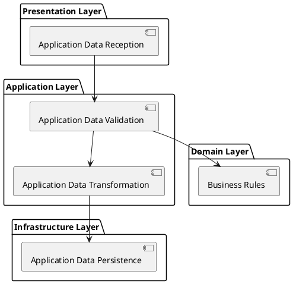
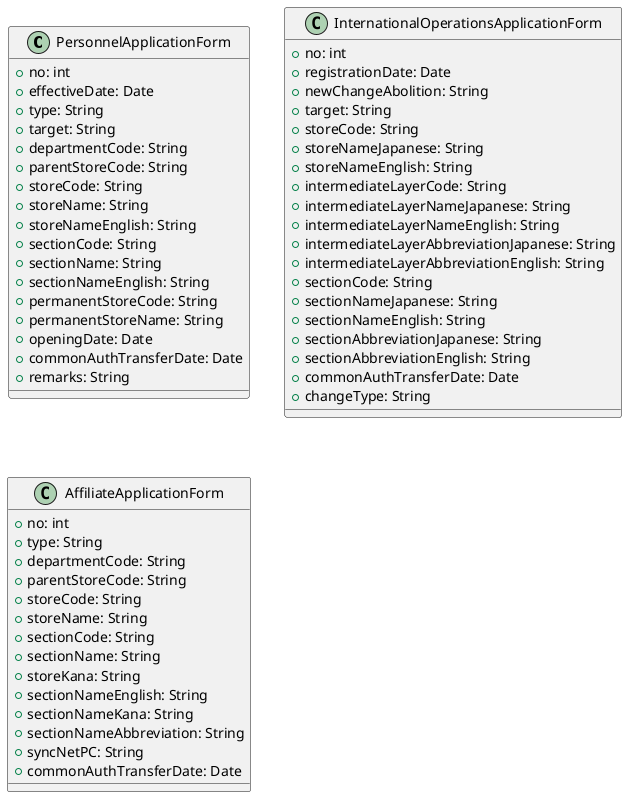
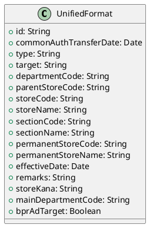
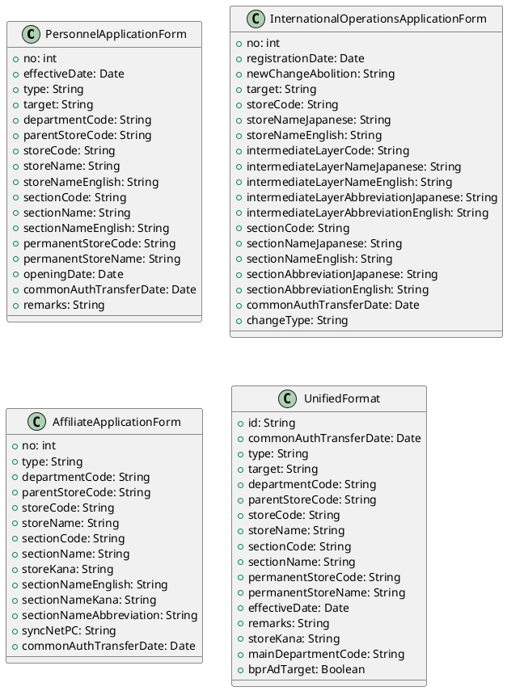
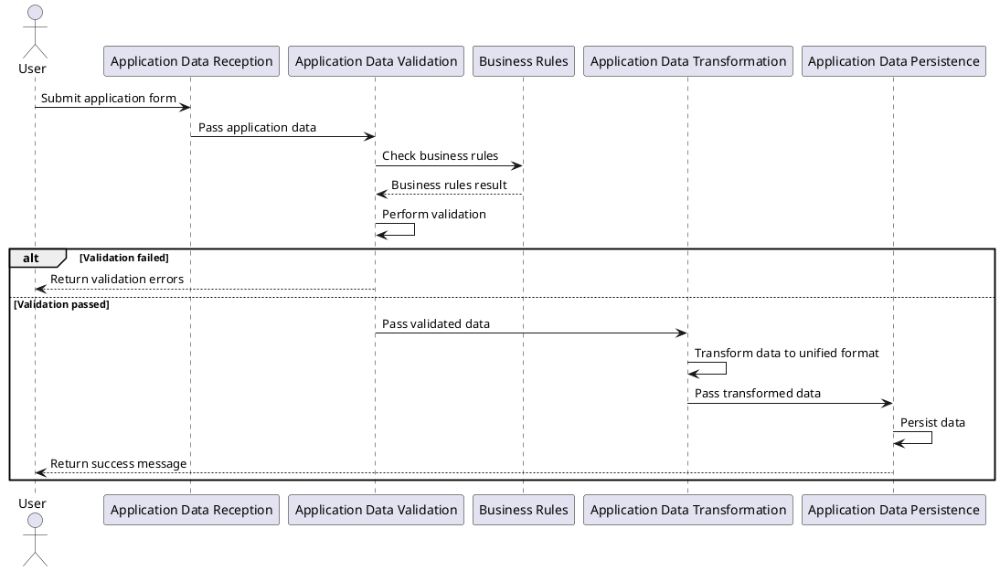

## Prompt:
undefined

## Response:
はい、提示されたドキュメントを読み、コードと構造を理解しました。

主な点をまとめると以下の通りです:

1. Main クラスがアプリケーションの実行を制御し、Excelファイルの処理、データフレームの統合、後処理を行っています。
2. MapperFactory クラスが、ファイルパスに基づいて適切な Mapper クラスのインスタンスを生成します。
3. Mapper クラス (JinjiMapper, KokkiMapper, KanrenMapper) がレイアウトから統合レイアウトへのマッピングを行います。これらのクラスは MapperInterface を実装しています。
4. IntegratedMapper クラスが、マッピング済みのデータフレームを統合します。
5. Processor クラス (ULIDProcessor) がバリデーション後の処理を行います。これらのクラスは ProcessorInterface を実装しています。
6. 各クラスとメソッドにはGoogleDocスタイルのDocStringが追加されており、コードの可読性と保守性を向上させています。
7. 処理対象のExcelファイルが見つからない場合には、警告メッセージがログに出力されます。

この構造により、新しいレイアウトや処理を追加する際には、対応するクラスを作成し、既存のインターフェースを実装するだけで済むようになっています。

コードの全体的な流れと各クラスの役割は理解できましたが、具体的な処理の内容についてはコメントアウトされている部分が多いため、詳細な動作は不明な点もあります。何か他に質問やご要望がありましたらお知らせください。

## Prompt:
undefined

## Response:
提示された業務要件、システム機能要件、データライフサイクル、システムデザイン要件を読み、一括受付の理解を深めました。以下に、重要なポイントをまとめます。

1. 本システムは、銀行の部署情報のデータを保持・メンテナンスし、それに対する変更申請を処理するシステムです。
2. システムは、一括申請、受付、パターン編集、反映・送信の4つのフェーズから構成されています。
3. 一括申請では、人事部、国際事務企画部、関連会社からの異なるフォーマットによる申請を統一フォーマットにまとめ、申請内容のバリデーションと整合性チェックを行います。
4. 受付では、申請情報に対し、リファレンスDBの情報を補記するなどして、後続パターン編集に適したフォーマットに整形します。条件制御で100パターン程度が見込まれており、複雑なifネストや個別処理実装を避けるためのリファクタリングが必要です。
5. パターン編集では、受付後データを元に、リファレンスDBに登録する各種設定値を計算します。設定値の計算はパターンのマッチングに基づいて行われ、変更情報明細の各カラムの値によって異なります。
6. 反映・送信では、パターン編集後のデータに基づいてリファレンスDBを更新し、リファレンスDBの全明細を対象とした一括処理を行います。また、バリデーション・整合性チェック・アウトプットファイルの生成・後続システムに対するファイル送信を行います。
7. システムはPythonで実装され、validationにはpydanticライブラリを使用します。データの永続化にはpickle形式ファイルを使用します。
8. 受付とパターン編集では、main/Factory/Facade/編集部品構成デザインを採用し、条件分岐の複雑化を避けるためにアーリーリターンの考え方を導入します。
9. リファレンスDBは正規化されておらず、部店の情報に変更が入っても配下の課・Grが保持している部店の情報は自動的には変更されないため、受付フェーズでは配下の課Grのレコードが持つ部店情報も最新化する仕組みがあります。

以上が、提示された要件から理解した一括受付の概要です。システムの複雑性を管理するために、適切なデザインパターンの採用とリファクタリングが重要であると考えられます。何か他に質問やご要望がありましたらお知らせください。

## Prompt:
undefined

## Response:
一括申請のアプリケーションアーキテクチャ方針の章立てを以下のように提案します。

1. 概要 1.1. 一括申請の役割と目的 1.2. 一括申請の全体像
2. アーキテクチャ・デザインパターン 2.1. 採用するアーキテクチャ・デザインパターン 2.2. アーキテクチャ・デザインパターン採用の理由
3. コンポーネント構成 3.1. 一括申請のコンポーネント構成 3.2. 各コンポーネントの役割と責務
4. データモデル 4.1. 入力データ（申請フォーム）のデータモデル 4.2. 統一フォーマットのデータモデル 4.3. 申請一覧テーブルのデータモデル
5. 処理フロー 5.1. 申請データの受領 5.2. 申請データに対するValidation 5.3. 申請データに対する整合性チェック 5.4. 各種申請フォームから統一フォーマットへの変換 5.5. 変換後データの永続化
6. エラーハンドリングと例外処理 6.1. Validationエラーの処理方針 6.2. 整合性チェックエラーの処理方針 6.3. データ変換エラーの処理方針
7. ログ出力 7.1. ログ出力の目的と方針 7.2. ログ出力箇所とログレベル
8. テスト方針 8.1. ユニットテスト 8.2. 統合テスト 8.3. システムテスト
9. 非機能要件 9.1. パフォーマンス要件 9.2. セキュリティ要件 9.3. 運用・保守性要件
10. 将来の拡張性と保守性 10.1. 新しい申請フォームの追加 10.2. Validationルールの変更 10.3. 整合性チェックルールの変更

この章立ては、一括申請のアプリケーションアーキテクチャを網羅的に説明するための一例です。プロジェクトの要件や規模に応じて、章立てを適宜調整してください。

## Prompt:
undefined

## Response:
はい、提案いただいた章立ては、一括申請のアプリケーションアーキテクチャを適切に説明するために十分だと思います。以下のように絞り込むことで、重要な項目に焦点を当てることができます。

## アーキテクチャ・デザインパターン

### 採用するアーキテクチャ・デザインパターン

### アーキテクチャ・デザインパターン採用の理由

## コンポーネント構成

### 一括申請のコンポーネント構成

### 各コンポーネントの役割と責務

## 処理フロー

### 申請データの受領

### 申請データに対するValidation

### 申請データに対する整合性チェック

### 各種申請フォームから統一フォーマットへの変換

### 変換後データの永続化

## エラーハンドリングと例外処理

### Validationエラーの処理方針

### 整合性チェックエラーの処理方針

### データ変換エラーの処理方針

## 将来の拡張性と保守性

### 新しい申請フォームの追加

### Validationルールの変更

### 整合性チェックルールの変更

この章立てでは、以下の点に重点を置いています。

1. アーキテクチャとデザインパターンの選択とその理由
2. システムのコンポーネント構成と各コンポーネントの役割
3. 一括申請の処理フローの詳細
4. エラーハンドリングと例外処理の方針
5. 将来の変更や拡張に対する対応方法

これらの項目を詳細に説明することで、一括申請のアプリケーションアーキテクチャを明確に文書化することができます。また、データモデルやログ出力、テスト方針などの項目は、必要に応じて追加することもできます。

## Prompt:
undefined

## Response:
## アーキテクチャ・デザインパターン

### 採用するアーキテクチャ・デザインパターン

一括申請では、クリーンアーキテクチャを採用します。クリーンアーキテクチャは、関心事の分離を重視し、システムを複数の独立したレイヤーに分割することで、柔軟性、拡張性、およびテスト容易性を提供します。一括申請では、以下の4つのレイヤーを定義します。

1. プレゼンテーション層：ユーザーインターフェースや外部システムとのインターフェースを担当。
2. アプリケーション層：ビジネスロジックや処理フローの制御を担当。
3. ドメイン層：ビジネスルールや業務ロジックを担当。
4. インフラストラクチャ層：データの永続化や外部システムとの連携を担当。

また、一括申請では、データの妥当性検証と整合性チェックのために、Validatorパターンを採用します。Validatorパターンは、オブジェクトの状態を検証するロジックを分離し、再利用性と保守性を向上させます。

### アーキテクチャ・デザインパターン採用の理由

クリーンアーキテクチャを採用する理由は、以下の通りです。

1. 関心事の分離：各レイヤーが独立しているため、変更の影響範囲を最小限に抑えることができます。
2. テスト容易性：レイヤー間の依存関係が明確であるため、ユニットテストや統合テストを容易に実施できます。
3. 拡張性：新しい機能や外部システムとの連携を追加する際に、影響範囲を限定できます。

Validatorパターンを採用する理由は、以下の通りです。

1. 検証ロジックの集中管理：検証ロジックを一箇所に集約することで、保守性が向上します。
2. 再利用性：複数の申請フォームで共通の検証ロジックを再利用できます。
3. エラーハンドリングの簡素化：検証エラーを一元的に処理できるため、エラーハンドリングが簡素化されます。

## コンポーネント構成

### 一括申請のコンポーネント構成

一括申請は、以下のコンポーネントで構成されます。

1. 申請データ受領コンポーネント（プレゼンテーション層）
2. 申請データ検証コンポーネント（アプリケーション層）
3. 申請データ変換コンポーネント（アプリケーション層）
4. 申請データ永続化コンポーネント（インフラストラクチャ層）
5. 業務ルールコンポーネント（ドメイン層）

これらのコンポーネントの関係を以下のPlantUMLで表現します。

### 各コンポーネントの役割と責務

1. 申請データ受領コンポーネント：申請フォームからデータを受け取り、アプリケーション層に渡します。
2. 申請データ検証コンポーネント：申請データの妥当性検証と整合性チェックを行います。
3. 申請データ変換コンポーネント：各種申請フォームのデータを統一フォーマットに変換します。
4. 申請データ永続化コンポーネント：変換後のデータをデータベースや外部ストレージに保存します。
5. 業務ルールコンポーネント：業務上のルールや制約を定義し、アプリケーション層のコンポーネントに提供します。

## 処理フロー

### 申請データの受領

申請データ受領コンポーネントは、各部署から提出された申請フォーム（Excelファイル）を受け取ります。受領したファイルは、一時的なストレージに保存され、後続の処理に渡されます。

### 申請データに対するValidation

申請データ検証コンポーネントは、受領したデータに対して以下の検証を行います。

1. 必須項目のチェック
2. データ型のチェック
3. 値の範囲チェック
4. 文字列長のチェック

検証ルールは、Validatorクラスに集約され、再利用可能な形で実装されます。

### 申請データに対する整合性チェック

申請データ検証コンポーネントは、申請データの整合性チェックも行います。整合性チェックでは、以下の項目を確認します。

1. 申請データ内の項目間の整合性
2. 申請データと既存のデータベース情報との整合性

整合性チェックのルールは、業務ルールコンポーネントに定義され、申請データ検証コンポーネントから参照されます。

### 各種申請フォームから統一フォーマットへの変換

申請データ変換コンポーネントは、検証済みの申請データを統一フォーマットに変換します。変換処理では、以下の手順を実行します。

1. 申請フォームごとの変換ルールの適用
2. 統一フォーマットへのマッピング
3. 変換後データの正当性チェック

変換ルールは、申請フォームごとに定義され、容易に追加・変更できる設計とします。

### 変換後データの永続化

申請データ永続化コンポーネントは、変換後のデータを永続化します。永続化先は、以下のいずれかを選択します。

1. リレーショナルデータベース
2. NoSQLデータベース
3. ファイルシステム（CSVファイルなど）

永続化先の選択は、データ量や後続の処理要件に基づいて決定します。

## エラーハンドリングと例外処理

### Validationエラーの処理方針

申請データ検証コンポーネントは、Validationエラーが発生した場合、以下の処理を行います。

1. エラーメッセージの生成
2. エラー情報のログ出力
3. エラー応答の返却

エラーメッセージは、エラーの原因や修正方法を明確に示す内容とします。エラー応答は、HTTP ステータスコードとエラーメッセージを含む JSON 形式とします。

### 整合性チェックエラーの処理方針

申請データ検証コンポーネントは、整合性チェックエラーが発生した場合、以下の処理を行います。

1. エラーメッセージの生成
2. エラー情報のログ出力
3. エラー応答の返却

整合性チェックエラーのメッセージは、不整合の内容と修正方法を明確に示す内容とします。エラー応答は、HTTP ステータスコードとエラーメッセージを含む JSON 形式とします。

### データ変換エラーの処理方針

申請データ変換コンポーネントは、データ変換エラーが発生した場合、以下の処理を行います。

1. エラーメッセージの生成
2. エラー情報のログ出力
3. 変換処理の中断
4. エラー応答の返却

データ変換エラーのメッセージは、変換失敗の原因と修正方法を明確に示す内容とします。エラー応答は、HTTP ステータスコードとエラーメッセージを含む JSON 形式とします。

## 将来の拡張性と保守性

### 新しい申請フォームの追加

新しい申請フォームを追加する際は、以下の手順を実行します。

1. 申請フォームの仕様を定義
2. 申請データ受領コンポーネントに申請フォームの受領処理を追加
3. 申請データ検証コンポーネントに申請フォーム固有のValidationルールを追加
4. 申請データ変換コンポーネントに申請フォーム固有の変換ルールを追加
5. テストケースの作成と実行

コンポーネントごとに責務が明確に分離されているため、新しい申請フォームの追加による影響範囲は限定的です。

### Validationルールの変更

Validationルールを変更する際は、以下の手順を実行します。

1. 変更対象のValidationルールを特定
2. Validatorクラスの当該ルールを修正
3. テストケースの修正と実行

Validationロジックは、Validatorクラスに集約されているため、ルールの変更は一箇所で完結します。

### 整合性チェックルールの変更

整合性チェックルールを変更する際は、以下の手順を実行します。

1. 変更対象の整合性チェックルールを特定
2. 業務ルールコンポーネントの当該ルールを修正
3. 申請データ検証コンポーネントの整合性チェック処理を修正
4. テストケースの修正と実行

整合性チェックルールは、業務ルールコンポーネントに集約されているため、ルールの変更による影響範囲は限定的です。

## Prompt:
undefined

## Response:
## データモデル

### 入力データ（申請フォーム）のデータモデル

入力データ（申請フォーム）のデータモデルは、申請フォームごとに異なります。各申請フォームのデータモデルは、以下のようにクラス図で表現できます。

### 統一フォーマットのデータモデル

統一フォーマットのデータモデルは、以下のようにクラス図で表現できます。

### 申請一覧テーブルのデータモデル

申請一覧テーブルのデータモデルは、統一フォーマットと同一です。ただし、永続化の方法に応じて、以下のようなオプションがあります。

1. リレーショナルデータベースの場合：統一フォーマットのクラス図をそのままテーブル定義に変換
2. NoSQLデータベースの場合：統一フォーマットのクラス図をドキュメント構造に変換
3. CSVファイルの場合：統一フォーマットのクラス図をCSVのヘッダー行に変換

## テスト方針

### ユニットテスト

各コンポーネントの単体動作を検証するために、以下のユニットテストを実施します。

1. 申請データ受領コンポーネント：申請フォームの読み込みと一時保存が正常に動作することを確認
2. 申請データ検証コンポーネント：Validationルールと整合性チェックルールが正しく適用されることを確認
3. 申請データ変換コンポーネント：各申請フォームから統一フォーマットへの変換が正常に動作することを確認
4. 申請データ永続化コンポーネント：変換後データの永続化が正常に動作することを確認

ユニットテストには、モックオブジェクトを活用し、コンポーネント間の依存関係を切り離します。

### 結合テスト

コンポーネント間の連携を検証するために、以下の結合テストを実施します。

1. 申請データの受領から検証までの一連の流れが正常に動作することを確認
2. 検証済みデータの変換から永続化までの一連の流れが正常に動作することを確認

結合テストでは、実際のデータベースや外部システムとの連携を模擬するためのテスト用のスタブやドライバを用意します。

### システムテスト

end-to-endの動作を検証するために、以下のシステムテストを実施します。

1. 各申請フォームからデータを受領し、最終的な永続化まで一貫した処理が正常に動作することを確認
2. エラーケース（Validationエラー、整合性チェックエラー、データ変換エラーなど）が適切にハンドリングされることを確認

システムテストでは、実際の申請フォームや外部システムを用いて、実運用に近い環境を構築します。

## 非機能要件

### パフォーマンス要件

一括申請の処理時間は、申請データの件数に応じて以下の基準を満たすものとします。

1. 1,000件以下の申請データ：30分以内
2. 1,001件以上10,000件以下の申請データ：2時間以内
3. 10,001件以上の申請データ：4時間以内

また、申請データの受領から永続化までの一連の処理が、24時間以内に完了することを保証します。

### セキュリティ要件

一括申請では、以下のセキュリティ対策を実施します。

1. 申請データの受領時の認証と認可
2. 申請データの暗号化保存
3. ネットワーク通信の暗号化
4. アクセスログの記録と監視

申請データには、機密情報が含まれる可能性があるため、厳重な管理体制を敷きます。

### 運用・保守性要件

一括申請では、以下の運用・保守性要件を満たします。

1. 24時間365日の連続稼働
2. 障害発生時の自動通知と迅速な復旧
3. 申請データのバックアップと復元手順の整備
4. 運用手順とトラブルシューティングガイドの整備
5. 定期的なパフォーマンスモニタリングとチューニング

また、システムの拡張や変更に備えて、設計ドキュメントとコード規約を整備し、保守性の向上を図ります。

以上が、一括申請のアプリケーションアーキテクチャ方針の詳細です。この方針に基づいて、詳細設計と実装を進めていきます。

## Prompt:
undefined

## Response:
はい、コンポーネント図、クラス図、シーケンス図をPlantUMLで表記します。

コンポーネント図:

クラス図（申請フォームと統一フォーマット）:

シーケンス図（申請データの処理フロー）:

これらのダイアグラムは、一括申請のアプリケーションアーキテクチャの主要な側面を視覚的に表現しています。コンポーネント図は、システムの全体的な構造を示し、クラス図は入力データと統一フォーマットのデータ構造を示し、シーケンス図は申請データの処理フローを示しています。

