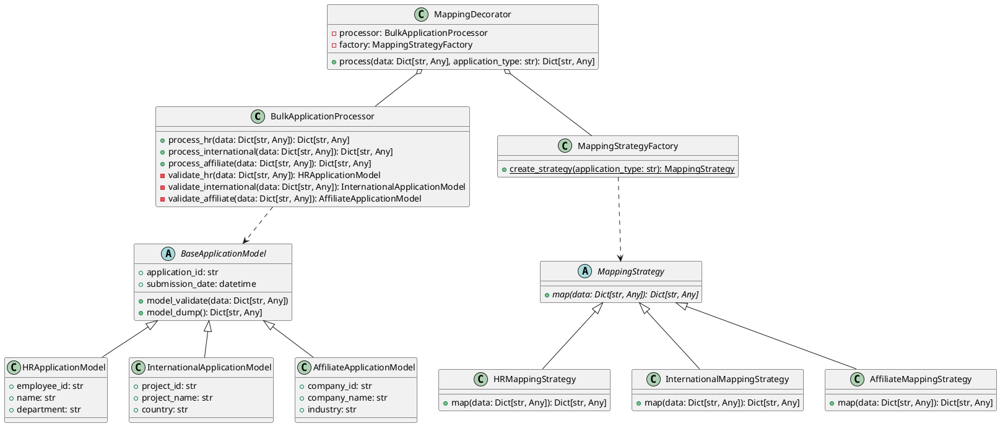
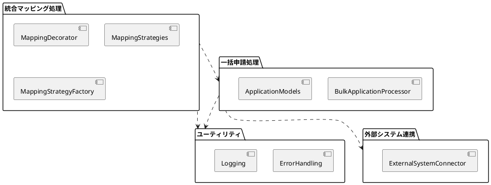
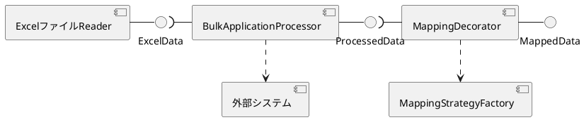
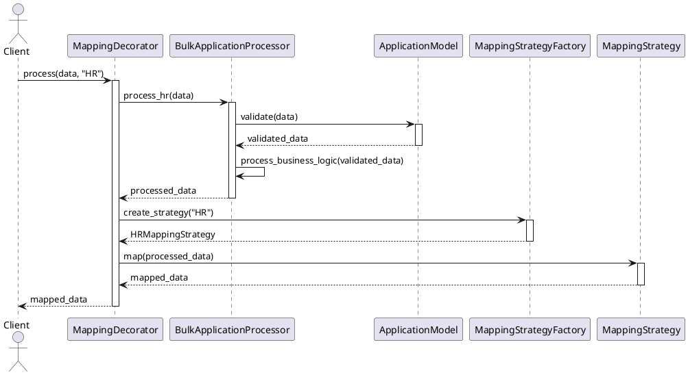

# 一括申請フェーズ開発ガイドライン
```
├── 1. 概要
│   ├── 1.1 ガイドラインの目的
│   ├── 1.2 対象読者
│   └── 1.3 用語定義
├── 2. システム全体の設計
│   ├── 2.1 アーキテクチャ概要
│   ├── 2.2 主要コンポーネント
│   └── 2.3 データフロー
├── 3. 一括申請処理
│   ├── 3.1 BulkApplicationProcessor
│   │   ├── 3.1.1 クラス構造
│   │   ├── 3.1.2 主要メソッド
│   │   └── 3.1.3 エラーハンドリング
│   ├── 3.2 申請モデル
│   │   ├── 3.2.1 BaseApplicationModel
│   │   ├── 3.2.2 HRApplicationModel
│   │   ├── 3.2.3 InternationalApplicationModel
│   │   └── 3.2.4 AffiliateApplicationModel
│   ├── 3.3 バリデーション
│   │   ├── 3.3.1 フィールドバリデーション
│   │   ├── 3.3.2 モデルバリデーション
│   │   └── 3.3.3 カスタムバリデーションの実装
│   └── 3.4 処理ロジック
│       ├── 3.4.1 HR申請の処理
│       ├── 3.4.2 国際申請の処理
│       └── 3.4.3 関連会社申請の処理
├── 4. 統合マッピング処理
│   ├── 4.1 MappingDecorator
│   │   ├── 4.1.1 クラス構造
│   │   ├── 4.1.2 BulkApplicationProcessorとの連携
│   │   └── 4.1.3 処理フロー
│   ├── 4.2 MappingStrategy
│   │   ├── 4.2.1 抽象基底クラス
│   │   ├── 4.2.2 HRMappingStrategy
│   │   ├── 4.2.3 InternationalMappingStrategy
│   │   └── 4.2.4 AffiliateMappingStrategy
│   ├── 4.3 MappingStrategyFactory
│   │   ├── 4.3.1 クラス構造
│   │   └── 4.3.2 ストラテジー生成ロジック
│   └── 4.4 マッピングロジック
│       ├── 4.4.1 HR申請のマッピング
│       ├── 4.4.2 国際申請のマッピング
│       └── 4.4.3 関連会社申請のマッピング
├── 5. エラーハンドリングとログ
│   ├── 5.1 例外の種類と処理
│   ├── 5.2 エラーメッセージの設計
│   └── 5.3 ログ記録の方針
├── 6. テストと品質保証
│   ├── 6.1 ユニットテスト
│   ├── 6.2 統合テスト
│   └── 6.3 エンドツーエンドテスト
└── 7. 付録
    ├── 7.1 コーディング規約
    ├── 7.2 パフォーマンス最適化のヒント
    └── 7.3 よくある質問（FAQ）


ガイダンス上に出てくるパッケージ名やClass名は、設計に応じて適宜読み替えて対応して下さい。
```


## 1. 概要

### 1.1 ガイドラインの目的

このガイドラインは、三菱UFJ銀行の一括申請フェーズにおけるソフトウェア開発プロセスを標準化し、高品質かつ保守性の高いコードを生成することを目的としています。

具体的には、以下の目標を達成することを目指しています：

1. データの整合性確保： Pydanticを使用したデータモデリングとバリデーションにより、入力データの正確性と一貫性を保証します。
1. エラー検出の効率化： 厳密なバリデーションルールを適用することで、データの問題を早期に特定し、後続の処理におけるエラーを防ぎます。
1. コードの再利用性向上： チェック部品の設計と実装に関するベストプラクティスを提供し、効率的なコード再利用を促進します。
1. 開発プロセスの標準化： 一貫したアプローチを定義することで、チーム全体の開発効率を向上させ、コードの品質を維持します。
1. メンテナンス性の向上： 明確な構造とドキュメンテーションにより、長期的なコードの保守と拡張を容易にします。

このガイドラインに従うことで、開発チームは一貫性のある高品質なコードを生成し、銀行のデータ処理システムの信頼性と効率性を向上させることができます。

### 1.2 対象読者

このガイドラインは、主に以下の読者を対象としています：

| ロール説明 | 担当内容 |
|---|---|
| ソフトウェア開発者 | * 一括申請フェーズの実装を担当するプログラマー <br> * Pythonを使用してデータ処理システムを開発するエンジニア <br> * バックエンド開発者 |
| システムアーキテクト | * システム全体の設計を担当する技術リーダー <br> * マイクロサービスアーキテクチャの設計者 |
| プロジェクトマネージャー | * 開発プロジェクトの進行を管理する責任者 <br> * 品質管理を担当するチームリーダー |
| 品質保証（QA）エンジニア | * テスト計画の立案と実行を担当する専門家 <br> * コード品質の監査を行う担当者 |
| 新入社員やジュニア開発者 | * 銀行のシステム開発に初めて携わる開発者 <br> * Pythonやデータ処理の基礎知識を持つ新人エンジニア |
| 保守担当者 | * 既存システムのメンテナンスや拡張を担当するエンジニア <br> * レガシーコードの改善を行う開発者 |

このガイドラインは、読者が基本的なPython知識と、データ処理システムの概念を理解していることを前提としています。ただし、Pydanticやデザインパターンなどの特定の技術については、基本的な説明も含めて記述しています。

### 1.3 用語定義

本ガイドラインで使用される主要な用語と概念を以下に定義します：

| No | 用語 | 用語説明 |
|---|---|---|
| 1 | 一括申請フェーズ | 複数の部署（人事、国際企画部、関連会社）から提出されたExcelファイルのデータを一括で処理し、検証する段階。 |
| 2 | Pydantic | Pythonのデータバリデーションライブラリ。型ヒントを使用してデータモデルを定義し、自動的にデータの検証を行う。 |
| 3 | BaseModel | Pydanticの基本クラス。これを継承することでカスタムデータモデルを作成できる。 |
| 4 | field_validator | Pydanticのデコレータの一つ。個々のフィールドに対するカスタムバリデーションルールを定義するために使用。 |
| 5 | model_validator | Pydanticのデコレータの一つ。モデル全体に対するバリデーションルールを定義するために使用。 |
| 6 | チェック部品 | データの妥当性を検証するための再利用可能なコンポーネント。関数またはクラスとして実装される。 |
| 7 | ポリモーフィズム | 同じインターフェースを持つ異なるクラスのオブジェクトを、同じ方法で扱うことができるオブジェクト指向プログラミングの概念。 |
| 8 | Compositeパターン | オブジェクトを木構造で構成し、個々のオブジェクトと合成したオブジェクトを同一視できるようにするデザインパターン。 |
| 9 | ファクトリパターン | オブジェクトの生成ロジックをカプセル化し、サブクラスでの実装の詳細を決定できるようにするデザインパターン。 |
| 10 | デコレータパターン | オブジェクトに動的に新しい責任を追加するデザインパターン。機能の拡張を柔軟に行うことができる。 |
| 11 | バリデーション | データの正確性、一貫性、および品質を確保するためのプロセス。入力データが事前に定義された規則や制約に適合しているかを検証する。 |
| 12 | 整合性チェック | データ間の論理的な関係や依存関係が正しいかを確認するプロセス。例えば、開始日が終了日よりも前であることを確認するなど。 |
| 13 | BulkApplicationProcessor | 一括申請処理を行う主要なクラス。各種申請データの検証と処理を担当する。 |
| 14 | MappingDecorator | 一括申請処理の後に統合レイアウトへのマッピングを行うクラス。デコレータパターンを用いて実装される。 |
| 15 | MappingStrategy | 異なる申請タイプに対するマッピングロジックを定義する抽象基底クラス。 |


これらの用語と概念を理解することで、本ガイドラインの内容をより深く理解し、効果的に適用することができます。不明な点がある場合は、チームリーダーや経験豊富な開発者に質問することをお勧めします。

## 2. システム全体の設計

### 2.1 アーキテクチャ概要

一括申請フェーズのシステムは、主に以下の2つの主要コンポーネントで構成されています：

1. 一括申請処理
1. 統合マッピング処理

これらのコンポーネントは、異なる部署（人事、国際企画部、関連会社）からの申請データを処理し、統一されたフォーマットにマッピングする役割を担っています。

システムの全体的な流れは以下の通りです：

1. 各部署からExcelファイル形式で申請データを受け取る
1. BulkApplicationProcessorがデータの検証と処理を行う
1. 処理されたデータがMappingDecoratorに渡される
1. MappingDecoratorが適切なMappingStrategyを使用して、データを統一フォーマットにマッピングする
1. マッピングされたデータが出力される

### 2.2 主要コンポーネント

システムの主要コンポーネントとその役割は以下の通りです：

1. BulkApplicationProcessor
  * 一括申請データの検証と処理を行う
  * 各申請タイプ（HR、International、Affiliate）に対応する処理メソッドを持つ
  * Pydanticモデルを使用してデータのバリデーションを行う
2. ApplicationModels (HRApplicationModel, InternationalApplicationModel, AffiliateApplicationModel)
  * 各申請タイプのデータ構造とバリデーションルールを定義する
  * Pydanticの BaseModel を継承して実装される
3. MappingDecorator
  * BulkApplicationProcessorの処理結果を受け取り、マッピング処理を適用する
  * 適切なMappingStrategyを選択し、データのマッピングを行う
4. MappingStrategy
  * 異なる申請タイプに対するマッピングロジックを定義する抽象基底クラス
  * 具体的な実装（HRMappingStrategy, InternationalMappingStrategy, AffiliateMappingStrategy）を持つ
5. MappingStrategyFactory
  * 申請タイプに基づいて適切なMappingStrategyインスタンスを生成する

### 2.3 データフロー

システム内のデータフローは以下の通りです：

1. 入力: Excelファイルから読み込んだ申請データ（Dict\[str, Any\]形式）
1. BulkApplicationProcessor:
   * 適切な ApplicationModel を使用してデータをバリデーション
   * バリデーション済みデータに対して必要な処理を実行
1. MappingDecorator:
   * BulkApplicationProcessor からの処理済みデータを受け取る
   * MappingStrategyFactory を使用して適切な MappingStrategy を取得
   * 選択された MappingStrategy を使用してデータをマッピング
1. 出力: 統一フォーマットにマッピングされたデータ（Dict\[str, Any\]形式）

この設計により、一括申請処理と統合マッピング処理が明確に分離され、かつ柔軟に連携できる構造となっています。また、新しい申請タイプの追加や既存の処理の変更も、それぞれのコンポーネント内で対応できるため、拡張性と保守性が高くなっています。

### 2.4 ディレクトリ構成

プロジェクトのディレクトリ構成は以下の通りです：

```
├── conftest.py
├── docs
├── src
│   ├── __init__.py
│   ├── bin
│   │   ├── __init__.py
│   ├── def
│   │   ├── __init__.py
│   │   ├── common_config
│   │   │   └── common_config.toml
│   │   └── mfaUtilsLoggingHelper
│   │       ├── config_MessageList.toml
│   │       └── logging_TimedRotate.json
│   ├── lib
│   │   ├── __init__.py
│   │   ├── common_utils
│   │   │   ├── __init__.py
│   │   │   ├── ibr_csv_helper.py
│   │   │   ├── ibr_dataframe_helper.py
│   │   │   ├── ibr_date_helper.py
│   │   │   ├── ibr_email_sender.py
│   │   │   ├── ibr_enums.py
│   │   │   ├── ibr_eventlog_handler.py
│   │   │   ├── ibr_excel_reader.py
│   │   │   ├── ibr_file_operation_helper.py
│   │   │   ├── ibr_get_config.py
│   │   │   ├── ibr_logger_package.py
│   │   │   ├── ibr_multiprocess_lock.py
│   │   │   ├── ibr_mutex_check.py
│   │   │   ├── ibr_sqlite3_loader.py
│   │   │   └── ibr_toml_loader.py
│   │   ├── convertor_utils
│   │   │   ├── __init__.py
│   │   │   └── ibr_excel_field_analyzer.py
│   │   ├── validator_utils
│   │   │   ├── __init__.py
│   │   │   ├── field_validators.py
│   │   │   └── model_validators.py
│   │   ├── mapping_strategies
│   │   │   ├── __init__.py
│   │   │   ├── hr_mapping_strategy.py
│   │   │   ├── international_mapping_strategy.py
│   │   │   ├── affiliate_mapping_strategy.py
│   │   │   └── mapping_strategy_factory.py
│   ├── log
│   │   ├── __init__.py
│   │   ├── app.log
│   │   ├── app.log.2023-12-27
│   ├── model
│   │   ├── __init__.py
│   │   ├── dataclass
│   │   │   ├── __init__.py
│   │   │   ├── hr_application_model.py
│   │   │   ├── international_application_model.py
│   │   │   └── affiliate_application_model.py
│   │   └── facade
│   │       ├── __init__.py
│   ├── package
│   │   ├── __init__.py
│   │   ├── validator_excel
│   │   │   ├── __init__.py
│   │   │   ├── __main__.py
│   │   │   └── package_config.toml
│   │   ├── bulk_processor
│   │   │   ├── __init__.py
│   │   │   └── bulk_application_processor.py
│   │   ├── mapping_decorator
│   │   │   ├── __init__.py
│   │   │   └── mapping_decorator.py
│   ├── share
│   │   ├── __init__.py
│   │   ├── receive
│   │   │   ├── __init__.py
│   │   │   ├── bank_cal.txt
│   │   │   └── input_data_validator.xlsx
│   │   └── send
│   │       ├── __init__.py
│   ├── table
│   │   ├── __init__.py
│   └── work
│       ├── __init__.py
└── tests
    ├── __init__.py
    ├── test_bulk_application_processor.py
    ├── test_mapping_decorator.py
    └── test_mapping_strategies.py
```

この構成に基づいて、各コンポーネントを適切に配置し、既存のユーティリティクラスやヘルパー関数を活用します。

## 3. 一括申請処理

- markdownからUML表示させる場合は `Alt+D`



### 3.1 BulkApplicationProcessor

#### 3.1.1 クラス構造

`BulkApplicationProcessor` クラスは一括申請処理の中心的な役割を果たします。このクラスの主な責務は、各種申請データの検証と処理です。

```python
# src/package/bulk_processor/bulk_application_processor.py

from src.lib.common_utils.ibr_logger_package import get_logger
from src.model.dataclass.hr_application_model import HRApplicationModel
from src.model.dataclass.international_application_model import InternationalApplicationModel
from src.model.dataclass.affiliate_application_model import AffiliateApplicationModel

logger = get_logger(__name__)

class BulkApplicationProcessor:
    def process(self, data: dict, application_type: str) -> dict:
        try:
            if application_type == "HR":
                return self.process_hr(data)
            elif application_type == "International":
                return self.process_international(data)
            elif application_type == "Affiliate":
                return self.process_affiliate(data)
            else:
                raise ValueError(f"不明な申請タイプです: {application_type}")
        except Exception as e:
            logger.error(f"申請処理中にエラーが発生しました: {str(e)}")
            raise

    def process_hr(self, data: dict) -> dict:
        validated_data = HRApplicationModel(**data)
        # HR申請の処理ロジック
        return validated_data.dict()

    def process_international(self, data: dict) -> dict:
        validated_data = InternationalApplicationModel(**data)
        # 国際申請の処理ロジック
        return validated_data.dict()

    def process_affiliate(self, data: dict) -> dict:
        validated_data = AffiliateApplicationModel(**data)
        # 関連会社申請の処理ロジック
        return validated_data.dict()
```

#### 3.1.2 主要メソッド

1. `process`:
   * 申請タイプに基づいて適切な処理メソッドを呼び出す
   * エラーハンドリングとログ記録を行う
1. `process_hr`, `process_international`, `process_affiliate`:
   * 各申請タイプの処理を行うメソッド
   * データのバリデーション、ビジネスロジックの適用、必要な変換を行う

#### 3.1.3 エラーハンドリング

エラーハンドリングは以下の方針で行います：

* バリデーションエラーはPydanticの`ValidationError`として捕捉し、適切なエラーメッセージとともにログに記録
* ビジネスロジックに関するエラーは、カスタム例外クラスを定義して処理
* 全てのエラーは適切にログに記録し、上位層に伝播

### 3.2 申請モデル

#### 3.2.1 BaseApplicationModel

`BaseApplicationModel` は全ての申請モデルの基底クラスとなります。共通のフィールドやメソッドをここで定義します。

```python
# src/model/dataclass/base_application_model.py

from pydantic import BaseModel, Field
from datetime import datetime

class BaseApplicationModel(BaseModel):
    application_id: str = Field(..., description="申請ID")
    submission_date: datetime = Field(default_factory=datetime.now, description="申請日")

    class Config:
        arbitrary_types_allowed = True
```

#### 3.2.2 HRApplicationModel

```python
# src/model/dataclass/hr_application_model.py

from pydantic import Field, field_validator
from src.model.dataclass.base_application_model import BaseApplicationModel
from src.lib.validator_utils.field_validators import validate_employee_id

class HRApplicationModel(BaseApplicationModel):
    employee_id: str = Field(..., min_length=5, max_length=10)
    name: str = Field(..., min_length=1, max_length=100)
    department: str = Field(..., min_length=1, max_length=50)

    _validate_employee_id = field_validator('employee_id')(validate_employee_id)
```

#### 3.2.3 InternationalApplicationModel

```python
# src/model/dataclass/international_application_model.py

from pydantic import Field, field_validator
from src.model.dataclass.base_application_model import BaseApplicationModel
from src.lib.validator_utils.field_validators import validate_project_id

class InternationalApplicationModel(BaseApplicationModel):
    project_id: str = Field(..., min_length=5, max_length=15)
    project_name: str = Field(..., min_length=1, max_length=200)
    country: str = Field(..., min_length=2, max_length=50)

    _validate_project_id = field_validator('project_id')(validate_project_id)
```

#### 3.2.4 AffiliateApplicationModel

```python
# src/model/dataclass/affiliate_application_model.py

from pydantic import Field, field_validator
from src.model.dataclass.base_application_model import BaseApplicationModel
from src.lib.validator_utils.field_validators import validate_company_id

class AffiliateApplicationModel(BaseApplicationModel):
    company_id: str = Field(..., min_length=5, max_length=10)
    company_name: str = Field(..., min_length=1, max_length=100)
    industry: str = Field(..., min_length=1, max_length=50)

    _validate_company_id = field_validator('company_id')(validate_company_id)
```

### 3.3 バリデーション

#### 3.3.1 フィールドバリデーション

フィールドバリデーションは、`field_validator` デコレータを使用して実装します。これにより、個々のフィールドに対する具体的なバリデーションルールを定義できます。

```python
# src/lib/validator_utils/field_validators.py

from pydantic import field_validator

def validate_employee_id(v: str) -> str:
    if not v.startswith('EMP'):
        raise ValueError('Employee ID must start with "EMP"')
    return v

def validate_project_id(v: str) -> str:
    if not v.startswith('PRJ'):
        raise ValueError('Project ID must start with "PRJ"')
    return v

def validate_company_id(v: str) -> str:
    if not v.startswith('COM'):
        raise ValueError('Company ID must start with "COM"')
    return v
```

#### 3.3.2 モデルバリデーション

モデルバリデーションは、`model_validator` デコレータを使用して実装します。これにより、モデル全体に対するバリデーションルールを定義できます。

```python
# src/lib/validator_utils/model_validators.py

from pydantic import model_validator
from datetime import date

def validate_date_range(cls, values):
    start_date = values.get('start_date')
    end_date = values.get('end_date')
    if start_date and end_date and start_date > end_date:
        raise ValueError("End date must be after start date")
    return values

# 使用例:
# class ProjectModel(BaseModel):
#     start_date: date
#     end_date: date
#
#     _validate_date_range = model_validator(mode='after')(validate_date_range)
```

#### 3.3.3 カスタムバリデーションの実装

より複雑なバリデーションロジックが必要な場合は、カスタムバリデーション関数を実装し、それを `field_validator` や `model_validator` 内で使用することができます。

```python
# src/lib/validator_utils/custom_validators.py

from datetime import date

def validate_future_date(value: date) -> bool:
    return value > date.today()

# 使用例:
# class FutureEvent(BaseModel):
#     event_date: date
#
#     @field_validator('event_date')
#     def check_future_date(cls, v):
#         if not validate_future_date(v):
#             raise ValueError("Event date must be in the future")
#         return v
```

### 3.4 処理ロジック

#### 3.4.1 HR申請の処理

HR申請の処理ロジックは以下のような流れになります：

1. データのバリデーション
2. 従業員情報の確認と更新
3. 部門情報の処理
4. 必要に応じて関連システムとの連携

```python
# src/package/bulk_processor/bulk_application_processor.py

from src.lib.common_utils.ibr_logger_package import get_logger
from src.model.dataclass.hr_application_model import HRApplicationModel

logger = get_logger(__name__)

class BulkApplicationProcessor:
    def process_hr(self, data: dict) -> dict:
        try:
            validated_data = HRApplicationModel(**data)
            employee = self.get_employee(validated_data.employee_id)
            updated_employee = self.update_employee_info(employee, validated_data)
            self.process_department_changes(updated_employee, validated_data.department)
            self.sync_with_hr_system(updated_employee)
            return updated_employee.dict()
        except Exception as e:
            logger.error(f"HR申請処理中にエラーが発生しました: {str(e)}")
            raise

    def get_employee(self, employee_id: str):
        # 従業員情報の取得ロジック
        pass

    def update_employee_info(self, employee, validated_data):
        # 従業員情報の更新ロジック
        pass

    def process_department_changes(self, employee, new_department):
        # 部門変更の処理ロジック
        pass

    def sync_with_hr_system(self, employee):
        # HR系システムとの同期ロジック
        pass
```

#### 3.4.2 国際申請の処理

国際申請の処理ロジックは以下のような流れになります：

1. データのバリデーション
2. プロジェクト情報の確認と更新
3. 国別の規制チェック
4. 必要に応じて国際部門との連携

```python
# src/package/bulk_processor/bulk_application_processor.py

from src.lib.common_utils.ibr_logger_package import get_logger
from src.model.dataclass.international_application_model import InternationalApplicationModel

logger = get_logger(__name__)

class BulkApplicationProcessor:
    def process_international(self, data: dict) -> dict:
        try:
            validated_data = InternationalApplicationModel(**data)
            project = self.get_project(validated_data.project_id)
            updated_project = self.update_project_info(project, validated_data)
            self.check_country_regulations(updated_project, validated_data.country)
            self.sync_with_international_department(updated_project)
            return updated_project.dict()
        except Exception as e:
            logger.error(f"国際申請処理中にエラーが発生しました: {str(e)}")
            raise

    def get_project(self, project_id: str):
        # プロジェクト情報の取得ロジック
        pass

    def update_project_info(self, project, validated_data):
        # プロジェクト情報の更新ロジック
        pass

    def check_country_regulations(self, project, country):
        # 国別規制チェックロジック
        pass

    def sync_with_international_department(self, project):
        # 国際部門との同期ロジック
        pass
```

#### 3.4.3 関連会社申請の処理

関連会社申請の処理ロジックは以下のような流れになります：

1. データのバリデーション
2. 関連会社情報の確認と更新
3. 業界特有の処理
4. 必要に応じて親会社との連携

```python
# src/package/bulk_processor/bulk_application_processor.py

from src.lib.common_utils.ibr_logger_package import get_logger
from src.model.dataclass.affiliate_application_model import AffiliateApplicationModel

logger = get_logger(__name__)

class BulkApplicationProcessor:
    def process_affiliate(self, data: dict) -> dict:
        try:
            validated_data = AffiliateApplicationModel(**data)
            affiliate = self.get_affiliate(validated_data.company_id)
            updated_affiliate = self.update_affiliate_info(affiliate, validated_data)
            self.process_industry_specific_rules(updated_affiliate, validated_data.industry)
            self.sync_with_parent_company(updated_affiliate)
            return updated_affiliate.dict()
        except Exception as e:
            logger.error(f"関連会社申請処理中にエラーが発生しました: {str(e)}")
            raise

    def get_affiliate(self, company_id: str):
        # 関連会社情報の取得ロジック
        pass

    def update_affiliate_info(self, affiliate, validated_data):
        # 関連会社情報の更新ロジック
        pass

    def process_industry_specific_rules(self, affiliate, industry):
        # 業界特有の処理ロジック
        pass

    def sync_with_parent_company(self, affiliate):
        # 親会社との同期ロジック
        pass
```

これらの処理ロジックは、各申請タイプに特化した形で実装されています。エラーハンドリングとログ記録も適切に組み込まれており、問題が発生した場合に迅速に対応できるようになっています。

## 4. 統合マッピング処理

### 4.1 MappingDecorator

#### 4.1.1 クラス構造

`MappingDecorator` クラスは、一括申請処理の結果を受け取り、それを統合レイアウトにマッピングする役割を担います。このクラスはデコレータパターンを使用して実装されます。

```python
# src/package/mapping_decorator/mapping_decorator.py

from src.lib.common_utils.ibr_logger_package import get_logger
from src.lib.mapping_
```

```python
# src/package/mapping_decorator/mapping_decorator.py

from src.lib.common_utils.ibr_logger_package import get_logger
from src.lib.mapping_strategies.mapping_strategy_factory import MappingStrategyFactory
from src.package.bulk_processor.bulk_application_processor import BulkApplicationProcessor

logger = get_logger(__name__)

class MappingDecorator:
   def __init__(self, processor: BulkApplicationProcessor):
       self.processor = processor
       self.factory = MappingStrategyFactory()

   def process(self, data: dict, application_type: str) -> dict:
       try:
           processed_data = self.processor.process(data, application_type)
           mapping_strategy = self.factory.create_strategy(application_type)
           mapped_data = mapping_strategy.map(processed_data)
           logger.info(f"{application_type} 申請のマッピングが完了しました")
           return mapped_data
       except Exception as e:
           logger.error(f"マッピング処理中にエラーが発生しました: {str(e)}")
           raise
```

#### 4.1.2 BulkApplicationProcessorとの連携

`MappingDecorator` は `BulkApplicationProcessor` のインスタンスを内部に保持し、それを使用して一括申請処理を行います。この設計により、処理とマッピングの責務を明確に分離しつつ、柔軟な連携を実現しています。

#### 4.1.3 処理フロー

`MappingDecorator` の処理フローは以下の通りです：

1. `BulkApplicationProcessor` を使用して申請データを処理
2. 処理結果を受け取る
3. `MappingStrategyFactory` を使用して適切な `MappingStrategy` を取得
4. 取得した `MappingStrategy` を使用してデータをマッピング
5. マッピングされたデータを返す

### 4.2 MappingStrategy

#### 4.2.1 抽象基底クラス

`MappingStrategy` は異なる申請タイプに対するマッピングロジックを定義する抽象基底クラスです。

```python
# src/lib/mapping_strategies/mapping_strategy.py

from abc import ABC, abstractmethod

class MappingStrategy(ABC):
    @abstractmethod
    def map(self, data: dict) -> dict:
        pass
```

#### 4.2.2 HRMappingStrategy

```python
# src/lib/mapping_strategies/hr_mapping_strategy.py

from src.lib.mapping_strategies.mapping_strategy import MappingStrategy
from src.lib.common_utils.ibr_date_helper import format_date

class HRMappingStrategy(MappingStrategy):
    def map(self, data: dict) -> dict:
        return {
            "employee_number": data["employee_id"],
            "full_name": data["name"],
            "department_code": self.get_department_code(data["department"]),
            "submission_date": format_date(data["submission_date"])
        }

    def get_department_code(self, department: str) -> str:
        # 部門コードの取得ロジック
        pass
```

#### 4.2.3 InternationalMappingStrategy

```python
# src/lib/mapping_strategies/international_mapping_strategy.py

from src.lib.mapping_strategies.mapping_strategy import MappingStrategy
from src.lib.common_utils.ibr_date_helper import format_date

class InternationalMappingStrategy(MappingStrategy):
    def map(self, data: dict) -> dict:
        return {
            "project_code": data["project_id"],
            "project_name": data["project_name"],
            "country_code": self.get_country_code(data["country"]),
            "submission_date": format_date(data["submission_date"])
        }

    def get_country_code(self, country: str) -> str:
        # 国コードの取得ロジック
        pass
```

#### 4.2.4 AffiliateMappingStrategy

```python
# src/lib/mapping_strategies/affiliate_mapping_strategy.py

from src.lib.mapping_strategies.mapping_strategy import MappingStrategy
from src.lib.common_utils.ibr_date_helper import format_date

class AffiliateMappingStrategy(MappingStrategy):
    def map(self, data: dict) -> dict:
        return {
            "affiliate_code": data["company_id"],
            "company_name": data["company_name"],
            "industry_code": self.get_industry_code(data["industry"]),
            "submission_date": format_date(data["submission_date"])
        }

    def get_industry_code(self, industry: str) -> str:
        # 業界コードの取得ロジック
        pass
```

### 4.3 MappingStrategyFactory

#### 4.3.1 クラス構造

`MappingStrategyFactory` クラスは、申請タイプに基づいて適切な `MappingStrategy` インスタンスを生成する役割を担います。

```python
# src/lib/mapping_strategies/mapping_strategy_factory.py

from src.lib.mapping_strategies.hr_mapping_strategy import HRMappingStrategy
from src.lib.mapping_strategies.international_mapping_strategy import InternationalMappingStrategy
from src.lib.mapping_strategies.affiliate_mapping_strategy import AffiliateMappingStrategy
from src.lib.mapping_strategies.mapping_strategy import MappingStrategy

class MappingStrategyFactory:
    @staticmethod
    def create_strategy(application_type: str) -> MappingStrategy:
        if application_type == "HR":
            return HRMappingStrategy()
        elif application_type == "International":
            return InternationalMappingStrategy()
        elif application_type == "Affiliate":
            return AffiliateMappingStrategy()
        else:
            raise ValueError(f"未知の申請タイプです: {application_type}")
```

#### 4.3.2 ストラテジー生成ロジック

`create_strategy` メソッドは、与えられた申請タイプに基づいて適切な `MappingStrategy` インスタンスを返します。新しい申請タイプが追加された場合は、このメソッドを拡張するだけで対応可能です。

### 4.4 マッピングロジック

#### 4.4.1 HR申請のマッピング

HR申請のマッピングでは、従業員情報を統一フォーマットに変換します。主な変換ポイントは以下の通りです：

* 従業員IDを従業員番号に変換
* 部門名を部門コードに変換
* 日付フォーマットの統一

#### 4.4.2 国際申請のマッピング

国際申請のマッピングでは、プロジェクト情報を統一フォーマットに変換します。主な変換ポイントは以下の通りです：

* プロジェクトIDをプロジェクトコードに変換
* 国名を国コードに変換
* 日付フォーマットの統一

#### 4.4.3 関連会社申請のマッピング

関連会社申請のマッピングでは、関連会社情報を統一フォーマットに変換します。主な変換ポイントは以下の通りです：

* 会社IDを関連会社コードに変換
* 業界名を業界コードに変換
* 日付フォーマットの統一

これらのマッピングロジックは、それぞれの `MappingStrategy` クラス内の `map` メソッドで実装されています。必要に応じて、追加のヘルパーメソッドや外部サービスを利用して、コードの取得や変換処理を行います。

## 5. エラーハンドリングとログ

### 5.1 例外の種類と処理

システムで扱う主な例外の種類と処理方法は以下の通りです：

1. ValidationError (Pydantic):
   * データモデルのバリデーション失敗時に発生
   * 処理: エラーメッセージをログに記録し、上位層に伝播
2. ValueError:
   * 不正な値が渡された場合に発生
   * 処理: エラーメッセージをログに記録し、適切なエラーレスポンスを返す
3. BusinessLogicError (カスタム例外):
   * ビジネスロジックに違反する操作が行われた場合に発生
   * 処理: エラーの詳細をログに記録し、適切なエラーレスポンスを返す
4. IOError:
   * ファイル操作やネットワーク通信時のエラーで発生
   * 処理: エラーの詳細をログに記録し、必要に応じて再試行またはエラーレスポンスを返す

例外処理の基本的な構造:

```python
from src.lib.common_utils.ibr_logger_package import get_logger

logger = get_logger(__name__)

try:
    # 処理ロジック
except ValidationError as e:
    logger.error(f"バリデーションエラー: {e}")
    raise HTTPException(status_code=400, detail=str(e))
except ValueError as e:
    logger.error(f"不正な値: {e}")
    raise HTTPException(status_code=400, detail=str(e))
except BusinessLogicError as e:
    logger.error(f"ビジネスロジックエラー: {e}")
    raise HTTPException(status_code=422, detail=str(e))
except IOError as e:
    logger.error(f"IO エラー: {e}")
    raise HTTPException(status_code=500, detail="内部サーバーエラー")
except Exception as e:
    logger.critical(f"予期せぬエラー: {e}")
    raise HTTPException(status_code=500, detail="内部サーバーエラー")
```

### 5.2 エラーメッセージの設計

エラーメッセージは以下の原則に従って設計します：

1. 明確性: エラーの原因を明確に説明する
2. 実用性: ユーザーが問題を解決するための手がかりを提供する
3. 一貫性: 同様のエラーには一貫したメッセージを使用する
4. セキュリティ: センシティブな情報を露出しない

エラーメッセージの例:

```python
class HRApplicationModel(BaseApplicationModel):
    employee_id: str = Field(..., min_length=5, max_length=10)

    @field_validator('employee_id')
    def validate_employee_id(cls, v):
        if not v.startswith('EMP'):
            raise ValueError('従業員IDは"EMP"で始まる必要があります。例: EMP12345')
        return v
```

### 5.3 ログ記録の方針

ログ記録は以下の方針に従って実装します：

1. ログレベルの適切な使用:
   * DEBUG: 詳細なデバッグ情報
   * INFO: 一般的な情報
   * WARNING: 警告（潜在的な問題）
   * ERROR: エラー（処理は続行可能）
   * CRITICAL: 重大なエラー（システム停止など）
2. 構造化ログの使用:
   * JSON形式でログを記録し、後の分析を容易にする
3. センシティブ情報の保護:
   * 個人情報や機密データをログに記録しない
   * 必要な場合はマスキングを行う
4. コンテキスト情報の含有:
   * リクエストID、ユーザーID、タイムスタンプなどを含める
5. ログローテーション:
   * ログファイルのサイズと保存期間を適切に管理する

ログ記録の例:

```python
# src/lib/common_utils/ibr_logger_package.py

import logging
import json
from datetime import datetime

def get_logger(name):
    logger = logging.getLogger(name)
    # ログの設定...
    return logger

def log_structured(logger, level, message, **kwargs):
    log_data = {
        "timestamp": datetime.utcnow().isoformat(),
        "level": level,
        "message": message,
        **kwargs
    }
    log_message = json.dumps(log_data)
    getattr(logger, level.lower())(log_message)

# 使用例
logger = get_logger(__name__)
log_structured(logger, "INFO", "HR申請処理開始", employee_id="EMP12345", department="Sales")
```

この設計により、エラーの効果的な処理とログ記録が可能になり、システムの安定性と保守性が向上します。

## 6. テストと品質保証

### 6.1 ユニットテスト

ユニットテストは個々のコンポーネントの機能を検証するために実施します。主なテスト対象と方針は以下の通りです：

1. Pydanticモデル:
   * 正常系: 有効なデータでモデルが正しく作成されることを確認
   * 異常系: 無効なデータでバリデーションエラーが発生することを確認
2. BulkApplicationProcessor:
   * 各処理メソッド（process\_hr, process\_international, process\_affiliate）のテスト
   * 正常系と異常系のケースを網羅
3. MappingStrategy:
   * 各マッピング戦略の正確性を確認
   * エッジケースの処理を確認
4. MappingDecorator:
   * 異なる申請タイプに対する正しい処理の流れを確認

ユニットテストの例（pytestを使用）:

```python
# tests/test_hr_application_model.py

import pytest
from src.model.dataclass.hr_application_model import HRApplicationModel
from pydantic import ValidationError

def test_hr_application_model_valid():
    data = {
        "employee_id": "EMP12345",
        "name": "John Doe",
        "department": "IT"
    }
    model = HRApplicationModel(**data)
    assert model.employee_id == "EMP12345"
    assert model.name == "John Doe"
    assert model.department == "IT"

def test_hr_application_model_invalid():
    data = {
        "employee_id": "12345",  # Invalid: should start with EMP
        "name": "John Doe",
        "department": "IT"
    }
    with pytest.raises(ValidationError):
        HRApplicationModel(**data)

# tests/test_hr_mapping_strategy.py

from src.lib.mapping_strategies.hr_mapping_strategy import HRMappingStrategy

def test_hr_mapping_

# tests/test_hr_mapping_strategy.py

from src.lib.mapping_strategies.hr_mapping_strategy import HRMappingStrategy

def test_hr_mapping_strategy():
   data = {
       "employee_id": "EMP12345",
       "name": "John Doe",
       "department": "IT",
       "submission_date": "2023-07-07T10:00:00"
   }
   strategy = HRMappingStrategy()
   mapped_data = strategy.map(data)
   assert mapped_data["employee_number"] == "EMP12345"
   assert mapped_data["full_name"] == "John Doe"
   assert "department_code" in mapped_data
   assert "submission_date" in mapped_data

# tests/test_bulk_application_processor.py

import pytest
from src.package.bulk_processor.bulk_application_processor import BulkApplicationProcessor

@pytest.fixture
def processor():
   return BulkApplicationProcessor()

def test_process_hr(processor):
   data = {
       "employee_id": "EMP12345",
       "name": "John Doe",
       "department": "IT"
   }
   result = processor.process(data, "HR")
   assert "employee_id" in result
   assert "name" in result
   assert "department" in result

def test_process_invalid_type(processor):
   data = {"some_field": "some_value"}
   with pytest.raises(ValueError):
       processor.process(data, "InvalidType")

# tests/test_mapping_decorator.py

import pytest
from src.package.mapping_decorator.mapping_decorator import MappingDecorator
from src.package.bulk_processor.bulk_application_processor import BulkApplicationProcessor

@pytest.fixture
def decorator():
   processor = BulkApplicationProcessor()
   return MappingDecorator(processor)

def test_mapping_decorator_hr(decorator):
   data = {
       "employee_id": "EMP12345",
       "name": "John Doe",
       "department": "IT"
   }
   result = decorator.process(data, "HR")
   assert "employee_number" in result
   assert "full_name" in result
   assert "department_code" in result
   assert "submission_date" in result
```

### 6.2 統合テスト

統合テストはシステムの異なるコンポーネント間の相互作用を検証します。主なテスト対象と方針は以下の通りです：

1. BulkApplicationProcessorとMappingDecoratorの連携:
   * 異なる申請タイプのエンドツーエンドの処理フローを確認
2. 外部システムとの連携:
   * モックまたはスタブを使用して外部システムとの連携をテスト
3. エラーハンドリングとログ記録:
   * 異常系シナリオでの動作を確認

統合テストの例:

```python
# tests/integration/test_application_processing.py

import pytest
from src.package.mapping_decorator.mapping_decorator import MappingDecorator
from src.package.bulk_processor.bulk_application_processor import BulkApplicationProcessor
from unittest.mock import Mock

@pytest.fixture
def mock_external_system():
    return Mock()

@pytest.fixture
def application_processor(mock_external_system):
    processor = BulkApplicationProcessor()
    processor.external_system = mock_external_system
    return processor

@pytest.fixture
def mapping_decorator(application_processor):
    return MappingDecorator(application_processor)

def test_hr_application_end_to_end(mapping_decorator, mock_external_system):
    input_data = {
        "employee_id": "EMP12345",
        "name": "John Doe",
        "department": "IT"
    }
    
    result = mapping_decorator.process(input_data, "HR")
    
    assert result["employee_number"] == "EMP12345"
    assert result["full_name"] == "John Doe"
    assert "department_code" in result
    assert "submission_date" in result
    
    mock_external_system.update_employee.assert_called_once()

@pytest.mark.parametrize("application_type", ["HR", "International", "Affiliate"])
def test_invalid_data_handling(mapping_decorator, application_type):
    invalid_data = {"invalid_field": "invalid_value"}
    
    with pytest.raises(ValueError):
        mapping_decorator.process(invalid_data, application_type)
```

### 6.3 エンドツーエンドテスト

エンドツーエンドテストは、システム全体の動作を実際の使用シナリオに基づいて検証します。主なテスト対象と方針は以下の通りです：

1. 実際のExcelファイルを使用したテスト:
   * 各申請タイプのサンプルExcelファイルを準備
   * ファイルの読み込みから最終的なマッピング結果までの一連の流れを確認
2. 異常系シナリオのテスト:
   * 不正なデータを含むExcelファイルの処理
   * ネットワークエラーや外部システム障害の模擬
3. パフォーマンステスト:
   * 大量のデータを含むExcelファイルの処理時間を計測

エンドツーエンドテストの例:

```python
# tests/e2e/test_excel_processing.py

import pytest
import pandas as pd
import time
from src.package.validator_excel.__main__ import main

def test_process_hr_excel_file(tmp_path):
    input_file = "tests/fixtures/hr_applications.xlsx"
    output_file = tmp_path / "output.csv"
    
    main(["python", "-m", "src.package.validator_excel", input_file, "HR", "--output", str(output_file)])
    
    # 結果の検証
    df = pd.read_csv(output_file)
    assert len(df) > 0
    assert "employee_number" in df.columns
    assert "full_name" in df.columns
    assert "department_code" in df.columns

def test_large_file_performance(tmp_path):
    input_file = "tests/fixtures/large_hr_applications.xlsx"
    output_file = tmp_path / "output.csv"
    
    start_time = time.time()
    main(["python", "-m", "src.package.validator_excel", input_file, "HR", "--output", str(output_file)])
    end_time = time.time()
    
    processing_time = end_time - start_time
    assert processing_time < 60  # 処理時間が1分未満であることを確認

def test_invalid_excel_file(tmp_path):
    input_file = "tests/fixtures/invalid_hr_applications.xlsx"
    output_file = tmp_path / "output.csv"
    
    with pytest.raises(SystemExit):
        main(["python", "-m", "src.package.validator_excel", input_file, "HR", "--output", str(output_file)])
```

これらのテスト戦略を組み合わせることで、システムの信頼性と品質を確保することができます。また、継続的インテグレーション（CI）システムを使用して、これらのテストを自動的に実行することで、開発プロセス全体の品質を向上させることができます。

## 7. 付録

### 7.1 コーディング規約

プロジェクトの一貫性と可読性を維持するために、以下のコーディング規約を遵守してください：

1. PEP 8に準拠する
   * インデントは4スペースを使用
   * 1行の長さは最大79文字
   * 関数間は2行空ける
   * クラス内のメソッド間は1行空ける
2. 命名規則
   * クラス名: UpperCamelCase
   * 関数名とメソッド名: lowercase\_with\_underscores
   * 定数: ALL\_CAPS
   * 変数名: lowercase\_with\_underscores
3. 型ヒントの使用
   * 全ての関数とメソッドに型ヒントを付ける
   * 複雑な型はtypingモジュールを使用
4. ドキュメンテーション
   * 全てのクラス、メソッド、関数にdocstringを付ける
   * Google styleのdocstringを使用

コーディング規約の例：

```python
Copyfrom typing import Dict, Any

class HRProcessor:
    """人事申請を処理するクラス。"""

    def process_application(self, data: Dict[str, Any]) -> Dict[str, Any]:
        """
        人事申請を処理し、結果を返す。

        Args:
            data (Dict[str, Any]): 処理する申請データ

        Returns:
            Dict[str, Any]: 処理結果

        Raises:
            ValueError: 無効なデータが渡された場合
        """
        if not self._validate_data(data):
            raise ValueError("無効な人事申請データです")
        
        # 処理ロジック
        result = self._process_data(data)
        
        return result

    def _validate_data(self, data: Dict[str, Any]) -> bool:
        """
        申請データを検証する。

        Args:
            data (Dict[str, Any]): 検証する申請データ

        Returns:
            bool: データが有効な場合はTrue、そうでない場合はFalse
        """
        # 検証ロジック
        pass

    def _process_data(self, data: Dict[str, Any]) -> Dict[str, Any]:
        """
        検証済みの申請データを処理する。

        Args:
            data (Dict[str, Any]): 処理する申請データ

        Returns:
            Dict[str, Any]: 処理結果
        """
        # 処理ロジック
        pass
```

### 7.2 パフォーマンス最適化のヒント

1. プロファイリングの実施
   * cProfileやline\_profilerを使用して、ボトルネックを特定する
2. データ構造の最適化
   * 適切なデータ構造（リスト、辞書、セットなど）を選択する
   * 大量のデータを扱う場合は、Pandasの使用を検討する
3. ループの最適化
   * リスト内包表記やジェネレータ式を活用する
   * 不要なループを避ける
4. メモリ使用量の最適化
   * 大きなオブジェクトは使用後に明示的に削除する
   * ジェネレータを使用して、メモリ効率を向上させる
5. 非同期処理の活用
   * I/O待ちが多い処理では、asyncioを使用する
6. キャッシュの活用
   * 頻繁に使用される計算結果をキャッシュする
   * functools.lru\_cacheデコレータを使用する

最適化の例：

```python
Copyfrom functools import lru_cache

class DepartmentProcessor:
    @lru_cache(maxsize=100)
    def get_department_code(self, department_name: str) -> str:
        """
        部門名から部門コードを取得する。結果はキャッシュされる。

        Args:
            department_name (str): 部門名

        Returns:
            str: 部門コード
        """
        # 実際には、データベースやAPIを呼び出して部門コードを取得する処理が入る
        # ここでは簡単な例として、部門名の最初の3文字を大文字にしたものを返す
        return department_name[:3].upper()

# 使用例
processor = DepartmentProcessor()
print(processor.get_department_code("Human Resources"))  # 最初の呼び出し：計算が実行される
print(processor.get_department_code("Human Resources"))  # 2回目の呼び出し：キャッシュから結果が返される

# リスト内包表記を使用した最適化例
numbers = [1, 2, 3, 4, 5]
squared = [x**2 for x in numbers]  # リスト内包表記
# 上記は以下のループよりも効率的:
# squared = []
# for x in numbers:
#     squared.append(x**2)

# ジェネレータを使用したメモリ効率の良い処理
def process_large_file(filename: str):
    with open(filename, 'r') as file:
        for line in file:  # ファイルを1行ずつ読み込む
            yield line.strip().upper()

# 使用例
for processed_line in process_large_file('large_file.txt'):
    print(processed_line)
```

### 7.3 よくある質問（FAQ）

Q1: 新しい申請タイプを追加する際、システムのどの部分を変更する必要がありますか？

A1: 新しい申請タイプを追加する際は、以下の部分を変更または追加する必要があります：

1. 新しい申請タイプのPydanticモデルを作成 (`src/model/dataclass/` ディレクトリ)
2. `BulkApplicationProcessor` に新しい申請タイプの処理メソッドを追加
3. 新しい `MappingStrategy` クラスを作成
4. `MappingStrategyFactory` に新しい申請タイプの処理を追加
5. `MappingDecorator` の処理フローに新しい申請タイプを追加
6. 必要に応じて、新しい申請タイプに関連するテストを追加

例えば、「Project」という新しい申請タイプを追加する場合：

```python
# src/model/dataclass/project_application_model.py
from pydantic import BaseModel, Field
from src.model.dataclass.base_application_model import BaseApplicationModel

class ProjectApplicationModel(BaseApplicationModel):
    project_name: str = Field(..., min_length=1, max_length=100)
    start_date: date
    end_date: date
    budget: float = Field(..., gt=0)

# src/package/bulk_processor/bulk_application_processor.py
class BulkApplicationProcessor:
    # ...既存のメソッド...

    def process_project(self, data: dict) -> dict:
        validated_data = ProjectApplicationModel(**data)
        # プロジェクト申請の処理ロジック
        return processed_data

# src/lib/mapping_strategies/project_mapping_strategy.py
class ProjectMappingStrategy(MappingStrategy):
    def map(self, data: Dict[str, Any]) -> Dict[str, Any]:
        return {
            "project_code": generate_project_code(data["project_name"]),
            "project_name": data["project_name"],
            "duration": (data["end_date"] - data["start_date"]).days,
            "budget": data["budget"]
        }

# src/lib/mapping_strategies/mapping_strategy_factory.py

class MappingStrategyFactory: @staticmethod def create\_strategy(application\_type: str) -> MappingStrategy: if application\_type == "Project": return ProjectMappingStrategy() # ...既存の条件分岐...

# src/package/mapping\_decorator/mapping\_decorator.py

class MappingDecorator: def process(self, data: Dict\[str, Any\], application\_type: str) -> Dict\[str, Any\]: if application\_type == "Project": processed\_data = self.processor.process\_project(data) # ...既存の条件分岐...

# tests/test\_project\_application\_processing.py

def test\_project\_application\_processing(): processor = BulkApplicationProcessor() decorator = MappingDecorator(processor)

input_data = {
    "project_name": "New Product Launch",
    "start_date": date(2023, 1, 1),
    "end_date": date(2023, 12, 31),
    "budget": 1000000.0
}

result = decorator.process(input_data, "Project")

assert "project_code" in result
assert result["project_name"] == "New Product Launch"
assert result["duration"] == 365
assert result["budget"] == 1000000.0
```

これらの変更を適切に行うことで、新しい申請タイプをシステムに統合することができます。システムの設計が適切であれば、既存の機能に影響を与えることなく、新しい機能を追加できるはずです。

Q2: 大量のデータを処理する際のメモリ使用量を最小限に抑える方法は？

A2: 大量のデータを効率的に処理するためには、以下の方法が有効です：

1. ジェネレータの使用: イテレータを使用してデータを一度に1項目ずつ処理します。
2. チャンク処理: データを小さなチャンクに分割して処理します。
3. メモリマッピングファイル: 大きなファイルを直接メモリにマッピングして処理します。
4. データベースの使用: 大量のデータはデータベースに格納し、必要な部分だけを取得して処理します。

例：

```python
import csv
from typing import Generator, Dict, Any

def process_large_csv(filename: str) -> Generator[Dict[str, Any], None, None]:
    with open(filename, 'r') as csvfile:
        reader = csv.DictReader(csvfile)
        for row in reader:
            # 各行を処理
            processed_row = process_row(row)
            yield processed_row

def process_row(row: Dict[str, str]) -> Dict[str, Any]:
    # 行の処理ロジック
    return {
        "id": int(row["id"]),
        "name": row["name"].upper(),
        "salary": float(row["salary"]) * 1.1  # 10%昇給
    }

# 使用例
for processed_row in process_large_csv("large_employee_data.csv"):
    save_to_database(processed_row)
```

Q3: システムのパフォーマンスを向上させるための主な方法は？

A3: システムのパフォーマンスを向上させるための主な方法には以下があります：

1. データベースの最適化:
   * インデックスの適切な使用
   * クエリの最適化
   * データベース接続のプーリング
2. キャッシング:
   * メモリキャッシュ（例：Redis）の使用
   * 頻繁に使用されるデータや計算結果のキャッシング
3. 非同期処理:
   * I/O待ちの多い処理をasyncioを使用して非同期化
4. マルチスレッディングまたはマルチプロセッシング:
   * CPUバウンドな処理の並列化
5. コードの最適化:
   * ボトルネックの特定と改善
   * 適切なデータ構造とアルゴリズムの選択
6. ロードバランシング:
   * 複数のサーバー間で負荷を分散

例：非同期処理の実装

```python
import asyncio
import aiohttp

async def fetch_data(url: str) -> dict:
    async with aiohttp.ClientSession() as session:
        async with session.get(url) as response:
            return await response.json()

async def process_applications(applications: List[dict]):
    tasks = []
    for app in applications:
        task = asyncio.create_task(process_application(app))
        tasks.append(task)
    await asyncio.gather(*tasks)

async def process_application(app: dict):
    # 申請処理のロジック
    result = await fetch_data(f"https://api.example.com/validate/{app['id']}")
    # 結果の処理

# 使用例
applications = [...]  # 申請のリスト
asyncio.run(process_applications(applications))
```

Q4: エラーハンドリングとログ記録のベストプラクティスは？

A4: エラーハンドリングとログ記録のベストプラクティスには以下があります：

1. 例外の適切な使用:
   * カスタム例外クラスの作成
   * 例外の階層構造の活用
2. 詳細なログ記録:
   * エラーの詳細情報（スタックトレース、コンテキスト情報）の記録
   * ログレベルの適切な使用（DEBUG, INFO, WARNING, ERROR, CRITICAL）
3. 構造化ログ:
   * JSON形式でのログ記録
   * タグやメタデータの追加
4. セキュリティ考慮:
   * センシティブ情報のマスキング
   * ログの暗号化（必要に応じて）
5. ログの集中管理:
   * ログ集約システム（例：ELK stack）の使用

例：構造化ログとカスタム例外の使用

```python
import json
import logging
from datetime import datetime

class ApplicationProcessingError(Exception):
    def __init__(self, message: str, application_id: str):
        self.message = message
        self.application_id = application_id
        super().__init__(self.message)

def log_structured(logger, level: str, message: str, **kwargs):
    log_data = {
        "timestamp": datetime.utcnow().isoformat(),
        "level": level,
        "message": message,
        **kwargs
    }
    logger.log(getattr(logging, level), json.dumps(log_data))

# 使用例
logger = logging.getLogger(__name__)

try:
    # 処理ロジック
    raise ApplicationProcessingError("Invalid data", "APP12345")
except ApplicationProcessingError as e:
    log_structured(
        logger,
        "ERROR",
        "Application processing failed",
        application_id=e.application_id,
        error_message=str(e)
    )
```

これらの FAQ と回答は、開発チームが直面する可能性のある一般的な課題に対処するのに役立ちます。システムの拡張、パフォーマンスの最適化、エラー処理など、重要な側面をカバーしています。必要に応じて、プロジェクトの特定の要件に合わせてこれらの回答をさらにカスタマイズすることができます。

以上で、一括申請フェーズ開発ガイドラインの全セクションを網羅しました。このガイドラインに従うことで、高品質で保守性の高いシステムを開発することができます。開発中に疑問点や課題が生じた場合は、このガイドラインを参照し、必要に応じてチームで議論を行ってください。


1. パッケージ図



2. コンポーネント図



3. クラス図


4. シーケンス図



これらのUML図は、システムの構造、コンポーネント間の関係、クラスの詳細、および実行時の動作を視覚的に表現しています。これらの図を使用することで、開発者はシステムの全体像を把握し、各部分の役割と相互作用を理解しやすくなります。
