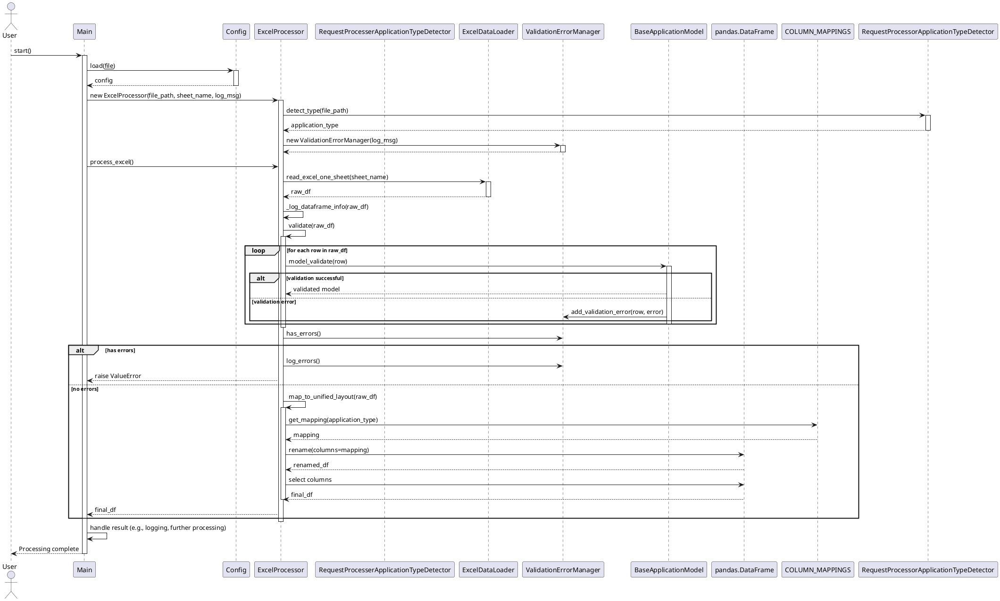

# 一括申請フェーズ実装ガイドライン

```
# 一括申請フェーズ実装ガイドライン
├── 1. 概要
│   ├── 1.1 ガイドラインの目的
│   ├── 1.2 対象読者
│   ├── 1.3 用語定義
│   ├── 1.4 構成概要 
├── 2. システム構成
│   ├── 2.1 全体アーキテクチャ
│   ├── 2.2 主要コンポーネント
│   │   ├── 2.2.1 Main
│   │   ├── 2.2.2 Config
│   │   ├── 2.2.3 ExcelProcessor
│   │   ├── 2.2.4 ValidationErrorManager
│   │   └── 2.2.5 ApplicationModels
│   └── 2.3 データフロー
├── 3. データモデリングとバリデーション
│   ├── 3.1 Pydanticモデル定義
│   ├── 3.2 アプリケーションモデル
│   │   ├── 3.2.1 BaseApplicationModel
│   │   ├── 3.2.2 HumanResourceApplicationModel
│   │   ├── 3.2.3 InternationalApplicationModel
│   │   └── 3.2.4 AffiliateApplicationModel
│   ├── 3.3 フィールドバリデーション
│   └── 3.4 モデルバリデーション
├── 4. Excel処理
│   ├── 4.1 ExcelDataLoader
│   ├── 4.2 アプリケーションタイプ検出
│   └── 4.3 カラムマッピング
└── 5. バリデーションとエラー処理
    ├── 5.1 ValidationErrorManager
    ├── 5.2 エラーの種類と処理
    ├── 5.3 カスタム例外
    └── 5.4 エラーログ記録
```


## 1. 概要

### 1.1 ガイドラインの目的

このガイドラインは、三菱UFJ銀行の一括申請フェーズにおけるソフトウェア開発プロセスを標準化し、高品質かつ保守性の高いコードを生成することを目的としています。

具体的には、以下の目標を達成することを目指しています：

1. データの整合性確保： Pydanticを使用したデータモデリングとバリデーションにより、入力データの正確性と一貫性を保証します。
2. エラー検出の効率化： 厳密なバリデーションルールを適用することで、データの問題を早期に特定し、後続の処理におけるエラーを防ぎます。
3. コードの再利用性向上： チェック部品の設計と実装に関するベストプラクティスを提供し、効率的なコード再利用を促進します。
4. 開発プロセスの標準化： 一貫したアプローチを定義することで、チーム全体の開発効率を向上させ、コードの品質を維持します。
5. メンテナンス性の向上： 明確な構造とドキュメンテーションにより、長期的なコードの保守と拡張を容易にします。

このガイドラインに従うことで、開発チームは一貫性のある高品質なコードを生成し、銀行のデータ処理システムの信頼性と効率性を向上させることができます。

### 1.2 対象読者

このガイドラインは、主に以下の読者を対象としています：

| ロール説明 | 役割 |
|---|---|
| ソフトウェア開発者 | * 一括申請フェーズの実装を担当するプログラマー <br> * Pythonを使用してデータ処理システムを開発するエンジニア <br> * バックエンド開発者 |
| システムアーキテクト | * システム全体の設計を担当する技術リーダー <br> * マイクロサービスアーキテクチャの設計者 |
| プロジェクトマネージャー | * 開発プロジェクトの進行を管理する責任者 <br> * 品質管理を担当するチームリーダー |
| 品質保証（QA）エンジニア | * テスト計画の立案と実行を担当する専門家 <br> * コード品質の監査を行う担当者 |
| 新入社員やジュニア開発者 | * 銀行のシステム開発に初めて携わる開発者 <br> * Pythonやデータ処理の基礎知識を持つ新人エンジニア |
| 保守担当者 | * 既存システムのメンテナンスや拡張を担当するエンジニア <br> * レガシーコードの改善を行う開発者 |

このガイドラインは、読者が基本的なPython知識と、データ処理システムの概念を理解していることを前提としています。ただし、Pydanticやデザインパターンなどの特定の技術については、基本的な説明も含めて記述しています。

### 1.3 用語定義

本ガイドラインで使用される主要な用語と概念を以下に定義します：

| No | 用語 | 説明 |
|---|---|---|
| 1 | 一括申請フェーズ | 複数の部署（人事、国企、関連）から提出されたExcelファイルのデータを一括で処理し、検証する段階 |
| 2 | Pydantic | Pythonのデータバリデーションライブラリ。型ヒントを使用してデータモデルを定義し、自動的にデータの検証を行う |
| 3 | BaseModel | Pydanticの基本クラス。これを継承することでカスタムデータモデルを作成できる |
| 4 | field_validator | Pydanticのデコレータの一つ。個々のフィールドに対するカスタムバリデーションルールを定義するために使用 |
| 5 | model_validator | Pydanticのデコレータの一つ。モデル全体に対するバリデーションルールを定義するために使用 |
| 6 | チェック部品 | データの妥当性を検証するための再利用可能なコンポーネント。関数またはクラスとして実装される |
| 7 | ExcelProcessor | Excelファイルの読み込み、データの前処理、バリデーション、統一レイアウトへのマッピングを行うクラス |
| 8 | ValidationErrorManager | バリデーションエラーを管理し、エラーログを生成するクラス |
| 9 | ApplicationType | 申請タイプを表す列挙型。HUMANRESOURCE（人事）、INTERNATIONAL（国企）、AFFILIATE（関連）の3種類がある |
| 10 | RequestProcesserTypeDetector | ファイル名から申請タイプを自動検出するクラス |
| 11 | 統合レイアウト | 申請部署により異なるレイアウトを統合したレイアウトへマッピングし複雑さを取り除く役割 |
| 12 | COLUMN_MAPPINGS | 各申請タイプに対応する統合レイアウトへのカラムマッピングを定義するクラス |
| 13 | validation_check_mode | Validationエラー検出時に処理継続・停止を制御するフラグ |

これらの用語と概念を理解することで、本ガイドラインの内容をより深く理解し、効果的に適用することができます。不明な点がある場合は、チームリーダーや経験豊富な開発者に質問することをお勧めします。

### 1.4 構成概要 
#### 1.4.1 クラス構成

一括申請フェーズの主要なクラス構成を以下のUML図で示します。

```plantuml

@startuml
package "Main Application" {
    class Main {
        -env: dict
        -common_config: dict
        -package_config: dict
        -log_msg: Callable
        +start(): None
    }

    class Config {
        +{static} load(file_path: str): Config
        +env: dict
        +common_config: dict
        +package_config: dict
        +log_message: Callable
        +validation_check_mode: str
    }
}

package "Excel Processing" {
    class ExcelProcessor {
        -file_path: Path
        -sheet_name: str
        -log_msg: Callable
        -error_manager: ValidationErrorManager
        -application_type: ApplicationType
        -application_model: Type[BaseApplicationModel]
        +process_excel(): pd.DataFrame
        -load_and_preprocess(): pd.DataFrame
        -map_to_unified_layout(df: pd.DataFrame): pd.DataFrame
        -validate(df: pd.DataFrame): None
        -_log_dataframe_info(df: pd.DataFrame): None
    }

    class ExcelDataLoader {
        -file_path: Path
        +__init__(file_path: Path)
        +read_excel_one_sheet(sheet_name: str): pd.DataFrame
    }
}

package "Application Models" {
    abstract class BaseApplicationModel {
        +application_id: str
        +submission_date: datetime
        +{static} model_validate(data: dict[str, Any]): BaseApplicationModel
        +model_dump(): dict[str, Any]
    }

    class HumanResourceApplicationModel {
        +employee_id: str
        +name: str
        +department: str
    }

    class InternationalApplicationModel {
        +project_id: str
        +project_name: str
        +country: str
    }

    class AffiliateApplicationModel {
        +company_id: str
        +company_name: str
        +industry: str
    }
}

package "Type Detection" {
    class RequestProcesserApplicationTypeDetector {
        +{static} TYPE_KEYWORDS: dict[ApplicationType, list[str]]
        +{static} detect_type(file_path: Path): ApplicationType
    }
}

package "Column Mapping" {
    class COLUMN_MAPPINGS {
        +{static} HUMANRESOURCE: dict[str, str]
        +{static} INTERNATIONAL: dict[str, str]
        +{static} AFFILIATE: dict[str, str]
        +{static} get_mapping(application_type: ApplicationType): dict[str, str]
    }
}

package "ErrorManager" {
    class ValidationErrorManager {
        -log_msg: Callable
        -errors: dict[int, list[dict[str, Any]]]
        +add_validation_error(row: int, error: ValidationError): None
        +add_error(row: int, error: dict[str, Any]): None
        +has_errors(): bool
        +get_errors(): dict[int, list[dict[str, Any]]]
        +log_errors(): None
    }
}

package "validator_utils" {
    class FieldValidators {
        +{static} validate_string_length(value: str, min_length: int, max_length: int)
        +{static} validate_date_format(value: str, format: str)
        +{static} validate_numeric_range(value: int, min_value: int, max_value: int)
    }
    note right of FieldValidators
        @field_validators
        def validate...
    end note

    class ModelValidators {
        +{static} validate_date_consistency(start_date: date, end_date: date)
        +{static} validate_unique_constraint(values: list[Any])
    }
    note left of ModelValidators
        @model_validators
        def corr_validate...
    end note
}

enum ApplicationType {
    HUMANRESOURCE
    INTERNATIONAL
    AFFILIATE
}

enum LogLevel {
    INFO
    WARNING
    ERROR
    CRITICAL
}

Main ..> Config
Main ..> ExcelProcessor
ExcelProcessor ..> ExcelDataLoader
ExcelProcessor o-- COLUMN_MAPPINGS
ExcelProcessor o-- ValidationErrorManager
ExcelProcessor o-- RequestProcesserApplicationTypeDetector
ExcelProcessor o-- BaseApplicationModel
BaseApplicationModel <|-- HumanResourceApplicationModel
BaseApplicationModel <|-- InternationalApplicationModel
BaseApplicationModel <|-- AffiliateApplicationModel
HumanResourceApplicationModel ..> FieldValidators
HumanResourceApplicationModel ..> ModelValidators
InternationalApplicationModel ..> FieldValidators
InternationalApplicationModel ..> ModelValidators
AffiliateApplicationModel ..> FieldValidators
AffiliateApplicationModel ..> ModelValidators
ExcelProcessor ..> LogLevel
ValidationErrorManager ..> LogLevel
Config ..> LogLevel
RequestProcesserApplicationTypeDetector ..> ApplicationType
COLUMN_MAPPINGS ..> ApplicationType


@enduml
```



この図は、システムの主要なクラスとその関係を示しています。`Main`クラスがエントリーポイントとなり、`Config`クラスから設定を読み込み、`ExcelProcessor`を使用してExcelファイルの処理を行います。`ExcelProcessor`は`ValidationErrorManager`を使用してエラー処理を行い、適切な`ApplicationModel`を使用してデータのバリデーションを実施します。

#### 1.4.2 シーケンス図

以下のシーケンス図は、一括申請フェーズの主要な処理フローを示しています。



このシーケンス図は、ユーザーが処理を開始してから完了するまでの主要なステップを示しています。主な流れは以下の通りです：

1. ユーザーが処理を開始
1. 設定の読み込み
1. ExcelProcessorの初期化
1. アプリケーションタイプの検出
1. Excelデータの読み込みと前処理
1. データのバリデーション
1. エラーチェックと処理
1. 統一レイアウトへのマッピング
1. 結果の処理と返却

この流れに従って、システムは効率的にデータを処理し、エラーを適切に処理しながら、最終的な結果を生成します。

## 2. システム構成

### 2.1 全体アーキテクチャ

一括申請フェーズのシステムは、モジュール性、保守性、そして拡張性を重視した設計となっています。主要なコンポーネントは以下の通りです：

1. メイン処理部（Main）
1. 設定管理（Config）
1. Excel処理部（ExcelProcessor）
1. バリデーション管理（ValidationErrorManager）
1. アプリケーションモデル（ApplicationModels）

これらのコンポーネントは、以下のような階層構造で構成されています：

```
src/
├── package/
│   └── validator_excel_main_class-1/
│       ├── __main__.py (Main, ExcelProcessor)
│       ├── bulk_application_type_detector.py
│       └── column_mappings.py
├── model/
│   └── dataclass/
│       └── application_models.py
└── lib/
    ├── common_utils/
    │   ├── ibr_enums.py
    │   ├── ibr_excel_reader.py
    │   └── ibr_get_config.py
    └── validator_utils/
        ├── field_validators.py
        ├── model_validators.py
        └── validation_error_manager.py
```

この構造により、共通のユーティリティと特定のパッケージに固有の要素が適切に分離され、コードの再利用性と保守性が向上します。

### 2.2 主要コンポーネント

#### 2.2.1 Main

`Main`クラスは、アプリケーションのエントリーポイントです。主な責務は以下の通りです：

* 設定の読み込み
* ExcelProcessorの初期化と実行
* 全体的なエラーハンドリング
* ログ記録

```python
class Main:
    def __init__(self):
        config = Config.load(__file__)
        self.env = config.env
        self.common_config = config.common_config
        self.package_config = config.package_config
        self.log_msg = config.log_message

    def start(self) -> None:
        self.log_msg("IBRDEV-I-0000001")  # 処理開始ログ
        try:
            excel_file_path = Path(
                f"{self.common_config['input_file_path']['UPDATE_EXCEL_PATH']}/"
                f"{self.package_config['excel_definition']['UPDATE_RECORD_JINJI']}",
            )
            excel_sheet_name = self.package_config['excel_definition']['UPDATE_RECORD_JINJI_SHEET_NAME']

            processor = ExcelProcessor(excel_file_path, excel_sheet_name, self.log_msg)
            result_df = processor.process_excel()

            self.log_msg("Process completed successfully", LogLevel.INFO)
            # 結果の処理やさらなる操作をここに追加

        except ValueError as e:
            self.log_msg(f"Validation error: {str(e)}", LogLevel.ERROR)
        except BusinessLogicError as e:
            self.log_msg(f"Business logic error: {e.message}", LogLevel.ERROR)
        except Exception as e:
            self.log_msg(f"Unexpected error: {str(e)}", LogLevel.CRITICAL)
        finally:
            self.log_msg("IBRDEV-I-0000002")  # 処理終了ログ
```

#### 2.2.2 Config

`Config`クラスは、アプリケーションの設定を管理します。主な責務は以下の通りです：

* 環境設定の読み込み
* 共通設定の管理
* パッケージ固有の設定の管理
* ログメッセージ関数の提供
* Validationチェックモード定義 

```python
class Config:
    @staticmethod
    def load(file_path: str) -> 'Config':
        # 設定ファイルの読み込みロジック
        pass

    def __init__(self, env: dict, common_config: dict, package_config: dict, log_message: Callable):
        self.env = env
        self.common_config = common_config
        self.package_config = package_config
        self.log_message = log_message
        self.validation_check_mode = validation_check_mode
```

#### 2.2.3 ExcelProcessor

`ExcelProcessor`クラスは、Excelファイルの処理を担当します。主な責務は以下の通りです：

* Excelファイルの読み込み
* データの前処理(現時点では不要)
* アプリケーションタイプ(申請部署)の検出
* データのバリデーション
* 統一レイアウトへのマッピング

```python
class ExcelProcessor:
    def __init__(self, file_path: Path, sheet_name: str, log_msg: Callable):
        self.file_path = file_path
        self.sheet_name = sheet_name
        self.excel_loader = ExcelDataLoader(file_path=file_path)
        self.log_msg = log_msg
        self.error_manager = ValidationErrorManager(log_msg)
        self.application_type = RequestProcessorApplicationTypeDetector.detect_type(file_path)
        self.application_model = self._get_application_model()

    def process_excel(self) -> pd.DataFrame:
        df = self.load_and_preprocess()
        self.validate(df)
        if self.error_manager.has_errors():
            self.process_validation_errors()
            raise ValueError("Validation errors occurred. Check the logs for details.")
        return self.map_to_unified_layout(df)

    # その他のメソッド...
```

#### 2.2.4 ValidationErrorManager

`ValidationErrorManager`クラスは、バリデーションエラーの管理を担当します。主な責務は以下の通りです：

* エラーの収集
* エラーの記録
* エラーレポートの生成

```python
class ValidationErrorManager:
    def __init__(self, log_msg: Callable):
        self.log_msg = log_msg
        self.errors: dict[int, list[dict[str, Any]]] = {}

    def add_validation_error(self, row: int, error: ValidationError):
        if row not in self.errors:
            self.errors[row] = []
        self.errors[row].extend([{"loc": ".".join(map(str, e["loc"])), "msg": e["msg"]} for e in error.errors()])

    # その他のメソッド...
```

#### 2.2.5 ApplicationModels

`ApplicationModels`は、各種申請データのモデルを定義します。主な構成は以下の通りです：

* `BaseApplicationModel`: 全ての申請モデルの基底クラス, pydanticのBaseModelを想定
* `HumanResourceApplicationModel`: 人事申請用モデル
* `InternationalApplicationModel`: 国際事業申請用モデル
* `AffiliateApplicationModel`: 関連会社申請用モデル

これらのモデルは、Pydanticを使用して定義され、データの構造とバリデーションルールを明確に示します。

### 2.3 データフロー

一括申請フェーズのデータフローは以下の通りです：

1. ユーザーが処理を開始（`Main.start()`）
2. 設定の読み込み（`Config.load()`）
3. `ExcelProcessor`の初期化
4. アプリケーションタイプの検出（`RequestProcessorApplicationTypeDetector.detect_type()`）
5. Excelデータの読み込みと前処理（`ExcelProcessor.load_and_preprocess()`）
6. データのバリデーション（`ExcelProcessor.validate()`）
   * 各行に対して適切な`ApplicationModel`を使用
   * エラーは`ValidationErrorManager`に記録
7. エラーチェックと処理
   * エラーがある場合は処理を中断し、エラーログを生成
8. 統一レイアウトへのマッピング（`ExcelProcessor.map_to_unified_layout()`）
9. 結果の返却と後続処理

このデータフローにより、入力データは段階的に処理され、エラーは早期に検出されます。また、異なる申請タイプに対しても柔軟に対応できる設計となっています。

## 3. データモデリングとバリデーション

### 3.1 Pydanticモデル定義

Pydanticは、Pythonの型ヒントを使用してデータモデルを定義し、自動的にデータバリデーションを行うライブラリです。一括申請フェーズでは、Pydanticを使用してExcelファイルから読み込んだデータの構造を定義し、バリデーションを行います。

Pydanticの`BaseModel`を継承することで、データモデルを簡単に定義できます：

```python
from pydantic import BaseModel, Field

class ExcelDataModel(BaseModel):
    # フィールドの定義
    pass
```

`BaseModel`を継承することで、以下の利点があります：

* データの自動検証
* データの自動変換（例：文字列から日付への変換）
* JSONシリアライズ/デシリアライズのサポート
* 設定可能なモデルの振る舞い

Pythonの型ヒントとPydanticの`Field`を使用して、各フィールドの型と制約を定義します：

```python
from datetime import date
from pydantic import BaseModel, Field

class EmployeeModel(BaseModel):
    employee_id: str = Field(..., description="従業員ID")
    name: str = Field(..., min_length=1, max_length=100)
    age: int = Field(..., ge=18, le=65)
    join_date: date = Field(...)
    is_manager: bool = Field(default=False)
```

`Field`の主な引数：

* `...`: 必須フィールドを示す
* `default`: デフォルト値の設定
* `description`: フィールドの説明
* `min_length`, `max_length`: 文字列の長さ制約
* `ge`, `le`: 数値の範囲制約（以上、以下）

### 3.2 アプリケーションモデル

#### 3.2.1 BaseApplicationModel

`BaseApplicationModel`は、全ての申請モデルの基底クラスとなります。共通のフィールドとバリデーションルールを定義します。

```python
from datetime import datetime
from pydantic import BaseModel, Field, field_validator, model_validator

class BaseApplicationModel(BaseModel):
    application_id: str = Field(..., description="申請ID")
    submission_date: datetime = Field(..., description="提出日")

    @field_validator('application_id')
    @classmethod
    def validate_application_id(cls, v):
        if not v.startswith('APP'):
            raise ValueError('申請IDは"APP"で始まる必要があります')
        return v

    @field_validator('submission_date')
    @classmethod
    def validate_submission_date(cls, v):
        if v > datetime.now():
            raise ValueError('提出日は未来の日付であってはいけません')
        return v

    @model_validator(mode='after')
    def validate_model(self):
        # モデル全体のバリデーション
        return self
```

#### 3.2.2 HumanResourceApplicationModel

人事申請用のモデルです。`BaseApplicationModel`を継承し、人事申請特有のフィールドとバリデーションルールを追加します。

.TODO(suzuki)
- レイアウトの具体化を反映する

```python
class HumanResourceApplicationModel(BaseApplicationModel):
    employee_id: str = Field(..., description="従業員ID")
    name: str = Field(..., min_length=1, max_length=100)
    department: str = Field(...)

    @field_validator('employee_id')
    @classmethod
    def validate_employee_id(cls, v):
        # 人事申請特有のバリデーション
        return v

    @model_validator(mode='after')
    def validate_hr_model(self):
        # 人事申請特有のバリデーション
        return self
```

#### 3.2.3 InternationalApplicationModel

国際事業申請用のモデルです。`BaseApplicationModel`を継承し、国際事業申請特有のフィールドとバリデーションルールを追加します。

```python
class InternationalApplicationModel(BaseApplicationModel):
    project_id: str = Field(..., description="プロジェクトID")
    project_name: str = Field(..., min_length=1, max_length=200)
    country: str = Field(...)

    @field_validator('project_id')
    @classmethod
    def validate_project_id(cls, v):
        # 国企特有のバリデーション
        return v

    @model_validator(mode='after')
    def validate_international_model(self):
        # 国企特有のバリデーション
        return self
```

#### 3.2.4 AffiliateApplicationModel

関連会社申請用のモデルです。`BaseApplicationModel`を継承し、関連会社申請特有のフィールドとバリデーションルールを追加します。

```python
class AffiliateApplicationModel(BaseApplicationModel):
    company_id: str = Field(..., description="会社ID")
    company_name: str = Field(..., min_length=1, max_length=200)
    industry: str = Field(...)

    @field_validator('company_id')
    @classmethod
    def validate_company_id(cls, v):
        # 関連申請特有のバリデーション
        return v

    @model_validator(mode='after')
    def validate_affiliate_model(self):
        # 関連申請特有のバリデーション
        return self
```

### 3.3 フィールドバリデーション

フィールドバリデーションは、個々のフィールドに対するバリデーションルールを定義します。`field_validator`デコレータを使用して実装します。

```python
from pydantic import field_validator

class EmployeeModel(BaseModel):
    employee_id: str

    @field_validator('employee_id')
    @classmethod
    def validate_employee_id(cls, v):
        # 実装ではlibエリアにvalidate関数を定義し呼び出して使用する
        if not v.startswith('EMP'):
            raise ValueError('従業員IDは"EMP"で始まる必要があります')
        if len(v) != 10:
            raise ValueError('従業員IDは10文字である必要があります')
        return v
```

### 3.4 モデルバリデーション

モデルバリデーションは、複数のフィールド間の関係や、モデル全体に対するバリデーションルールを定義します。`model_validator`デコレータを使用して実装します。

```python
from pydantic import model_validator

class SalaryModel(BaseModel):
    base_salary: float
    bonus: float
    total_compensation: float

    @model_validator(mode='after')
    def check_total_compensation(self):
        # 実装ではlibエリアにvalidate関数を定義し呼び出して使用する
        if self.total_compensation != self.base_salary + self.bonus:
            raise ValueError('総報酬額は基本給とボーナスの合計と一致する必要があります')
        return self
```

これらのバリデーション手法を適切に組み合わせることで、データの整合性を確保し、エラーを早期に検出することができます。また、ビジネスロジックに基づいた複雑なバリデーションルールも実装可能です。

## 4. Excel処理

### 4.1 ExcelDataLoader

`ExcelDataLoader`クラスは、Excelファイルの読み込みを担当します。pandas ライブラリを使用して、指定されたシートのデータをDataFrameとして読み込みます。

```python
import pandas as pd
from pathlib import Path

class ExcelDataLoader:
    def __init__(self, file_path: Path):
        self.file_path = file_path

    def read_excel_one_sheet(self, sheet_name: str) -> pd.DataFrame:
        try:
            df = pd.read_excel(self.file_path, sheet_name=sheet_name)
            return df
        except Exception as e:
            raise ValueError(f"Excelファイルの読み込み中にエラーが発生しました: {str(e)}")
```

使用例：

```python
loader = ExcelDataLoader(Path("path/to/your/excel_file.xlsx"))
df = loader.read_excel_one_sheet("Sheet1")
```

### 4.2 アプリケーションタイプ検出

`RequestProcessorApplicationTypeDetector`クラスは、ファイル名からアプリケーションタイプを自動検出します。これにより、異なる種類の申請を柔軟に処理することができます。

```python
from enum import Enum
from pathlib import Path

class ApplicationType(Enum):
    HUMANRESORCE = "人事"
    INTERNATIONAL = "国企"
    AFFILIATE = "関連"

class RequestProcessorApplicationTypeDetector:
    TYPE_KEYWORDS = {
        ApplicationType.HUMANRESOURCE: ["人事"],
        ApplicationType.INTERNATIONAL: ["国企"],
        ApplicationType.AFFILIATE: ["関連"]
    }

    @classmethod
    def detect_type(cls, file_path: Path) -> ApplicationType:
        file_name = file_path.name.lower()
        for app_type, keywords in cls.TYPE_KEYWORDS.items():
            if any(keyword in file_name for keyword in keywords):
                return app_type
        raise ValueError(f"ファイルパスから申請タイプを特定できません: {str(file_path)}")
```

使用例：

```python
file_path = Path("./人事/申請_2023.xlsx")
app_type = RequestProcessorApplicationTypeDetector.detect_type(file_path)
print(app_type)  # ApplicationType.HUMANRESOURCE
```

### 4.3 カラムマッピング
.TODO(suzuki)
- マッピング定義確定後に具体化する
- 少々複雑なマッピングになる見通し,レイアウト組み換えや一律ブランク行追加等
- 日本語名Column -> 英語名Columnに変更もこのタイミングで実施

`COLUMN_MAPPINGS`クラスは、各申請タイプに対応するカラムマッピングを定義します。これにより、異なるExcelレイアウトを統一されたデータ構造にマッピングすることができます。

```python
class COLUMN_MAPPINGS:
    HUMANRESOURCE = {
        '申請ID': 'application_id',
        '提出日': 'submission_date',
        '従業員ID': 'employee_id',
        '氏名': 'name',
        '部署': 'department'
    }
    INTERNATIONAL = {
        '申請ID': 'application_id',
        '提出日': 'submission_date',
        'プロジェクトID': 'project_id',
        'プロジェクト名': 'project_name',
        '国': 'country'
    }
    AFFILIATE = {
        '申請ID': 'application_id',
        '提出日': 'submission_date',
        '会社ID': 'company_id',
        '会社名': 'company_name',
        '業種': 'industry'
    }

    @classmethod
    def get_mapping(cls, application_type: ApplicationType) -> dict[str, str]:
        return getattr(cls, application_type.name)
```

使用例：

```python
mapping = COLUMN_MAPPINGS.get_mapping(ApplicationType.HR)
df_renamed = df.rename(columns=mapping)
```

これらのコンポーネントを組み合わせることで、`ExcelProcessor`クラスは以下のような流れでExcelデータを処理します：

1. `ExcelDataLoader`を使用してExcelファイルを読み込む
2. `RequestProcessorApplicationTypeDetector`を使用してアプリケーションタイプを検出する
3. 検出されたタイプに基づいて適切な`ApplicationModel`を選択する
4. `COLUMN_MAPPINGS`を使用してカラムを統一レイアウトにマッピングする
5. マッピングされたデータに対してバリデーションを実行する

この方法により、異なる種類の申請データを柔軟かつ効率的に処理することができます。

## 5. バリデーションとエラー処理

### 5.1 ValidationErrorManager

`ValidationErrorManager`クラスは、バリデーション過程で発生したエラーを管理し、適切にログ記録を行います。このクラスは、エラーの収集、整理、およびレポート生成を担当します。

```python
from typing import Any, Callable
from pydantic import ValidationError
from src.lib.common_utils.ibr_enums import LogLevel

class ValidationErrorManager:
    def __init__(self, log_msg: Callable):
        self.errors: dict[int, list[dict[str, Any]]] = {}
        self.log_msg = log_msg

    def add_validation_error(self, row: int, error: ValidationError) -> None:
        """ValidationErrorをエラーリストに追加する"""
        if row not in self.errors:
            self.errors[row] = []
        self.errors[row].extend([
            {"loc": ".".join(map(str, e["loc"])), "msg": e["msg"]}
            for e in error.errors()
        ])

    def add_error(self, row: int, error: dict[str, Any]) -> None:
        """一般的なエラーをエラーリストに追加する"""
        if row not in self.errors:
            self.errors[row] = []
        self.errors[row].append(error)

    def has_errors(self) -> bool:
        """エラーがあるかどうかを返す"""
        return len(self.errors) > 0

    def get_errors(self) -> dict[int, list[dict[str, Any]]]:
        """全エラーを取得する"""
        return self.errors

    def log_errors(self) -> None:
        """エラーをログに出力する"""
        if self.has_errors():
            for row, errors in self.errors.items():
                for error in errors:
                    self.log_msg(f"Validation error at row {row}: {error}", LogLevel.WARNING)
        else:
            self.log_msg("No validation errors found", LogLevel.INFO)

    def clear_errors(self) -> None:
        """エラーリストをクリアする"""
        self.errors.clear()
```

### 5.2 エラーの種類と処理

一括申請フェーズで扱う主なエラーの種類と処理方法は以下の通りです：

1. ValidationError (Pydantic):
   * データモデルのバリデーション失敗時に発生
   * 処理: エラーメッセージをログに記録し、`ValidationErrorManager`に追加
2. ValueError:
   * 不正な値が渡された場合に発生
   * 処理: エラーメッセージをログに記録し、適切なエラーレスポンスを返す
3. BusinessLogicError (カスタム例外):
   * ビジネスロジックに違反する操作が行われた場合に発生
   * 処理: エラーの詳細をログに記録し、適切なエラーレスポンスを返す
4. IOError:
   * ファイル操作やネットワーク通信時のエラーで発生
   * 処理: エラーの詳細をログに記録し、必要に応じて再試行またはエラーレスポンスを返す

例外処理の基本的な構造:

```python
try:
    # 処理ロジック
except ValidationError as e:
    error_manager.add_validation_error(row_index, e)
    logger.error(f"バリデーションエラー: {e}")
except ValueError as e:
    error_manager.add_error(row_index, {"type": "value_error", "msg": str(e)})
    logger.error(f"不正な値: {e}")
except BusinessLogicError as e:
    error_manager.add_error(row_index, {"type": "business_logic_error", "msg": str(e)})
    logger.error(f"ビジネスロジックエラー: {e}")
except IOError as e:
    logger.error(f"IO エラー: {e}")
    raise
except Exception as e:
    logger.critical(f"予期せぬエラー: {e}")
    raise
```

### 5.3 カスタム例外

ビジネスロジックに特化したカスタム例外を設計することで、エラーの種類をより明確に区別し、適切に処理することができます。

```python
class BusinessLogicError(Exception):
    """ビジネスロジックに関連する基本的な例外クラス"""
    def __init__(self, message: str, error_code: str):
        self.message = message
        self.error_code = error_code
        super().__init__(self.message)

class InvalidEmployeeIdError(BusinessLogicError):
    """従業員IDが無効な場合の例外"""
    def __init__(self, employee_id: str):
        super().__init__(f"無効な従業員ID: {employee_id}", "HR001")

class DuplicateApplicationError(BusinessLogicError):
    """申請が重複している場合の例外"""
    def __init__(self, application_id: str):
        super().__init__(f"申請が重複しています: {application_id}", "APP001")

class InsufficientBudgetError(BusinessLogicError):
    """予算が不足している場合の例外"""
    def __init__(self, required: float, available: float):
        super().__init__(f"予算が不足しています。必要: {required}, 利用可能: {available}", "FIN001")
```

これらのカスタム例外を使用することで、エラーの種類と原因をより明確に示すことができます。

### 5.4 エラーログ記録

エラーログの記録は、`ValidationErrorManager`クラスを通じて行われます。このクラスは、エラーの収集、管理、およびログ記録を一元的に処理します。

```python
from typing import Any, Callable
from pydantic import ValidationError
from src.lib.common_utils.ibr_enums import LogLevel

class ValidationErrorManager:
    def __init__(self, log_msg: Callable):
        self.errors: dict[int, list[dict[str, Any]]] = {}
        self.log_msg = log_msg

    def add_validation_error(self, row: int, error: ValidationError) -> None:
        """ValidationErrorをエラーリストに追加し、ログに記録する"""
        if row not in self.errors:
            self.errors[row] = []
        error_details = [{"loc": ".".join(map(str, e["loc"])), "msg": e["msg"]} for e in error.errors()]
        self.errors[row].extend(error_details)
        self.log_msg(f"Validation error at row {row}: {error_details}", LogLevel.WARNING)

    def add_error(self, row: int, error: dict[str, Any]) -> None:
        """一般的なエラーをエラーリストに追加し、ログに記録する"""
        if row not in self.errors:
            self.errors[row] = []
        self.errors[row].append(error)
        self.log_msg(f"Error at row {row}: {error}", LogLevel.ERROR)

    def log_errors(self) -> None:
        """全てのエラーをまとめてログに出力する"""
        if self.has_errors():
            for row, errors in self.errors.items():
                for error in errors:
                    self.log_msg(f"Error summary - Row {row}: {error}", LogLevel.ERROR)
        else:
            self.log_msg("No errors found during validation", LogLevel.INFO)
```

このクラスを使用することで、以下のようなエラーログ記録の方針を実現できます：

1. エラーの即時記録：
   * `add_validation_error`や`add_error`メソッドが呼び出されるたびに、即座にログが記録されます。
   * これにより、エラーの発生をリアルタイムで追跡できます。
2. エラーの集約：
   * 全てのエラーは`errors`ディクショナリに保存され、行番号ごとに整理されます。
   * `log_errors`メソッドを使用することで、全てのエラーをまとめて出力することができます。
3. ログレベルの適切な使用：
   * バリデーションエラーは`WARNING`レベルで記録されます。
   * その他のエラーは`ERROR`レベルで記録されます。
   * エラーが見つからない場合は`INFO`レベルでログが記録されます。
4. コンテキスト情報の含有：
   * 各エラーログには、関連する行番号が含まれます。
   * ValidationErrorの場合、エラーの詳細な位置情報（loc）とメッセージが記録されます。
5. 柔軟性：
   * `log_msg`コールバック関数を使用することで、プロジェクトの要件に応じたログ記録方法を柔軟に実装できます。

使用例：

```python
def log_message(message: str, level: LogLevel):
    # プロジェクトの要件に応じたログ記録の実装
    print(f"{level.name}: {message}")

error_manager = ValidationErrorManager(log_message)

# バリデーションエラーの記録
try:
    # バリデーション処理
    pass
except ValidationError as e:
    error_manager.add_validation_error(1, e)

# 一般的なエラーの記録
error_manager.add_error(2, {"type": "business_logic_error", "msg": "Budget exceeded"})

# すべてのエラーのサマリーを出力
error_manager.log_errors()
```

この方法により、エラーの詳細な情報を保持しつつ、適切なタイミングでログに記録することができます。また、エラーの集約や後処理も容易に行うことができ、システムの問題分析や改善に役立てることができます。


## 総評:
このガイドラインは、三菱UFJ銀行の一括申請フェーズにおけるソフトウェア開発プロセスを包括的に説明しており、高品質で保守性の高いコードを生成するための優れた基準となっています。以下に総評をまとめます：

- 総じて、このガイドラインは一括申請フェーズの開発に関わる全ての開発者にとって、貴重な参考資料となるでしょう。システムの全体像から具体的な実装詳細まで、幅広くカバーされており、高品質なソフトウェア開発を促進する優れたドキュメントとなっています。
- ただし、実際の開発過程で新たな要件や課題が生じた場合には、このガイドラインを適宜更新し、常に最新の開発プラクティスを反映させていくことが重要です。また、チーム内でのレビューや討議を通じて、さらに改善を加えていくことをお勧めします。

### 構造と明確性:

目次が論理的に構成され、各セクションの内容が明確に定義されています。
クラス構成やシーケンス図を用いて、システムの全体像を視覚的に表現しており、理解を促進しています。


### 技術的深度:

Pydanticを用いたデータモデリングやバリデーションの説明が詳細で、実装例も充実しています。
ExcelデータのLoading、アプリケーションタイプの検出、カラムマッピングなど、具体的な処理フローが明確に説明されています。


### エラー処理とログ記録:

ValidationErrorManagerの実装と使用方法が詳細に説明されており、エラー処理の重要性が強調されています。
カスタム例外の設計と使用方法も明確に示されています。


### コード例:

各セクションで適切なコード例が提供されており、実装の指針となっています。
型ヒントの使用やPythonの最新機能の活用が見られ、モダンなPython開発の良い例となっています。


### 拡張性と保守性:

異なる申請タイプに対応できる柔軟な設計が示されており、将来の拡張性を考慮しています。
コンポーネントの責務が明確に分離されており、保守性の高い設計となっています。


### ベストプラクティス:

Pydanticの活用、型安全性の確保、エラー処理の重要性など、Python開発のベストプラクティスが随所に盛り込まれています。


### 対象読者への配慮:

様々な役割の読者を想定し、それぞれに適した情報が提供されています。
用語定義のセクションが充実しており、新人開発者にも理解しやすい構成となっています。
