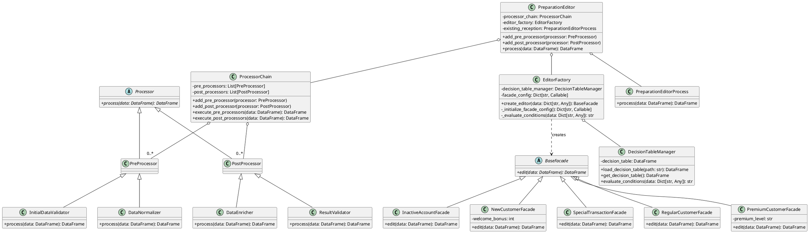
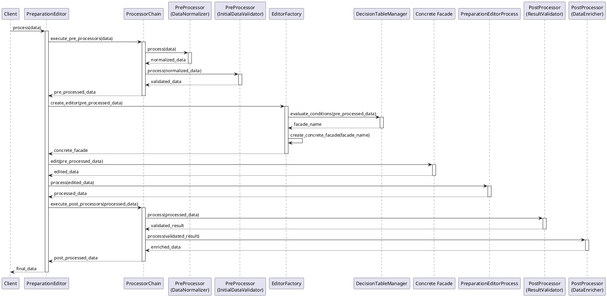

# 受付フェーズ開発ガイドライン

```
├── 1. 概要
│   ├── 1.1 ガイドラインの目的
│   ├── 1.2 対象読者
│   └── 1.3 用語定義
│   └── 1.4 構成概要
├── 2. ディシジョンテーブルの設計と管理
│   ├── 2.1 Excelファイルによるディシジョンテーブル管理
│   ├── 2.2 ディシジョンテーブルの構造
│   ├── 2.3 条件判定関数の設計と実装
│   └── 2.4 ディシジョンテーブルの保守と更新プロセス
├── 3. Factoryパターンとディシジョンテーブルの連携
│   ├── 3.1 EditorFactoryの設計
│   ├── 3.2 Excelファイルからのディシジョンテーブル読み込み
│   ├── 3.3 条件評価ロジックの実装
│   ├── 3.4 Facade名称の取得と解決
│   └── 3.5 動的生成されたFacadeの管理と使用
├── 4. Facadeパターンの活用
│   ├── 4.1 Facadeクラスの基本構造
│   ├── 4.2 データ編集定義の実装
│   └── 4.3 複数Facadeの管理と選択
├── 5. データ編集部品の設計と実装
│   ├── 5.1 編集部品の基本インターフェース
│   ├── 5.2 単独編集部品の実装
│   ├── 5.3 テーブル参照編集部品の実装
│   └── 5.4 部品の組み合わせと再利用
├── 6. 前処理・後処理フレームワークの設計と実装
│   ├── 6.1 プロセッサの基本インターフェース
│   ├── 6.2 前処理（PreProcessor）の設計と実装
│   ├── 6.3 後処理（PostProcessor）の設計と実装
│   ├── 6.4 ProcessorChainの設計と実装
│   └── 6.5 PreparationEditorProcessへの統合
├── 7. 例外処理とエラーハンドリング
│   ├── 7.1 例外の種類と発生箇所
│   ├── 7.2 Facadeレベルでの例外処理
│   └── 7.3 グローバルエラーハンドリング
├── 8. テストと品質保証
│   ├── 8.1 ユニットテスト戦略
│   ├── 8.2 統合テスト手法
│   └── 8.3 前処理・後処理のテスト方法
└── 9. 付録
    ├── 9.1 サンプルコード
    ├── 9.2 ベストプラクティス集
    └── 9.3 FAQ
```

# 1. 概要

## 1.1 ガイドラインの目的

本ガイドラインは、三菱UFJ銀行の受付フェーズにおけるソフトウェア開発プロセスを標準化し、高品質かつ保守性の高いコードを生成することを目的としています。特に、ディシジョンテーブルを用いたFactoryパターンとFacadeパターン、そして新たに導入する前処理・後処理フレームワークの実装に焦点を当て、効率的なデータ処理と柔軟なシステム設計を実現することを目指します。

具体的には、以下の目標を達成することを目指しています：

1. ディシジョンテーブルの効果的な設計と管理方法の確立
2. Factoryパターンとディシジョンテーブルの連携による動的なオブジェクト生成の実現
3. Facadeパターンを活用した複雑なデータ処理ロジックの整理と再利用性の向上
4. 前処理・後処理フレームワークによる柔軟な処理フローの実現
5. 堅牢なエラーハンドリングと例外処理の実装
6. 保守性と拡張性の高いコード設計の促進

このガイドラインに従うことで、開発チームは一貫性のある高品質なコードを生成し、銀行のデータ処理システムの信頼性と効率性を向上させることができます。

## 1.2 対象読者

このガイドラインは、主に以下の読者を対象としています：

| ロール | 具体的な役割 | スキル・経験 |
|---|---|---|
| ソフトウェア開発者 | 受付フェーズの実装を担当するプログラマー |  |
|  | Pythonを使用してデータ処理システムを開発するエンジニア | Python, データ処理 |
|  | FactoryパターンやFacadeパターン、前処理・後処理フレームワークの実装に携わる開発者 | デザインパターン、フレームワーク開発 |
| システムアーキテクト | システム全体の設計を担当する技術リーダー |  |
|  | ディシジョンテーブルを活用したシステム設計者 | ディシジョンテーブル |
| プロジェクトマネージャー | 開発プロジェクトの進行を管理する責任者 | プロジェクト管理 |
|  | 品質管理を担当するチームリーダー | 品質管理 |
| 品質保証（QA）エンジニア | テスト計画の立案と実行を担当する専門家 | テスト計画、テスト実行 |
|  | コード品質の監査を行う担当者 | コードレビュー |
| 新入社員やジュニア開発者 | 銀行のシステム開発に初めて携わる開発者 | 銀行システム開発 |
|  | デザインパターンやExcelを用いたデータ処理の基礎知識を持つ新人エンジニア | デザインパターン、Excel |
| 保守担当者 | 既存システムのメンテナンスや拡張を担当するエンジニア |  |
|  | ディシジョンテーブルの更新や管理を行う担当者 | ディシジョンテーブル管理 |
このガイドラインは、読者が基本的なPython知識と、デザインパターンの基本概念を理解していることを前提としています。

## 1.3 用語定義

本ガイドラインで使用される主要な用語と概念を以下に定義します：

| 要素 | 説明 |
|---|---|
| **受付フェーズ** | データの検証、加工、振り分けを行う処理段階。ディシジョンテーブルに基づいて適切なFacadeを選択し、データを処理する。 |
| **ディシジョンテーブル** | Excelファイルで管理される、条件とそれに対応するアクション（この場合はFacade）を定義したテーブル。 |
| **Factoryパターン** | オブジェクトの生成ロジックをカプセル化するデザインパターン。本システムではEditorFactoryがこの役割を担う。 |
| **EditorFactory** | ディシジョンテーブルに基づいて適切なFacadeオブジェクトを生成するクラス。 |
| **Facadeパターン** | 複雑なサブシステムに対する簡素化されたインターフェースを提供するデザインパターン。データ処理ロジックをカプセル化する。 |
| **Facade** | データ処理ロジックをカプセル化するクラス。ディシジョンテーブルに基づいて選択される。 |
| **条件判定関数** | ディシジョンテーブルの各セルに記述される、データの条件を評価する関数。 |
| **前処理（PreProcessor）** | メインの処理の前に実行される処理。データの正規化や初期チェックなどを行う。 |
| **後処理（PostProcessor）** | メインの処理の後に実行される処理。結果の検証や追加の加工などを行う。 |
| **ProcessorChain** | 前処理と後処理を管理し、順序付けて実行するクラス。 |
| **データ編集部品** | 特定のデータ編集タスクを実行する再利用可能なコンポーネント。 |
|  | - **単独編集部品**： 単一のデータ項目を編集する部品。 |
|  | - **テーブル参照編集部品**： テーブルを参照してデータ編集を行う部品。 |
| **例外処理** | プログラム実行中に発生する異常事態を扱うメカニズム。本システムではFacadeレベルとグローバルレベルで実装。 | 

これらの用語と概念を理解することで、本ガイドラインの内容をより深く理解し、効果的に適用することができます。

## 1.4 構成概要
### 1.4.1 クラス図


この全体的なクラス図は以下の要素を含んでいます：

1. 基本的な構造（Processor, ProcessorChain, BaseFacade）
2. 具体的なFacadeクラス（RegularCustomerFacade, PremiumCustomerFacade, etc.）
3. EditorFactoryとDecisionTableManager
4. PreparationEditorProcessとProcessChainの統合
5. 具体的な前処理・後処理クラス（DataNormalizer, InitialDataValidator, ResultValidator, DataEnricher）

この図は、フレームワークの全体的な構造と各コンポーネント間の関係を示しています。これにより、開発者はシステムの全体像を理解し、新しいコンポーネントをどこに追加すべきか、また既存のコンポーネントをどのように拡張または修正すべきかを容易に判断できるようになります。


### 1.4.2 シーケンス図


この図は、データがシステムを通過する際の全体的な流れを示しており、各コンポーネントの役割と相互作用を明確に表現しています。これにより、開発者はシステムの動作を理解し、新しい機能を追加する際や既存の機能を修正する際の指針として活用できます。


# 2. ディシジョンテーブルの設計と管理

## 2.1 Excelファイルによるディシジョンテーブル管理

ディシジョンテーブルはExcelファイルで管理され、条件とそれに対応するFacadeを定義します。この方法には以下の利点があります：

1. 非技術者でも理解・編集しやすい
2. バージョン管理が容易
3. 他のツールとの連携が可能

### ベストプラクティス：

* ファイル名は固定とする、gitlabでバージョン管理しTag付与とする
* 定期的にバックアップを作成する
* 変更履歴を記録するシートを設ける

## 2.2 ディシジョンテーブルの構造

ディシジョンテーブルは、以下のような構造を持ちます：

1. Facade名称（1列目）:
   * 使用するFacadeクラスの名前を指定します。
   * この名前は、`EditorFactory`で定義されているキーと一致する必要があります。
2. 条件カラム（2列目以降）:
   * 各カラムは、入力データの特定のフィールドに対応します。
   * セルの内容は、そのフィールドに適用される条件判定関数の名前です。
   * "Any"は、そのフィールドの値が条件判定に影響しないことを示します。

例：

Facade名称    | 顧客ID       | 口座状態      | 残高         | 取引種別
--------------|-------------|--------------|-------------|----------------
RegularCustomerFacade | is_valid_customer_id | is_active_account | Any | is_regular_transaction
PremiumCustomerFacade | is_valid_customer_id | is_active_account | is_high_balance | Any

## 2.3 条件判定関数の設計と実装

条件判定関数は、以下のガイドラインに従って実装します：

1. 単一責任の原則を守る
2. ブール値を返す
3. 副作用を持たない純粋関数とする
4. 性能を考慮し、複雑な処理は避ける

条件判定関数は `src/lib/validator_utils/decision_functions.py` に配置し、既存の validator_util の機能と統合します。

例：

```python
# src/lib/validator_utils/decision_functions.py

import re
from decimal import Decimal
from .common_validators import is_valid_string, is_valid_decimal

def is_valid_customer_id(value: str) -> bool:
    return is_valid_string(value) and bool(re.match(r'^C\d{6}$', value))

def is_active_account(value: bool) -> bool:
    return value is True

def is_high_balance(value: Decimal) -> bool:
    return is_valid_decimal(value) and value >= Decimal('1000000')

def is_regular_transaction(value: str) -> bool:
    return is_valid_string(value) and value in ['DEPOSIT', 'WITHDRAWAL', 'TRANSFER']
```

## 2.4 ディシジョンテーブルの保守と更新プロセス

1. 変更提案：
   * 担当者が変更内容を提案
   * 変更理由と影響範囲を文書化
2. レビュー：
   * 技術チームと業務チームによるレビュー
   * 整合性と影響の確認
3. テスト：
   * 変更をテスト環境に適用
   * 単体テストと統合テストの実施
4. 承認：
   * レビューとテスト結果に基づく承認
5. 適用：
   * 本番環境への変更適用
   * 変更ログの記録
6. モニタリング：
   * 変更後のシステム動作を監視
   * 問題が発生した場合は迅速に対応

このプロセスにより、ディシジョンテーブルの一貫性と信頼性を維持しつつ、必要に応じて柔軟に更新することができます。

# 3. Factoryパターンとディシジョンテーブルの連携

## 3.1 EditorFactoryの設計

EditorFactoryは、ディシジョンテーブルに基づいて適切なFacadeオブジェクトを生成する責任を持ちます。以下に、EditorFactoryの実装を示します：

```python
from typing import Dict, Any, Callable
import pandas as pd
import logging
from src.lib.validator_utils.decision_functions import *

class EditorFactory:
    def __init__(self, decision_table_path: str):
        self.decision_table = self._load_decision_table(decision_table_path)
        self.facade_config = self._initialize_facade_config()

    def _load_decision_table(self, path: str) -> pd.DataFrame:
        try:
            return pd.read_excel(path)
        except FileNotFoundError:
            logging.error(f"ディシジョンテーブルファイルが見つかりません: {path}")
            raise
        except Exception as e:
            logging.error(f"ディシジョンテーブルの読み込みに失敗しました: {str(e)}")
            raise

    def _initialize_facade_config(self) -> Dict[str, Callable]:
        return {
            'RegularCustomerFacade': lambda: RegularCustomerFacade(),
            'PremiumCustomerFacade': lambda: PremiumCustomerFacade(premium_level="gold"),
            'InactiveAccountFacade': lambda: InactiveAccountFacade(),
            'NewCustomerFacade': lambda: NewCustomerFacade(welcome_bonus=1000),
            'SpecialTransactionFacade': lambda: SpecialTransactionFacade(),
        }

    def create_editor(self, data: Dict[str, Any]):
        facade_name = self._evaluate_conditions(data)
        return self.facade_config[facade_name]()

    def _evaluate_conditions(self, data: Dict[str, Any]) -> str:
        for _, row in self.decision_table.iterrows():
            if self._check_conditions(data, row):
                return row['Facade名称']
        raise ValueError("適切なFacadeが見つかりません")

    def _check_conditions(self, data: Dict[str, Any], conditions: pd.Series) -> bool:
        for column, condition in conditions.items():
            if column == 'Facade名称':
                continue
            if condition == 'Any':
                continue
            if not self._evaluate_condition(data.get(column), condition):
                return False
        return True

    def _evaluate_condition(self, value: Any, condition: str) -> bool:
        if ',' in condition:
            return all(globals()[cond](value) for cond in condition.split(','))
        elif '|' in condition:
            return any(globals()[cond](value) for cond in condition.split('|'))
        else:
            return globals()[condition](value)
```

## 3.2 Excelファイルからのディシジョンテーブル読み込み

`_load_decision_table`メソッドでExcelファイルを読み込みます：

```python
def _load_decision_table(self, path: str) -> pd.DataFrame:
    try:
        return pd.read_excel(path)
    except FileNotFoundError:
        logging.error(f"ディシジョンテーブルファイルが見つかりません: {path}")
        raise
    except Exception as e:
        logging.error(f"ディシジョンテーブルの読み込みに失敗しました: {str(e)}")
        raise
```

## 3.3 条件評価ロジックの実装

条件評価は`_evaluate_conditions`メソッドで行います：

```python
def _evaluate_conditions(self, data: Dict[str, Any]) -> str:
    for _, row in self.decision_table.iterrows():
        if self._check_conditions(data, row):
            return row['Facade名称']
    raise ValueError("適切なFacadeが見つかりません")
```

`_check_conditions`メソッドでは、各カラムの条件を評価します：

```python
def _check_conditions(self, data: Dict[str, Any], conditions: pd.Series) -> bool:
    for column, condition in conditions.items():
        if column == 'Facade名称':
            continue
        if condition == 'Any':
            continue
        if not self._evaluate_condition(data.get(column), condition):
            return False
    return True
```

## 3.4 Facade名称の取得と解決

### 3.4.1 ディシジョンテーブル分析によるFacade名称の取得

Facade名称は、条件評価の結果として`_evaluate_conditions`メソッドから返されます。

### 3.4.2 Facadeクラスの動的解決と生成

`create_editor`メソッドでは、`facade_config`ディクショナリを使用してFacadeオブジェクトを生成します：

```python
def create_editor(self, data: Dict[str, Any]):
    facade_name = self._evaluate_conditions(data)
    return self.facade_config[facade_name]()
```

## 3.5 動的生成されたFacadeの管理と使用

動的に生成されたFacadeオブジェクトは、以下のように使用できます：

```python
factory = EditorFactory("path/to/decision_table.xlsx")

# RegularCustomerFacadeの場合
data1 = {"顧客ID": "C123456", "口座状態": True, "残高": Decimal("2000000"), "取引種別": "DEPOSIT"}
editor1 = factory.create_editor(data1)
edited_data1 = editor1.edit(data1)

# PremiumCustomerFacadeの場合
data2 = {"顧客ID": "C789012", "口座状態": True, "残高": Decimal("5000000"), "取引種別": "INVESTMENT"}
editor2 = factory.create_editor(data2)
edited_data2 = editor2.edit(data2)
```

Facadeの管理については、以下の点に注意してください：

1. 生成されたFacadeオブジェクトは使い捨てとし、長期間保持しないようにします。
2. 必要に応じて、Facadeオブジェクトのキャッシュを実装して、パフォーマンスを向上させることができます。
3. Facadeクラスの追加や変更時は、ディシジョンテーブルと`_initialize_facade_config`メソッドの両方を更新する必要があります。

以上が、Factoryパターンとディシジョンテーブルがどのように連携してFacadeオブジェクトを動的に生成するかの説明です。

# 4. Facadeパターンの活用

## 4.1 Facadeクラスの基本構造

Facadeパターンは、複雑なサブシステムに対してシンプルなインターフェースを提供します。受付フェーズでは、各Facadeクラスがデータ編集ロジックをカプセル化します。

基本的なFacadeクラスの構造は以下のようになります：

```python
import pandas as pd

class BaseFacade:
    def edit(self, data: pd.DataFrame) -> pd.DataFrame:
        raise NotImplementedError("Subclasses must implement edit method")

class RegularCustomerFacade(BaseFacade):
    def edit(self, data: pd.DataFrame) -> pd.DataFrame:
        # RegularCustomer向けの編集ロジック
        return self._process_regular_customer(data)

    def _process_regular_customer(self, data: pd.DataFrame) -> pd.DataFrame:
        # 具体的な処理ロジック（ベクトル処理）
        pass

class PremiumCustomerFacade(BaseFacade):
    def __init__(self, premium_level: str):
        self.premium_level = premium_level

    def edit(self, data: pd.DataFrame) -> pd.DataFrame:
        # PremiumCustomer向けの編集ロジック
        return self._process_premium_customer(data)

    def _process_premium_customer(self, data: pd.DataFrame) -> pd.DataFrame:
        # 具体的な処理ロジック（ベクトル処理）
        pass
```

## 4.2 データ編集定義の実装

各Facadeクラス内でのデータ編集定義は、以下のような方針で実装します：

1. pandas DataFrameのベクトル処理機能を最大限に活用し、ループを避けます。
2. 単一責任の原則に従い、各Facadeは特定のデータ処理タスクに特化した処理を行います。
3. 共通の処理ロジックは、ユーティリティ関数として外部に定義し、再利用可能にします。
4. 編集ロジックは、可能な限り宣言的に記述し、可読性と保守性を高めます。

例えば、`RegularCustomerFacade`の実装は以下のようになります：

```python
import pandas as pd
from src.lib.data_processors import normalize_customer_id, calculate_transaction_fee
from src.lib.validators import validate_transaction_amount

class RegularCustomerFacade(BaseFacade):
    def edit(self, data: pd.DataFrame) -> pd.DataFrame:
        # 顧客IDの正規化
        data['顧客ID'] = data['顧客ID'].apply(normalize_customer_id)
        
        # 取引金額の検証
        invalid_amounts = ~data['取引金額'].apply(validate_transaction_amount)
        if invalid_amounts.any():
            raise ValueError(f"Invalid transaction amounts found in rows: {invalid_amounts[invalid_amounts].index.tolist()}")
        
        # 取引手数料の計算
        data['手数料'] = data['取引金額'].apply(lambda x: calculate_transaction_fee(x, customer_type='regular'))
        
        return data
```

## 4.3 複数Facadeの管理と選択

複数のFacadeクラスを効果的に管理し、適切なFacadeを選択するために、以下の方法を採用します：

1. Facadeクラスの命名規則を統一し、目的が明確に分かるようにします（例：`RegularCustomerFacade`, `PremiumCustomerFacade`）。
2. 全てのFacadeクラスを同一のモジュールまたはパッケージにまとめて配置します。
3. EditorFactoryクラスの`_initialize_facade_config`メソッドで、全てのFacadeクラスとその初期化方法を定義します。

```python
def _initialize_facade_config(self) -> Dict[str, Callable]:
    return {
        'RegularCustomerFacade': lambda: RegularCustomerFacade(),
        'PremiumCustomerFacade': lambda: PremiumCustomerFacade(premium_level="gold"),
        'InactiveAccountFacade': lambda: InactiveAccountFacade(),
        'NewCustomerFacade': lambda: NewCustomerFacade(welcome_bonus=1000),
        'SpecialTransactionFacade': lambda: SpecialTransactionFacade(),
    }
```

## 4.4 Facadeパターン活用のベストプラクティス

1. インターフェースの一貫性：全てのFacadeクラスが同じインターフェース（`edit`メソッド）を持つようにします。
2. ベクトル処理の活用：pandas DataFrameのベクトル処理機能を最大限に利用し、処理速度を向上させます。
3. 依存性の最小化：各Facadeクラスは、必要最小限の依存関係のみを持つようにします。
4. テスタビリティ：Facadeクラスは単体でテスト可能な設計にします。
5. ドキュメンテーション：各Facadeクラスの役割と責任を明確に文書化します。
6. エラーハンドリング：適切な例外処理を実装し、エラーメッセージは具体的で有用なものにします。
7. パフォーマンス考慮：大規模なDataFrameを処理する場合は、`chunk_size`を使用した分割処理も検討します。

```python
def process_large_dataframe(self, data: pd.DataFrame, chunk_size: int = 10000) -> pd.DataFrame:
    result_chunks = []
    for chunk in pd.read_csv(data, chunksize=chunk_size):
        processed_chunk = self.edit(chunk)
        result_chunks.append(processed_chunk)
    return pd.concat(result_chunks)
```

Facadeパターンを適切に活用することで、システムの複雑性を隠蔽しつつ、効率的なデータ処理を実現できます。また、クライアントコードをシンプルに保ちながら、ビジネスロジックの変更や新しい要件の追加にも柔軟に対応できる設計となります。

# 6. 前処理・後処理フレームワークの設計と実装

## 6.1 プロセッサの基本インターフェース

前処理と後処理のための共通インターフェースを定義します。

```python
from abc import ABC, abstractmethod
import pandas as pd

class Processor(ABC):
    @abstractmethod
    def process(self, data: pd.DataFrame) -> pd.DataFrame:
        pass

class PreProcessor(Processor):
    pass

class PostProcessor(Processor):
    pass
```

## 6.2 前処理（PreProcessor）の設計と実装

前処理の具体的な実装例：

```python
class DataNormalizer(PreProcessor):
    def process(self, data: pd.DataFrame) -> pd.DataFrame:
        # データの正規化処理を実装
        data = data.copy()
        data['顧客ID'] = data['顧客ID'].str.upper()
        data['名前'] = data['名前'].str.title()
        return data

class InitialDataValidator(PreProcessor):
    def process(self, data: pd.DataFrame) -> pd.DataFrame:
        # 初期データ検証を実装
        if data.empty:
            raise ValueError("データフレームが空です")
        required_columns = ['顧客ID', '名前', '残高']
        missing_columns = set(required_columns) - set(data.columns)
        if missing_columns:
            raise ValueError(f"必要なカラムが不足しています: {missing_columns}")
        return data
```

## 6.3 後処理（PostProcessor）の設計と実装

後処理の具体的な実装例：

```python
class ResultValidator(PostProcessor):
    def process(self, data: pd.DataFrame) -> pd.DataFrame:
        # 結果の検証処理を実装
        if '処理結果' not in data.columns:
            raise ValueError("処理結果カラムがありません")
        invalid_results = data[data['処理結果'] == 'エラー']
        if not invalid_results.empty:
            logging.warning(f"エラーのある処理結果があります: {len(invalid_results)}件")
        return data

class DataEnricher(PostProcessor):
    def process(self, data: pd.DataFrame) -> pd.DataFrame:
        # データの拡充処理を実装
        data = data.copy()
        data['処理日時'] = pd.Timestamp.now()
        data['ステータス'] = data['残高'].apply(lambda x: '高額' if x >= 1000000 else '通常')
        return data
```

## 6.4 ProcessorChainの設計と実装

前処理と後処理を管理し、順序付けて実行するProcessorChainクラスを実装します。

```python
class ProcessorChain:
    def __init__(self):
        self.pre_processors = []
        self.post_processors = []

    def add_pre_processor(self, processor: PreProcessor):
        self.pre_processors.append(processor)

    def add_post_processor(self, processor: PostProcessor):
        self.post_processors.append(processor)

    def execute_pre_processors(self, data: pd.DataFrame) -> pd.DataFrame:
        for processor in self.pre_processors:
            data = processor.process(data)
        return data

    def execute_post_processors(self, data: pd.DataFrame) -> pd.DataFrame:
        for processor in self.post_processors:
            data = processor.process(data)
        return data
```

## 6.5 PreparationEditorProcessへのPre/Post処理組み込み

既存の受付処理に前処理・後処理フレームワークを統合します。

```python
class PreparationEditor:
    def __init__(self):
        self.processor_chain = ProcessorChain()
        self.existing_reception = PreparationEditorProcess() # 既存の受付処理

    def add_pre_processor(self, processor: PreProcessor):    # 前処理定義
        self.processor_chain.add_pre_processor(processor)

    def add_post_processor(self, processor: PostProcessor):  # 後処理定義
        self.processor_chain.add_post_processor(processor)

    def process(self, data: pd.DataFrame) -> pd.DataFrame:
        # 前処理の実行
        data = self.processor_chain.execute_pre_processors(data)

        # 既存の受付処理の実行
        data = self.existing_reception.process(data)

        # 後処理の実行
        data = self.processor_chain.execute_post_processors(data)

        return data
```

## 6.6 使用例

```python
# プロセッサの初期化
data_normalizer = DataNormalizer()
initial_validator = InitialDataValidator()
result_validator = ResultValidator()
data_enricher = DataEnricher()

# 受付プロセスの設定
reception = PreparationEditorProcess()
reception.add_pre_processor(data_normalizer)
reception.add_pre_processor(initial_validator)
reception.add_post_processor(result_validator)
reception.add_post_processor(data_enricher)

# データ処理の実行
input_data = pd.DataFrame(...)  # 入力データ
processed_data = reception.process(input_data)
```

この設計により、前処理と後処理を柔軟に追加・削除でき、既存の受付処理に影響を与えることなく、処理フローをカスタマイズすることが可能になります。また、各処理が独立しているため、テストや保守が容易になります。


# 7. 例外処理とエラーハンドリング

## 7.1 例外の種類と発生箇所

受付フェーズのデータ処理システムでは、主に以下のような例外が発生する可能性があります：

1. 入力データの検証エラー
   * データ型の不一致
   * 必須フィールドの欠落
   * 値の範囲外エラー
2. ビジネスルール違反
   * 取引限度額の超過
   * 無効な顧客状態
3. 外部リソースアクセスエラー
   * ディシジョンテーブルの読み込みエラー
   * データベース接続エラー
4. 処理エラー
   * Facadeオブジェクトの生成失敗
   * 前処理・後処理の実行エラー
5. 未定義の状態や想定外のエラー

これらの例外に対して、適切な処理を実装する必要があります。

## 7.2 Facadeレベルでの例外処理

Facadeクラスは、下位レベルの例外を捕捉し、適切に処理または上位レベルに伝播させる責任があります。

```python
from src.lib.exceptions import ValidationError, BusinessRuleViolation

class RegularCustomerFacade(BaseFacade):
    def edit(self, data: pd.DataFrame) -> pd.DataFrame:
        try:
            # データの正規化
            data['顧客ID'] = data['顧客ID'].apply(normalize_customer_id)
            
            # 取引金額の検証
            invalid_amounts = ~data['取引金額'].apply(validate_transaction_amount)
            if invalid_amounts.any():
                raise ValidationError(f"Invalid transaction amounts found in rows: {invalid_amounts[invalid_amounts].index.tolist()}")
            
            # 取引手数料の計算
            data['手数料'] = data['取引金額'].apply(lambda x: calculate_transaction_fee(x, customer_type='regular'))
            
            return data
        except ValidationError as e:
            logging.error(f"Validation error in RegularCustomerFacade: {str(e)}")
            raise
        except BusinessRuleViolation as e:
            logging.warning(f"Business rule violated in RegularCustomerFacade: {str(e)}")
            # ビジネスルール違反の処理（例：デフォルト値の設定）
            return self._handle_business_rule_violation(data, e)
        except Exception as e:
            logging.critical(f"Unexpected error in RegularCustomerFacade: {str(e)}")
            raise
```

## 7.3 グローバルエラーハンドリング

アプリケーション全体で一貫したエラーハンドリングを実現するために、グローバルエラーハンドラーを実装します。

```python
from src.lib.exceptions import ValidationError, BusinessRuleViolation

def global_error_handler(func):
    @functools.wraps(func)
    def wrapper(*args, **kwargs):
        try:
            return func(*args, **kwargs)
        except ValidationError as e:
            logging.error(f"Validation error: {str(e)}")
            return {"status": "error", "message": str(e), "error_type": "validation_error"}
        except BusinessRuleViolation as e:
            logging.warning(f"Business rule violation: {str(e)}")
            return {"status": "error", "message": str(e), "error_type": "business_rule_violation"}
        except Exception as e:
            logging.critical(f"Unexpected error: {str(e)}")
            return {"status": "error", "message": "An unexpected error occurred", "error_type": "internal_error"}
    return wrapper

# 使用例
@global_error_handler
def process_data(data):
    # データ処理ロジック
    pass
```

## 7.4 カスタム例外クラスの定義

プロジェクト固有の例外を定義することで、より明確なエラー処理が可能になります。

```python
class BaseError(Exception):
    """ベースとなる例外クラス"""
    pass

class ValidationError(BaseError):
    """データ検証エラー"""
    pass

class BusinessRuleViolation(BaseError):
    """ビジネスルール違反"""
    pass

class ExternalResourceError(BaseError):
    """外部リソースアクセスエラー"""
    pass

class ProcessingError(BaseError):
    """処理エラー"""
    pass
```

## 7.5 エラーログ記録

適切なログ記録は、問題の診断と解決に不可欠です。
`__init__`処理でConfigオブジェクトから`logger`を受け取り使用します。


## 7.6 エラーハンドリングのベストプラクティス

1. 具体的な例外をキャッチする: `except Exception` の使用は最小限に抑え、可能な限り具体的な例外をキャッチします。
2. エラーメッセージの明確化: ユーザーやデベロッパーが理解しやすい明確なエラーメッセージを提供します。
3. エラーの階層化: カスタム例外クラスを使用して、エラーを適切に階層化します。
4. ログレベルの適切な使用: エラーの重要度に応じて適切なログレベル（DEBUG, INFO, WARNING, ERROR, CRITICAL）を使用します。
5. 例外の再送出: 必要に応じて例外を捕捉し、追加情報を付加して再送出します。
6. トレースバックの保存: 重大なエラーの場合は、完全なトレースバックを保存します。
7. エラー通知: 重要なエラーが発生した場合、管理者に通知する仕組みを実装します。

適切な例外処理とエラーハンドリングを実装することで、システムの堅牢性が向上し、問題の早期発見と迅速な対応が可能になります。

