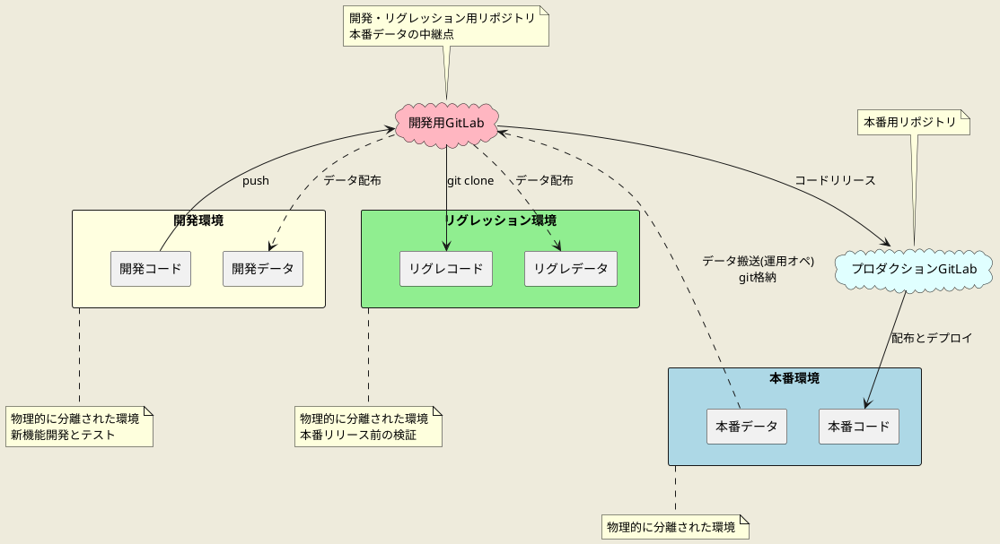
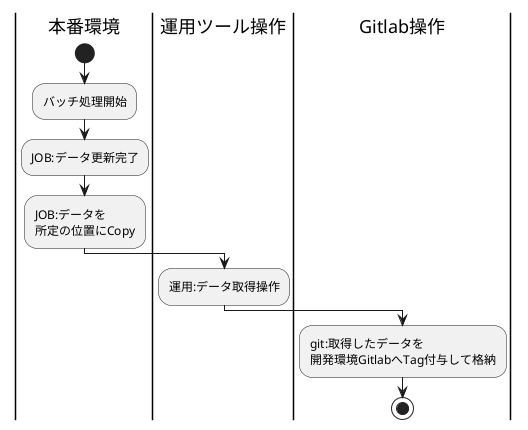
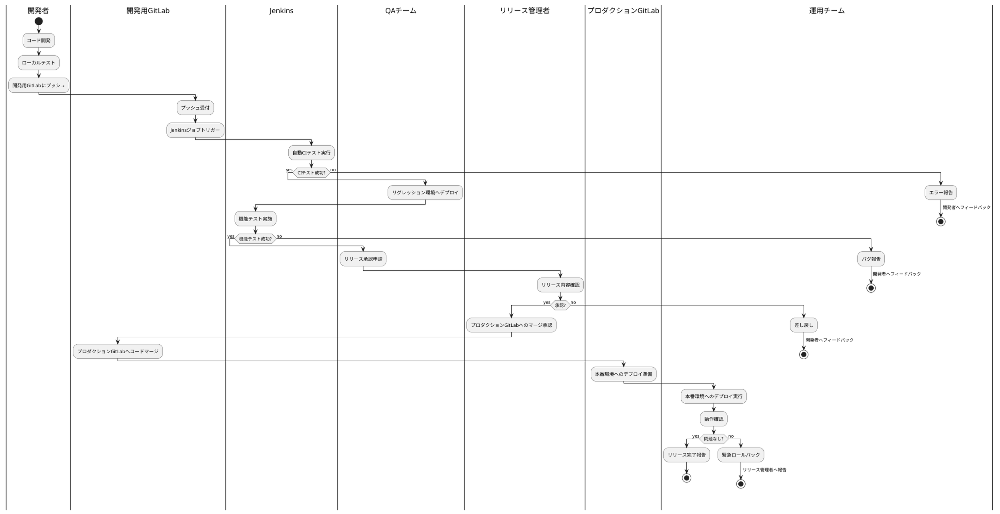

# リファレンス:リグレ環境〜本番環境運用連携定義

## はじめに

[plantuml]
----
@startuml
skinparam backgroundColor #EEEBDC
skinparam handwritten false
cloud "開発用GitLab" as DevGit #LightPink
cloud "プロダクションGitLab" as ProdGit #LightCyan
rectangle "開発環境" as Dev #LightYellow {
rectangle "開発データ" as DevData
}
rectangle "リグレッション環境" as Reg #LightGreen {
rectangle "リグレデータ" as RegData
rectangle "リグレコード" as RegCode
    rectangle "リグレッション処理フロー" {
    rectangle "一括申請" as RegBulkApply
    rectangle "受付" as RegReception
    rectangle "パターン編集" as RegPatternEdit
    RegBulkApply -> RegReception
    RegReception -> RegPatternEdit
}
}
rectangle "本番環境" as Prod #LightBlue {
rectangle "本番データ" as ProdData
rectangle "本番コード/更新明細" as ProdCode
    rectangle "本番処理フロー" {
    rectangle "反映" as ProdReflect
    rectangle "一括処理" as ProdBatch
    rectangle "送信" as ProdSend
    ProdReflect -> ProdBatch
    ProdBatch -> ProdSend
}
}
Dev -[hidden]right- Reg
Reg -[hidden]right- Prod
DevGit -[hidden]down- Dev
ProdGit -[hidden]down- Prod
DevGit --> RegCode : git clone
DevGit --> ProdGit : コード\n更新明細テーブル\nリリース
ProdGit --> ProdCode : 配布とデプロイ
ProdData .-> DevGit : データ搬送(運用オペ)\ngit格納
DevGit .-> RegData : データ配布
DevData .-> DevGit : コードpush
note bottom of Dev
物理的に分離された環境
新機能開発とテスト
end note
note bottom of Reg
物理的に分離された環境
本番リリース前の検証
end note
note bottom of Prod
物理的に分離された環境
end note
note top of DevGit
開発・リグレッション用リポジトリ
本番データの中継点
end note
note top of ProdGit
本番用リポジトリ
end note
@enduml
----

[plamtuml]
----
@startuml
skinparam backgroundColor #EEEBDC
skinparam handwritten false
actor 開発者
participant "開発環境" as Dev
participant "開発用GitLab" as DevGit
participant "リグレッション環境" as Reg
participant "プロダクションGitLab" as ProdGit
participant "本番環境" as Prod
開発者 -> Dev : コード開発/テスト
Dev -> DevGit : コードpush
Prod -> DevGit : データ取得
DevGit -> Reg : コード、データを配布
Reg -> Reg : 環境構築
Reg -> Reg : 一括申請実行
Reg -> Reg : 受付実行
Reg -> Reg : パターン編集実行
Reg -> DevGit : 更新明細およびコードを反映
DevGit -> ProdGit : 更新明細およびコード反映
ProdGit -> Prod : 資源配布
Prod -> Prod : 反映実行
Prod -> Prod : 一括処理実行
Prod -> Prod : 送信実行
@enduml
----

### 文書の目的
この文書は一括申請・受付・パターン編集はリグレ環境で運営し、反映・一括処理・送信処理は本番環境で運用します。リグレ環境での運用環境を保護・リフレッシュしつつ本番との相互運用を柔軟に行うよう運営ルール・フローを定める必要があります。

### 用語集
用語集

| 用語 | 説明 |
|------|------|
| CI/CD | Continuous Integration / Continuous Delivery の略。継続的インテグレーション/継続的デリバリーを指す。 |
| GitLab | バージョン管理システムGitのリポジトリマネージャ。 |
| Jenkins | オープンソースの継続的インテグレーションツール。 |
| MR | Merge Request の略。GitLab上でのコードレビューと統合のためのリクエスト。 |
| リグレッション環境 | 本番環境の変更前に検証を行うための環境。 |
| 運用オペレーション | 本番データを開発環境に安全に搬送するための運用ツール。 |

## システム環境構成

### 環境の分離
システムは以下の3つの環境で構成されます：
これらの環境は物理的に別のサーバーとして存在し、相互に分離されています。

#### 環境の種類:

| 環境 | 説明 |
|------|------|
| 本番環境 | 実際の業務で使用される環境 |
| リグレッション環境 | 本番環境の変更前に検証を行うための環境 |
| 開発環境 | 新機能開発とテストを行うための環境 |

#### 環境の特性:

| 特性 | 説明 |
|------|------|
| ネットワーク環境 | 本番環境は、リグレッション環境と開発環境からはネットワーク分離されています。リグレッション・開発環境ネットワークから制約なくアクセスすることはできません。 |
| サーバ環境 | サーバ環境は本番、リグレッション、開発環境それぞれで物理的に別物になっています。 |
| リポジトリ環境 | ・開発用リポジトリと本番用リポジトリがあります ・開発用リポジトリ→本番用リポジトリへの資源反映は承認フローの上で可能です |
| 本番環境にあるデータの搬送 | ・運用ツールを使用することで本番データを開発環境に搬送が可能です ・ただし本番運用データそのものの搬送ではなく、本番サーバ上の特定の位置に配置したデータのみ搬送が可能です ・特定位置へのデータ配置は本番運用JOBでデータCopy処理を組み込むなどの考慮が必要となります |

これらのテーブルは、環境の種類とそれぞれの特性を明確に示しています。

### GitLab構成
ライブラリ資源及び本番からの取得データを格納します。
また開発環境Gitlab→プロダクションGitlabを経由して本番環境へライブラリ資源を配布する運用を想定しています。

| 項目 | 説明 |
|------|------|
| プロダクションGitLab | 本番用リポジトリ |
| 開発用GitLab | ・開発・リグレッション用リポジトリ ・本番データの中継点としても機能 |
| 開発環境の利用 | 開発環境から開発用Gitlabを活用して資源開発・バージョン管理を行います |
| リグレッション環境への配布 | 開発用Gitlabからgit cloneによりリグレッション環境に資源を配布します |

このテーブルは、GitLab の構成と利用方法を簡潔に示しています。各項目とその説明が明確に対応付けられています。

## バージョン管理戦略

### GitLabを用いたバージョン管理の基本方針
ライブラリ資源の配布フローと本番環境データ取得のフローがあり、それぞれの特性に応じてGitlabを利用したバージョン管理を行います。

- ライブラリ資源
  - 開発用GitLabでコード開発と機能テストを行い、リリース認後にプロダクションGitLabへマージする
  - 開発→開発用GitlabでUpdateを行いリグレッション環境へは開発用Gitlabから資源取得するフローとする
  - 開発計画はブランチ戦略を立案しそのプランに從いfeature単位で開発及びテストを行う、詳細はブランチ戦略を参照

- 本番データ資源取得    
  - 本番データは開発用GitLabを経由して、リグレッション環境と開発環境に配布します
    - 取得したデータはGitlabによりTag付与してバージョン管理を行います
    - データの配布はJenkinsでのビルド処理時にライブラリ資源・データを合わせて実行します

### ブランチ戦略とワークフロー
- feature/*, develop, main などのブランチを使用、詳細はブランチ戦略を参照
- マージリクエスト (MR) を用いたコードレビューの実施

### タグ付けとリリース管理
- リリースごとにセマンティックバージョニングに基づいたタグを付与（例：v1.2.3）
- 本番リリース時には `production-YYYYMMDD` 形式のタグも追加

## データと環境の連携管理

### 本番データの取り込みと管理方法
- 本番データは定期的に（週1回程度）開発用GitLabに搬送する運用を行う
- データ搬送には運用オペレーションを使用し、取得データはgit格納格納する

### テストデータと運用データの同期プロセス・バージョン管理
- 開発環境とリグレッション環境ではTag付与管理されたデータをGitlabから取得して利用する
- 原則JenkinsJOBでのgit cloneフェーズでデータ配布コントロールを行う

## CI/CD パイプライン

リグレッションでのテスト実施はJenkinsによる環境構築・テスト実施を基本フローとする。
リグレッションのテスト向けの資源は、マニュアル配布せずJenkinsJOBにより配布・ビルドによりセットアップを行い検証環境のクリーンさを実現する。

### 自動化されたビルドとテストプロセス
1. 開発者がコードを開発用GitLabにプッシュ
2. Jenkins が自動CIテストを実行
3. CIテスト成功後、QAチームがリグレッション環境へデプロイ
4. テスト対象データ資源を配置
5. Jenkins が機能テストを実施

### 環境別のデプロイメントフロー
- 開発環境：開発者が直接デプロイ
- リグレッション環境：QAチームが Jenkins のテスト成功後にデプロイ
- 本番環境：運用チームがプロダクションGitLabからデプロイ

### 品質管理と静的解析の統合
- Jenkins のCIプロセスに静的コード解析を組み込む
- SonarQube などのツールを使用し、コード品質メトリクスを継続的に監視

## 6. セキュリティとアクセス制御

### 6.1 環境別のアクセス権限設定
- 本番環境：運用チームのみがアクセス可能
- リグレッション環境：QAチームと一部の開発者がアクセス可能
- 開発環境：全開発者がアクセス可能

### 6.2 機密情報の管理方針
- 環境変数やGitLabのCI/CD変数機能を使用して機密情報を管理
- 本番環境の機密情報は、運用チームのみがアクセス可能な別システムで管理

## 7. 運用プロセスと手順

### 7.1 リリースプロセス
1. 開発者がコードをプッシュ
2. Jenkins が自動CIテストを実行
3. QAチームがリグレッション環境へデプロイ
4. Jenkins が機能テストを実施
5. QAチームがリリース承認を申請
6. リリース管理者がリリース内容を確認し承認
7. 開発用GitLabからプロダクションGitLabへコードマージ
8. 運用チームが本番環境へデプロイを実行
9. 運用チームが動作確認を行い、問題がなければリリース完了

### 7.2 緊急時の対応手順
- 本番環境で問題が発生した場合、即時にロールバックを実施
- インシデント報告をリリース管理者に行い、原因分析と再発防止策を策定

## 8. モニタリングと継続的改善

### 8.1 パフォーマンスモニタリング
- 各環境のリソース使用状況を定期的に監視
- アプリケーションのパフォーマンスメトリクスを収集・分析

### 8.2 継続的な改善プロセス
- 月次でリリースプロセスのレビューを実施
- 四半期ごとにシステム全体の健全性チェックを行い、改善点を洗い出す
