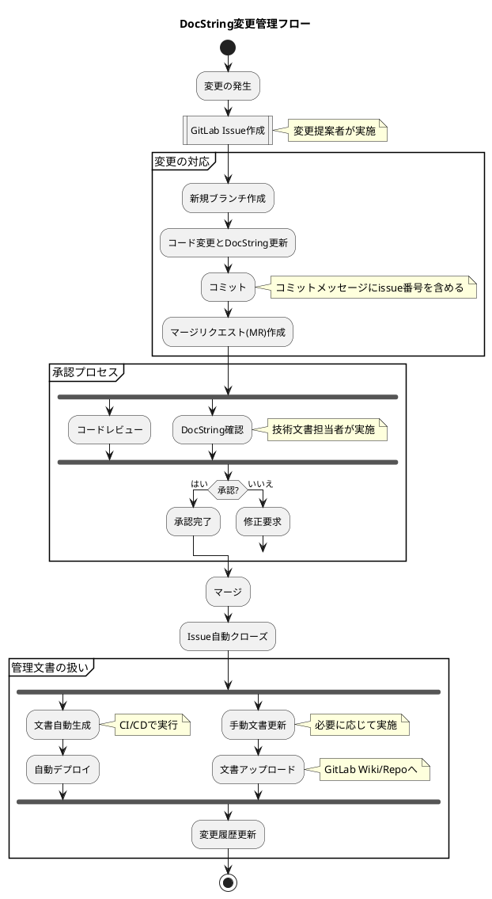

# DocString変更管理フロー設計書

## 1. 目的
本文書は、コードのDocStringに関する仕様変更を効果的に管理し、一貫性のある更新プロセスを確立することを目的としています。GitLabを使用したissueベースの変更管理フローを定義し、開発チーム全体で統一された方法で変更を追跡・実装することを目指します。

## 2. フロー図

## 3. プロセス詳細

### 3.1 変更の発生
- 要件変更や機能追加の必要性が識別された時点でプロセスを開始します。
- 変更提案者は、変更の概要、理由、予想される影響範囲を特定します。

### 3.2 GitLab Issue作成
- 変更提案者がGitLab上で新しいissueを作成します。
- issueには以下の情報を含めます：
  - 変更の概要
  - 変更の理由
  - 予想される影響範囲
  - 関連するコードファイルやモジュール
- 適切なラベル（例：「仕様変更」「DocString更新」）を付与します。
- 担当者や関係者をアサインします。

### 3.3 変更の対応
1. **新規ブランチ作成**
   - アサインされた開発者が、issueに基づいて新しい作業ブランチを作成します。

2. **コード変更とDocString更新**
   - 開発者は、必要なコードの変更とDocStringの更新を同時に行います。
   - DocStringの更新は、コードの変更を正確に反映させるように注意します。

3. **コミット**
   - 変更をコミットする際、コミットメッセージにissue番号を含めます。
   - 例: "機能Aの DocString 更新 #123"

4. **マージリクエスト(MR)作成**
   - 開発者は、変更内容をレビュー用にマージリクエストを作成します。
   - MRの説明にissue番号を記載し、関連付けます。
   - MRには変更されたDocStringの内容も明記します。

### 3.4 承認プロセス
1. **コードレビュー**
   - レビュアーは、コードの変更とDocStringの更新を確認します。
   - 必要に応じて、MRにコメントや修正リクエストを追加します。

2. **DocString確認**
   - 技術文書担当者（もしいれば）がDocStringの内容を確認します。
   - 用語の一貫性、説明の明確さ、フォーマットの正確さを検証します。

3. **承認または修正要求**
   - すべてのレビューが完了し、問題がなければ承認します。
   - 修正が必要な場合、開発者に差し戻し、変更対応のステップに戻ります。

### 3.5 マージとIssue自動クローズ
- 承認後、MRをマスターブランチにマージします。
- マージ後、関連するissueが自動的にクローズされるよう設定します。

### 3.6 管理文書の扱い
1. **文書自動生成**
   - CI/CDパイプラインで、更新されたDocStringに基づいてAPI文書やインターフェース仕様書を自動生成します。
   - 生成された文書を、指定された場所（GitLab WikiやPages等）に自動デプロイします。

2. **手動文書更新**
   - 自動生成対象外の関連文書がある場合、担当者が手動で更新します。
   - 更新した文書をGitLabのリポジトリやWikiにアップロードします。

3. **変更履歴更新**
   - GitLabのreleases機能を使用して、主要な変更をまとめます。
   - 必要に応じて、CHANGELOG.mdファイルを更新します。

## 4. 注意事項
- DocStringのフォーマットは、チーム内で標準化し、一貫性を保ちます。
- DocStringの品質チェックを自動化するツール（例：Pylint, Pydocstyle）をCI/CDパイプラインに組み込むことを推奨します。
- 定期的に（例：四半期ごと）DocStringの全体的なレビューを行い、一貫性と完全性を確保します。
- このプロセスは、チームの規模や要求に応じて適宜調整してください。

## 5. 参考資料
- GitLab公式ドキュメント: [Issues](https://docs.gitlab.com/ee/user/project/issues/)
- Python公式ドキュメント: [Docstring Conventions](https://www.python.org/dev/peps/pep-0257/)

