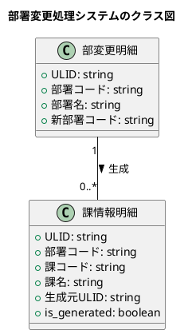
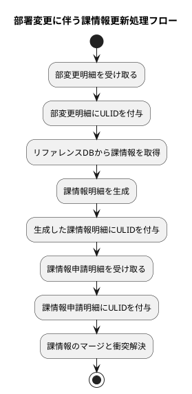
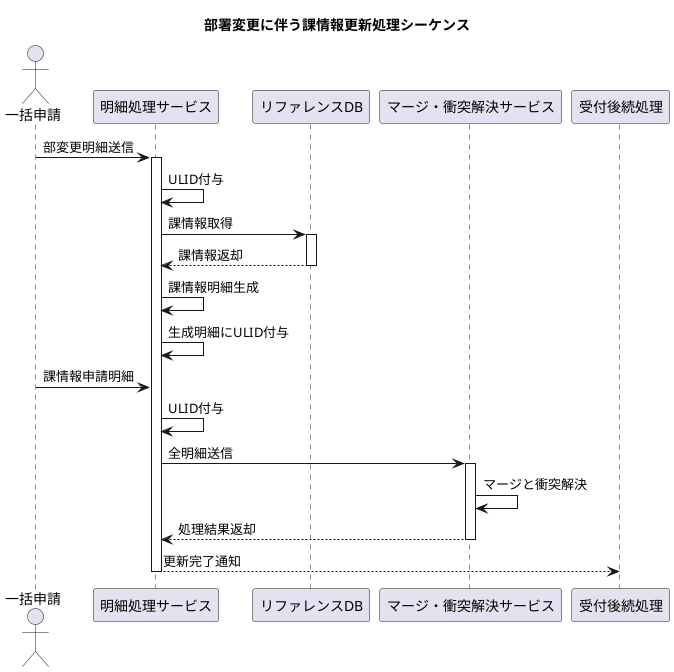
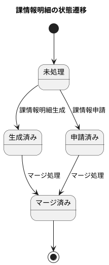

ご指摘ありがとうございます。ご指摘の点を踏まえて、より詳細な説明を加えた改訂版を作成いたします。

# 部署変更に伴う課情報更新処理設計書

## 1. 現状と課題

### 1.1 現状
- 部署変更時、関連する課情報の更新が必要だが、自動更新の仕組みがない
- データの正規化がされておらず、部署情報変更が自動的に課情報に反映されない
- 現在は、部署変更に伴う課情報の更新をマニュアルで行っており、以下の問題がある：
  1. 人的ミスのリスクが高い
  2. 大量の更新作業に時間がかかる
  3. リアルタイムの情報反映ができない

### 1.2 目指す姿
- 部署変更に伴う課情報の自動更新
- データの一貫性維持
- 効率的かつ正確な情報更新プロセスの確立
- 人的作業の最小化とエラー率の低減

## 2. 解決策

### 2.1 部変更明細処理
1. 外部ソースから部変更明細を受信
   - これは人事部門や関連部署からの利用申請処理として行われる
   - 申請には部署コード、変更内容（名称変更、コード変更など）が含まれる
2. 各明細にULIDを付与し、時系列管理を実現
   - ULIDにより、ミリ秒単位の時系列順序と一意性を保証

### 2.2 課情報明細生成
1. リファレンスDBから関連課情報を取得
   - 部変更明細に含まれる部署コードをキーとして、その部署に紐づく全ての課情報を取得
   - 例：部署コード"DEPT001"に対し、"DEPT001_SECT001", "DEPT001_SECT002"などの課情報を取得
2. 部変更情報を反映した新課情報明細を生成
   - 取得した各課情報に対し、部変更の内容（例：部署名変更）を反映
   - 例：部署名が"営業部"から"営業推進部"に変更された場合、全ての関連課の所属部署名も更新
3. 生成明細にULIDを付与し、元の部変更明細との関連を保持
   - 生成元の部変更明細のULIDを参照情報として保持することで、追跡可能性を確保

### 2.3 課情報申請処理
1. 外部ソースから課情報申請明細を受信
   - これは課レベルでの変更（名称変更、新設、廃止など）の申請処理
2. 各申請明細にULIDを付与

### 2.4 マージと衝突解決
1. 生成明細と申請明細を部署コードと課コードでマージ
   - 同一の部署コードと課コードを持つ明細をグループ化
2. 衝突時は申請明細を優先、同種の場合はULIDの新しい方を採用
   - 衝突例：部署変更により自動生成された課情報と、直接申請された課情報の内容が異なる場合
   - 解決策：申請された情報を優先することで、より正確で最新の情報を反映

## 3. 想定される問題と解決策

### 3.1 問題: データの不整合
- 部署変更と課情報申請が同時に行われた場合、データの不整合が発生する可能性
- 具体例：部署名変更に伴い自動生成された課情報と、同時に申請された課の名称変更が競合

#### 解決策
1. ULID活用による厳密な時系列管理
   - ミリ秒単位の順序付けにより、どの変更が最新かを正確に判断
2. マージプロセスでの明確な優先順位付け
   - 申請明細を優先することで、意図的な変更を確実に反映
3. 衝突検出・解決メカニズムの実装
   - 同一課に対する複数の変更を検出し、定義されたルールに基づいて自動解決

### 3.2 問題: 処理の複雑化
- 部署変更に伴う課情報更新により、処理が複雑化
- 複雑化の例：部署の統廃合に伴う大量の課情報更新、階層構造の変更など

#### 解決策
1. モジュール化された設計採用
   - 部変更処理、課情報生成、マージ処理を独立したモジュールとして実装
2. 明確に定義されたインターフェースによる各処理の分離
   - モジュール間の依存関係を最小限に抑え、変更の影響範囲を限定
3. 詳細なログ記録による処理の追跡可能性確保
   - 各ステップでの入出力、適用されたルール、発生した例外などを記録

